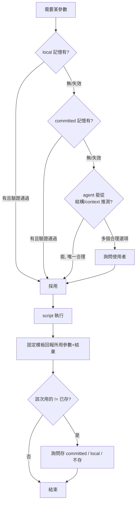

# .NET 技能 csproj 化 — 給 agent 用的 VS 2022

## Summary

把 `turbo-plugin-dotnet-framework-web` 的 build / run / publish / stop 改成「給 agent 用的 VS 2022」：由 **agent** 判斷該操作哪個 csproj 與 Configuration / Platform / pubxml，把明確參數傳給變薄的 script 執行；判斷不出來就問使用者，並把選擇記進專案層級記憶供下次沿用；每次執行後用固定模板回報所用參數與結果，讓使用者一眼核對、選錯能當場糾正。

## Problem Frame

使用者的專案普遍是「一個 `.sln` 底下多個 csproj」（偶爾也單獨開某個 csproj）。現行 plugin 要靠寫死的專案路徑才知道要 build/run/publish 哪個，使用者得手動維護該設定；遇到多 csproj 時 `Find-SingleCsproj` 直接報錯（>1 個就 throw），無法表達「這次要哪個」。

更深的卡關在 SEED：原始目標「自動分析、對齊 VS 2022」一直缺驗收準則——若理解成「在 script 裡重做 MSBuild 屬性求值 + Import 鏈 + `Directory.Build.props`」就是無底洞，半年沒動。本次釐清的關鍵事實是：**VS 2022 做 build/run/publish 時自己也沒展開那個無底洞**——它靠 (1) MSBuild 不指定時的內建預設（Debug / AnyCPU）、(2) 讀 `.sln` 知道有哪些專案、(3) publish 是互動流程（沒 profile 就現場建）、(4) 直接讀 csproj XML 取 TFM。這四招都不需要屬性求值引擎，繞過了無底洞。

---

## Key Decisions

- **智慧放在 agent、走淺版判斷。** 「分析」由 agent 用 context + 讀檔 + 必要時詢問完成，不在 script 裡跑 MSBuild 屬性求值。script 退化成薄執行器，只依收到的明確參數呼叫 MSBuild / IIS Express。這一決策直接解掉 SEED 的「對齊 VS = 無底洞」死結。
- **build 預設整個方案、run/publish 單一目標。** 對齊使用者在 VS 的真實手感：大改建方案、小改建單一。executor 須同時接受 `.sln`（交給 MSBuild 自行編排）與單一 `.csproj`。
- **記憶走兩層、重用既有設定慣例。** committed 預設放 `config.toml`、local 覆蓋放 `config.local.toml`，讀取時 local 蓋過 committed——這是 VS `.suo` 的類比，但用可版控/可分享的兩層取代 binary、per-user 的 `.suo`。存回時三選一即是分類：committed＝主動定為專案 canonical 預設、local＝本機 / 本任務、不存＝一次性；agent 預設建議 local，只有使用者主動選才寫 committed，避免 per-task 選擇污染 git。
- **記憶在執行後才寫、且採嚴格存回。** `tp-setup` 不寫這些選項；每次執行後只要「該次實際用的」≠「已存的」（含記憶為空的首次、含存的是預設值）就詢問使用者要存到 committed / local / 不存。
- **記憶是提示而非權威。** agent 沿用前對照當前檔案驗證，失效（csproj/pubxml 已改名或刪除）就重新判斷或詢問；固定結果模板永遠暴露「這次實際用了什麼」，作為糾錯閘。
- **agent 先做再報、executor 行為對齊 VS。** 有把握就直接執行、跑完用模板回報；只有判斷不出來才先問。**executor 省略 agent 未指定的 `/p:Configuration|Platform`**，讓 MSBuild / `.sln` / `Directory.Build.props` 自行解析（與 VS 一致，不再強制 Debug——現行 `Build-Web.ps1` 恆傳 Debug 會壓過 props，須改）；agent 不深算「有效」config。模板誠實回報 agent 實際傳了什麼（未指定者標「由 MSBuild/solution 決定」），不假裝 parse 出 props 覆蓋後的有效值。
- **build / run / publish 目標選擇全權交給 agent 判斷。** 不在 SKILL.md 硬寫觸發字眼（會讓 agent 只在出現特定字眼時才判對）；選錯目標成本低（依模板糾正、重跑一次即可），結果模板是糾錯閘。
- **`tp-cleanup-orphan-iis` 不納入改造。** 它是清道夫（全掃 turbo-plugin 格式孤兒站台 + 多選確認），本來就不挑 csproj，維持現狀。

---

## Requirements

### Agent 判斷與參數傳遞

- R1. build / run / publish / stop 由 agent 判斷要操作的 csproj，作為明確參數傳給 script；script 不再依賴寫死的專案路徑做判斷。
- R2. agent 同樣判斷 Configuration / Platform、以及 publish 的 pubxml，作為明確參數傳入。publish 的 configuration 以 pubxml 內嵌值為準、除非使用者明確覆蓋；agent 預設不另傳 `/p:Configuration` 給 publish，避免與 pubxml 衝突。
- R3. 判斷的優先序為：專案層級記憶（local 覆蓋 committed）→ 不足時 agent 從專案結構 / context 推測 → 仍無法確定時當下詢問使用者。
- R4. script 維持薄執行器：只依收到的明確參數執行，不做 MSBuild 屬性求值、不展開 Import 鏈 / `Directory.Build.props`。
- R5. 存在多個合理選項且記憶 / context 無法消歧時，agent 須互動詢問使用者，不得靜默亂猜，也不得像現行 `Find-SingleCsproj` 那樣多 csproj 直接 throw。

### 專案層級記憶（VS `.suo` 類比）

- R6. 記憶分兩層：committed 預設（`config.toml`）+ local 覆蓋（`config.local.toml`）；讀取時 local 覆蓋 committed。
- R7. `tp-setup` 不寫入這些記憶選項，保持空白；記憶只在執行後依使用者選擇寫入。
- R8. 記憶以「足以讓下次沿用」為粒度保存，**按操作分**：run 存目標 / startup csproj（run 不涉 configuration）；publish 存 pubxml（configuration 由 pubxml 決定）；build 存目標 csproj / `.sln`，以及 **agent 明確選擇**的 configuration / platform（未指定就不存——交 MSBuild/solution 解析）。
- R9. 記憶為提示而非權威：agent 沿用前須對照當前專案檔案驗證選項仍有效，失效則重新判斷或詢問。

### 存回流程（save-back）

- R10. 每次 build / run / publish 執行後，若**該次 agent 實際選定的輸入**（目標 csproj / `.sln`、pubxml、agent 明確選的 configuration / platform）與已存記憶不同（含記憶為空的首次），詢問是否儲存。比對只看 agent 控制的輸入，**不看 MSBuild 解析後的有效值**，避免對 props / `.sln` 衍生、agent 沒選的值跳存回。
- R11. 存回詢問提供三個去向：存到 committed 預設 / 存到 local 覆蓋 / 不存。

### 結果回報

- R12. build / run / publish / stop 執行完皆以固定模板回報，**按操作報相關欄位**：build 報目標 csproj / `.sln` + configuration / platform（agent 明確選的；未指定標「由 MSBuild/solution 決定」）+ 成敗；run 報目標 csproj + web URL + 成敗（run 不涉 configuration）；publish 報目標 csproj + 所用 pubxml + 發佈輸出路徑 + 成敗；stop 報停了哪個站台 / csproj。模板報 **agent 實際傳入的值 + script 產出的具體產物**（發佈路徑、URL），不假裝 parse 出 props 覆蓋後的有效 config，讓使用者核對並糾正。

### 各操作目標語意

- R13. build 預設目標為整個方案（把 `.sln` 交給 MSBuild）；當 context 明顯指向單一專案時建單一 csproj。executor 須同時接受 `.sln` 與 `.csproj`，且接受 `.sln` 時 `SolutionDir` 由 `.sln` 所在目錄推導（非寫死 repo 根）。「明顯指向單一專案」由 agent 全權判斷，不在 SKILL.md 硬寫準則（見 Key Decisions）。
- R14. run / publish 每次呼叫針對單一目標；「單一目標」指每次呼叫的粒度，非「同時只能跑一個」——併發多跑靠各自呼叫、per-csproj 站台天生共存（唯兩 csproj 宣告同一 port 才衝突，見 Outstanding Questions）。存在多個合理目標時依 R5 詢問。
- R15. stop 用與 run 同一套 identity 解析，停 agent 指定 csproj 對應的站台（站台名 = csproj 檔名 + 路徑雜湊），不依賴任何「上次 run」session 狀態；要停全部須使用者明講。
- R16. `tp-cleanup-orphan-iis` 維持現狀（全掃孤兒 + 多選確認），不納入 csproj 判斷改造；是否套用同一結果回報模板為低優先的可選項。

---

## 參數解析與存回流程

agent 對每個需要的參數（csproj / Configuration / Platform / pubxml）跑同一條解析鏈，執行後再依差異決定是否存回：

---

## Acceptance Examples

- AE1. **首次 build、無記憶。** **Given** `.sln` 有多 csproj、記憶皆空。**When** 使用者只說 build。**Then** agent 建整個方案（R13）、不指定 config（交 MSBuild/solution 解析，等同 VS）；模板報「目標：整個方案、configuration：由 MSBuild/solution 決定、成敗」；因 agent 選定的輸入 ≠ 已存（空）→ 詢問是否存（R10, R11）。
- AE2. **run 多 web 專案、無記憶。** **Given** `.sln` 有 2 個可跑的 web 專案、無 startup 記憶。**When** 使用者說 run。**Then** agent 無法消歧 → 詢問選哪個（R5）→ 執行 → 存回詢問。
- AE3. **publish 多 pubxml。** **Given** 目標專案 `Properties/PublishProfiles/` 有 2 個 `.pubxml`、無記憶。**When** 使用者說 publish。**Then** agent 詢問用哪個（R5）→ 執行 → 模板回報所用 pubxml 與輸出路徑（R12）→ 存回詢問。
- AE4. **記憶漂移。** **Given** 記憶記了 startup = `A.csproj`，但 `A.csproj` 已改名 / 刪除。**When** 使用者說 run。**Then** agent 驗證發現失效（R9）→ 不沿用、重新判斷或詢問。
- AE5. **沿用無摩擦。** **Given** 第二次 run、記憶已有有效的 startup csproj。**When** 使用者說 run。**Then** agent 直接沿用、不問選擇；該次用的 == 已存 → 不觸發存回詢問（R10）。
- AE6. **build 單一專案。** **Given** agent 依 context 判斷此次明顯只關於某一個專案。**When** 使用者說 build。**Then** agent 只 build 該 csproj、不建整個方案；若判斷錯，使用者依模板回報糾正、重跑一次即可（R13）。

---

## Scope Boundaries

- 不重做 MSBuild 屬性求值引擎（不展開 Import 鏈 / `Directory.Build.props` 求值）。
- agent 不深算「有效」configuration / platform：executor 省略 agent 未指定的 config 參數，讓 MSBuild / `.sln` / `Directory.Build.props` 自行解析（與 VS 一致，所以 build 結果就跟 VS 相同）。殘留盲點（可接受）：模板報的是 agent 傳入值（未指定者標「由 MSBuild/solution 決定」），不保證回報 props 覆蓋後的精確有效值；要精確值看 build log / VS。是否用 `-getProperty`（VS2022 17.8+）回報有效值留 planning。
- 不讀取 VS 的 `.suo`（binary、per-user、`.vs/` 通常 gitignored）；以自建兩層記憶取代。
- 不重新實作 solution build 編排——build 順序 / 相依交由 MSBuild 處理 `.sln` 時負責。
- class library 等非 web 專案只隨方案被 build，不納入 run / publish 的目標選擇。
- `tp-cleanup-orphan-iis` 不納入 csproj 判斷改造，維持清道夫角色。

---

## Dependencies / Assumptions

- 假設多 csproj 專案普遍有 `.sln`（已確認），少數情況單獨開某個 csproj（已確認）。
- 假設 MSBuild 不指定 `/p:Configuration|Platform` 時自動套 Debug / AnyCPU（csproj 與 `Microsoft.Common.props` 內建的條件預設）——這是「淺版」可行的基礎。
- 依賴現有 per-csproj IIS identity 機制（站台名 = csproj 檔名 + 路徑雜湊）；不同 csproj 天生取得不同 identity / 站台，port 只在兩個 csproj 宣告同一 port 時才衝突。
- 互動詢問依賴 skill 端的 `AskUserQuestion`。
- IIS Express 為 Windows-only：run / stop / cleanup 在非 Windows 維持自我 SKIP 行為。

---

## Outstanding Questions

### Deferred to Planning

- 記憶的精確存放 schema（`config.toml` / `config.local.toml` 內的 section / key 命名、per-csproj 結構），含與既有 `config.toml [build].project` 的關係（同檔可能 schema 衝突，或分節 / 分檔）；須落在現有 reader 支援的扁平 `[section] key=scalar`（不支援陣列 / 巢狀表）。
- save-back 寫回需要 structure-preserving 的 TOML 寫入機制——目前只有 reader、`config.toml` 是 comment + marker 區塊；planning 須定寫入方式（新 writer 或走 agent-Edit）。
- **executor 對齊 VS 的改動**：須改為**省略** agent 未指定的 `/p:Configuration|Platform`（現行 `Build-Web.ps1` 恆傳 Debug/AnyCPU、`Publish-Web.ps1` 恆附 Configuration，會壓過 props / `.sln`）——「像 VS」的前提；連帶既有 build/publish 測試（斷言 Debug / `bin\Debug`）需重訂。
- executor 的 `.sln` 路徑：`SolutionDir` 由 `.sln` 目錄推導、且 `Find-SingleCsproj` 目前無 `.sln` 分支，需新增 `.sln` 探索 / 解析。
- 固定結果模板的精確欄位與輸出格式，須與現有 marker（如 `PUBLISH_OUTPUT`）保持一致、可被 agent 解析；模板報 agent 傳入值 + script 產物（不 parse props 覆蓋後的有效 config）。是否額外用 `-getProperty`（VS2022 17.8+，舊版 fallback）回報有效 config 為選配。
- 多 csproj 同時 run、兩專案宣告同一 port 的衝突處理（自動改派 / 詢問 / 報錯）——edge case，現行已逐 csproj 從 csproj XML 取 port。
- R9 記憶驗證的深度：只查檔案是否存在，或也比對內容（如 pubxml profile 仍在 `PublishProfiles/`）。
- 既有 `Find-SingleCsproj` 三層解析在新模型下的去留（保留為「唯一 csproj」捷徑，或由 agent 判斷全面取代）；注意它經 `Resolve-IisSettings` 被 `Start-Iis` / `Stop-Iis` 間接呼叫，去留橫跨 build / publish **與** run / stop 四個操作，須一併考慮。
- 跨平台 `.sh` 對等行為與測試覆蓋（含非 Windows SKIP）。

---

## Sources / Research

- SEED 種子文件：`docs/brainstorms/2026-06-06-turbo-plugin-dotnet-csproj-vs2022-SEED.md`。
- csproj 解析現況：`plugins/turbo-plugin-dotnet-framework-web/scripts/lib/Common.ps1` 的 `Find-SingleCsproj`（CLI arg → `config.toml [build].project` → 自動偵測單一 csproj；多個則 throw）；caller 為 `Build-Web.ps1` / `Publish-Web.ps1` / `Get-ProjectIdentity.ps1` 與 IisHelpers 的 `Resolve-IisSettings`。
- MSBuild 呼叫現況：build 用 `/restore /t:Build /p:SolutionDir=...`；publish 用 `/p:DeployOnBuild=true /p:PublishProfile=...`；目前未用 `-getProperty` / `-pp`。
- IIS identity / 孤兒清理：`plugins/turbo-plugin-dotnet-framework-web/scripts/Remove-OrphanIis.ps1` 與 `plugins/turbo-plugin-dotnet-framework-web/skills/tp-cleanup-orphan-iis/SKILL.md`（站台命名 `<csproj-stem>-<hash>`、hash 來自 git-common-dir + csproj 相對路徑）。
- 受影響 skill：`tp-build-dotnet-framework-web` / `tp-run-dotnet-framework-web` / `tp-stop-dotnet-framework-web` / `tp-publish-dotnet-framework-web`（改造）；`tp-cleanup-orphan-iis`（不改造）。
