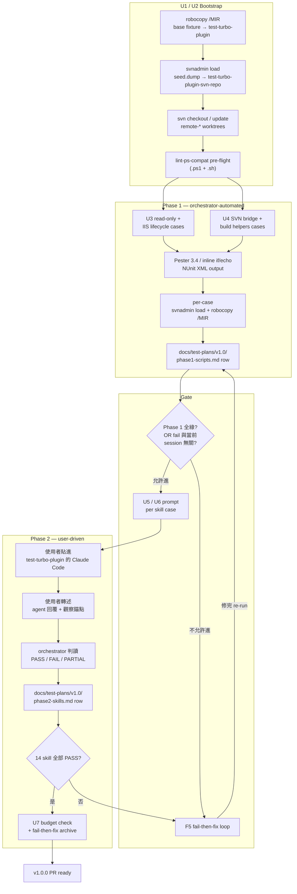

# feat: turbo-plugin v1.0 PR 前手動測試計畫 — 實作 plan

## Summary

兩階段 v1.0.0 PR-readiness 驗證的實作 plan。7 個 implementation unit:fixture 基礎建設(test-turbo-plugin clean rebuild + SVN repo seed + `svnadmin dump/load` 每 case 重設 + `robocopy /MIR` mirror)→ Phase 1 test harness(`tools/lint-ps-compat.ps1` pre-flight + Pester 3.4 for `.ps1` + inline `if/echo` for `.sh`)→ Phase 1 cases 分群(read-only / IIS lifecycle / SVN bridge / build helpers)→ Phase 2 tracking schema + 中文字典 inline + per-skill prompt templates → Phase 2 skill bundles execution notes → fail-then-fix process + 5 個 ce-doc-review trade-off planning resolution + budget tracking。Test scope 為 origin 全範圍,無收斂。

---

## Problem Frame

turbo-plugin 從 v0.2.7 走到 1.0.0 的 11 個 implementation unit(U1-U12)只跑過 lint 與型別檢查,沒有任何 end-to-end 觸發。1.0.0 是第一個 marketplace release(`marketplace.json` 即將從 dev pointer 改回 production)— marketplace 首發品質直接影響 plugin 信任度,使用者第一次裝起來撞 bug 會直接放棄,沒有「使用者反饋指出哪些 path 重要」的 luxury。Origin doc 規格了 36 個 script(18 對 `.ps1` / `.sh`)+ 14 個 skill 的兩階段驗證,本 plan 把驗證計畫變成可由 orchestrator + 使用者協同執行的 7-unit 實作。

---

## High-Level Technical Design

### 兩階段執行 + 三層 fixture 隔離



### Fixture 隔離三層

- **Phase 1 每 case**:`robocopy /MIR base → test-turbo-plugin` + `svnadmin load < seed.dump` + remote-* worktree 重新 checkout(完全 reset,clean slate)
- **Phase 2 跨 case 延續(trade-off 1 resolution)**:同 session 內 fixture 延續(tp-setup 安裝 LSP / CE 後保留給 build/run/publish case 用),只有 F5 root-cause 懷疑被污染才升級為 fresh-fixture re-run
- **跨 session checkpoint**:tracking doc 記錄當前 fixture state,使用者中斷後 resume 可從上次狀態繼續

### Phase 1 assertion 層級

```
1. Pre-flight:   tools/lint-ps-compat.{ps1,sh} 對 36 個 script 做 static lint(失敗即停)
                 ↓
2. PowerShell:   Pester 3.4(bundled with PS 5.1)Describe/It/Should -Be|-Throw
                 ↓ (Pester 3.4 API friction 時 fallback)
                 hand-rolled Assert-Equal / Assert-True / Assert-Match / Assert-Throws
                 (相同 shape as 既有 tests/lib-tests/*.ps1)
                 ↓
3. Bash:         inline `if [...]; then echo OK; else echo FAIL; exit 1; fi`
                 對 exit code + stdout substring 做 assertion
                 ↓
4. Output:       NUnit XML(.ps1)+ stdout `OK|FAIL` 行(.sh)→ tracking doc row
```

---

## Requirements

從 origin 帶入的 29 個 R-ID(已 ce-doc-review 修完版本)+ 5 個 plan-time addition(R30-R34,標 *new*):

**Phase 1 — Script 自動測試**
- R1-R10:照 origin。R2 多了 (e) sub-clause(每 script 至少 1 case 透過 SKILL.md 入口路徑 invoke)。R7a:每個 SVN-touching case 跑之前 svnadmin dump/load reset SVN repo。R8:Pester 3.4 + inline `.sh`。

**Phase 2 — Skill 手動測試**
- R11-R17:照 origin。R12 plan-time clarification:`1 happy + 2-3 error + 1 中文` 是 **floor not ceiling**(trade-off 5 resolution),`tp-setup` 等複雜 skill 實際 case 數 5-6 個,在 phase2-session-plan.md 預先列具體數字。

**中文測試** R18, R19:照 origin。R18 已含 source content body 中文 sub-面向。R19 中文字典 **inline** 在 `phase1-scripts.md` 開頭。

**Fail 處理** R20-R23:照 origin。

**tp-setup 推薦項目實際安裝** R24-R26:照 origin。R25 plan-time addition:Phase 2 結束**一次性** rollback(原 RBP Q3 resolution = (b))。

**Tracking** R27-R29:照 origin。

**Plan-time additions(new):**
- **R30** *(new)*. Pre-flight gate:`Run-Phase1.ps1` 必須先跑 `tools/lint-ps-compat.{ps1,sh}` 對 36 script 做 static lint;有任何 violation 即 abort,不進 Pester 階段。
- **R31** *(new)*. Per-case fixture reset 必須 idempotent:跑 `Reset-Fixture.ps1` 對任意先前狀態(乾淨 / 髒 / 中間態)還原到 base state 完全一致(diff = empty,svn log -r 20 = r20 base seed)。
- **R32** *(new)*. F5 escalation rule **promote 為 R-level**:同 case 修 3 次仍 FAIL → mark `FAIL-known`,列入 `Known Issues` 不 block v1.0 PR,但記入 tracking doc 由使用者確認(trade-off 4 partial resolution)。
- **R33** *(new)*. Budget caps:Phase 1 max ~20 hr orchestrator wall time / Phase 2 max ~12 session user time。超過暫停 surface scope-cut recommendation 給使用者(trade-off 4 resolution)。
- **R34** *(new)*. Hand-rolled `Assert-Helpers.ps1` fallback **必須存在且驗證**:即使 Phase 1 採 Pester 3.4,`tests/v1.0/lib/Assert-Helpers.ps1` 與 `test_assert_helpers.ps1` 必須在 U2 build out,確保 Pester friction 時可立刻切換。

---

## Key Technical Decisions

- **Pester 3.4(bundled with PS 5.1)over 5.x(needs install)** — 維持 R8 的「不增加環境依賴」承諾;trade-off 是 3.4 較舊 API(沒 `BeforeAll`、`Should` 語法較簡陋,需要 `BeforeEach`/`AfterEach` 替代 setup/teardown 群組)。可接受,Pester 3.4 的 `Describe/It/Should -Be|-Throw|-Match` 足夠覆蓋 36 script 的 happy + error + 中文 case。
- **5 個 ce-doc-review trade-off 全部採較保守選項**:
  - **fixture isolation(trade-off 1)** → (b)Phase 2 fixture 延續 + F5 fresh-snapshot escalation when suspected。Reject (a) per-case snapshot 因為 tp-setup real-install 重複 1+ minute 每 case × 多 skill case 累積 30+ minute 浪費,且 `~/.claude/settings.json` 機器全域狀態本來就無法 snapshot。
  - **tp-setup containment(trade-off 2)** → 維持「主機 install + 手動 rollback」。Reject Windows Sandbox(不 persist `~/.claude` across runs,測完 plugin 啟用狀態消失,等於沒驗證)、reject VM snapshot(setup cost > rollback checklist cost)、reject `dotnet --tool-path`(只解部分 — Claude Code plugin / settings 仍動主機)。代價是 Phase 2 全程使用者 `~/.claude/settings.json` 留下 plugin 啟用紀錄、`dotnet tool -g` 留 csharp-ls、`npm -g` 留 typescript-language-server,Phase 2 結束統一 rollback checklist。
  - **Phase 1 gate granularity(trade-off 3)** → (b)保留 global gate + per-skill escalation。Reject (a) per-skill dependency mapping 因為 dependency 表本身需要 planning + maintain,複雜度 > escalation 的 known-issue mark 路徑。Escalation:`svn-log.ps1` 中文 case FAIL 在 phase2 session 預計測 `tp-csharp-comment`(無 SVN 依賴)時,orchestrator 在 tracking doc 標 `BLOCKED-BY: P1-svn-log-fail`,使用者確認後繼續 Phase 2。
  - **Fail-fast budget(trade-off 4)** → R33 promote(Phase 1 ~20 hr / Phase 2 ~12 session)+ R32 escalation(3 fix 仍 fail → FAIL-known)。
  - **R12 formula(trade-off 5)** → (b)floor not ceiling。U5 phase2-session-plan.md 預先列 per-skill case count:tp-setup=5(4 phase × happy + 中文 + IIS 未裝 error),tp-pull-from-svn=4(happy + 中文 commit + main dirty + remote-main missing),tp-push-to-svn=4,tp-create-remote-test=3,tp-reset-remote-test=2,tp-build/run/stop/publish/cleanup-orphan-iis 各 3,tp-suggest-ignore=4(含 cross-worktree + rollback),tp-svn-log=4(含 pagination + 中文 + 指定 revision),tp-csharp-comment=2,tp-js-comment=2。Total = ~50 case in Phase 2。
- **使用 robocopy /MIR 做 fixture mirror**(非 git stash / git worktree branch switch) — robocopy 對任意目錄結構 1:1 mirror,不受 fixture 內含 `.git` 結構影響;git stash 對 `.gitignore` 之外的 untracked file behavior 不一致;git worktree branch switch 會搞混「test-turbo-plugin 本身的 .git」與「`.worktrees/remote-*` 的 SVN 結構」。robocopy 慢但可靠,~5-10 sec per case 可接受。
- **使用 svnadmin dump/load 而非 binary repo snapshot** — `svnadmin dump` 是 SVN 官方匯出格式,跨 SVN 版本相容;hot-restore binary repo dir 需要 `svnadmin recover` 等步驟且 Windows / Linux 行為不同。dump/load ~2-5 sec per case 可接受。
- **Tracking doc commit 在 `feat/turbo-plugin-v1.0` branch,squash-merge 時內容入 release commit message 摘要** — `docs/test-plans/v1.0/` 跟 plugin 程式碼同 branch,進 v1.0.0 PR 時 squash 後 commit message 摘要包含「Phase 1 PASS 100% / Phase 2 PASS 14 skill / 中文跨層驗證 zero mojibake」之類 evidence summary;完整 doc 保留在 branch history(squash 前)。

---

## Implementation Units

### U1. Fixture Base + SVN Seed + Per-Case Reset Mechanism

- **Goal**:建立 `test-turbo-plugin` 完整 fixture 基底、`test-turbo-plugin-svn-repo` SVN seed 與 dump、case 間自動重設機制
- **Requirements**:R5, R6, R7, R7a, R31, A1, A2(RBP resolutions)
- **Dependencies**:無
- **Files**:
  - `tests/v1.0/fixtures/base/` — fixture base mirror source 含 `.sln`、樣本 `.csproj`、`samples/HelloController.cs`、`samples/script.js`、`.turbo-plugin/applicationhost.config`(含 `__TURBO_PLUGIN_PHYSICAL_PATH__` placeholder)、`.turbo-plugin/config.toml`(`[iis] enabled = true`)、`.git/`(初始化空 repo)、`.worktrees/remote-main/` + `.worktrees/remote-test-1/` skeleton
  - `tests/v1.0/fixtures/seed/build-seed-repo.ps1` — orchestrator setup script:`svnadmin create test-turbo-plugin-svn-repo` → seed r1-r20(其中 r5/r10/r15 含中文 commit msg,從 inline 字典 #1 / #2 / #3 取)→ `svnadmin dump > tests/v1.0/fixtures/seed/svn-repo-r1-r20.dump`
  - `tests/v1.0/fixtures/seed/svn-repo-r1-r20.dump` — 產出物,進 git(small,~10KB)
  - `tests/v1.0/fixtures/reset/Reset-Fixture.ps1` — per-case reset entry:`robocopy /MIR tests/v1.0/fixtures/base C:\Turbo\test-turbo-plugin` + `svnadmin load < seed.dump` → `svn checkout` `remote-main` 與 `remote-test-1` worktree
  - `tests/v1.0/fixtures/reset/reset_fixture.sh` — Bash mirror(`rsync -a --delete` 取代 robocopy)
  - `tests/v1.0/fixtures/reset/test_reset_fixture.ps1` — Pester test:reset idempotency + 髒環境還原 + 中文路徑(模擬 `test-turbo-plugin` 改名為 `test-turbo-plugin 測試 ™` 後 reset 仍 OK)
  - `docs/test-plans/v1.0/phase1-scripts.md` — 開頭 `## 中文 fixture 樣本` section(inline 字典)+ schema 範例
- **Approach**:
  - base fixture 的 `.csproj` `<TargetFramework>` 與 `<OutputType>` 對齊 turbo-plugin 預期使用環境(`.NET Framework 4.7.2 / Web Application`)
  - 中文字典 5×5×5×5×5 = 25 條樣本,在 `phase1-scripts.md` 開頭 inline table 排版(`#1 路徑 / #2 檔名 / #3 commit msg / #4 source 註解 / #5 source string literal`)
  - SVN seed 內容明文寫在 `build-seed-repo.ps1` 註解(可重現)
  - Reset 的 `.worktrees/remote-test-1` 透過 `svn checkout file:///.../branches/test-1` (seed script `svn copy trunk@HEAD branches/test-1` 產出 r20)
- **Patterns to follow**:
  - 既有 `plugins/turbo-plugin/tests/lib-tests/test_resolve_config_value_merge.ps1` 的 `New-IsolatedRepoRoot` + 原生 `[System.IO.Directory]::Delete($Dir, $true)` 對 PS 5.1 short-name bug 的 dodge
  - 既有 `scripts/lib/common.ps1` 的 `Write-Utf8NoBom`(寫 UTF-8 BOM 時)與 `$PSScriptRoot` + `[System.IO.Path]::Combine` 路徑模式
- **Test scenarios**:
  - **Happy reset**:跑 `Reset-Fixture.ps1` 對全新 base → `test-turbo-plugin` 內容 = `base/` mirror;`svn log -r 20` = base seed last revision
  - **Dirty reset**:`test-turbo-plugin/extras/garbage.txt` 多餘檔 + SVN repo 多 r21 → reset 後 garbage.txt 消失、`svn log -r 21` 不存在
  - **中文路徑 reset**:`test-turbo-plugin/測試 ™ subdir/` 含中文子目錄 + 中文檔名 → reset 後完全還原 base(不殘留)
  - **中文 commit msg seed**:`svn log -r 5` output byte-level 比對 inline 字典 #3 第一筆中文 commit msg(沒 mojibake)
  - **Idempotency**:連跑 2 次 reset → 第 2 次 diff = empty
  - **Covers AE5(部分)**:base 還原後 `tests/v1.0/phase1/pull-from-svn.Tests.ps1` happy case 可以正常跑(間接驗證)
- **Verification**:
  - `Reset-Fixture.ps1` exit 0 對所有 5 個 scenario
  - `test_reset_fixture.ps1` 所有 case PASS
  - `phase1-scripts.md` 含 25 條 inline 字典 + schema 範例 column headers

---

### U2. Phase 1 Test Harness + Pre-flight + Pester / Hand-rolled Library

- **Goal**:建立 Phase 1 orchestrator 進入點、Pester 3.4 wrapper、hand-rolled fallback helper、tracking doc emitter
- **Requirements**:R1, R2, R3, R4, R8, R9, R10, R28, R29, R30, R34
- **Dependencies**:U1
- **Files**:
  - `tests/v1.0/Run-Phase1.ps1` — 入口:跑 pre-flight → discovery → loop:for each `.Tests.ps1` → reset fixture → Pester → emit row → next case;loop for `.sh.test.sh` 對等
  - `tests/v1.0/lib/Pester-Helpers.ps1` — Pester 3.4 wrapper:`Invoke-PesterCase`(reset + run + parse NUnit XML),`Format-PesterRow`(NUnit 結果 → tracking doc row)
  - `tests/v1.0/lib/Assert-Helpers.ps1` — hand-rolled fallback:`Assert-Equal`, `Assert-True`, `Assert-Match`, `Assert-Throws`, `Assert-FileBytes`(中文 byte-level compare)— 同 shape as 既有 `tests/lib-tests/`
  - `tests/v1.0/lib/Get-RawCommitDump.ps1` — helper:從 SVN repo 取 raw bytes 對比中文(避開 console codepage 干擾)
  - `tests/v1.0/lib/test_assert_helpers.ps1` — sanity test of helpers themselves
  - `tests/v1.0/lib/Get-Phase1Status.ps1` — 讀 tracking doc → 統計 PASS/FAIL/SKIP → 回傳 exit code + summary
  - `tests/v1.0/lib/Emit-TrackingRow.ps1` — tracking doc row writer(append-only,Markdown table row format)
- **Approach**:
  - Discovery:`Get-ChildItem -Recurse tests/v1.0/phase1/*.Tests.ps1` + `*.sh.test.sh`
  - Pre-flight pattern:`& "$PSScriptRoot/../tools/lint-ps-compat.ps1" -ErrorAction Stop`(`$LASTEXITCODE` 0 才繼續)
  - Pester 3.4 invoke:`Invoke-Pester -Script $caseFile -OutputFile "<tmp>.xml" -OutputFormat NUnitXml -PassThru`,parse `$result.TestResult` 取每 It result + Error message
  - Bash invoke:`& "C:\Program Files\Git\bin\bash.exe" -c "./tests/v1.0/phase1/<script>.sh.test.sh"`,collect exit code + stdout 最後 `OK|FAIL: <msg>` 行
  - Tracking doc row format:`| case ID | section | fixture | expected | actual | result | evidence |`,row append 到 phase1-scripts.md 對應 script section
- **Patterns to follow**:
  - PS 5.1 path:`[System.IO.Path]::Combine` 不用 3-arg Join-Path
  - UTF-8 BOM:helper file 含中文 string literal 都用 BOM(`Write-Utf8NoBom -WithBom`)
  - `Set-StrictMode -Version Latest` + `$ErrorActionPreference = 'Stop'`
- **Test scenarios**:
  - **Pre-flight 偵測 violation**:故意 commit 一個 3-arg `Join-Path` 到 `scripts/lib/common.ps1` 上方註解區(stub)→ `Run-Phase1.ps1` 在 pre-flight 階段 exit 非 0 + stderr 含 violation 位置
  - **Pre-flight 全 clean**:乾淨 codebase → pre-flight exit 0,進 Pester discovery
  - **Pester happy case**:故意建一個 `tests/v1.0/phase1/_smoke.Tests.ps1`(Describe / It / Should -Be `1 | Should -Be 1`)→ tracking doc 新增 row 標 PASS
  - **Pester throw case**:`Should -Throw` against 一個會 throw 的 stub → PASS
  - **Pester FAIL case**:`Should -Be 1 | Should -Be 2`(故意 fail)→ tracking doc 新增 row 標 FAIL + error message 在 evidence 欄
  - **Bash happy**:`./_smoke.sh.test.sh`(exit 0, echo OK)→ tracking doc row PASS
  - **Bash FAIL**:`./_smoke_fail.sh.test.sh`(exit 1, echo FAIL: deliberate)→ tracking doc row FAIL + reason 在 evidence
  - **中文 byte-level**:`Assert-FileBytes` 對 SVN seed r5 commit msg(從 dump) byte-for-byte 等於字典 #3 第 1 筆
  - **Hand-rolled fallback (R34)**:跑 `test_assert_helpers.ps1` → 7 個 Assert-* helper case 全 PASS,證明可作為 fallback
- **Verification**:
  - 跑 `Run-Phase1.ps1` 對只有 4 個 smoke case(`_smoke.Tests.ps1` PASS + `_smoke_fail.Tests.ps1` FAIL + `_smoke.sh.test.sh` PASS + `_smoke_fail.sh.test.sh` FAIL)→ exit code reflects FAIL count;tracking doc 4 row 對應
  - `Get-Phase1Status.ps1` 對 4-row tracking 輸出 `2 PASS / 2 FAIL`

---

### U3. Phase 1 Cases — Read-Only Scripts + IIS Lifecycle (with `[iis] enabled` 共用 fixture)

- **Goal**:Phase 1 覆蓋 read-only 工具腳本(7 個)+ IIS lifecycle 腳本(5 個,含 `[iis] enabled=false` dedup case)
- **Requirements**:R1, R2(含 e), R3, R4, R18, R31 + AE1, AE2, AE3, AE6
- **Dependencies**:U1, U2
- **Files**:
  - `tests/v1.0/phase1/compute-project-identity.Tests.ps1` + `.sh.test.sh`
  - `tests/v1.0/phase1/get-target-url.Tests.ps1` + `.sh.test.sh`
  - `tests/v1.0/phase1/check-iis-listening.Tests.ps1` + `.sh.test.sh`
  - `tests/v1.0/phase1/check-encoding-support.Tests.ps1` + `.sh.test.sh`
  - `tests/v1.0/phase1/resolve-iis-settings.Tests.ps1` + `.sh.test.sh`
  - `tests/v1.0/phase1/push-to-svn-prepare.Tests.ps1` + `.sh.test.sh`(SVN-touching 但 read-only,reset 必要但 dump/load 不必)
  - `tests/v1.0/phase1/svn-log.Tests.ps1` + `.sh.test.sh`(SVN-read,reset 必要)
  - `tests/v1.0/phase1/start-iis.Tests.ps1` + `.sh.test.sh`(含 `[iis] enabled=false` **canonical disabled fixture**)
  - `tests/v1.0/phase1/stop-iis.Tests.ps1` + `.sh.test.sh`
  - `tests/v1.0/phase1/cleanup-orphan-iis.Tests.ps1` + `.sh.test.sh`
  - `tests/v1.0/phase1/build-web.Tests.ps1` + `.sh.test.sh`
  - `tests/v1.0/phase1/publish-web.Tests.ps1` + `.sh.test.sh`
- **Approach**:
  - 12 script × ~3-4 case 各 ≈ 45 PS cases + 45 Bash cases
  - `[iis] enabled = false` dedup pattern:`start-iis.Tests.ps1` 的 disabled fixture 為 canonical case,其他 4 個 IIS script(stop / cleanup / build / publish)用 `Should -Match` 對 stderr 確認「IIS 已停用」訊息一致(不重複 fixture build)
  - R2(e) SKILL entry path:每 script 至少 1 case 用 `$env:TGS_*` / `$env:RUN_IIS_*` 預設 env var invoke,模擬 agent 透過 SKILL.md 觸發
  - 中文 case:每 script 1 個,從中文字典挑樣本(路徑 / 檔名 / commit msg / source 註解 / source string literal as applicable)
- **Patterns to follow**:
  - 既有 `tests/lib-tests/test_find_tools_strict_cut.ps1` 對 Find-MSBuild / Find-IisExpressPath 的 strict cut + auto-probe + throw 三層 case 模式
- **Test scenarios**(per-script,illustrative;完整列表在實作時逐 case 寫入):
  - **`compute-project-identity` happy**:標準 `.csproj` + git common-dir → identity hash 16-char hex
  - **`compute-project-identity` SKILL entry**:`$env:TGS_PROJECT_ROOT` 預設 → hash = direct call hash(一致性)
  - **`compute-project-identity` 中文 path**:workspace `測試 ™` → hash 不 crash + ≠ ASCII path hash
  - **`start-iis` happy**:`[iis] enabled = true` + canonical applicationhost.config → IIS Express launched + `%TEMP%\turbo-plugin-iis-<hash>.config` 存在 + placeholder substituted to current workspace
  - **`start-iis` `[iis] disabled` canonical** *(Covers AE2)*:`[iis] enabled = false` → exit ≠ 0 + stderr contains `IIS 已停用` + temp file NOT created
  - **`start-iis` 中文 path** *(Covers AE9 partially)*:workspace path 含中文 → temp config physicalPath byte-level 含中文 + IIS Express 仍 launch
  - **`svn-log` happy**:SVN seed → stdout 顯示 r20-r16 + `# LAST_SHOWN_REV=16` trailer
  - **`svn-log` 中文 commit** *(Covers AE3)*:r5 commit msg = 字典 #3 條目 → svn-log stdout byte-level 等於字典(`Assert-FileBytes` against pipe)
  - **`svn-log` 指定 revision**:`--revision 5` → 只顯示 r5
  - **`build-web` happy**:標準 .csproj → MSBuild exit 0 + `bin/<config>/<app>.dll` 存在
  - **`build-web` `[iis] disabled` consistency**:`[iis] enabled = false` → exit ≠ 0 + stderr 含同 `IIS 已停用` 訊息(對齊 start-iis disabled case)
  - **`pack-content` 中文 source body** *(Covers R18 source body 面向)*:source `.cs` 含中文 string literal → packed output byte-level 保留(`Assert-FileBytes`)
  - ...(完整列表 ≈ 90+ cases 在實作時 enumerate)
- **Verification**:
  - 跑 `Run-Phase1.ps1` 此單元 cases → 所有 PASS;tracking doc rows fully populated;`[iis] disabled` consistency 5 script 都驗證
  - 中文 case `Assert-FileBytes` 100% 通過 → 證明跨 console codepage byte-level 完整保留

---

### U4. Phase 1 Cases — SVN Bridge + Build Helpers (Heavy SVN Mutation)

- **Goal**:Phase 1 覆蓋 SVN-mutating 腳本(5 個)+ 內容處理腳本(`pack-content`)— 每 case 必須跑 `svnadmin load` reset
- **Requirements**:R1, R2(含 e), R7a, R18, R31, AE5, AE7, AE13(F4 rewritten)
- **Dependencies**:U1, U2, U3 中文字典使用模式
- **Files**:
  - `tests/v1.0/phase1/pull-from-svn.Tests.ps1` + `.sh.test.sh`
  - `tests/v1.0/phase1/push-to-svn-commit.Tests.ps1` + `.sh.test.sh`
  - `tests/v1.0/phase1/create-remote-test.Tests.ps1` + `.sh.test.sh`
  - `tests/v1.0/phase1/reset-remote-test.Tests.ps1` + `.sh.test.sh`
  - `tests/v1.0/phase1/svn-ignore.Tests.ps1` + `.sh.test.sh`
  - `tests/v1.0/phase1/pack-content.Tests.ps1` + `.sh.test.sh`
- **Approach**:
  - 6 script × ~4 case 各 ≈ 24 PS cases + 24 Bash cases
  - 每 case 自動跑 `svnadmin load < seed.dump` 還原 SVN repo + `svn update` remote-* worktree
  - svn-ignore cross-worktree case 對齊 origin AE13(F4 rewritten):main + remote-main + remote-test-1 三個 worktree,**2 個** `remote-*` 跑 propset(main 不是 target)
  - svn-ignore rollback case:故意刪 remote-test-1 的 svn credentials → main worktree 沒留下 propset 髒狀態
  - pack-content 中文 source body case 對齊 R18 sub-面向
- **Test scenarios**:
  - **`pull-from-svn` happy** *(Covers AE5)*:`.worktrees/remote-main` 有 SVN seed → svn update + git rebase 後 main worktree HEAD = SVN trunk r20
  - **`pull-from-svn` 中文 commit pull**:remote-main 有新 r21 中文 commit(用 seed-extend script 製造)→ git log 顯示中文 + git rebase clean
  - **`pull-from-svn` main dirty**:main worktree 有 uncommitted change → fail-loudly + 提示先 commit + 不 mutate
  - **`pull-from-svn` remote-main missing**:`.worktrees/remote-main` 不存在 → fail-loudly + 提示先跑 setup
  - **`push-to-svn-commit` 中文 commit** *(Covers AE7)*:改 source + commit msg「修正中文 bug」→ SVN r21 寫入;`svn log -r 21` byte-level msg = 「修正中文 bug」
  - **`push-to-svn-commit` 沒 prepared**:prepare 步驟未跑 → fail-loudly
  - **`create-remote-test` happy**:fresh fixture → `.worktrees/remote-test-1` 存在 + `svn ls branches/test-1` 顯示 SVN copy 成功(r21)
  - **`create-remote-test` rollback**:故意讓 `svn copy` 失敗(中間刪 SVN repo write permission)→ 不留半建狀態(git branch 也回 rollback)
  - **`svn-ignore --add-svn` cross-worktree** *(Covers AE13)*:main + remote-main + remote-test-1 → `svn-ignore --add-svn obj/` → **2 個** `remote-*` propset + 2 個 SVN commit(r21、r22)+ main 沒 propset(無 `.svn`)
  - **`svn-ignore --add-svn` rollback**:remote-test-1 propset 失敗(remove `.svn/wc.db` 後再跑)→ main(N/A)+ remote-main 都 rollback(svn pg svn:ignore 不含 obj/)
  - **`reset-remote-test` happy**:remote-test-1 branch HEAD 設為 main + 1 commit → reset → HEAD = main HEAD
  - **`pack-content` happy**:標準 frontend source → output dir 含 packed asset
  - **`pack-content` 中文 source body** *(Covers R18)*:source `.cs` 含中文 string literal `var msg = "中文錯誤訊息";` → packed `bin/` 對應 `.dll` 用 `Assert-FileBytes` 提取 string section 含中文 byte-level
- **Verification**:
  - 所有 SVN-mutating case 跑完後 svn repo 必須能 `svnadmin load` reset 還原(無 corrupt)
  - svn-ignore cross-worktree case 結束 `svn log` 顯示 2 個新 revision(r21 + r22),每 revision 對應 1 個 `remote-*` worktree commit msg
  - rollback case 結束 svn repo state = baseline + 0 new revision(propset 全 rollback)

---

### U5. Phase 2 Tracking Schema + 中文 Dictionary + Per-Skill Prompt Templates

- **Goal**:Phase 2 manual session 的執行框架 — tracking doc schema + per-skill case prompts + session 切分計畫
- **Requirements**:R11-R17, R19, R27-R29 + R12 floor resolution(per-skill case-count table)+ R24, R25 rollback timing(RBP Q3 = (b))
- **Dependencies**:U1(中文字典 inline 進 phase1-scripts.md)
- **Files**:
  - `docs/test-plans/v1.0/phase2-skills.md` — 14 skill sub-section + per-case row schema
  - `docs/test-plans/v1.0/phase2-session-plan.md` — 8-12 個 session 切分 + per-skill case count table + skill 執行順序
  - `docs/test-plans/v1.0/prompts/<skill>-case-<N>.md` — 14 skill × per case prompt 範本(估 ~50 個檔)
  - `docs/test-plans/v1.0/rollback-checklist.md` — Phase 2 結束 tp-setup 痕跡 rollback checklist(R24/R25)
- **Approach**:
  - phase2-skills.md row schema:`| case ID | skill | case desc | fixture | prompt summary | expected agent behavior | observation anchors | result | evidence |`
  - Session 切分建議(根據 skill 依賴):
    - Session 1:`tp-setup`(case 1-3 — happy / IIS missing / 中文 path)
    - Session 2:`tp-setup`(case 4-5 — real-install LSP / CE / agent teams + tp-pull-from-svn 1 case)
    - Session 3:`tp-pull-from-svn`(case 2-4)+ `tp-create-remote-test`(case 1-3)
    - Session 4:`tp-suggest-ignore`(case 1-4 含 cross-worktree + rollback)
    - Session 5:`tp-build` + `tp-run` + `tp-stop`(配對:同 IIS 環境連續測,避免互斥)
    - Session 6:`tp-publish` + `tp-cleanup-orphan-iis`
    - Session 7:`tp-push-to-svn`(case 1-4 含中文 commit)+ `tp-reset-remote-test`(case 1-2)
    - Session 8:`tp-svn-log`(case 1-4 含 pagination + 中文 + revision spec)
    - Session 9:`tp-csharp-comment`(case 1-2)+ `tp-js-comment`(case 1-2)
    - Session 10-12:reserved for fail-then-fix re-run
  - Per-skill case count table(R12 floor not ceiling):
    | Skill | Case count |
    |---|---|
    | tp-setup | 5 |
    | tp-pull-from-svn | 4 |
    | tp-push-to-svn | 4 |
    | tp-create-remote-test | 3 |
    | tp-reset-remote-test | 2 |
    | tp-build-dotnet-framework-web | 3 |
    | tp-run-dotnet-framework-web | 3 |
    | tp-stop-dotnet-framework-web | 3 |
    | tp-publish-dotnet-framework-web | 3 |
    | tp-cleanup-orphan-iis | 3 |
    | tp-suggest-ignore | 4 |
    | tp-svn-log | 4 |
    | tp-csharp-comment | 2 |
    | tp-js-comment | 2 |
    | **Total** | **45** |
  - Per-case prompt 範本三段:
    - `## Setup`(orchestrator 跑什麼:reset / 額外 fixture 改動)
    - `## Prompt`(直接 copy-paste 給 Claude Code 的字串)
    - `## 觀察重點`(預期 skill 觸發 / file write / AskUserQuestion / 中文輸出 byte 完整)
  - rollback checklist 細項:
    - `dotnet tool uninstall -g csharp-ls`
    - `npm uninstall -g typescript-language-server typescript`
    - `~/.claude/settings.json` 移除 `csharp-lsp@claude-plugins-official` / `typescript-lsp@claude-plugins-official` / `compound-engineering@compound-engineering-plugin`
    - `~/.claude/plugins/cache/` 清掉對應 cache 資料夾(or `claude plugins uninstall`)
    - `~/.claude/settings.json` 還原 `tui` / `env.ENABLE_LSP_TOOL` / `env.CLAUDE_CODE_EXPERIMENTAL_AGENT_TEAMS` 設定到 Phase 2 開始前
- **Test scenarios**(meta-test of doc artifacts):
  - phase2-skills.md schema sample row 可填(field 對齊 R28)
  - session-plan 列 8-12 個 session(範圍對齊 R17)、case count 總和 = 45
  - sample prompt 對 `tp-setup` case 1 可由真實使用者直接貼進 Claude Code 觸發 tp-setup
  - rollback checklist 12-15 個 step 涵蓋所有 R24 列的痕跡
- **Verification**:
  - phase2-skills.md + phase2-session-plan.md + 45 個 prompt template 檔案存在
  - 隨機抽 3 個 prompt 檔請使用者 review 是否「貼進 Claude Code 後 agent 會做我預期的事」

---

### U6. Phase 2 Skill Bundles Execution Notes (Per-Skill Detail)

- **Goal**:14 個 skill 的詳細 case spec — fixture diff、expected behavior、AE coverage、轉述格式
- **Requirements**:R11, R12, R14, R15, R18, R24, R25, R26, AE8-AE15
- **Dependencies**:U5
- **Files**:
  - `docs/test-plans/v1.0/skill-notes/tp-setup.md`
  - `docs/test-plans/v1.0/skill-notes/tp-pull-from-svn.md`
  - `docs/test-plans/v1.0/skill-notes/tp-push-to-svn.md`
  - `docs/test-plans/v1.0/skill-notes/tp-create-remote-test.md`
  - `docs/test-plans/v1.0/skill-notes/tp-reset-remote-test.md`
  - `docs/test-plans/v1.0/skill-notes/tp-build-dotnet-framework-web.md`
  - `docs/test-plans/v1.0/skill-notes/tp-run-dotnet-framework-web.md`
  - `docs/test-plans/v1.0/skill-notes/tp-stop-dotnet-framework-web.md`
  - `docs/test-plans/v1.0/skill-notes/tp-publish-dotnet-framework-web.md`
  - `docs/test-plans/v1.0/skill-notes/tp-cleanup-orphan-iis.md`
  - `docs/test-plans/v1.0/skill-notes/tp-suggest-ignore.md`
  - `docs/test-plans/v1.0/skill-notes/tp-svn-log.md`
  - `docs/test-plans/v1.0/skill-notes/tp-csharp-comment.md`
  - `docs/test-plans/v1.0/skill-notes/tp-js-comment.md`
- **Approach**:
  - Per skill 內容:
    - `## Cases`(每 case:#、name、fixture pre-state、expected agent invocation chain、AE coverage)
    - `## 中文 case 特殊事項`
    - `## 失敗常見 patterns`(歷史上 SKILL.md 出問題的位置)
  - `tp-setup.md` 5 case 對應 AE8 / AE9 / AE10 + 額外:Phase 3 推薦項目 LSP / CE / agent teams 實際安裝 case(AE15)+ tp-setup 中文 path case(AE9 extended)
  - `tp-svn-log.md` 4 case 對應 AE12(下一頁分頁)+ 中文 commit byte-level + `--revision r5` + 進入分頁迴圈後輸入「其他」/「換話題」退出
  - `tp-suggest-ignore.md` 4 case 對應 AE13(F4 rewritten 2-worktree propset)+ rollback case + 中文 svn:ignore pattern
- **Test scenarios**(meta):
  - 14 skill notes 都齊全
  - case # 加總 = 45(對齊 U5 session-plan case-count table)
  - 每 skill 至少 1 中文 case(R18)
  - tp-setup 案例詳細涵蓋 real-install 各推薦項目(R24)
- **Verification**:
  - 14 個 `.md` 檔存在
  - random spot-check 2 個 skill notes:case # 與 session-plan 一致;中文 case 至少 1 個;tp-setup notes 含 LSP / CE / agent teams 三項實際安裝步驟

---

### U7. Fail-then-Fix Process + 5 Trade-off Resolutions + Budget Tracking

- **Goal**:F5 fail-then-fix loop 流程文件化、5 個 ce-doc-review trade-off 在 plan 明示 resolution、Phase 1+2 budget tracking 機制
- **Requirements**:R20-R23, R32, R33 + 5 ce-doc-review deferred items
- **Dependencies**:無(純 doc)
- **Files**:
  - `docs/test-plans/v1.0/fail-then-fix-process.md` — F5 流程細節 + R32 escalation + R23 cross-case impact 評估規則
  - `docs/test-plans/v1.0/trade-off-resolutions.md` — 5 個 trade-off 明示 + 對應 K-Decision 引用
  - `docs/test-plans/v1.0/budget-tracker.md` — Phase 1 hr 累計 + Phase 2 session 計數 + escalation trigger
- **Approach**:
  - **fail-then-fix-process.md** 章節:
    - `## F5 觸發條件`(任 case FAIL → 立即停 current phase)
    - `## Root-cause 流程`(讀 script / SKILL → 重現 → 找 bug)
    - `## 修復規則`(commit 在 `feat/turbo-plugin-v1.0`,prefix 用 `fix:`,進 `[1.0.0]` CHANGELOG 不是 `[Unreleased]`,因為 1.0.0 還沒 ship)
    - `## Re-run + impact 評估`(改 `common.ps1` / SKILL.md framework / env-var contract 時 re-run **此 unit 所有 prior PASS** + 跨 unit 受影響者)
    - `## R32 Escalation`(同 case fix 3 次仍 FAIL → mark `FAIL-known` 在 tracking doc + 列入 `## Known Issues` section + 由使用者確認是否 block PR)
  - **trade-off-resolutions.md** 章節(對應 origin Outstanding Questions 「From 2026-05-27 ce-doc-review」):
    - `### Trade-off 1: Fixture isolation (R5/R17/R26)` → 採 **(b) Phase 2 fixture 延續 + F5 fresh-snapshot escalation**。Reject (a) reasons:tp-setup real-install 重複 1+ min × 多 case = 累積 30+ min 浪費;`~/.claude/settings.json` 機器全域狀態本就無法 snapshot,per-case snapshot 解決不了根本問題。
    - `### Trade-off 2: tp-setup containment (R24/R25/K-Decision 6)` → 採 **主機 install + 手動 rollback**。Reject Windows Sandbox:不 persist `~/.claude` across runs,測完 plugin enable 狀態消失 = 沒驗證。Reject VM:setup cost(裝 VS / IIS / .NET / Git / svn / Node)> rollback checklist cost。Reject `--tool-path`:只解 dotnet/npm 部分,Claude Code plugin/settings 仍動主機。Mitigation:Phase 2 結束的 `rollback-checklist.md`(在 U5)+ tracking doc 在 tp-setup case 後 emit 警示「user-level settings 已修改」。
    - `### Trade-off 3: Phase 1 gate granularity (R10/K-Decision 2)` → 採 **(b) global gate + per-skill escalation**。Reject (a) per-skill dependency mapping reasons:dependency 表本身需 maintain,複雜度 > escalation 的 known-issue mark 路徑;FAIL 多到要 escalation 時通常表示有 systemic issue,該 stop 而非 per-skill bypass。Escalation 具體規則:Phase 1 FAIL case 的 script 與當前 Phase 2 session 預測 skill **無依賴關係**(由 orchestrator 判讀 SKILL.md 的 script 引用),orchestrator 在 tracking doc 標 `BLOCKED-BY: P1-<script>-<case>`,使用者確認後可繼續 Phase 2。
    - `### Trade-off 4: Fail-fast budget (R20/R23/K-Decision 5)` → 採 **R32 + R33** combined:R32 escalation(同 case 3 fix 仍 FAIL → known-issue)+ R33 budget cap(Phase 1 ~20 hr / Phase 2 ~12 session,超過 surface scope-cut)。Optional suspension trigger:連續 N 次 fix 觸到 shared code(`common.ps1` / SKILL.md framework / env-var contract)時,orchestrator 暫停目前 unit 切換到 **batch mode**(本 unit 剩下 case 全跑完再一次性 fix + re-validate group)— planning 階段 N = 3。
    - `### Trade-off 5: R12 formula (R12/R17)` → 採 **(b) floor not ceiling + per-skill case-count table inline**。U5 phase2-session-plan.md 已列具體數字(total 45 case)。
  - **budget-tracker.md** schema:
    - `## Phase 1 hour log`(orchestrator session × wall time）
    - `## Phase 2 session log`(session ID × duration × case 數)
    - `## Escalation trigger reached?`(checkbox,reach hit → orchestrator emit AskUserQuestion 給使用者「砍 scope 還是繼續?」)
- **Test scenarios**(process simulation,文件可讀性測試):
  - F5 walk-through:模擬 case `P1-svn-log-中文` FAIL → root-cause 找到 `svn-log.ps1` 對某 codepage 處理 bug → fix commit `fix(turbo-plugin): svn-log codepage 950 中文輸出` → re-run case PASS → 評估影響(其他 svn-touching case 都用 svn-log helper?)→ re-run 受影響者
  - R32 Escalation:同 case fail 3 次後 tracking doc 自動 mark `FAIL-known` + Known Issues section append
  - R33 Budget alarm:Phase 1 累計到 20 hr → orchestrator 觸發 AskUserQuestion「scope-cut?」三選(砍 / 繼續但跳過 X 類別 / 取消 PR 等下次)
- **Verification**:
  - 3 個 doc 都存在,內容明示對 origin Outstanding Questions From 2026-05-27 ce-doc-review 5 items 的 resolution
  - trade-off-resolutions.md 對每個 trade-off 寫 reject reason(不只 pick winner)
  - budget-tracker.md schema 足以塞 ~20 hr / ~12 session 紀錄

---

## Output Structure

```
tests/v1.0/
├── Run-Phase1.ps1
├── fixtures/
│   ├── base/
│   │   ├── <sample Web App>.sln
│   │   ├── samples/
│   │   │   ├── <Web>.csproj
│   │   │   ├── HelloController.cs
│   │   │   ├── script.js
│   │   │   └── ...
│   │   ├── .turbo-plugin/
│   │   │   ├── applicationhost.config
│   │   │   └── config.toml
│   │   ├── .git/  (initialized empty)
│   │   └── .worktrees/
│   │       ├── remote-main/
│   │       └── remote-test-1/
│   ├── seed/
│   │   ├── build-seed-repo.ps1
│   │   └── svn-repo-r1-r20.dump
│   └── reset/
│       ├── Reset-Fixture.ps1
│       ├── reset_fixture.sh
│       └── test_reset_fixture.ps1
├── lib/
│   ├── Pester-Helpers.ps1
│   ├── Assert-Helpers.ps1
│   ├── Get-RawCommitDump.ps1
│   ├── test_assert_helpers.ps1
│   ├── Get-Phase1Status.ps1
│   └── Emit-TrackingRow.ps1
└── phase1/
    ├── compute-project-identity.Tests.ps1 + .sh.test.sh
    ├── get-target-url.Tests.ps1 + .sh.test.sh
    ├── check-iis-listening.Tests.ps1 + .sh.test.sh
    ├── check-encoding-support.Tests.ps1 + .sh.test.sh
    ├── resolve-iis-settings.Tests.ps1 + .sh.test.sh
    ├── push-to-svn-prepare.Tests.ps1 + .sh.test.sh
    ├── svn-log.Tests.ps1 + .sh.test.sh
    ├── start-iis.Tests.ps1 + .sh.test.sh
    ├── stop-iis.Tests.ps1 + .sh.test.sh
    ├── cleanup-orphan-iis.Tests.ps1 + .sh.test.sh
    ├── build-web.Tests.ps1 + .sh.test.sh
    ├── publish-web.Tests.ps1 + .sh.test.sh
    ├── pull-from-svn.Tests.ps1 + .sh.test.sh
    ├── push-to-svn-commit.Tests.ps1 + .sh.test.sh
    ├── create-remote-test.Tests.ps1 + .sh.test.sh
    ├── reset-remote-test.Tests.ps1 + .sh.test.sh
    ├── svn-ignore.Tests.ps1 + .sh.test.sh
    └── pack-content.Tests.ps1 + .sh.test.sh

docs/test-plans/v1.0/
├── phase1-scripts.md  (中文字典 inline at top)
├── phase2-skills.md
├── phase2-session-plan.md
├── fail-then-fix-process.md
├── trade-off-resolutions.md
├── budget-tracker.md
├── rollback-checklist.md
├── prompts/
│   └── <skill>-case-<N>.md  (~50 個檔)
└── skill-notes/
    └── <skill>.md  (14 個檔)
```

---

## Scope Boundaries

### In scope
- 36 個 script(18 對 `.ps1` / `.sh`)完整 happy + error + 中文 case
- 14 skill × 平均 ~3 case = ~45 case 手動測試
- 中文跨層(路徑 / 檔名 / commit msg / log output / source comment / source body string literal / svn:ignore / `.ps1` BOM)byte-level 驗證
- Windows PowerShell 5.1 + Git Bash for Windows
- tp-setup 推薦項目(LSP / CE / agent teams)實際安裝在使用者主機 + Phase 2 結束統一 rollback
- 跨 worktree 同步(suggest-ignore + per-worktree commit + 失敗 rollback)
- F5 fail-then-fix loop + R32 escalation + R33 budget caps
- 5 個 ce-doc-review trade-off planning-time resolution

### Deferred for later(carried from origin)
- Bash script 在 Linux / macOS native 跑(`marketplace.json` 沒承諾 Linux 支援)
- Performance / stress testing(無 throughput / memory / latency 目標)
- Concurrent / race condition testing(turbo-plugin single-user single-session 設計)
- Network failure 模擬(走 svn cli / Claude Code 自己的 error 路徑)
- 4 個舊 plugin(tdp / tnf / tgs / tpi)測試(已 retire)
- CI / 自動化整合(一次性手動觸發,non-goal 為 CI suite)
- PowerShell 7+ 環境(主流安裝是 PS 5.1)

### Deferred to Follow-Up Work
- **Linux WSL smoke test for `.sh`**:本 plan 接受「Git Bash 全測 18 個 = sweet spot」(K-Decision 已 explain),但若 1.0 ship 後使用者反饋有真實 Linux/macOS use case,follow-up plan 加 WSL Ubuntu smoke test 對 3-5 個 encoding-critical script
- **Pester 5.x migration**:本 plan 用 Pester 3.4 bundled。若 3.4 API friction 嚴重(walkthrough 一半發現語法障礙),follow-up plan 評估 Pester 5.x 安裝 + 升級(會打破「不裝東西」承諾,需另開討論)
- **`docs/solutions/` 首發**:本 plan 結束(Phase 1 + Phase 2 都 PASS)後,把過程中發現的 surprises(Pester 3.4 quirks / Git Bash CJK / svnadmin 操作)寫成 `docs/solutions/patterns/` 條目,作為 institutional knowledge store 的首發 entries

### Outside this product's identity
- 對 v1.0 plugin **設計**的修改(non-test)— fail-then-fix loop 修 bug 是 In Scope;**改 SKILL.md 設計 / scope 微調 / 加新 skill** 都不在本 plan 範圍

---

## Acceptance Examples

從 origin AE1-AE16 carry forward(AE16 plan-time correction 已套用 — 描述對齊 R19 inline 字典)+ 6 個 plan-time addition(AE17-AE22):

- **AE1-AE16**:照 origin(已在 ce-doc-review 修完版本)。AE16 plan correction:`zh-samples.md` 描述改為「inline 中文字典 section 在 `phase1-scripts.md`」對齊 R19。
- **AE17** *(new — Covers U1, R31)*. Given fixture mid-state with `test-turbo-plugin/extras/garbage.txt` + SVN repo at r25(extra 5 commits),when orchestrator 跑 `Reset-Fixture.ps1`,then `test-turbo-plugin` diff vs `tests/v1.0/fixtures/base/` = empty + `svn log -r 20` 為 base seed last revision + 沒有 r21+。
- **AE18** *(new — Covers U2, R30)*. Given orchestrator 故意 inject 一個 3-arg `Join-Path` 到 `scripts/svn-log.ps1` 上方 stub 註解,when 跑 `Run-Phase1.ps1`,then pre-flight 階段 exit 非 0、stderr 含「svn-log.ps1:1: 3+ arg Join-Path 違規」、Pester 階段未啟動。
- **AE19** *(new — Covers U3, R2(e))*. Given `tests/v1.0/phase1/compute-project-identity.Tests.ps1` 的 SKILL entry case,fixture 預設 `$env:TGS_PROJECT_ROOT = "C:\Turbo\test-turbo-plugin"`,when test 跑該 case,then identity hash 與 direct call(無 env)的 hash 完全相同(SKILL/script env contract 一致)。
- **AE20** *(new — Covers U4, R7a, AE13)*. Given fixture mid-state(r21 已 mutate),when `tests/v1.0/phase1/svn-ignore.Tests.ps1` cross-worktree case 開始 → orchestrator 先 `svnadmin load < seed.dump` reset → 跑 svn-ignore → 結束驗證 `svn log` 顯示 r21 + r22(per-worktree commit),then case 結束後下一個 case 開始前 reset 再次跑,SVN repo 回到 r20 baseline。
- **AE21** *(new — Covers U5, R12 floor)*. Given `docs/test-plans/v1.0/phase2-session-plan.md` 列 per-skill case-count table,when orchestrator 在 Phase 2 開跑前 emit「session 1 預計測 tp-setup 5 cases」,then 使用者轉述「我看到 5 cases:1 happy / 2 IIS 未裝 / 3 中文 path / 4 + 5 real-install LSP / CE / agent teams」對齊 table。
- **AE22** *(new — Covers U7, R32, R33)*. Given Phase 1 case `P1-svn-log-中文` fail 3 次後 mark `FAIL-known`,when 使用者打開 `phase1-scripts.md`,then row 顯示 `result: FAIL-known | evidence: 修復 attempt #1 commit abc, #2 def, #3 ghi 仍 FAIL | escalation: user-confirmed not blocking 1.0 PR`;同 doc `## Known Issues` section 列入該 case 摘要 + planning 階段建議的 follow-up issue。

---

## Risks & Dependencies

### Risks

- **R-1: Pester 3.4 syntax friction**:3.4 沒 `BeforeAll`、`Should` 語法較簡陋。Mitigation:`Assert-Helpers.ps1` fallback 在 U2 ready,任何 case 寫不順可立即切換;walkthrough 早期(U3 第一個 case)evaluate Pester 3.4 是否真的能撐起來,若不能進 follow-up「Pester 5.x migration」路徑。
- **R-2: SVN dump/load 在 Windows 上的 path encoding**:`svnadmin load` 對中文 commit msg 是否 byte-level reload 保持。Mitigation:U1 build 階段先做 byte-level round-trip test(seed → dump → load → log byte-compare)。
- **R-3: Git Bash on Windows realpath / cygpath 行為差異**:`.sh` script 用 `realpath` / 路徑轉換時 Git Bash 與真 bash 行為不一致。Mitigation:U3 / U4 的 `.sh.test.sh` 每對 ps1 cover 同 case,差異會被 cross-shell parity check 抓到。
- **R-4: `~/.claude/settings.json` 干擾**:Phase 2 tp-setup case 寫使用者全域 settings.json。若 fail-then-fix 中斷 + 使用者其他 Claude Code session 動到 settings.json,可能 conflict。Mitigation:rollback-checklist.md 加 step「Phase 2 進行期間建議使用者不要在其他 worktree 另開 Claude Code 並動 settings.json」。
- **R-5: Phase 2 session 預算超過**:8-12 session 預估可能保守。若每 case fail + fix + re-run 累積,total session 可能達 15-20。Mitigation:R33 budget cap 觸發 + orchestrator surface scope-cut question。
- **R-6: `[1.0.0]` CHANGELOG 是否 lock**:fail-then-fix loop 修 bug 後 CHANGELOG 寫入 `[1.0.0]`(因為 1.0.0 還沒 ship 到 marketplace,section 是 mutable)。若使用者偏好 immutable 1.0.0 + bump 1.0.1,follow-up 開始時要明示。Mitigation:trade-off-resolutions.md 寫明這個 convention(plan 預設 `[1.0.0]` mutable until marketplace push)。

### Dependencies

- 假設 `C:\Turbo\test-turbo-plugin` 內所有檔案可任意改 / 砍 / 重建(已 confirm,A1)
- 假設 `C:\Turbo\test-turbo-plugin-svn-repo` 可建立為 SVN 檔案庫(`svnadmin create` 權限,svn cli 在 PATH)
- 假設 Windows PowerShell 5.1 (`powershell.exe`) 是 system default
- 假設 Git for Windows 已安裝(Git Bash 在 `C:\Program Files\Git\bin\bash.exe`)
- 假設 svn cli >= 1.10 with `--xml`
- 假設使用者本機有 IIS Express(`%ProgramFiles%\IIS Express\iisexpress.exe`)
- 假設 `.NET Framework 4.x` SDK + MSBuild 已安裝(VS 2017/2019/2022 任一,或 Build Tools)
- 假設使用者 daily-driver 機器接受 Phase 2 結束前 user-level Claude Code settings / `dotnet tool -g` / `npm -g` 留下 plugin 啟用紀錄(A3 from RBP Q3 = (b))
- 假設 `feat/turbo-plugin-v1.0` branch 在 Phase 1+2 進行期間維持可寫,修復 commit 直接 land
- 假設使用者每個 Phase 2 session 願意提供 10-30 分鐘集中時間
- 假設 Pester 3.4.0 確實 ship with Windows 10 / 11 PS 5.1(`Get-Module -ListAvailable Pester` 應列出 3.4.0)— U2 build 開始時 verify

---

## Assumptions

從 origin RBP resolution(已 confirm)+ ce-doc-review trade-off resolution(K-Decision)+ plan-time research finding:

- **A1**:`C:\Turbo\test-turbo-plugin` 全清重建(從 `tests/v1.0/fixtures/base/` mirror),fixture 設置流程進 `phase1-scripts.md` 開頭 + `build-seed-repo.ps1` 註解(可重現)— RBP Q1 resolution。
- **A2**:SVN repo seed 由 orchestrator 自動產生(`build-seed-repo.ps1`),seed 內容明文寫在 script 註解(任何人可重現)— RBP Q2 resolution。
- **A3**:Phase 2 tp-setup 推薦項目實際安裝,跑完後**(b) 留到 Phase 2 全部結束再一次性 rollback** — RBP Q3 resolution。
- **A4**:Pester 3.4 bundled with PS 5.1 為 Phase 1 `.ps1` assertion 主軸;`.sh` 用 inline `if/echo`(R8 已修);hand-rolled `Assert-Helpers.ps1` 為 fallback。
- **A5**:5 個 ce-doc-review trade-off 採較保守 option(K-Decision 條列)。
- **A6**:fail-then-fix 修復 commit 進 `[1.0.0]` CHANGELOG section(因為 1.0.0 還沒 push 到 marketplace,section 是 mutable)。若偏好 immutable,follow-up 改 convention。

---

## System-Wide Impact

- **`feat/turbo-plugin-v1.0` branch**:加 `tests/v1.0/` 目錄(~30+ 個檔)、`docs/test-plans/v1.0/` 目錄(~70+ 個檔含 prompt 範本 + skill notes),共 ~100 個新檔。`squash-merge` v1.0.0 PR 時 release commit message 摘要包含 Phase 1+2 evidence summary。
- **`C:\Turbo\test-turbo-plugin`**:使用者環境完全重建(clear + restore base fixture)。Phase 1 + Phase 2 進行期間此目錄為「testing zone」,不要在裡面寫其他內容。
- **`C:\Turbo\test-turbo-plugin-svn-repo`**:新建 SVN repo,在 Phase 1+2 期間多次 `svnadmin load` reset。Phase 2 結束後可保留或刪除。
- **使用者 `~/.claude/settings.json`**:Phase 2 tp-setup case 期間多 LSP plugin / CE plugin / agent teams / TUI fullscreen 等 entry。Phase 2 結束依 `rollback-checklist.md` 還原。
- **使用者 `dotnet tool -g` / `npm -g`**:Phase 2 期間 install `csharp-ls` / `typescript-language-server typescript`。Phase 2 結束 uninstall。
- **`~/.claude/plugins/cache/`**:Phase 2 期間下載 `csharp-lsp@claude-plugins-official` + `typescript-lsp@claude-plugins-official` + `compound-engineering@compound-engineering-plugin`。Phase 2 結束 `claude plugins uninstall`。

---

## Documentation Plan

- `plugins/turbo-plugin/CHANGELOG.md` `[1.0.0]` section 在 fail-then-fix 過程中累積 `Fixed:` 條目(每個修復 commit 對應一條),squash-merge 時整段進 release。
- `plugins/turbo-plugin/README.md` 不需要動(本 plan 不改 plugin 設計)。
- v1.0.0 PR description 列 evidence summary:`Phase 1: <PASS>/<TOTAL> | Phase 2: <PASS>/<TOTAL> | 中文 byte-level: <PASS>/<CASES> | Known Issues: <N>`。
- 若有 `FAIL-known` 案例(R32):列入 PR description 的「Known Issues」section,使用者明示確認是否 block PR。
- Phase 1 + Phase 2 結束後考慮把 surprises(Pester 3.4 quirks、Git Bash CJK 行為、svnadmin Windows-specific 操作)寫成 `docs/solutions/patterns/` 條目作為 institutional knowledge(scope-deferred 但提一下)。

---

## Operational / Rollout Notes

- **執行順序**:U1 → U2 → U3 + U4(可平行)→ U5 + U6(可平行)→ Phase 1 跑(U3 / U4 cases)→ Phase 2 跑(U5 / U6 prompt → skill execution)→ U7 fail-then-fix process 隨時觸發。
- **Phase 1 開跑前 verify**:Pester 3.4.0 在 `Get-Module -ListAvailable Pester` 列出;若沒有(極少數 Windows install 跳過),orchestrator 在 `Run-Phase1.ps1` 開頭 abort + 提示「請確認 Windows 10/11 PowerShell module path 含 `C:\Program Files\WindowsPowerShell\Modules\Pester\3.4.0\`」。
- **fixture 中斷 recovery**:任何 orchestrator session 中斷(系統 reboot / Claude Code crash)後,resume 從 tracking doc 上次紀錄的 case 繼續;tracking doc rows 是 append-only,重複跑同 case 會多出一個 row(orchestrator 選用最後一筆作為 authoritative)。
- **Phase 2 session 切分變動**:`phase2-session-plan.md` 列的 session 分組是建議,使用者可以合併 / 拆分;但 case 數總和 45 不變。
- **rollback Phase 2 tp-setup 痕跡**:Phase 2 全部 case PASS / FAIL-known 確認後,orchestrator emit 提示「現在跑 `rollback-checklist.md` 把使用者主機還原」+ 使用者執行各 step + 在 checklist 打勾;最後 commit 「fix(turbo-plugin): mark v1.0.0 test plan complete + rollback restored」進 branch。

---

## Sources & Research

- **Origin doc**:`docs/brainstorms/2026-05-27-turbo-plugin-v1.0-manual-test-plan-requirements.md`(ce-doc-review 修完版本,含 5 個 deferred trade-off 在 Outstanding Questions From 2026-05-27 ce-doc-review)
- **既有 plan(reference for structure)**:`docs/plans/2026-05-26-001-feat-turbo-plugin-v1.0-refinements-plan.md`
- **既有 test pattern**:`plugins/turbo-plugin/tests/lib-tests/test_resolve_config_value_merge.ps1` + `test_find_tools_strict_cut.ps1`(hand-rolled `Assert-Equal` pattern → U2 fallback library reuses)
- **既有 static linter**:`tools/lint-ps-compat.ps1` + `tools/lint-ps-compat.sh`(U2 pre-flight reuses)
- **`scripts/lib/common.ps1`** 已 ship helpers(`Write-Utf8NoBom`、`[System.IO.Path]::Combine` 路徑模式、`$PSScriptRoot` 引用)— U1 / U2 / U3 / U4 follow
- **CLAUDE.md** "Windows PowerShell 5.1 相容性" section(line 81-91)— 5 個 banned pattern 作為 lint-ps-compat 規則來源,test case 對應驗證
- **Pester 3.4** documentation:`C:\Program Files\WindowsPowerShell\Modules\Pester\3.4.0\Pester.psd1` exported functions(Describe / Context / It / Should `-Be` `-Match` `-Throw` `-BeNullOrEmpty` `-Exist` 等)
- **SVN docs**:`svn --version` 確認 >= 1.10;`svnadmin help dump` / `svnadmin help load` 對 SVN repo 操作
- **No `docs/solutions/` 既有 entries** — 確認本 plan 結束後可作為首發 entry source(deferred to follow-up)

---

## Open Questions

純 execution-time unknowns,不在 plan 階段決:

- 是否 `~/.claude/settings.json` 在 Phase 2 進行中被使用者其他 session 同時修改(rare 但有 race)— execution-time discovery,若發生則 F5 root-cause 是否屬於 turbo-plugin bug。
- `tools/lint-ps-compat.ps1` 對 36 個 script 跑 pre-flight 的具體耗時 — execution-time measure,若 > 2 min orchestrator 考慮 cache(下次 pre-flight 跳過未動的 script)。
- Phase 2 prompt 範本實際使用時 agent 是否照預期觸發 SKILL.md — execution-time discovery(若不,可能是 SKILL.md description frontmatter 需要 tune,屬於 turbo-plugin 修而非 test plan 修)。
- 中文 byte-level 在某個特殊 console codepage(950 之外的)出現 mojibake — execution-time discovery,需 follow-up plan 補測。
