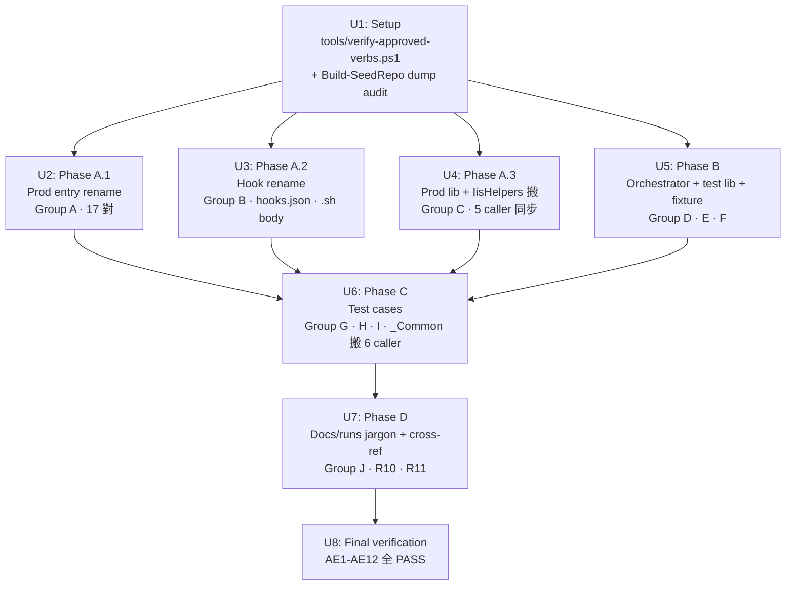

# refactor: turbo-plugin 命名統一(~100 檔 rename 至 PowerShell 官方命名規範)

## Summary

把 `plugins/turbo-plugin/` 內所有 PowerShell + Bash script 改名符合 PowerShell `Get-Verb` 官方規範(entry Verb-Noun PascalCase / lib noun-only PascalCase / hook Invoke-prefix / Bash kebab-lowercase 同語意),消除測試端 4 種混雜後綴,並把「Phase 1/2」內部 jargon 改成對外清楚的「Script tests / Skill tests」。

執行採 brainstorm 提的 4-phase 拆解 + setup unit + final verification unit,總計 8 個 implementation unit。本 plan 完全沿用 brainstorm 的 15 KD / 14 R / 12 AE,無 scope 擴大。

**Target repo:** `turbo-plugins-claude`(本 worktree 目前所在)
**Branch:** `feat/turbo-plugin-v1.0`(承接 commit `afad1fa`,仍屬 v1.0.0 範圍,不 bump)

---

## Problem Frame

`turbo-plugin` 在 ce-work U1-U7 跑完後,user audit 發現命名不一致(see origin: `docs/brainstorms/2026-05-28-turbo-plugin-naming-conventions-requirements.md`):

1. 生產 script 全 kebab-lowercase,不符 PS 官方 Verb-Noun
2. 7 個 unapproved verb(pull / pack / cleanup / compute / check×2 / emit / run)
3. `push-to-svn-prepare/commit` 兩階段 prefix 誤導(兩階段合起來才是 push)
4. 測試端 4 種混雜後綴(`.Tests.ps1` / `.sh.test.sh` / `test_*.ps1` / `_Common.ps1`)
5. `unit/scripts-lib/` flat 跟 `unit/scripts/hooks/` nested 不一致
6. `scripts/lib/` test coverage 不完整
7. `Run-Phase1.ps1` 沒 Bash sibling
8. 「Phase 1/2」內部 jargon 對外不直觀

ship v1.0 前是無 publish / 無 user / 無 backward-compat 包袱的時機點,趁此把命名統一掉(已知時機 trade-off,see origin Dependencies)。

---

## High-Level Technical Design



每個 phase unit 結束都會跑 `tools/verify-approved-verbs.ps1` + `Invoke-ScriptTests.ps1` 作為 inner-loop fail-fast。U8 是最終 sweep,跑 lint + verifier + orchestrator + hook 觸發 + audit SHA 等 12 個 AE 全 PASS。

> 此圖為實作方向 directional guidance,非 implementation specification。實際 dispatch 仍以下方各 unit 細節為準。

---

## Output Structure

本 plan 結束後 `plugins/turbo-plugin/` 內新增 / 改動結構摘要(只列關鍵改動,不窮舉每個 rename):

```
plugins/turbo-plugin/
├── hooks/
│   └── hooks.json                          [modify: command: 指向新 .sh]
├── scripts/
│   ├── *.ps1 / *.sh                        [rename × 17 對:Verb-Noun PascalCase / kebab]
│   ├── hooks/
│   │   ├── Invoke-PostToolUseEnterWorktree.ps1   [rename from posttooluse-enterworktree.ps1]
│   │   ├── Invoke-SessionStart.ps1                [rename from sessionstart.ps1]
│   │   └── *.sh                                    [rename + body PS1_PATH 改 PascalCase]
│   └── lib/
│       ├── Common.ps1 / common.sh         [rename: noun-only]
│       ├── ApplicationHostHelpers.ps1     [rename: noun-only]
│       ├── IisHelpers.ps1                  [new: 從 ../resolve-iis-settings.ps1 搬入]
│       └── ps1-delegate.sh                 [unchanged]
└── tests/
    ├── Invoke-ScriptTests.ps1              [rename from Run-Phase1.ps1; 加 lint pre-flight + infra gate + routing]
    ├── invoke-script-tests.sh              [new: Bash sibling]
    ├── lib/
    │   ├── AssertHelpers.ps1               [rename: noun-only multi-fn]
    │   ├── AssertHelpers.test.ps1          [rename from test_assert_helpers.ps1]
    │   ├── Write-TrackingRow.ps1           [rename Verb-Noun (Emit→Write)]
    │   ├── Get-ScriptTestStatus.ps1        [rename Verb-Noun + jargon clean]
    │   ├── Get-RawCommitDump.ps1           [unchanged]
    │   └── ScriptsCommon.ps1               [new: 從 unit/scripts/_Common.ps1 搬入]
    ├── fixtures/
    │   ├── seed/
    │   │   ├── Build-SeedRepo.ps1          [rename Verb-Noun]
    │   │   ├── build-seed-repo.sh          [rename kebab]
    │   │   └── svn-repo-r1-r20.dump        [unchanged frozen dump]
    │   └── reset/
    │       ├── Reset-Fixture.ps1           [unchanged: 已合 Verb-Noun]
    │       ├── Reset-Fixture.test.ps1      [rename from test_reset_fixture.ps1]
    │       ├── reset-fixture.sh            [rename kebab]
    │       └── reset-fixture.test.sh       [new: meta-test]
    ├── unit/
    │   └── scripts/                        [_Common.ps1 移出]
    │       ├── *.test.ps1 / *.test.sh     [rename × 17 對對應 Group A 新名]
    │       ├── hooks/
    │       │   └── *.test.ps1 / *.test.sh [rename × 2 對]
    │       └── lib/                        [rename from ../scripts-lib/]
    │           ├── Common.test.ps1         [merge from 2 個 feature test]
    │           ├── common.test.sh          [new]
    │           ├── ApplicationHostHelpers.test.ps1   [new]
    │           ├── ps1-delegate.test.sh    [new]
    │           └── IisHelpers.test.ps1     [搬自 unit/scripts/resolve-iis-settings.Tests.ps1]
    ├── docs/
    │   ├── script-tests-schema.md          [rename from phase1-scripts-schema.md + 加 Build-SeedRepo audit section]
    │   ├── skill-tests.md                  [rename from phase2-skills.md]
    │   ├── skill-tests-session-plan.md     [rename from phase2-session-plan.md]
    │   └── (其他 docs 內文 Phase 1/2 全清)
    └── runs/v1.0.0/
        ├── script-tests-results.md         [rename from phase1-results.md]
        └── skill-tests-results/            [rename from phase2-results/]

tools/
└── verify-approved-verbs.ps1               [new: PS native Get-Verb 比對,CI-ready]
```

> 此結構為實作方向。實作端可微調未列細節(例如 audit doc 段落結構),per-unit `**Files:**` 段才是權威。

---

## Implementation Units

### U1. Setup — verifier + Build-SeedRepo dump audit

**Goal:** 建立 `tools/verify-approved-verbs.ps1`(後續所有 phase 跑完 inner-loop 的驗證工具)+ 完成 `Build-SeedRepo` 一次性 dump audit(KD-13 要求,記到 schema doc 含 SHA)。

**Requirements:** R13(verify-approved-verbs.ps1)、R14 sub-item(audit 記錄含 dump SHA)、Covers KD-13。

**Dependencies:** 無。

**Files:**
- `tools/verify-approved-verbs.ps1` *(new)* — PowerShell script using `Get-Verb` 內建 cmdlet
- `plugins/turbo-plugin/tests/docs/phase1-scripts-schema.md` *(modify)* — 加 `## Build-SeedRepo audit` section(含 dump file path / SHA / commit hash / audited by / date / verified facts)。注意 U7 才改檔名,本 unit 仍寫進舊檔名

**Approach:**
- verifier 演算法(per R13 三條 edge case 規則):
  - 路徑 whitelist:`scripts/lib/` 與 `tests/lib/` 下的 `.ps1` skip(library noun-only)
  - 其他位置必須 Verb-Noun:第一個 `-` 之前是 verb(case-sensitive PascalCase,大寫開頭),verb 在 `(Get-Verb).Verb` 清單
  - 多 hyphen:Verb-Noun 區的 `.ps1` 只能有單一 hyphen
- 輸入:`-Path <root>`;遞迴掃 `.ps1`;違規檔名 + reason 印 stderr;exit code 非 0
- audit 流程:跑 `svnadmin dump` reload 確認 R1-R20 都載入 → 對每個 revision 看 `svn log` + `svn cat` 確認 commit message 中文 / author / 預期檔內容 → 把驗證項目 + 當前 dump file 的 SHA-256 寫進 schema doc 新增段落 + 標當前 commit hash

**Patterns to follow:**
- `tools/lint-ps-compat.ps1`(現有 PS 5.1 相容性 lint)— 走相同 CLI 形式(`-Path`,exit code,STDERR violations,stdout summary)
- `plugins/turbo-plugin/tests/lib/Get-Phase1Status.ps1`(現有 exit code 規則)— exit 0 = all pass,exit 非 0 = 有違規

**Test scenarios:**
- *Covers AE10 (a)*:故意建 `Pull-Foo.ps1`(unapproved verb)→ verifier exit 非 0 + STDERR 訊息含「`Pull-Foo.ps1`」+「verb `Pull` not approved」
- *Covers AE10 (b)*:故意建 `build-web.ps1`(小寫 verb)→ exit 非 0 + 訊息「verb must be PascalCase」
- *Covers AE10 (c)*:`scripts/lib/Common.ps1` + `tests/lib/AssertHelpers.ps1`(noun-only,無 hyphen)→ verifier 通過,**不算違規**
- *Covers AE10 (d)*:故意建 `Get-Svn-Log.ps1`(多 hyphen)→ exit 非 0 + 訊息「single hyphen only」
- Happy path:對「v0.x 命名前」現況跑 verifier → **預期會 fail**(舊名 `pull-from-svn.ps1` 等屬 (b) 違規)。本 unit 不用通過,只驗證 verifier 抓得到舊命名違規(rename 完才會 0 violation)

**Verification:**
- verifier 個別 negative case 跑出正確 exit code + 訊息
- `tests/docs/phase1-scripts-schema.md` 有 `## Build-SeedRepo audit` 段含 dump SHA + commit hash + R1-R20 驗證項目
- 當前 dump file 計算 SHA-256 等於 audit 記錄裡的 SHA

---

### U2. Phase A.1 — Prod entry script rename(Group A,17 對)

**Goal:** 把 `plugins/turbo-plugin/scripts/` 下 17 對 prod entry `.ps1` + `.sh` 改名為 Verb-Noun PascalCase + 同語意 kebab,更新 .sh body 內 trampoline arg 的 byte-for-byte case match。所有 command / skill body 內路徑 reference 同步更新。

> **註:** Group A 原 brainstorm 列 18 對,但 `resolve-iis-settings` 經 brainstorm Round 2 重歸 Group C lib(實際上它是 dot-source library,不是 entry script,見 U4)。本 unit 處理剩 17 對。

**Requirements:** R1。

**Dependencies:** U1(verifier 可用)。

**Files:**
- 17 對 `plugins/turbo-plugin/scripts/<old-name>.ps1` + `<old-name>.sh` rename 為新名:
  - `build-web` → `Build-Web` / `build-web`
  - `check-encoding-support` → `Test-EncodingSupport` / `test-encoding-support`
  - `check-iis-listening` → `Test-IisListening` / `test-iis-listening`
  - `cleanup-orphan-iis` → `Remove-OrphanIis` / `remove-orphan-iis`
  - `compute-project-identity` → `Get-ProjectIdentity` / `get-project-identity`
  - `create-remote-test` → `New-RemoteTest` / `new-remote-test`
  - `get-target-url` → `Get-TargetUrl` / `get-target-url`
  - `pack-content` → `Compress-Content` / `compress-content`
  - `publish-web` → `Publish-Web` / `publish-web`
  - `pull-from-svn` → `Sync-FromSvn` / `sync-from-svn`
  - `push-to-svn-prepare` → `Build-SvnCommit` / `build-svn-commit`
  - `push-to-svn-commit` → `Submit-SvnCommit` / `submit-svn-commit`
  - `reset-remote-test` → `Reset-RemoteTest` / `reset-remote-test`
  - `resolve-iis-settings` → **不在此 unit**(歸 U4 Group C)
  - `start-iis` / `stop-iis` → `Start-Iis` / `Stop-Iis`(case 變動)
  - `svn-ignore` → `Set-SvnIgnore` / `set-svn-ignore`
  - `svn-log` → `Get-SvnLog` / `get-svn-log`
- 每對 `.sh` body 內 `exec "...lib/ps1-delegate.sh" <name> "$@"` 那個 `<name>` argument 改 PascalCase byte-for-byte match 新 `.ps1` basename
- 全 plugin command / skill body 內 `${CLAUDE_PLUGIN_ROOT}/scripts/<old-name>.ps1` 等路徑 reference 同步更新(具體檔案於 implement 時 grep 列出)

**Approach:**
- 用 `git mv` 而非 delete-then-create,保 git history blame 連續
- Windows NTFS case-only rename(e.g. `start-iis.ps1` → `Start-Iis.ps1`)要走兩段 rename 避開 case-insensitive collision:
  ```
  git mv start-iis.ps1 _Start-Iis.tmp.ps1
  git mv _Start-Iis.tmp.ps1 Start-Iis.ps1
  ```
  影響的 case-only 對:`start-iis` / `stop-iis`(對應 .sh 已是小寫,不用改)。**Verifier 跑時機 = U2 結尾**(所有 `_temp` 中介檔已 rename 掉),`_temp` 字串不會被 verifier 抓到
- `.sh` body 內 trampoline arg 用 sed-style 修改;PS 端 verifier 通過後手動 Linux smoke check(若 dev 環境有 WSL)

**Patterns to follow:**
- 既有 17 對 `.ps1` + `.sh` 已是 1:1 pair pattern(`<name>.ps1` + `<name>.sh`)
- ps1-delegate.sh trampoline 約定:arg 是 `.ps1` basename(沒 extension)

**Test scenarios:**
- *Covers AE1*:Given `scripts/pull-from-svn.ps1`,when rename 完成,then `scripts/Sync-FromSvn.ps1` 存在 + `pull-from-svn.ps1` 不存在 + `Get-Verb 'Sync'` 返非空
- *Covers AE12*:Given Group A `.sh` 內 trampoline arg,when grep,then 每個 `<name>` byte-for-byte 等於對應新 `.ps1` basename(含 PascalCase 大小寫)
- *Covers AE12 negative*:故意把某 `.sh` 內 arg 維持舊小寫,when 在 Git Bash + WSL 跑該 `.sh`,then 預期 fail(NTFS case-insensitive 上不會抓到,須在 case-sensitive FS 驗)
- Patterns to follow 驗證:每對 `.ps1` + `.sh` 都存在(無 orphan)

**Verification:**
- `tools/verify-approved-verbs.ps1 -Path plugins/turbo-plugin/scripts/` 對 Group A 區跑通過 0 violation(其它 group 仍會 fail,本 unit 不要求)
- 17 對檔存在 + 0 舊名殘留(`Get-ChildItem -Recurse plugins/turbo-plugin/scripts -Filter 'pull-from-svn.*'` 等返 0)
- `Invoke-ScriptTests` 跑 prod test(Group A 對應 test,U6 還沒改名前可能 fail — 此 unit 只 verify rename 本身,test PASS 留 U8)

---

### U3. Phase A.2 — Hook rename + `hooks.json` + `.sh` body PS1_PATH(Group B)

**Goal:** 改 2 個 hook `.ps1` + 2 個 `.sh`,更新 `hooks/hooks.json` 內 `command:` 指向新 `.sh`,同步更新 `.sh` body 內 hard-code `PS1_PATH=` literal(byte-for-byte case match)。

**Requirements:** R2。

**Dependencies:** U1。

**Files:**
- `plugins/turbo-plugin/scripts/hooks/posttooluse-enterworktree.ps1` → `Invoke-PostToolUseEnterWorktree.ps1`
- `plugins/turbo-plugin/scripts/hooks/posttooluse-enterworktree.sh` → `invoke-posttooluse-enterworktree.sh`
- `plugins/turbo-plugin/scripts/hooks/sessionstart.ps1` → `Invoke-SessionStart.ps1`
- `plugins/turbo-plugin/scripts/hooks/sessionstart.sh` → `invoke-sessionstart.sh`
- `plugins/turbo-plugin/hooks/hooks.json` *(modify)*:兩條 `command:` 從 `bash "...hooks/posttooluse-enterworktree.sh"` 改 `bash "...hooks/invoke-posttooluse-enterworktree.sh"`(SessionStart 同理)
- 兩個新 `.sh` body 內 hard-code `PS1_PATH="${PLUGIN_ROOT}/scripts/hooks/<old-name>.ps1"` 改 `PS1_PATH="${PLUGIN_ROOT}/scripts/hooks/Invoke-PostToolUseEnterWorktree.ps1"`(SessionStart 同理)

**Approach:**
- `hooks.json` 編輯時保留 JSON 結構 + indentation(用 Read → Edit,不用 sed)
- `.sh` body PS1_PATH literal 必須 PascalCase byte-for-byte match — 故意檢查:rename 後 grep 每個 hook `.sh` 確認 `PS1_PATH=` 行的 `.ps1` basename 跟對應 `.ps1` 檔名完全一致(含大寫)
- 本 unit 不負責 Claude Code 重新觸發測試 — 留 U8 最終 verification(因為需要重啟 session)

**Patterns to follow:**
- 既有 `hooks/hooks.json` 結構(無其他 entry,只兩條 hook)
- 既有 hook `.sh` 已用 `bash "..."` invoke + `PS1_PATH=` literal pattern(非 ps1-delegate trampoline,因為 hook 需要透過 stdin 傳 payload — 詳見既有 `.sh` 註解)

**Test scenarios:**
- *Covers AE2 (a)*:Given `hooks/hooks.json` 內 `PostToolUse` 與 `SessionStart` 兩條 hook config,when grep,then `command:` 含 `bash "${CLAUDE_PLUGIN_ROOT}/scripts/hooks/invoke-posttooluse-enterworktree.sh"` 及對應 `invoke-sessionstart.sh`
- *Covers AE2 (b)*:該兩個 `.sh` 檔存在
- *Covers AE2 (c)*:每個 `.sh` body 內 `PS1_PATH=` literal **byte-for-byte**(含 PascalCase)指向對應新 `.ps1` 名,且該 `.ps1` 存在
- *Covers AE2 negative*:故意把某 hook `.sh` 的 `PS1_PATH=` 維持舊小寫(模擬漏改),在 case-sensitive filesystem 觸發該 hook,應 fail 且訊息含「No such file」(若 dev 環境是 NTFS,則 stage 上 WSL 或 ext4 mount 跑此 negative)

**Verification:**
- `hooks.json` 兩條 command 路徑正確 + 兩個 `.sh` 存在 + 兩個 `.sh` 內 PS1_PATH 正確 byte-match
- `tools/verify-approved-verbs.ps1` 對 `scripts/hooks/` 通過(`Invoke-*` 都 approved)

---

### U4. Phase A.3 — Prod library + IisHelpers 搬入(Group C)

**Goal:** 把 prod library 改名 noun-only PascalCase(Common / ApplicationHostHelpers),把原 entry script `resolve-iis-settings.ps1` 重新歸類為 lib 並搬到 `scripts/lib/IisHelpers.ps1`,更新 5 個 caller 的 dot-source path,刪除 `resolve-iis-settings.sh` trampoline。

**Requirements:** R3。

**Dependencies:** U1、U2(5 個 caller 在 U2 已 rename 為新 PascalCase 檔名,本 unit 對新檔名做 dot-source path 更新)。

**Files:**
- `plugins/turbo-plugin/scripts/lib/common.ps1` → `Common.ps1`(`common.sh` 同檔名,不變)
- `plugins/turbo-plugin/scripts/lib/applicationhost-helpers.ps1` → `ApplicationHostHelpers.ps1`(無 `.sh` sibling,KD-11 single-sibling 例外條 (a))
- `plugins/turbo-plugin/scripts/lib/ps1-delegate.sh` 不變(KD-11 single-sibling 例外條 (b))
- `plugins/turbo-plugin/scripts/resolve-iis-settings.ps1` *(move + rename)* → `plugins/turbo-plugin/scripts/lib/IisHelpers.ps1`(內含 `Find-IisExpressPath` + `Find-ApplicationhostTarget` + `Resolve-IisSettings` 三個 function,不改 function 名)
- `plugins/turbo-plugin/scripts/resolve-iis-settings.sh` *(delete)* — trampoline 失效(IisHelpers 不再是 entry,沒人會 bash 呼)
- 5 個 caller dot-source path 更新(這些檔在 U2 已 rename,本 unit 用新檔名):
  - `plugins/turbo-plugin/scripts/Test-IisListening.ps1`
  - `plugins/turbo-plugin/scripts/Remove-OrphanIis.ps1`
  - `plugins/turbo-plugin/scripts/Get-TargetUrl.ps1`
  - `plugins/turbo-plugin/scripts/Start-Iis.ps1`
  - `plugins/turbo-plugin/scripts/Stop-Iis.ps1`
- 5 個 caller dot-source 從 `. (Join-Path $PSScriptRoot 'resolve-iis-settings.ps1')` 改 `. (Join-Path $PSScriptRoot 'lib' 'IisHelpers.ps1')`(注意 PS 5.1 不能 3+ arg Join-Path,要用 `[System.IO.Path]::Combine($PSScriptRoot, 'lib', 'IisHelpers.ps1')`)

**額外 dot-source 案 update — `common.ps1` 與 `applicationhost-helpers.ps1` 改 PascalCase 後,字串 literal 必須 byte-for-byte case match,否則 case-sensitive FS(Linux / macOS)silent fail:**

- **17 個 external caller dot-source `common.ps1` → `Common.ps1`**(`.sh` 端依舊小寫 `common.sh` 不變):
  - 16 個 Group A prod entry script(post-U2 PascalCase 名):`Build-Web.ps1` / `Test-IisListening.ps1` / `Remove-OrphanIis.ps1` / `Get-ProjectIdentity.ps1` / `New-RemoteTest.ps1` / `Get-TargetUrl.ps1` / `Compress-Content.ps1` / `Publish-Web.ps1` / `Sync-FromSvn.ps1` / `Build-SvnCommit.ps1` / `Submit-SvnCommit.ps1` / `Reset-RemoteTest.ps1` / `Start-Iis.ps1` / `Stop-Iis.ps1` / `Set-SvnIgnore.ps1` / `Get-SvnLog.ps1`
  - 1 個 hook(post-U3):`scripts/hooks/Invoke-SessionStart.ps1`
- **1 個 external caller dot-source `applicationhost-helpers.ps1` → `ApplicationHostHelpers.ps1`**(post-U2):`Start-Iis.ps1`
- **1 個 internal:**新 `IisHelpers.ps1`(post-move from `resolve-iis-settings.ps1`)body 內也 dot-source `common.ps1` → 改 `Common.ps1`,且因為 IisHelpers 自己已在 `scripts/lib/`,dot-source path 從原本 `lib/common.ps1` 改成同層 `Common.ps1`(無需 `lib/` 前綴)

**Approach:**
- IisHelpers 搬入 lib 是「擴大 KD-11 例外清單」— PR 描述須明文 cite 是 (a) clause(IIS Express + applicationhost.config + MSBuild 找路徑都是 Windows-only)以滿足 KD-11 enforcement
- 5 個 caller 的 dot-source path 必須用 `[System.IO.Path]::Combine` 或單一 `Join-Path`,避開 PS 5.1 不支援 3+ arg Join-Path 的 footgun
- 刪 `resolve-iis-settings.sh` 用 `git rm`(保 history)

**Patterns to follow:**
- 既有 `Common.ps1` 已是 noun-only PascalCase 的好 reference(但要從 `common.ps1` rename 來)
- 既有 `ApplicationHostHelpers.ps1` 命名 pattern — 同 `<Concept>Helpers.ps1`
- PS 5.1 dot-source path 慣例:`. (Join-Path $PSScriptRoot 'lib' 'foo.ps1')` 或 `. ([System.IO.Path]::Combine(...))`

**Test scenarios:**
- *Covers AE3*:Given `scripts/lib/Common.ps1`,when 跑 `Get-Content`,then 內容跟 rename 前 byte-equal
- 5 caller dot-source 正確性:跑 `Test-IisListening.ps1` 等任一 script,確認 `Find-IisExpressPath` function 在 scope 內可呼(不能 `Command not found`)
- IisHelpers 三個 function 名不變:`Get-Command Find-IisExpressPath -ErrorAction SilentlyContinue` 返非空(after dot-source)

**Verification:**
- `tools/verify-approved-verbs.ps1 -Path plugins/turbo-plugin/scripts/lib/` 通過(noun-only whitelist 起作用)
- `tools/verify-approved-verbs.ps1 -Path plugins/turbo-plugin/scripts/` 對 Group A + B + C 整體跑通過 0 violation
- `Get-ChildItem plugins/turbo-plugin/scripts/lib/IisHelpers.ps1` 存在
- `Get-ChildItem plugins/turbo-plugin/scripts/resolve-iis-settings.{ps1,sh}` 不存在
- 5 callers 用新檔名跑(任一 IIS-touching script `&` invoke),不報 dot-source 失敗
- **Case-sensitive grep verification:**對 `plugins/turbo-plugin/scripts/` 跑 `Select-String -CaseSensitive 'common\.ps1'` 與 `'applicationhost-helpers\.ps1'`,返 0 處小寫殘留(NTFS 不會抓出來,但 case-sensitive Linux / macOS FS 上會 silent fail。AE12 同類 case match 要求)

---

### U5. Phase B — Orchestrator + test library + fixture(Group D + E + F)

**Goal:** 重寫測試 orchestrator(加 lint pre-flight + infra gate + halt logic + path routing),改名測試 lib + 搬 `_Common.ps1` 到 `tests/lib/`,改名 fixture script + 新增 fixture meta-test。

**Requirements:** R4、R5、R6、R12。

**Dependencies:** U1。

**Files:**
- `plugins/turbo-plugin/tests/Run-Phase1.ps1` *(rewrite + rename)* → `Invoke-ScriptTests.ps1`
- `plugins/turbo-plugin/tests/invoke-script-tests.sh` *(new)* — Bash sibling
- Test library(`tests/lib/`):
  - `Assert-Helpers.ps1` *(rename)* → `AssertHelpers.ps1`(noun-only,內含 6 個 Assert-* function 不變)
  - `Emit-TrackingRow.ps1` *(rename)* → `Write-TrackingRow.ps1`(Verb-Noun,Emit→Write approved)
  - `Get-Phase1Status.ps1` *(rename)* → `Get-ScriptTestStatus.ps1`(Verb-Noun + jargon clean)
  - `Get-RawCommitDump.ps1` 不變
  - `test_assert_helpers.ps1` *(rename)* → `AssertHelpers.test.ps1`
  - `ScriptsCommon.ps1` *(new)* — **複製 `unit/scripts/_Common.ps1` 全部內容到此新檔**(內容不改)。本 unit 只新增此檔,**不刪原 `_Common.ps1`**;U6 才從 `unit/scripts/` 刪舊 `_Common.ps1` + 改 6 caller dot-source
- Fixture:
  - `tests/fixtures/seed/build-seed-repo.ps1` *(rename)* → `Build-SeedRepo.ps1`
  - `tests/fixtures/seed/build-seed-repo.sh` 檔名不變(已是 kebab)
  - `tests/fixtures/reset/reset_fixture.sh` *(rename)* → `reset-fixture.sh`
  - `tests/fixtures/reset/test_reset_fixture.ps1` *(rename)* → `Reset-Fixture.test.ps1`
  - `tests/fixtures/reset/reset-fixture.test.sh` *(new)* — meta-test for Bash side
  - `tests/fixtures/reset/Reset-Fixture.ps1` 不變(已是 Verb-Noun)

**Approach:**

`Invoke-ScriptTests.ps1` 行為(per KD-14):
1. **Lint pre-flight**:跑 `tools/lint-ps-compat.ps1 -Path plugins/turbo-plugin/`,違規 → halt + exit 2,不進 infra gate(繼承 `Run-Phase1.ps1` 既有行為)
2. **Infra gate(有 ordering)**:
   - 先跑 `tests/lib/AssertHelpers.test.ps1` → FAIL 即 full halt(assertion 本身壞了 → 所有結果不可信)
   - 再跑 `tests/fixtures/*/Reset-Fixture.test.ps1` 等 fixture meta-test → FAIL 只 skip fixture-dependent prod test,純 unit 照跑
3. **Routing**:discovery 後分類:
   - path 開頭 `tests/lib/` 或 `tests/fixtures/` → infra
   - path 開頭 `tests/unit/` → prod
   - 其他 → 報錯「unrecognized test location」
4. **Discovery glob 實作備註(per R12)**:`*.test.{ps1,sh}` 是 shell brace,PS 端要分兩次 `Get-ChildItem -Recurse -Filter '*.test.ps1'` + `'*.test.sh'`,或用 `-Include`。Bash 端 `find ... -name '*.test.ps1' -o -name '*.test.sh'`

`invoke-script-tests.sh` Bash sibling 功能對等;兩者都會跑 `.ps1` + `.sh` 雙邊 test(.sh 透過 `ps1-delegate.sh` 反向 invoke PS)

`Write-TrackingRow` / `Get-ScriptTestStatus` 內部 function 名同步改(content rename 不只 file rename)。所有 caller(主要是 `Invoke-ScriptTests.ps1` 本身)的 dot-source path / function call 同步改

**Internal jargon + default path 同步更新(F-003):**
- `Get-ScriptTestStatus.ps1` body 內 `Write-Output "Phase 1 status..."` literal → 改 `"Script tests status..."`
- `Get-ScriptTestStatus.ps1` 的 `-TargetDoc` 預設值從 `phase1-results.md` → `script-tests-results.md`(U7 才改檔名,本 unit 改預設指向那個未來檔名)
- `Invoke-ScriptTests.ps1`(新 orchestrator)的 `-TargetDoc` 預設值同樣指向 `script-tests-results.md`
- 其他 `Phase 1` / `phase1-` 字串 literal 在 `tests/lib/*.ps1` 內全清(`Write-TrackingRow.ps1` / `Invoke-ScriptTests.ps1` 一併 grep verify)

**Patterns to follow:**
- 既有 `Run-Phase1.ps1` lint pre-flight 實作(line 90-141 範圍)
- 既有 `Reset-Fixture.ps1` idempotent 特性
- PS test framework convention:`.test.ps1` 內定義 `Test-*` function + 用 hand-rolled `Assert-*`(per F-1 chain pivot,no Pester)

**Test scenarios:**
- *Covers AE4 part 1*:Given `Invoke-ScriptTests.ps1` + 一個臨時空目錄 fixture(`$env:TEMP\u5-discovery-test\tests\unit\scripts\`,內無任何 `.test.ps1`),when 跑 discovery 指向該空 root,then 返 0 個 file + exit code 反映 0-result(無 false PASS)。Given 在臨時 fixture 內 touch 一個 `Foo-Bar.test.ps1` 空檔,when 跑 discovery,then 找到 1 個。**不在 `plugins/turbo-plugin/tests/` live tree 內建 stub**(避免 U6 重複 + AE11 count 失準)
- *Covers AE5*:Given `tests/lib/`,when rename 完成,then 包含 `AssertHelpers.ps1` + `Write-TrackingRow.ps1` + `Get-ScriptTestStatus.ps1` + `Get-RawCommitDump.ps1` + `ScriptsCommon.ps1` + `AssertHelpers.test.ps1`,且 `Get-Phase1Status` 字串不出現在任何 `.ps1` 內部
- *Covers AE6*:Given `Reset-Fixture.ps1` 跟 `reset-fixture.sh` 修改,when 跑 `Reset-Fixture.test.ps1` + `reset-fixture.test.sh`,then 雙方 case 全 PASS;故意改壞 `.sh` 一段 → `reset-fixture.test.sh` 抓出
- *Covers AE9*:Given `tests/lib/AssertHelpers.test.ps1` 故意改壞 `Assert-Equal` 永遠回 true,when 跑 `Invoke-ScriptTests.ps1`,then orchestrator 在 infra gate 階段 halt 不跑 prod,exit 非 0,訊息含「infra gate failed」
- Reset-Fixture skip-only:故意改壞 fixture seed dump → `Reset-Fixture.test.ps1` FAIL → orchestrator skip fixture-dependent prod test,純 unit test(不碰 fixture 的)照跑通過

**Verification:**
- `tools/verify-approved-verbs.ps1 -Path plugins/turbo-plugin/tests/lib/` 通過(noun-only whitelist + 單檔 Verb-Noun 都對)
- `Invoke-ScriptTests.ps1` 跑 lint pre-flight 通過 + infra gate 通過(`AssertHelpers.test.ps1` 跟 `Reset-Fixture.test.ps1` PASS)
- `invoke-script-tests.sh` 在 Git Bash 上跑能對等執行(同樣 lint → infra → routing)
- `Get-ChildItem plugins/turbo-plugin/tests/lib/_Common.ps1` 不存在於 lib(那個搬到 `tests/lib/ScriptsCommon.ps1`);此 unit 不刪 `unit/scripts/_Common.ps1`(留給 U6)

---

### U6. Phase C — Test cases(Group G + H + I)

**Goal:** 改名 17 對 unit/scripts test case + 2 對 hook test + `unit/scripts-lib/` → `unit/scripts/lib/`,merge 兩 feature test 為 `Common.test.ps1`,新增 3 個 lib test + 1 個 IisHelpers test,搬 `_Common.ps1`(U5 已加 ScriptsCommon.ps1 到 lib,本 unit 刪舊 + 改 6 caller 的 dot-source path)。

**Requirements:** R7、R8、R9。

**Dependencies:** U2、U3、U4(source 已 rename 才能改對應 test name)、U5(ScriptsCommon.ps1 已在 `tests/lib/`)。

**Files:**

Group G — unit/scripts/(對應 U2 17 對):
- 17 對 `tests/unit/scripts/<old>.{Tests.ps1,sh.test.sh}` → `<NewVerbNoun>.test.ps1` + `<new-verb-noun>.test.sh`,例:
  - `build-web.Tests.ps1` → `Build-Web.test.ps1`、`build-web.sh.test.sh` → `build-web.test.sh`
  - `pull-from-svn.Tests.ps1` → `Sync-FromSvn.test.ps1`、…
  - …(依 U2 mapping)
- `tests/unit/scripts/resolve-iis-settings.Tests.ps1` → `tests/unit/scripts/lib/IisHelpers.test.ps1`(搬位置 + 改名,對齊 U4 新 source)
- `tests/unit/scripts/resolve-iis-settings.sh.test.sh` *(delete)* — 對應 source `.sh` 已刪
- `tests/unit/scripts/_Common.ps1` *(delete)* — 已搬到 `tests/lib/ScriptsCommon.ps1`(U5)
- 6 個 caller dot-source path 更新:
  - `tests/unit/scripts/New-RemoteTest.test.ps1`(原 `create-remote-test.Tests.ps1`)
  - `tests/unit/scripts/Compress-Content.test.ps1`(原 `pack-content.Tests.ps1`)
  - `tests/unit/scripts/Sync-FromSvn.test.ps1`(原 `pull-from-svn.Tests.ps1`)
  - `tests/unit/scripts/Submit-SvnCommit.test.ps1`(原 `push-to-svn-commit.Tests.ps1`)
  - `tests/unit/scripts/Reset-RemoteTest.test.ps1`(原 `reset-remote-test.Tests.ps1`)
  - `tests/unit/scripts/Set-SvnIgnore.test.ps1`(原 `svn-ignore.Tests.ps1`)
- 6 個 caller 的 dot-source 從 `[System.IO.Path]::Combine($PSScriptRoot, '_Common.ps1')` 改 `[System.IO.Path]::Combine($PSScriptRoot, '..', '..', 'lib', 'ScriptsCommon.ps1')`(走 walk-up `..\..\lib\` 到 `tests/lib/`)

**額外:**`Assert-Helpers.ps1` → `AssertHelpers.ps1` rename(由 U5 完成)後,**20 個 `.Tests.ps1` 內的 dot-source 字串 literal 必須同步改 byte-for-byte case match**,否則 case-sensitive FS silent fail:
- 17 個 `tests/unit/scripts/*.test.ps1`(post-U6 PascalCase 名,即 Group G 17 對之 .ps1 側)
- 2 個 `tests/unit/scripts/hooks/*.test.ps1`(`Invoke-PostToolUseEnterWorktree.test.ps1` / `Invoke-SessionStart.test.ps1`)
- 1 個 `tests/unit/scripts/lib/IisHelpers.test.ps1`(post-搬移 from `resolve-iis-settings.Tests.ps1`)

每個 caller 內的 `[System.IO.Path]::Combine(..., 'Assert-Helpers.ps1')` literal 改 `'AssertHelpers.ps1'`

Group H — hooks 對應 U3:
- `tests/unit/scripts/hooks/posttooluse-enterworktree.{Tests.ps1,sh.test.sh}` → `Invoke-PostToolUseEnterWorktree.test.ps1` + `invoke-posttooluse-enterworktree.test.sh`
- `tests/unit/scripts/hooks/sessionstart.{...}` → `Invoke-SessionStart.test.ps1` + `invoke-sessionstart.test.sh`

Group I — scripts/lib 對應 U4:
- `tests/unit/scripts-lib/` *(rename directory)* → `tests/unit/scripts/lib/`
- `test_resolve_config_value_merge.ps1` + `test_find_tools_strict_cut.ps1` *(merge)* → `tests/unit/scripts/lib/Common.test.ps1`(內部 sub-section 區隔兩 feature)
- `tests/unit/scripts/lib/common.test.sh` *(new)* — 對應 `scripts/lib/common.sh`
- `tests/unit/scripts/lib/ApplicationHostHelpers.test.ps1` *(new)* — 對應 `scripts/lib/ApplicationHostHelpers.ps1`
- `tests/unit/scripts/lib/ps1-delegate.test.sh` *(new)* — 對應 `scripts/lib/ps1-delegate.sh`

**Approach:**
- `git mv` 處理 rename(保 history)。case-only rename 跟 U2 同樣兩段走
- merge `test_resolve_config_value_merge.ps1` + `test_find_tools_strict_cut.ps1` → 新 `Common.test.ps1` 內保留原 7 + 12 case(內部用 `#region` 或 H2 註解分段),不丟 case
- 6 caller dot-source path 計算:從 `tests/unit/scripts/<file>.test.ps1` 走到 `tests/lib/ScriptsCommon.ps1` = `..\..\lib\ScriptsCommon.ps1`(**前提:6 個 caller 都在 `tests/unit/scripts/` root,沒 nested 到 subdir;若以後新加 caller 在 `tests/unit/scripts/lib/` 或 `tests/unit/scripts/hooks/`,walk-up 要對應加深一層**)
- 3 個新 lib test 內容(per AE4 補):
  - `common.test.sh` ≥ 4 case:`probe_git_version` / `get_normalized_absolute_path` / `get_main_worktree` / `test_is_submodule` 各 1
  - `ApplicationHostHelpers.test.ps1` ≥ 3 case:讀 `applicationhost.config` / 找 binding section / parse port number 各 1
  - `ps1-delegate.test.sh` ≥ 3 case:成功 dispatch 一個簡單 `.ps1` / 不存在 `.ps1` 報錯 / passthrough exit code 各 1
- IisHelpers.test.ps1 內容:原 `resolve-iis-settings.Tests.ps1` 內容搬過來 + dot-source path 改 `tests/lib/ScriptsCommon.ps1` 的對應 walk-up;source rename 為 `IisHelpers` 後 dot-source 它的方式不變(`Find-*` function 名沒改)

**Patterns to follow:**
- 既有 17 對 .Tests.ps1 內 hand-rolled assertion + `Assert-*` from AssertHelpers
- 既有 _Common.ps1 提供 `Invoke-PsScript` / `New-Sandbox` / `New-GitMainRepo` 等共用 setup
- merge 模式:`Common.test.ps1` 內 H2 段標 `## resolve-config-value-merge feature` / `## find-tools-strict-cut feature`

**Test scenarios:**
- *Covers AE4 補*:Given `Invoke-ScriptTests.ps1`,when 跑 discovery,then 全找到 17 + 2 + 5 lib test(`Common.test.ps1` / `common.test.sh` / `ApplicationHostHelpers.test.ps1` / `IisHelpers.test.ps1` / `ps1-delegate.test.sh`)
- *Covers AE7*:Given `tests/unit/scripts/lib/Common.test.ps1`,when 跑,then 包含原 7 case `resolve_config_value_merge` + 12 case `find_tools_strict_cut` = 19 case 全 PASS
- 3 lib test minimum case 數達標(per AE4 sub-clause):common.test.sh ≥4 / ApplicationHostHelpers.test.ps1 ≥3 / ps1-delegate.test.sh ≥3
- 6 caller dot-source 正確:任一 caller `*.test.ps1` 跑起來,從 `tests/lib/ScriptsCommon.ps1` 載入的 `Run-Git` / `New-Sandbox` 等 function 在 scope 內可用

**Verification:**
- `Get-ChildItem -Recurse plugins/turbo-plugin/tests/unit -Include '*.Tests.ps1', '*.sh.test.sh'` 返 0 個檔(舊命名全清)
- `Get-ChildItem plugins/turbo-plugin/tests/unit/scripts/_Common.ps1` 不存在(已搬出)
- `Get-ChildItem plugins/turbo-plugin/tests/unit/scripts-lib` 目錄不存在(已 rename 為 `lib`)
- `Invoke-ScriptTests.ps1` 整跑(此時 infra gate + prod test 都對得起對應 source)→ 全 PASS
- **Case-sensitive grep verification:**對 `plugins/turbo-plugin/tests/unit/` 跑 `Select-String -CaseSensitive 'Assert-Helpers'`,返 0 處小寫殘留(同 F-001 同類 case match 要求)

---

### U7. Phase D — Docs/runs jargon clean + cross-reference 更新(Group J + R10 + R11)

**Goal:** Phase1/2 jargon 全清(改 Script tests / Skill tests),docs / runs 檔名 rename,所有 command / skill / README / CLAUDE.md / brainstorm doc / plan doc 內 script path / Phase 1/2 reference 同步更新(`tp-setup/SKILL.md` 除外)。

**Requirements:** R10、R11。

**Dependencies:** U2-U6(所有 prod script + test 檔 rename 完才能 grep-replace 全 plugin 內 reference 同步更新,避免 partial state)。

**Files:**

Group J — docs/runs jargon rename(per KD-10):
- `tests/docs/phase1-scripts-schema.md` → `tests/docs/script-tests-schema.md`(注意 U1 已在舊檔名加 Build-SeedRepo audit 段,本 unit rename 後檔名變動,audit 段隨遷)
- `tests/docs/phase2-skills.md` → `tests/docs/skill-tests.md`
- `tests/docs/phase2-session-plan.md` → `tests/docs/skill-tests-session-plan.md`
- `tests/runs/v1.0.0/phase1-results.md` → `tests/runs/v1.0.0/script-tests-results.md`
- `tests/runs/v1.0.0/phase2-results/` → `tests/runs/v1.0.0/skill-tests-results/`
- 內文 Phase 1/2 全替換(per KD-10):
  - `tests/docs/fail-then-fix-process.md`
  - `tests/docs/rollback-checklist.md`
  - `tests/docs/budget-tracker-template.md`
  - `tests/runs/v1.0.0/budget-tracker.md`
  - `tests/runs/v1.0.0/known-issues.md`
  - `tests/runs/v1.0.0/session-log.md`

Cross-reference 更新(per R11):
- 全 plugin command body(`plugins/turbo-plugin/commands/**/*.md`)內 `scripts/<old-name>.ps1` 等 reference
- 全 skill body(`plugins/turbo-plugin/skills/**/*.md`)內 reference
- README:`plugins/turbo-plugin/README.md`
- CHANGELOG:`plugins/turbo-plugin/CHANGELOG.md`(`[Unreleased]` 加 refactor entry)
- CLAUDE.md:repo root(若有提及 turbo-plugin script 名)
- brainstorm doc:`docs/brainstorms/2026-05-28-turbo-plugin-naming-conventions-requirements.md`(本 plan 的 origin,內若有 reference 已是新名,只 verify)
- plan doc:本 plan(若內部 reference 自己,verify)

**Carve-out(per R11 明文):**
- `plugins/turbo-plugin/skills/tp-setup/SKILL.md` 內「Phase 1 / Phase 2 / Phase 3 / Phase 4」是該 skill 自己 setup 流程步驟標籤,**不替換**

**Approach:**
- 機械 sed 風險高(替換錯 → tp-setup 壞 / partial replace)— 用 Read + Edit 一檔一檔 review 後改
- **`phase1-scripts-schema.md` → `script-tests-schema.md` rename 時,U1 加入的 `## Build-SeedRepo audit` 段 preserve verbatim through `git mv`,不要 Edit 動 body**(audit SHA / commit hash 等 metadata 要保留,U8 step 7 才能比對)
- jargon 替換規則(per KD-10):"Phase 1"(含半形空格)→ "Script tests";"Phase 2" → "Skill tests"
- 機械替換前先 grep 列出全部需改檔案(`tp-setup/SKILL.md` 排除),逐檔 confirm
- cross-reference grep 模板:`Get-ChildItem -Recurse plugins/turbo-plugin -Include '*.md' | Select-String -Pattern 'pull-from-svn|build-web|...'`,確認每個舊名都已 0 出現
- CHANGELOG entry 寫:
  ```
  ### Changed
  - refactor: 全 plugin scripts + tests 改名符合 PowerShell `Get-Verb` 規範,Phase 1/2 jargon 改 Script/Skill tests(無 logic 改動)
  ```

**Patterns to follow:**
- 既有 CHANGELOG.md `[Unreleased]` 段格式
- 既有 commands / skills `${CLAUDE_PLUGIN_ROOT}/scripts/<name>.ps1` reference 形式
- KD-10 jargon mapping table 完整列舉

**Test scenarios:**
- *Covers AE8*:Given 任何 `.md` 在 `tests/docs/` 或 `tests/runs/v1.0.0/`(`tp-setup/SKILL.md` 除外),when grep,then 找不到字串「Phase 1」/「Phase 2」(歷史 reference 在引號 OK)
- tp-setup carve-out 驗證:`Select-String 'Phase [1-4]' plugins/turbo-plugin/skills/tp-setup/SKILL.md` 仍有 ~10 處(per 原 brainstorm 統計)
- script path 更新驗證:全 `commands/` + `skills/` 內 0 個舊檔名(`build-web` 等)殘留
- README / CLAUDE.md 內 reference 用新檔名

**Verification:**
- `Get-ChildItem -Recurse plugins/turbo-plugin -Include '*.md' -Exclude '*.local.*'` 對每個檔 grep 舊名清單 → 0 (除 carve-out)
- CHANGELOG `[Unreleased]` 有 entry
- 5 個 docs/runs 檔已 rename,新檔案存在 + 舊名不存在

---

### U8. Final verification — AE1-AE12 全 PASS sweep

**Goal:** 對全 plan 範圍跑 final verification,12 個 AE 全 PASS,plugin 安裝後 hook 真實觸發。

**Requirements:** R14。

**Dependencies:** U1-U7。

**Files:** 無 file 變更 — 本 unit 純驗證。

**Approach:**

Verification 序列(per R14 全清單):
1. **Lint** — `tools/lint-ps-compat.ps1 -Path plugins/turbo-plugin/` 0 violations
2. **Verifier** — `tools/verify-approved-verbs.ps1 -Path plugins/turbo-plugin/scripts/` 0 violations + `-Path plugins/turbo-plugin/tests/` 0 violations
3. **Reset-Fixture idempotent** — 連跑兩次,第二次跟第一次結果一致(by `Reset-Fixture.test.ps1` + `reset-fixture.test.sh`)
4. **Invoke-ScriptTests 全跑** — `plugins/turbo-plugin/tests/Invoke-ScriptTests.ps1` 跑 lint pre-flight + infra gate + prod test,全 PASS,discovery count = source count(per AE11 1:1 principle)
5. **Cross-platform 等價** — `plugins/turbo-plugin/tests/invoke-script-tests.sh`(在 Git Bash 上)跑能對等通過
6. **Hook 觸發實測** — 啟新 Claude Code session,觀察 `Invoke-SessionStart` hook 觸發;在 session 中觸發 EnterWorktree tool,觀察 `Invoke-PostToolUseEnterWorktree` 觸發(per AE2 完整端到端)
7. **Audit SHA check** — `Get-FileHash plugins/turbo-plugin/tests/fixtures/seed/svn-repo-r1-r20.dump -Algorithm SHA256` 跟 `tests/docs/script-tests-schema.md` 內 audit 段記錄的 SHA 比對相等(per R14 audit sub-item)
8. **Jargon grep** — 對 `tests/docs/` + `tests/runs/v1.0.0/` 內 .md grep「Phase 1」/「Phase 2」 → 0(carve-out `tp-setup/SKILL.md` 不在範圍)
9. **AE4 lib test minimum count** — 個別跑 3 個新 lib test 確認 case 數達標(per R9 sub-clause):
   - `tests/unit/scripts/lib/common.test.sh` ≥ 4 case PASS(`probe_git_version` / `get_normalized_absolute_path` / `get_main_worktree` / `test_is_submodule`)
   - `tests/unit/scripts/lib/ApplicationHostHelpers.test.ps1` ≥ 3 case PASS(讀 `applicationhost.config` / 找 binding section / parse port number)
   - `tests/unit/scripts/lib/ps1-delegate.test.sh` ≥ 3 case PASS(成功 dispatch / 不存在 ps1 報錯 / passthrough exit code)
10. **Case-sensitive grep sweep**(F-001 + F-002 派生)— 對 `plugins/turbo-plugin/scripts/` 跑 `Select-String -CaseSensitive 'common\.ps1'` / `'applicationhost-helpers\.ps1'`,對 `plugins/turbo-plugin/tests/unit/` 跑 `'Assert-Helpers'`,**全返 0 殘留**(case-sensitive FS silent fail final check)

**Patterns to follow:**
- 既有 `Run-Phase1.ps1` exit code 規則(0 = 全 PASS or 全 acknowledged,非 0 = 至少 1 個 raw FAIL)
- 既有 hook trigger 觀察:`SessionStart` 在 session 開始時跑,看 console 是否有 hook 輸出 / log

**Test scenarios:**
- *Covers AE1-AE12*(每條 AE 對應上述 verification 步驟)
- *Covers AE11*:`Invoke-ScriptTests.ps1` 跑完 → 全 test PASS + exit 0 + discovery count = source count
- *Covers AE12*:`.sh` trampoline args + hook `PS1_PATH` 都 byte-for-byte case match(已在前面 unit 驗,本 unit 整體再 grep 一次)
- *Covers AE9*:故意改壞 `AssertHelpers.test.ps1` → orchestrator halt(可選 negative test,確認 halt logic 真能 trigger,跑完還原)

**Verification:**
- 8 個 verification step 全綠
- 全部 12 AE 通過(對照原 brainstorm AE 清單一條條打勾)
- working tree clean(無 forgotten edits)
- 可進入 commit phase

---

## System-Wide Impact

| 受影響面 | 衝擊 | Mitigation |
|---|---|---|
| **Hook 設定**(`hooks/hooks.json`)| 改錯 → Claude Code 安裝後 hook 不觸發 silent failure | U3 + AE2 三重驗證(hooks.json + `.sh` body + `.ps1` 存在);U8 step 6 端到端實測 |
| **Cross-platform 對等性**(Linux/macOS)| `.sh` trampoline arg 與 hook `PS1_PATH` 在 case-sensitive FS 上若沒 byte-match → silent fail | AE12 + AE2 negative case;U8 step 5 Git Bash 跑 invoke-script-tests.sh |
| **Plugin command / skill / hook config** | 全部 script path reference 改 | U7 全 grep + 逐檔 Edit;CHANGELOG entry 提醒 user `/clear` |
| **In-flight Claude Code session** | session cache 舊路徑 → tool error | CHANGELOG 標 breaking rename;PR 描述 `/clear` 建議 |
| **PS 5.1 dot-source**(IisHelpers 搬入 + _Common.ps1 搬入)| `Join-Path` 3+ arg 不支援 → 跑 dot-source 報錯 | KD requires `[System.IO.Path]::Combine`;U4 + U6 Approach 明寫 |
| **NTFS case-only rename**(start-iis → Start-Iis 等)| `git mv` 在 case-insensitive FS 上是 no-op | U2 Approach 明寫兩段 rename(經 `_temp`)|
| **`tools/` 新增 surface** | 永久新增工具目錄,目前無 CI wiring | Scope Boundaries 承認;CI wiring 留後續 PR |

---

## Key Technical Decisions

直接 carry forward brainstorm 15 KD,不重新討論(see origin)。本 plan 採用以下決策:

- **KD-1 命名規則分四層**:entry Verb-Noun PascalCase / lib noun-only PascalCase / lib 單 function Verb-Noun / hook Invoke-prefix;Bash kebab(see origin)
- **KD-2 + KD-3**:7 個 unapproved verb 全改;Push-to-svn 兩階段改 `Build-SvnCommit` / `Submit-SvnCommit`(adversarial Round 1 修正)
- **KD-4 hook Invoke- prefix**:`Invoke-PostToolUseEnterWorktree` / `Invoke-SessionStart`
- **KD-5 test 檔後綴統一 `.test.ps1` / `.test.sh`**:U5 / U6 全程套用,取代舊 `.Tests.ps1` / `.sh.test.sh` / `test_*.ps1`
- **KD-6 `unit/scripts-lib/` → `unit/scripts/lib/`**(對齊 source nested):U6 Group I
- **KD-7 `common.ps1` 兩 feature test merge 成 `Common.test.ps1`**:U6
- **KD-8 `_Common.ps1` → `tests/lib/ScriptsCommon.ps1`**:U5 建新檔,U6 刪舊檔 + 改 6 caller dot-source
- **KD-9 tests/lib 混合規則**:多 function (Assert-Helpers) noun-only / 單 function Verb-Noun
- **KD-12 不補 `assert-helpers.sh`**:接受 PS / Bash 不對等,Bash 端 inline assertion(見 Scope Boundaries)
- **KD-10**:Phase 1/2 → Script tests / Skill tests(全清,tp-setup carve-out)
- **KD-11 single-sibling formal rule**:(a) 平台專屬 OR (b) 單向語言橋;3 個現有例外列清單;新增例外須 PR 描述 cite 條款
- **KD-13 Build-SeedRepo 不寫 smoke test + 一次性 audit**:U1 完成 audit + dump SHA 寫進 schema doc
- **KD-14 Orchestrator gate + halt + lint pre-flight + routing**:U5 實作;halt logic 有 ordering(AssertHelpers 先 halt,fixture skip-only)
- **KD-15 Meta-test 緊鄰 source**:`tests/lib/AssertHelpers.test.ps1` + `tests/fixtures/reset/Reset-Fixture.test.ps1` + `reset-fixture.test.sh` 都在 source sibling

---

## Considered Alternatives

直接 carry forward brainstorm 「Considered Alternatives」段(see origin)。摘要:

- **Minimal-rename**(僅改 7 個 unapproved verb,維持 kebab,~30 個檔):已拒絕。理由:時機點(v1.0 無 publish / 無 user / 無 compat 包袱);全方案 jargon clean + orchestrator gate + lib 分類 mechanical 動作大重疊,拆兩 PR 反而 review overhead 高
- **Phase 1/2 → Unit Tests / Skill Tests**(orchestrator 叫 `Invoke-UnitTests.ps1`):brainstorm Round 1 dialog 選了 `Script Tests` 路線(`Invoke-ScriptTests.ps1`),理由是 user 偏好「Script tests」對外可讀性高於 Unit-test 抽象概念
- **Initialize-/Complete-SvnPush**(brainstorm 初版選擇):Round 1 adversarial 質疑後改 `Build-`/`Submit-SvnCommit`(語意更精準,verb 都 approved)

---

## Risks & Dependencies

### Risks

| Risk | Likelihood | Impact | Mitigation |
|---|---|---|---|
| Hook config 改錯 → Claude Code 不觸發 hook | Medium | High(plugin 半失能)| U3 + AE2 三重驗證;U8 step 6 端到端實測;`.sh` body PS1_PATH 強制 byte-for-byte case match |
| Case-sensitive FS 上 .sh trampoline arg silent fail | Medium | Medium(僅 Linux/macOS 顯露)| U2 + AE12;若 dev 環境純 Windows,U8 step 5 至少在 Git Bash 跑 invoke-script-tests.sh |
| PS 5.1 `Join-Path` 3+ arg footgun 在 dot-source 改寫處冒出 | Low(已知)| Medium | KD requires `[System.IO.Path]::Combine`;U4 + U6 Approach 明寫 |
| `_Common.ps1` 6 caller dot-source 改錯路徑 | Medium | Medium(test 跑掛)| U6 Approach 明寫 walk-up `..\..\lib\` |
| Phase 1/2 jargon 機械替換誤改 `tp-setup/SKILL.md` | Low(已 carve-out)| High(tp-setup 失能)| R11 明文 carve-out;U7 機械替換前 grep 列檔逐個 review |
| NTFS case-only rename 被當 no-op | Low | Low | U2 Approach 明寫兩段 rename |
| In-flight Claude session cache 舊路徑 | Low(僅 dev 自己)| Low | CHANGELOG 記 breaking rename;merge 後 `/clear` |
| PSScriptAnalyzer 對 bare script 不 fire 導致 R13 vacuous(原方案)| Resolved | — | 改用 `tools/verify-approved-verbs.ps1` 自寫 Get-Verb check(U1)|
| `tools/` 新 surface 但無 CI wiring | Low | Low | Scope 承認;CI wiring 留後續 PR |

### Dependencies

- **前置 commit:** `afad1fa` 在 `feat/turbo-plugin-v1.0` branch
- **Tool 依賴:**
  - PowerShell 5.1+(內建 `Get-Verb`,verifier 不需 install module)
  - Git Bash(Linux/Mac 等價測試)
- **No 新 external dependency** — 完全本機 / git 操作 / repo 內 tool
- 假設使用者尚未 publish v1.0.0;改名不需 backwards-compat shim
- 時機 trade-off 已知:在 v1.0 release 前夕做 ~100 檔 refactor 跟 ship-readiness work 競爭資源(see origin)

---

## Scope Boundaries

### In scope

- 全 `plugins/turbo-plugin/scripts/` + `plugins/turbo-plugin/tests/` 下 `.ps1` / `.sh` rename + 內部 reference 同步
- `plugins/turbo-plugin/hooks/hooks.json` 內 hook config path 更新
- 全 plugin command / skill body 內 script path 更新
- README / CHANGELOG / CLAUDE.md / brainstorm doc / 本 plan doc 內 reference 更新
- `tests/docs/` 內文 Phase 1/2 jargon → Script/Skill tests rename(`tp-setup/SKILL.md` 除外)
- 新增 `tools/verify-approved-verbs.ps1`(plugin 永久新 surface)
- 新增 `invoke-script-tests.sh`(orchestrator Bash sibling)
- 新增 3 個 lib test + 1 個 fixture meta-test(`reset-fixture.test.sh`)+ 1 個 IisHelpers test
- merge `common.ps1` 兩 feature test 為單一 `Common.test.ps1`
- Build-SeedRepo dump audit 一次性執行,記錄到 schema doc

### Deferred to Follow-Up Work

- **CI wiring**(GitHub Actions 設定 PR 前跑 `verify-approved-verbs.ps1` + 全 test)— 本 PR 只新增 `tools/verify-approved-verbs.ps1` 工具檔,實際 CI workflow(`.github/workflows/*.yml`)留給後續 PR
- 「VS UI 改 IIS port 不會回流」issue(README flag)

### Outside this PR's scope

- 既有 turbo-plugin script 內部 logic 變更(本次只是 rename + path ref)
- 補 `assert-helpers.sh`(KD-12 已決不補,接受 PS/Bash 不對等)
- 補 `Build-SeedRepo.test.ps1`(KD-13 已決不補,信任邊界停 builder)
- 補 `sh-delegate.ps1`(KD-11 已決不補,PS 不需要反向 trampoline)
- 補 `applicationhost-helpers.sh`(KD-11 已決不補,平台不對稱合理)
- Skill test(Phase 2 → Skill tests)真實執行(ship 後另開 session)
- 1.0.0 → 1.0.1 version bump(本 plan 一律 v1.0.0 ship)

---

## Success Criteria

直接 carry forward brainstorm Success Criteria(see origin):

**人類觀點(plugin 作者 / 未來 contributor):**
- 全 `plugins/turbo-plugin/` 下 `.ps1` 跟 `.sh` 命名一致 — entry Verb-Noun PascalCase / lib noun-only PascalCase / Bash kebab-lowercase。看到任何新檔能直接判斷該叫什麼
- 7 個 unapproved verb 全清除;PS 官方 `(Get-Verb).Verb` 清單對得起每個檔名 verb
- 「Phase 1/2」內部 jargon 消失,改用對外清楚的「Script tests / Skill tests」

**下游 implementer 觀點:**
- `tools/verify-approved-verbs.ps1` 可在 CI 上跑(無外部 module 依賴),用來持續守住命名規則
- `Invoke-ScriptTests.ps1` discovery 自動找全 test,新增 test 直接放到對應位置即可,不用更新 orchestrator
- 本 plan 每 unit 都有明確 Files + Approach + Test scenarios + Verification,implementer 不用 invent
