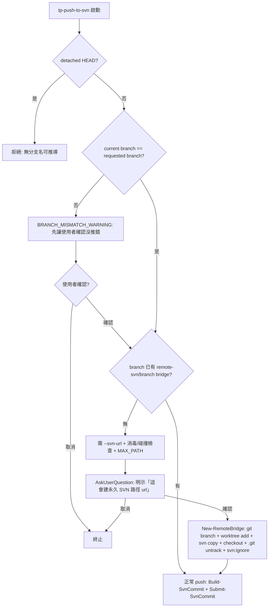

# feat: turbo-plugin v0.5.0

## Summary

turbo-plugin v0.5.0 是一輪跨切面收尾,分五個 phase:(A) 修正版本號語意 + 清除全 repo 僅限本機之物;(B) 把編碼初始化集中進共用 lib、統一所有跑腳本 skill 的執行路由、移除 `[svn] force_bash` 與 `schema_version`;(C) 把 git↔SVN bridge 從寫死的 `main`/`test-<n>` 一般化為任意 branch、建 bridge 折進 `tp-push-to-svn` 首推、reset/merge 改泛化保留、`.svn` 改 gitignore;(D) 回歸 `tp-commit-msg` skill、規範集中進 `.turbo-plugin/` 檔並精簡 CLAUDE.md、補 `tp-db-management` 約束;(E) 以 Pester 5 + shUnit2 取代手刻測試框架。

origin requirements 已跑四輪 `ce-doc-review` 收斂(see origin)。`.NET csproj / VS 2022 自動分析`已抽出為 v0.6.0,不在本 plan。

skill 數淨變動:移除 `tp-create-remote-test`、新增 `tp-commit-msg`、改名 2 支 → **16 → 16**。

---

## Problem Frame

詳見 origin「問題框架」。摘要五類痛點:SVN bridge 寫死只接受 `main`/`test-<n>`;腳本依賴使用者 console 編碼易亂碼;手刻測試框架難維護且未來新 plugin/skill 缺好用工具;僅限本機之物(機器路徑、內部 SVN/host URL、本機識別碼)外洩進版控、規範散落於 CLAUDE.md;commit-msg 語意無規範(可能引用 git SHA 或本機代號,但遠端是 SVN)。

**關鍵現況事實(research 確認,影響實作)**:
- `marketplace.json` 描述已是「16 個 skill」;`plugin.json` 仍 `version: 1.0.0` 且描述「14 個 skill」;`README.md` 有**兩處**「14」(行 3、141)。
- `Common.ps1` 已設 `OutputEncoding`/`$OutputEncoding`(行 9-10)但**未設** `InputEncoding`;`common.sh` 無全域 UTF-8 locale(只 `write_utf8_no_bom` 內有 inline `LC_ALL`)。
- `schema_version` validator 是 **warn-only、不在 control flow**,刪除安全。
- `docs/solutions/` **不存在**(R3 對它的清理 vacuously 滿足)。
- 真正機器專屬字串集中在 `docs/plans/2026-05-25-001/-002`、`docs/brainstorms/2026-05-27-...`、CHANGELOG;`file:///C:/Windows/System32/`(traversal 測試 fixture)與 `C:/Program Files/...MSBuild`(範例工具路徑)屬泛 Windows、非機器專屬。

---

## Requirements

逐項追溯 origin(R-ID 對應 origin requirements):

| Plan 區 | Origin | 內容 |
|---|---|---|
| Phase A | R1, R2, R3, R3a | 版本號重編 + 全 repo 清僅限本機之物 + 常駐規則 |
| Phase B | R4, R5, R6, R6a | 集中編碼、統一路由、移除 force_bash、移除 schema_version |
| Phase C | R7, R8, R9, R10, R11, R12, R12a | bridge 一般化、折進 push、reset/merge 泛化保留、trust 不變、`.svn` gitignore |
| Phase D | R13, R14, R15, R16, R17, R18 | tp-commit-msg、conventions 檔 + 精簡 CLAUDE.md、db 約束 |
| Phase E | R19, R20 | Pester/shUnit2 遷移、CI 安裝、精確 SKIP 規則 |

KD1–KD4 與各項細節見 origin「關鍵決策」與「需求」。

---

## Key Technical Decisions

延續 origin KD1–KD4(SVN URL 由 `--svn-url`、命名 + 消毒 + 碰撞、測試框架硬遷移、建 bridge 折進 push),加上本 plan 拍板的執行層決策:

- **KTD-1 MAX_PATH 超限 → hard-fail + 引導**(origin KD2 (b) 留 plan 裁示):深 clone 機器首次取得已發佈 ref 時 worktree 路徑超 260,**直接 fail 並提示**「縮短 clone 路徑或啟用 long-path(`core.longpaths` / `\\?\`)」,plugin **不**自做 long-path-aware 建立。錯誤訊息與 allowlist 拒絕分開。
- **KTD-2 R3a enforcement → advisory-only**(origin R3a 將 enforcement 留為 FYI/plan 評估,本 plan 拍板 advisory-only):常駐規則寫進 CLAUDE.md/conventions,**不**在 v0.5.0 建 CI 把關;輕量 CI grep lint 列 follow-up。
- **KTD-3 shUnit2 → vendor 進 repo**(origin OQ3):單檔 vendored、source 於測試檔末尾,path-free 且跨 Git Bash(windows runner)/ubuntu 一致,不依賴 apt/brew。Pester 5 走 `Install-Module Pester -Force -SkipPublisherCheck`(WinPS 5.1 內建 3.4,需 side-by-side 裝 5.x;orchestrator pre-flight 用 `Import-Module Pester -MinimumVersion 5.0 -ErrorAction Stop`)。
- **KTD-4 scrub 邊界**:只清真正機器專屬字串(`C:\Turbo\SampleGitWithSvn`、`SampleSvnServer`、`C:\Users\<name>`、`C:\Turbo\test-turbo-plugin`、`file:///C:/Turbo/...`),用固定 token `<INTERNAL-SVN-URL>` / `<MACHINE-PATH>`。**保留**泛 Windows 字串(`file:///C:/Windows/System32/` 測試 fixture、`C:/Program Files/...MSBuild` 範例、lib 路徑轉換註解、root CLAUDE.md 的 `/c/Users` 範例)。
- **KTD-5 `New-RemoteTest` 重新定位**:`tp-create-remote-test` SKILL 移除後,底層 `New-RemoteTest.ps1`/`.sh` **重新命名為 `New-RemoteBridge.ps1`/`.sh`**(`New` 為核可動詞)並一般化(去 `test-<n>` 編號、收 branch + `--svn-url`),成為 `tp-push-to-svn` 首推時呼叫的**內部 helper**(非使用者 skill)。
- **KTD-6 schema_version 全移除**(origin R6a):validator(`Test-TurboPluginConfigSchema` / `check_turbo_plugin_config_schema`)、once-guard、call site、範本與 fixture 的 `schema_version`、相關測試斷言全刪;既有檔殘留該鍵由 TOML reader 自然忽略。
- **KTD-7 測試覆蓋 re-key**:現有手刻測試借 `force_bash`(設定合併鏈)與 `schema_version`(top-level key 解析)當載體;兩者移除後,新 Pester/shUnit2 套件把這兩種 parser 行為改綁 `[iis] enabled`。
- **KTD-8 trust base 不變**(origin R11):`Assert-TrustedSvnUrl` / `assert_trusted_svn_url` 行為不動,仍錨定 `remote-svn-main` 的 `repos-root-url`;bridge 一般化不放寬 fail-closed 邊界。

---

## High-Level Technical Design

### `tp-push-to-svn` 首推自動 bootstrap 的 gate 順序(origin KD4 / U9)

新模型把建 bridge 折進 push。gate 順序為 load-bearing(分支不符檢查須**先於** bootstrap,避免在不知推錯分支的情況下建永久路徑):

> 方向性指引,非實作規格。`New-RemoteBridge` 沿用現 `New-RemoteTest` 的 trust-先驗(`Assert-TrustedSvnUrl` 在任何 git/svn mutation 之前)、rollback try/catch、`.git` untrack 完整序列。

### branch → ref / worktree / SVN 路徑映射(origin KD2 / U7）

| 本機 branch | git ref | bridge worktree 目錄 | SVN 路徑 |
|---|---|---|---|
| `main` | `remote-svn/main` | `remote-svn-main` | setup 時的 URL(trunk 錨點 + trust base) |
| `feat/login` | `remote-svn/feat/login`(保留斜線) | `remote-svn-feat-login`(slash→dash) | 使用者 `--svn-url`(首推時) |

消毒(轉 dash-form 前以 allowlist 拒絕):`..` / 前導 `-` / slash→dash 以外的分隔或控制字元 / 保留名(大小寫不敏感:`main` + Windows 裝置名 `CON`/`PRN`/`AUX`/`NUL`/`COM1-9`/`LPT1-9`)/ 結尾點或空白。碰撞:normalize-then-compare,同目錄名已被不同 ref 佔用則拒絕並提示改名。

### `.svn` 由 git 忽略(R12a / U12)

F-U18 死循環是**純 git 端**問題:bridge worktree 同時是 git worktree + svn checkout,git 不知 `.svn/` 特殊、把它當未追蹤檔,使 `git status` 乾淨檢查誤判。**解法:讓 git 忽略 `.svn/`。**(SVN 端無此問題——`.svn/` 是 SVN 管理目錄,`svn status`/`svn commit` 本就不納入,如同 git 不碰 `.git/`。)

`tp-setup` 在它已維護的專案 **main `.gitignore`** 加一條 `.svn/`(它本來就往該檔寫 `.turbo-plugin/worktrees/`、`*.local.*` 等 turbo-plugin 規則),整個專案忽略 `.svn/`。建 bridge 時 `New-RemoteBridge` 本就把 main 的 `.gitignore`(含 `.svn/`)copy 進每個 bridge,故所有 bridge 的 git 都忽略 `.svn/`,各腳本的 `.svn` dirty-filter 全可移除。

> `.gitignore` 這個**版控檔**會隨 SVN 內容同步,多一行 `.svn/` 文字無害且對所有 checkout 都正確;`.svn/` **目錄**本身永不進 SVN。無需任何 append 時序、也無「main vs bridge gitignore」取捨。

---

## Implementation Units

> Phase 依賴:A 多為獨立文件/manifest;B 在 C 之前(編碼/路由是基礎);C 內 **U7 為基礎、U8–U12 依賴之,且 U9(建 New-RemoteBridge)為 U12(`.svn` gitignore 落點)的前置**;D 在 C 之後(U14 conventions 參照 U13 commit-msg);E 最後(測試反映最終程式碼,且 orchestrator/CI infra 可提早並行)。skill 改名/增刪:**README 表格列在各自 unit(U9/U10/U11/U13)同步,人工 skill-test 套件(`tests/docs/`)亦同;skill 數字「16」綜述由 U1 設定**。

### Phase A — 版本與本機之物衛生

### U1. 版本號重編 + manifest/README skill 數同步

**Goal:** 修正 CHANGELOG 版本語意、bump 版本、同步 skill 數描述。
**Requirements:** R1, R2.
**Dependencies:** 無(數字 16 為定值;skill 改名/增刪的表格列在 U9/U10/U11/U13 同步)。
**Files:**
- `plugins/turbo-plugin/CHANGELOG.md` — `## [1.0.0] - 2026-05-27` → `## [0.3.0] - 2026-05-27`;`## [Unreleased]` → `## [0.4.0] - <其完成日>`;最上方新增 `## [0.5.0]` 區段(本 plan 工作,Keep a Changelog 分類、繁中)。
- `plugins/turbo-plugin/.claude-plugin/plugin.json` — `version` `1.0.0` → `0.5.0`;description「14 個 skill」→「16 個 skill」。
- `plugins/turbo-plugin/README.md` — 行 3 與行 141 的「14」→「16」。
- `.claude-plugin/marketplace.json` — 確認描述已是「16」(無需改;研究確認)。
**Approach:** 發版前確認無 git/SVN tag、`marketplace.json` pin 或外部 clone 引用 `1.0.0`(現況 `git tag -l` 為空,見 origin R1)。`tests/runs/` 與 orchestrator 內硬編的 `v1.0.0` 標籤(`Invoke-ScriptTests.ps1:44,86`)改為版本無關或對齊 0.5.0(見 U18)。
**Patterns to follow:** CHANGELOG 既有 Keep a Changelog 格式;絕對日期。
**Test expectation:** none — 版本字串/文件;由 U16/U17 的測試套件整體驗證綠燈。
**Verification:** `plugin.json` version=0.5.0、三份檔 skill 數一致為 16、CHANGELOG 由舊到新 `[0.2.7] → [0.3.0] → [0.4.0] → [0.5.0]`。

### U2. 清除全 repo 僅限本機之物 + 固定 placeholder token

**Goal:** 把機器專屬內容換成固定 token。
**Requirements:** R3.
**Dependencies:** 無。
**Files(research scan 熱點):**
- `docs/plans/2026-05-25-001-...acceptance-test-plan.md`(~17)、`docs/plans/2026-05-25-002-...script-level-test-plan.md`(~18)、`docs/plans/2026-06-01-001-...`(7)、`docs/plans/2026-05-27-001-...`(7)、`docs/plans/2026-05-26-001-...`(4)、`docs/plans/2026-05-29-001-...`(3)、`docs/plans/2026-05-22-001-...`(1)。
- `docs/brainstorms/2026-05-27-...manual-test-plan-requirements.md`(14)、`docs/brainstorms/2026-06-01-...finalization-requirements.md`(8)。
- `plugins/turbo-plugin/CHANGELOG.md`(行 99、146 的 `SampleGitWithSvn`)、`plugins/turbo-plugin/tests/docs/skill-tests.md`(1)。
**Approach:** 固定 token:內部 SVN/host URL → `<INTERNAL-SVN-URL>`、機器絕對路徑 → `<MACHINE-PATH>`。**只清**真正機器專屬(KTD-4 清單);**保留**泛 Windows 字串(KTD-4 保留清單)。`docs/solutions/` 不存在 → vacuous。歷史文件受保護不刪,只 placeholder 化。
**Patterns to follow:** origin R3 的固定 token 慕約;repo「PR 檔 path-free」慣例。
**Test expectation:** none — 文件清理。
**Verification:** `grep -rE 'C:\\Turbo\\Sample|SampleSvnServer|C:\\Users\\|file:///C:/Turbo'`(排除 `.sandbox/`)無命中;泛 Windows fixture 仍在。

### U3. CLAUDE.md 常駐規則(不得提交僅限本機之物)

**Goal:** 防止 U2 清掉的東西復發。
**Requirements:** R3a.
**Dependencies:** 無。
**Files:** `CLAUDE.md`(repo 根,marketplace 通用規約區)。
**Approach:** 加一條常駐規則:不得把僅限本機才有的東西(機器路徑、內部 hostname/URL、僅本機/單次情境識別碼)提交進版控。enforcement 採 advisory-only(KTD-2);CI lint 列 follow-up。
**Test expectation:** none。
**Verification:** CLAUDE.md 含該規則段。

### Phase B — 跨環境韌性 + 技能路由

### U4. 集中編碼初始化於 Common.ps1 / common.sh

**Goal:** 所有腳本經由共用 lib 取得一致 UTF-8 I/O,不逐腳本複製。
**Requirements:** R4, R5.
**Dependencies:** 無。
**Files:**
- `plugins/turbo-plugin/scripts/lib/Common.ps1` — 行 9-10 區新增 `[Console]::InputEncoding = UTF8`,**須 guard**(try/catch 或無 console input handle 時略過,避免非互動/redirected 下 throw)。
- `plugins/turbo-plugin/scripts/lib/common.sh` — 開頭新增全域 UTF-8 locale(或等效;portable fallback,見 Risks)。
- `plugins/turbo-plugin/scripts/Test-EncodingSupport.ps1` — 目前不 dot-source Common.ps1 且自設 OutputEncoding;**特別處理**:此為 codepage 偵測器,dot-source Common.ps1(會設 UTF-8)恐干擾偵測語意 → 評估維持獨立但補齊三個編碼變數的 guarded 設定,而非引入 Common.ps1。
- `plugins/turbo-plugin/scripts/hooks/Invoke-PostToolUseEnterWorktree.ps1` — no-op hook、刻意 `EAP=Continue`;補編碼 init 時**保留** EAP=Continue。
- `plugins/turbo-plugin/scripts/hooks/invoke-posttooluse-enterworktree.sh` — 唯一不 source common.sh 的 real-bash;no-op,評估補 locale init。
**Approach:** PS 走「所有 .ps1 dot-source Common.ps1」(現多數已是);bash 走「所有 native .sh source common.sh」;`ps1-delegate.sh` trampoline 只轉呼叫 .ps1,不需。InputEncoding guarded 寫法見 research(非互動 console 會 throw)。
**Patterns to follow:** 既有 `Common.ps1:9-10` 的 OutputEncoding 設定;PS 5.1 五禁忌(CLAUDE.md)。
**Test scenarios:**
- Common.ps1 dot-source 後 `[Console]::OutputEncoding`/`$OutputEncoding`/`[Console]::InputEncoding` 皆 UTF-8。
- InputEncoding guard:在無 console input handle 的 redirected 情境下 dot-source 不 throw。
- common.sh source 後 locale 為 UTF-8(或 fallback 生效)。
- Test-EncodingSupport.ps1 偵測語意不被破壞(仍能回報 non-UTF-8 codepage)。
**Verification:** 三變數設定到位、非互動不 throw、編碼偵測器行為不變。

### U5. 統一 script 執行路由 + Git Bash 偵測 + 移除 force_bash

**Goal:** 所有跑腳本 skill 依環境選工具;移除 `[svn] force_bash`(由路由涵蓋)。
**Requirements:** R6(含 OQ4 偵測法定案)。
**Dependencies:** U4。
**Files(兩件事範圍不同,分開處理):**
- **加統一路由段**(凡呼叫 plugin 配對 `.ps1`/`.sh` 的 skill):`tp-push-to-svn`、`tp-pull-from-svn`、`tp-svn-log`、`tp-suggest-ignore`、四個 .NET skill(build/run/publish/stop)+ `tp-cleanup-orphan-iis`、`tp-reset-*`(U10)、`tp-merge-*`(U11)。**`tp-db-management` 不在此列**——它只用 git(取 branch 名)+ dbhub MCP,不呼叫 plugin 配對腳本(研究確認其 Tool Preference),故無路由規則需求。
- **移除 `force_bash` Decision Rule**(僅現存處):`tp-push-to-svn/SKILL.md:165,178`、`tp-pull-from-svn/SKILL.md:25`、`tp-reset-remote-test/SKILL.md:73`、`tp-merge-main-into-all/SKILL.md:21`(後二者於 U10/U11 改名時順手)。**四個 .NET skill 無 force_bash**(研究確認),只加路由、不移 force_bash。
- `plugins/turbo-plugin/skills/tp-setup/SKILL.md` — 編碼 profile option (a)(`SKILL.md:61`)**停寫** `force_bash = true`,改靠 R6 Git Bash 自動偵測;對應敘述更新。
- `plugins/turbo-plugin/scripts/lib/Common.ps1` / `common.sh` — 移除 `force_bash` 相關註解(行 485 / 324);若有讀取分支一併移除。
- `plugins/turbo-plugin/default-files/.turbo-plugin/config.toml`(行 11 註解)、`tests/fixtures/base/.turbo-plugin/config.toml`(行 11)— 移除 `force_bash` 範本註解。
**Approach:** 路由規則:Windows+有 Git Bash → Bash 工具跑 .sh;Windows+無 Git Bash → PowerShell 工具跑 .ps1;Linux/macOS → Bash 跑 .sh;**不**用 Bash 工具呼叫 `pwsh`/`powershell`。Git Bash 偵測:先查 `C:\Program Files\Git\bin\bash.exe`、`C:\Program Files (x86)\Git\bin\bash.exe`;fallback `where.exe bash` **排除** `System32\bash.exe`(WSL)。`Invoke-ScriptTests.ps1:157-160` 既有候選路徑可當實作起點。「Windows 無 Git Bash + 中文檔名」之縫仍由 tp-setup encoding profile detect 引導(裝 PS7 / 開 Win10 UTF-8)。
**Patterns to follow:** `Invoke-ScriptTests.ps1` 的 bash 候選路徑解析。
**Test scenarios:**
- Git Bash 偵測:標準路徑存在 → 回該路徑;只有 System32\bash → 視為無 Git Bash(不誤抓 WSL)。
- 移除後全 repo `grep force_bash`(排除 CHANGELOG 歷史 + `.sandbox/`)無功能引用。
**Verification:** 各 skill 含統一路由段、無 force_bash 殘留功能引用、tp-setup option (a) 不再寫該鍵;`tp-db-management` 排除可稽核——`grep -rE 'Run.*(Bash|PowerShell)|\.ps1|\.sh' plugins/turbo-plugin/skills/tp-db-management/` 無呼叫配對腳本之命中(佐證只用 git + dbhub MCP、不需路由)。

### U6. 移除 schema_version

**Goal:** 拿掉 config 版本 gate(過度設計)。
**Requirements:** R6a。
**Dependencies:** 無(與 U5 同屬 config 清理,可同批)。
**Files:**
- `plugins/turbo-plugin/scripts/lib/Common.ps1` — 刪 `Test-TurboPluginConfigSchema`(476-490)+ once-guard `$script:_TpSchemaWarned`(474)+ `Resolve-ConfigValue` 內 call site(508)+ 相關註解。
- `plugins/turbo-plugin/scripts/lib/common.sh` — 刪 `check_turbo_plugin_config_schema`(315-331)+ once-guard `_TP_SCHEMA_WARNED`(311)+ `resolve_config_value` call site(367)。
- `plugins/turbo-plugin/default-files/.turbo-plugin/config.toml`(行 5)、`tests/fixtures/base/.turbo-plugin/config.toml`(行 5)— 移除 `schema_version`。
- `plugins/turbo-plugin/skills/tp-push-to-svn/SKILL.md:202` — 移除 schema_version warning 測試案例(已 stale)。
- 單元測試(於 U16/U17 測試重寫時處理,兩類分清楚):(1) **直接測 validator 警告** 的區塊 `tests/unit/scripts/lib/Common.test.ps1:960-1004`(`Get-SchemaWarningStderr` + 三個斷言)→ **刪除**(測的是已移除的 validator,不 re-key);(2) **借** `schema_version`/`force_bash` 當「合併鏈 / top-level key 解析」載體的測試(`Common.test.ps1` 156/185/209、`common.test.sh` 429/441/474)→ **re-key 到 `[iis] enabled`**(KTD-7,保留 parser 行為覆蓋)。
**Approach:** validator 是 warn-only、不在 control flow(research 確認),刪除安全。既有檔殘留 `schema_version` 鍵由 TOML reader 自然忽略(不警告、不報錯)。本 unit 移除 validator/範本/call site;上述測試的刪除與 re-key 在 U16/U17 隨測試框架遷移一起做(避免本 unit 與 E 階段重複編輯同檔)。
**Test scenarios:**
- 含殘留 `schema_version` 的 config 讀取不報錯、不警告。
- `Resolve-ConfigValue` / `resolve_config_value` 對既有 section/key 解析行為不變。
**Verification:** validator 函式與 call site 全刪;config 讀取寬鬆;相關測試移除(覆蓋 re-key 見 U16/U17)。

### Phase C — SVN bridge 模型一般化

### U7. `Resolve-RemoteWorktree` 一般化 + 消毒 + 碰撞 + MAX_PATH

**Goal:** 接受任意 branch,安全產生 ref/worktree 目錄。
**Requirements:** R7(origin KD2)、KTD-1。
**Dependencies:** 無(C 的基礎)。
**Files:**
- `plugins/turbo-plugin/scripts/lib/Common.ps1` — `Resolve-RemoteWorktree`(120-142):移除 `main`/`^test-(\d+)$` 寫死,改任意 branch → ref `remote-svn/<branch>`(保留斜線)+ 目錄 `remote-svn-<branch-dash>`;加 allowlist 消毒 + normalize-then-compare 碰撞 + MAX_PATH 檢查。
- `plugins/turbo-plugin/scripts/lib/common.sh` — `resolve_remote_worktree`(121-135)同步。
**Approach:** 消毒/碰撞/MAX_PATH 規則見 HTD「映射」段。MAX_PATH 守「本機能否建目錄」非「branch 名合法性」,超限走 hard-fail + 引導(KTD-1),訊息與 allowlist 拒絕分開;**不**因 MAX_PATH 拒絕已 bootstrap worktree 的 pull/sync(那條路徑不建目錄)。
**Patterns to follow:** `tp-db-management` 的 slash→dash 分組鍵;PS 5.1 五禁忌(尤其 `@(...)` 包 `.Count`、`[System.IO.Path]::Combine`)。
**Test scenarios:**
- `feat/login` → ref `remote-svn/feat/login` + 目錄 `remote-svn-feat-login`。
- 碰撞:`feat/login` 與 `feat-login` 映射同目錄 → 第二個(不同 ref)被拒並提示改名。
- 拒絕:`..`、前導 `-`、含 `\`/`:`/控制字元、`CON`/`NUL`(大小寫不敏感)、`MAIN`/`Main`、結尾 `.`/空白。
- MAX_PATH:組出路徑 > 260 → hard-fail,訊息含「縮短 clone 路徑 / long-path」且**不**等同 allowlist 拒絕訊息。
- `main` 仍解析為 `remote-svn-main`(trust 錨點不變)。
**Verification:** 任意合法 branch 可解析;非法/碰撞/超長依規則被拒;PS+bash 兩端一致。

### U8. 去耦其餘 main|test-`<n>` call site

**Goal:** 補齊一般化未覆蓋的硬編點(否則 .sh 仍拒任意分支、suggest-ignore 漏列)。
**Requirements:** R7(完整去耦)。
**Dependencies:** U7。
**Files:**
- `plugins/turbo-plugin/scripts/Set-SvnIgnore.ps1:78`(regex `^remote-svn-(main|test-\d+)$`)、`set-svn-ignore.sh:35,38`(glob + pattern)— 改任意分支列舉。
- usage/驗證字串 `<main|test-<n>>`:`Build-SvnCommit`、`Submit-SvnCommit`、`Sync-FromSvn`、`Get-SvnLog`、`Tag-Release`(各 .ps1 + .sh)。
**Approach:** 列舉改為「掃 `remote-svn-*` worktree 目錄」而非 regex 限定;usage 字串改泛指 branch。
**Patterns to follow:** U7 的 worktree 解析。
**Test scenarios:**
- `tp-suggest-ignore` 對任意名 bridge(如 `remote-svn-feat-login`)也納入列舉。
- 各 SVN 腳本對任意 `-Branch` 不再因 usage 驗證被拒。
**Verification:** `grep -rE 'main\|test-' plugins/turbo-plugin/scripts`(排除註解)無殘留限定。

### U9. 建 bridge 折進 `tp-push-to-svn` 首推 + 移除 create skill

**Goal:** 首推一個沒 bridge 的 branch 時,確認後自動建 bridge 再 push。
**Requirements:** R8(origin KD4)、R12(移除 create)、KTD-5、KTD-8。
**Dependencies:** U7。
**Files:**
- `plugins/turbo-plugin/scripts/New-RemoteTest.ps1` / `new-remote-test.sh` → **改名** `New-RemoteBridge.ps1` / `new-remote-bridge.sh`,一般化(去 `test-$idx` 編號,收 branch + `--svn-url`),成為內部 helper。**首推折進-push 模型下不建工作分支**(工作分支已是當前分支):移除現 `New-RemoteTest.ps1:67`(`git branch $testBranch 'main'`)及第 41–42 行針對工作分支的 already-exists guard(`new-remote-test.sh` 對應處同步);只建 `remote-svn/<branch>` bridge branch + `worktree add`,already-exists guard 改成只檢查 bridge ref(`remote-svn/<branch>`)與 worktree 路徑是否已被佔用。否則首推一個已存在的當前分支會撞工作分支 already-exists guard 而中止(或若改強制覆寫則 reset 掉使用者未推 commit)。**具名步驟**:`svn copy -m` 的 commit message 用 U7 消毒後的 dash-form 分支值(非 raw 使用者輸入),避免控制字元進 SVN 永久 history(與 Approach 該條一致)。
- **新增 pre-flight 偵測腳本(配對 `.ps1`/`.sh`)**:做 detached HEAD / 分支不符 / bridge 是否存在的偵測,**不因缺 bridge 而中止**,emit 結構化 token。偵測邏輯集中於此一腳本(避免 skill 內嵌 git 指令,確定性 + 可測;命名為實作細節)。**Token 契約(load-bearing,SKILL 依此分流)**:
  - **單一終結 token + 優先序**(R2-3):腳本只發**一個** token,優先序 `DETACHED_HEAD` > `BRANCH_MISMATCH_WARNING` > `BRIDGE_ABSENT` > `BRIDGE_PRESENT`(對應 HTD flowchart 樹);不發多個讓 SKILL 自行排序。
  - **detached 偵測法**(R2-4):用 `git symbolic-ref -q HEAD`(detached 時失敗)判定 detached,**不**用「current == requested」;並**拒絕 requested 值為字面 `HEAD`**。否則 detached 下 `--branch HEAD` 會 current=requested=HEAD,既非 detached 也非 mismatch、直接 bootstrap 建非分支永久路徑。
  - **token 名稱統一**(R2-5):分支不符 token 一律用 **`BRANCH_MISMATCH_WARNING`**(對齊現有 `Build-SvnCommit.ps1:30` emit 與 `SKILL.md:38,40` handler),新腳本與 backstop 同名,勿用 `BRANCH_MISMATCH` 別名。
  - **防 token 偽造**(R2-9):發 token 前先對 requested 跑 U7 allowlist 消毒(拒換行/控制字元/前導 dash);token 行用固定錨定前綴(如 `TP_TOKEN:`),SKILL 只認該前綴開頭的行,使 raw branch 名內嵌字串無法假冒 token。
  - **前綴契約涵蓋 backstop**(R3-1):`Build-SvnCommit.ps1:30` / `build-svn-commit.sh` 的 backstop `BRANCH_MISMATCH_WARNING` 現為**裸行(無前綴)**;須一併改發 `TP_TOKEN:` 前綴格式(與 pre-flight 同契約),並同步 `SKILL.md:38,40` handler/regex,否則正常 push 路徑上 prefix-strict 的 SKILL 會靜默丟掉 backstop 警告→推錯分支。U16/U17 加斷言:backstop emit 亦合前綴契約。
  - **token 須帶 payload**(R3-2):單一終結 token 除名稱外,**仍須攜帶 SKILL 渲染所需的消毒後欄位**——`BRANCH_MISMATCH_WARNING` 帶 `current=`/`requested=`(SKILL 確認 prompt 要顯示「你在 X、要推 Y」),`BRIDGE_ABSENT` 帶解析出的 worktree 目標;否則 SKILL 拿不到值得自跑 git(違反「SKILL 不跑 git」)。U16/U17 斷言「token 行同時前綴錨定 + 帶必要欄位」。
  - 納入 U16/U17 測試遷移(test 檔為**新建**,見 U16/U17 Files)。
- `plugins/turbo-plugin/skills/tp-push-to-svn/SKILL.md` — 加首推 bootstrap 流程 + 三道 gate(HTD flowchart);**SKILL 只呼叫上述 pre-flight 腳本並依其 token 分流,不在 skill 內嵌 git 指令邏輯**(見 Approach)。
- 移除 `plugins/turbo-plugin/skills/tp-create-remote-test/`(整個 skill 目錄)。
- `plugins/turbo-plugin/README.md` — 移除 `/tp-create-remote-test` 表格列(行 32)。
- **人工 skill-test 套件(必須,CLAUDE.md 要求的兩層之一)**:`plugins/turbo-plugin/tests/docs/skill-tests.md` 與 `skill-tests-session-plan.md` — (1) 移除 `tp-create-remote-test` 自己的 section;(2) **凡以 `/tp-create-remote-test` 當 fixture-setup primitive 建 test-1 的其它 skill case(tp-suggest-ignore / tp-reset / tp-merge 等)**,改以「在目標 branch 跑 `/tp-push-to-svn` 首推 bootstrap」或直接呼叫內部 helper 建 bridge——否則這些不相關 case 的 fixture 無法建。
- script 測試:`tests/unit/scripts/New-RemoteTest.test.ps1` / `new-remote-test.test.sh` → 改名 + 一般化(U16/U17 一併遷移)。fixture(`tests/fixtures/`)中以 `New-RemoteTest` 名稱引用之處同步改名。
**Approach:** gate 順序見 HTD。**pre-flight 偵測腳本(load-bearing)**:現 `BRANCH_MISMATCH_WARNING` 是在 `Build-SvnCommit.ps1:28-30` **執行中**才 emit,且 `Build-SvnCommit` 在缺 bridge 時會先於該偵測在 `:22-24` 中止(首推情境 bridge 尚未建),無法滿足「mismatch / bridge-absent 須先於 bootstrap」。故新增一支 **pre-flight 偵測腳本**(非由 SKILL 內嵌 git 指令):腳本做 detached 偵測(`git symbolic-ref -q HEAD`)+ 比對 current vs requested branch + `Resolve-RemoteWorktree` + `Test-Path`(bridge 是否存在),**不因缺 bridge 而 throw**,依上述 **Token 契約**發**單一終結 token**(優先序 `DETACHED_HEAD` > `BRANCH_MISMATCH_WARNING` > `BRIDGE_ABSENT` > `BRIDGE_PRESENT`,錨定前綴、發前消毒 requested)。SKILL **只讀 token 分流**(正常 push / bootstrap gate / 拒絕),不自行跑 git——對齊「Script 是實際做事的地方」與既有 token-emit 模式(`PENDING_MERGE_DETECTED` 等),確保確定性與可測。**分支比對方法統一**:current 解析用 `git rev-parse --abbrev-ref HEAD`;`Build-SvnCommit:28-30` 的 `BRANCH_MISMATCH_WARNING` 在正常 push 路徑保留為 backstop(token 同名、或改呼叫同一 helper),兩處邏輯若改須同步,避免分歧。`New-RemoteBridge` 沿用現序列:`Assert-TrustedSvnUrl` 在任何 git/svn mutation **之前**(KTD-8,且在 AskUserQuestion 確認後、mutation 前)、rollback try/catch、`svn checkout --force` 後 `svn rm --keep-local .git`、繼承 `svn:ignore`。**bridge base ref**:沿用現 `New-RemoteTest` 的「bridge branch 起於 repo init commit、svn checkout 後再 merge 使用者 branch」模型(與既有 pull/push merge 模型一致),一般化時保留此 base。**branch 名進 `svn copy -m` commit message 須用 U7 消毒後的 dash-form 值**(非 raw),避免控制字元進 SVN 永久 history。
**Patterns to follow:** 現 `New-RemoteTest.ps1` 的 rollback 與 `.git` untrack 序列;`tp-reset` 的 destructive-op 確認 gate。
**Test scenarios:**
- 首推已有 bridge 的 branch → 不觸發 bootstrap,正常 push。
- 首推無 bridge 的 branch + 給 `--svn-url` → 確認後建 bridge(branch/worktree/svn checkout)再 push。
- detached HEAD → 拒絕,不建任何東西。
- **detached + `--branch HEAD`**(用 `git symbolic-ref -q HEAD` 偵測)→ 發 `DETACHED_HEAD`、拒絕、零副作用(不被「current==requested」誤放行)。
- current ≠ requested branch → 先 `BRANCH_MISMATCH_WARNING` 確認,才進 bootstrap。
- **token 優先序**:current ≠ requested **且** requested 已有 bridge(mismatch + bridge-present 同時)→ 腳本只發單一 `BRANCH_MISMATCH_WARNING`(優先於 BRIDGE_PRESENT)→ 先 mismatch 確認,不直接 push。
- **token 防偽**:requested 含換行/嵌入 `TP_TOKEN:`-like 字串 → 發 token 前消毒擋下,SKILL 不被假 token 導向錯分支。
- 無效 `--svn-url`(不在 trust base 下)→ `Assert-TrustedSvnUrl` 在 mutation 前 fail、零副作用。
- svn checkout 失敗 → rollback 清掉半建的 branch/worktree(.ps1 try/catch、.sh trap 一致)。
- `svn copy` 成功但其後步驟失敗 → rollback 清掉本機 branch/worktree,但 `svn copy` 已建的 SVN 路徑**為永久、不被 rollback 涵蓋**(留孤兒);重跑首推時 `svn info` 偵測到該路徑已存在 → 走 checkout 分支(idempotent 接續),不重複 `svn copy`。
- `svn copy` commit message 使用 U7 消毒後的 dash-form branch 名(非 raw 使用者輸入)。
- pre-flight probe 在呼叫 `Build-SvnCommit` 前就判定 mismatch/detached/bridge-absent(不依賴 Build 執行中才 emit 的 warning)。
**Approach 補充(rollback 邊界)**:`svn copy` 寫的是 SVN 永久 history,**rollback try/catch 只清本機 git 端(branch/worktree),不回收已建的 SVN 路徑**。bootstrap 確認文案須明示「失敗仍可能留下一個永久 SVN 路徑,可由重跑首推 idempotent 接續(偵測既有路徑→checkout)」,避免使用者誤以為失敗=零副作用。**追溯**:此 idempotent 接續**非新增邏輯**——是既有 `New-RemoteTest.ps1:75-88` 的「`svn info` 偵測路徑是否存在 → 存在則 checkout、不存在才 `svn copy`」行為,加上 origin KD4「建永久 SVN 路徑(建後刪不掉)」語意的直接後果;一般化時保留此既有分支即可。
**Verification:** create skill 消失;push 首推可 bootstrap;rollback 與 trust-先驗保持;失敗後重跑可 idempotent 接續既有 SVN 路徑。

### U10. `tp-reset-remote-test` → `tp-reset-branch-to-main`(泛化保留 + footgun 警告)

**Goal:** reset 適用任意分支,保留安全防護。
**Requirements:** R9。
**Dependencies:** U7。(`.svn` dirty-filter 的移除由 **U12 單一所有**;本 unit 不碰 filter,只做泛化 + footgun。)
**Files:**
- 改名 `plugins/turbo-plugin/skills/tp-reset-remote-test/` → `skills/tp-reset-branch-to-main/`(SKILL.md frontmatter `name` 同步)。
- `plugins/turbo-plugin/scripts/Reset-RemoteTest.ps1` / `reset-remote-test.sh` → **改名** `Reset-BranchToMain.ps1` / `reset-branch-to-main.sh`(與 U9/U11 的 script 改名一致,skill 與程式名對齊),去 `test-<n>` 假設(原 `Reset-RemoteTest.ps1` 19/23/63、`reset-remote-test.sh` 26/30/71),適用任意分支。**不**動 `.svn` filter(U12 負責;U12 的 Reset filter 移除以新檔名為準)。
- `plugins/turbo-plugin/README.md` — 表格列 `/tp-reset-remote-test`(行 33)→ 新名。
- 人工 skill-test:`plugins/turbo-plugin/tests/docs/skill-tests.md` 與 `skill-tests-session-plan.md` 中 `tp-reset-remote-test` 的 case-ID stem / slash-command / section header → 新名(見 U9 的 skill-test 套件更新註)。
- script 測試:`Reset-RemoteTest.test.ps1` / `reset-remote-test.test.sh` → **改名** `Reset-BranchToMain.test.ps1` / `reset-branch-to-main.test.sh`(U16/U17 一併遷移 Pester/shUnit2)。
**Approach:** 保留 LOSE/GAIN/FILES_LOST 預覽 + 強制確認 gate。**footgun 防護**:確認視窗凸顯「此分支有 N 個 commit 不在 main、`git reset --hard main` 會全毀」強警告。**兩個預覽基準不同是刻意的、勿誤改**:`LOSE`(commit 清單,現 `:52` `main..<branch>`)量的是「reset 在**本機**毀掉的 commit」;`FILES_LOST_AFTER_PUSH`(現 `:63` `main..remote-svn/<branch>`)量的是「reset 後推送、**SVN 端**會被刪的檔」——後者對 bridge 算是正確的(其標籤即 after-push)。一般化時兩者各自的基準照舊(branch→任意分支),不要把 FILES_LOST 改成對本機 tip 算(會弄壞 SVN 端語意);本機未推 commit 的檔案損失由 `LOSE` 的 commit 數警告涵蓋。
**Patterns to follow:** 現 Reset-RemoteTest 的 LOSE/GAIN 計算與 AskUserQuestion gate。
**Test scenarios:**
- 任意分支 reset 預覽顯示正確 LOSE/GAIN + commit 數警告。
- 確認 → reset 執行;取消 → 不動。
- 已對齊 main 的分支 → early-exit「nothing to reset」。
**Verification:** skill 改名生效、適用任意分支、保留防護 + 新警告、`.svn` filter 已移除。

### U11. `tp-merge-main-into-all` → `tp-merge-main-into-branches`(泛化保留)

**Goal:** 讓使用者指定要合哪些分支,保留防護。
**Requirements:** R10。
**Dependencies:** 無(可與 U10 並行)。
**Files:**
- 改名 `skills/tp-merge-main-into-all/` → `skills/tp-merge-main-into-branches/`。
- `plugins/turbo-plugin/scripts/Merge-MainIntoAll.ps1` / `merge-main-into-all.sh` — 改名 `Merge-MainIntoBranches.*`,收使用者指定分支清單(預設仍可「全部非 remote-svn 分支」)。
- `plugins/turbo-plugin/README.md` 表格列同步。
- 人工 skill-test:`tests/docs/skill-tests.md` 與 `skill-tests-session-plan.md` 中 `tp-merge-main-into-all` 的 case / slash-command / section header → 新名。
**Approach:** 保留髒工作區守門 + 逐分支 `git merge --abort` 衝突隔離 + 還原原分支。
**Patterns to follow:** 現 `Merge-MainIntoAll.ps1` 的 per-branch abort 與 dirty-guard。
**Test scenarios:**
- 指定子集分支 → 只合那些。
- 某分支衝突 → 該分支 abort + 標 CONFLICT,續合其餘,最後還原原分支。
- 髒工作區 → 開跑前拒絕。
**Verification:** 改名生效、可指定分支、三道防護保留。

### U12. `tp-setup` 讓 git 忽略 `.svn/` + 移除各處 .svn dirty-filter

**Goal:** 用「main `.gitignore` 加 `.svn/`」讓全專案忽略 `.svn/`,取代各腳本的手動 `.svn` 過濾。
**Requirements:** R12a。
**Dependencies:** 無(tp-setup gitignore 寫入獨立;bridge 繼承靠 U9 的 `New-RemoteBridge` 既有 copy-from-main,runtime 順序天然是 setup→建 bridge)。
**Files(本 unit 為 `.svn` dirty-filter 的唯一所有者——Sync + Reset 兩端都在此移除,U10 不碰 filter):**
- `plugins/turbo-plugin/skills/tp-setup/SKILL.md` — 在既有寫 main `.gitignore` 的 turbo-plugin 規則區塊(現含 `.claude/**/*.local.*`、`.turbo-plugin/**/*.local.*`、`.turbo-plugin/worktrees/`)再加一條 `.svn/`;idempotent(case a/b/c 都涵蓋,重跑不重複)。
- `New-RemoteBridge.ps1` / `.sh`(U9 已建)— 確認其 copy-from-main 的 `.gitignore` 會把 `.svn/` 帶進 bridge(由 main `.gitignore` 自然帶來,無需額外 append)。
- `plugins/turbo-plugin/scripts/Sync-FromSvn.ps1:32-42`(filter 行 37)、`sync-from-svn.sh:45-50`(filter 行 50)— 移除 `.svn` dirty-filter。
- `Reset-BranchToMain.ps1`(原 Reset-RemoteTest.ps1,filter ~行 43-50)、`reset-branch-to-main.sh`(原 reset-remote-test.sh,filter ~行 49-58,邏輯行 53)— 移除 `.svn` dirty-filter。(U10 已將此二檔改名;行號近似,實作以 grep `\.svn[/\\]` 命中為準。)
- `New-RemoteBridge.ps1`(原 `New-RemoteTest.ps1:134-144`)/ `.sh` 對應處 — **只更新註解、不刪程式**:`.gitignore` 內容同步本體**保留**(它擋的是 .gitignore 互相分歧);但其註解(行 136-138)中「為避免 `.svn/wc.db` add/add 衝突」的理由在 `.svn/` 改 gitignore 後**已失效**,更新該註解移除 wc.db 說法。
**Approach:** 純 git 端問題(git 把 `.svn/` 當未追蹤),解法是讓 git 忽略 `.svn/`;SVN 端不受影響(`.svn/` 目錄永不進版控)。無需 migration(未發佈、無使用者,既有開發 worktree 可重建)。**R12a 三項移除對位**:(1) Sync filter、(2) Reset filter 為上列兩條;(3)「New-RemoteTest 的 `.svn/wc.db` merge 衝突處理」**與**要保留的「`.gitignore` 內容同步」是**同一段**(134-144)——程式保留、僅清掉已失效的 wc.db 理由註解,**無另一段獨立 wc.db 死碼需刪**。`.gitignore` 內容同步處理本身(防 .gitignore 互相分歧)與 `.svn` 無關,不一併移除。
**Patterns to follow:** 現 New-RemoteTest 的 `.gitignore` copy + svn:ignore 繼承。
**Test scenarios:**
- tp-setup 後 main `.gitignore` 含 `.svn/`;重跑 idempotent 不重複追加。
- 新建 bridge 後 `git status` 不顯示 `.svn/*`(繼承自 main `.gitignore`;gitignore 生效於首次 `git add` 前)。
- Sync / Reset 在 `.svn/wc.db` 變動下不再誤判 dirty(filter 移除後仍乾淨)。
**Verification:** main `.gitignore` 有 `.svn/`;bridge git-ignore `.svn/`;filter 程式碼移除;sync/reset 無死循環。

### Phase D — 規範與 commit-msg

### U13. 新增 `tp-commit-msg` skill

**Goal:** 回歸 commit-msg 語意規範(只語意、不規範 type)。
**Requirements:** R13, R14。
**Dependencies:** 無。
**Files:**
- 新增 `plugins/turbo-plugin/skills/tp-commit-msg/SKILL.md`(LLM-only,無腳本,結構參照 `tp-csharp-comment`)。
- `plugins/turbo-plugin/README.md` — 加 `/tp-commit-msg` 表格列。
**Approach:** 語意規則:type 一律依 commitlint(`.commitlintrc.json`),skill **不**列舉 type;**不得**引用特定 git SHA(遠端 SVN、不同 clone SHA 不一致);**不得**引用僅本地識別碼(需求/計畫/任務代號、單一 session 項目代號);加一般語意規則(祈使、what+why、語言一致)。
**Patterns to follow:** `tp-csharp-comment` / `tp-js-comment` 的 LLM-only SKILL frontmatter。
**Test scenarios:** (skill 層,manual skill-test)給含 SHA / 含需求代號的 draft msg → skill 指出違規並改寫;type 交給 commitlint。
**Verification:** skill 存在、frontmatter 正確、規則含 no-SHA / no-local-ref;README 列出。

### U14. conventions 檔 + 精簡 CLAUDE.md(tp-setup)

**Goal:** 規範集中進 `.turbo-plugin/` 檔,CLAUDE.md 只留祈使指向。
**Requirements:** R15, R16。
**Dependencies:** U13(conventions 參照 tp-commit-msg)。
**Files:**
- 新增 conventions 範本(提案 `plugins/turbo-plugin/default-files/.turbo-plugin/conventions.md`;最終檔名見 OQ1),內容:DB/dbhub 操作遵守 `tp-db-management`、commit msg 遵守 `tp-commit-msg`、`*.cs` 遵守 `tp-csharp-comment`、`*.js` 遵守 `tp-js-comment`。
- `plugins/turbo-plugin/skills/tp-setup/SKILL.md` — 改寫 CLAUDE.md 注入(`SKILL.md:137-139,178-179,522`):不再 inline 規範,改寫**祈使觸發語**(「執行任何 DB / commit / `*.cs` / `*.js` 操作前,先讀 `.turbo-plugin/conventions.md`」)+ 指向 + R3a 規則;Phase 2 部署 conventions 範本。
- `plugins/turbo-plugin/skills/tp-setup/assets/claudemd-convention-snippet.md` — 由 commit-type 表改為精簡指向 snippet。
**Approach:** commit type enforcement 仍留 commitlint + tp-push-to-svn(不變);conventions 進版控、由 tp-setup 從 default-files 部署。把「讀檔可靠性」列為驗收考量(祈使語句而非被動「須遵守」)。
**Patterns to follow:** tp-setup 既有 marker-delimited(`<!-- turbo-plugin:begin/end -->`)idempotent 注入。
**Test scenarios:** (manual skill-test)tp-setup 後使用者專案 CLAUDE.md 只含祈使指向 + R3a;`.turbo-plugin/conventions.md` 含四條 skill 規則;重跑 idempotent。
**Verification:** conventions 範本存在且四規則齊全;CLAUDE.md snippet 為祈使指向;tp-setup 部署正確。

### U15. `tp-db-management` 約束補述

**Goal:** 補不可變 SQL 與敏感資料約束、dbhub=local-db。
**Requirements:** R17, R18。
**Dependencies:** 無。
**Files:** `plugins/turbo-plugin/skills/tp-db-management/SKILL.md`。
**Approach:** 加:已 push 到 `remote-svn/*` 且已打 release tag 的 `.sql` 不可更改(要改走新檔);版控 `.turbo-plugin/sql/` 不得含字面憑證、含密碼連線字串、或超出 schema 遷移所需 PII;明確 dbhub 連 local-db(強化現述)。
**Test expectation:** none — 文件約束。
**Verification:** SKILL.md 含三條約束。

### Phase E — 測試框架化

### U16. PowerShell 測試遷移到 Pester 5 + pre-flight FAIL gate + 覆蓋 re-key

**Goal:** 以 Pester 5 取代手刻 PS 測試;框架缺 → FAIL。
**Requirements:** R19, R20、KTD-3、KTD-7。
**Dependencies:** A–D 完成(測試反映最終程式碼);orchestrator infra 可提早並行。
**Files:**
- `plugins/turbo-plugin/tests/unit/scripts/**/*.test.ps1`(全部)+ `tests/unit/scripts/lib/Common.test.ps1`、`IisHelpers.test.ps1`、`ApplicationHostHelpers.test.ps1` — 改寫為 Pester 5(`Describe`/`It`/`Should`、`BeforeAll` 放 dot-source/fixture、**skip 條件在 Discovery/`BeforeDiscovery` 不在 `BeforeAll`**)。
- **新建**(非遷移)U9 新 pre-flight 偵測腳本的 Pester 測試檔(`tests/unit/scripts/<pre-flight>.test.ps1`)— 涵蓋 Token 契約情境:單一終結 token 優先序、detached `--branch HEAD` → `DETACHED_HEAD`、mismatch+bridge-present → `BRANCH_MISMATCH_WARNING` 優先、token 防偽消毒。
- `plugins/turbo-plugin/tests/Invoke-ScriptTests.ps1` — 重塑為呼叫 `Invoke-Pester -PassThru -CI`,pre-flight `Import-Module Pester -MinimumVersion 5.0 -ErrorAction Stop`(缺 → exit 1 FAIL);讀 `.FailedCount/.SkippedCount/.PassedCount` 彙整。**須明確處置現 orchestrator 的三項非-discovery 責任**:(a) `tools/lint-ps-compat.ps1` lint pre-flight 保留為 Pester 之前的獨立步驟,**失敗回 exit 1**(配合 (c) 簡化,不再用 exit 2)。**`-SkipPreflight` 範圍界定(R3-3)**:此開關**只**擋 lint 步驟;**framework-missing gate(`Import-Module Pester -MinimumVersion 5.0`)與 fixture gate 無論 `-SkipPreflight` 與否都跑**——否則 ubuntu 為閃 `powershell.exe` 而 `-SkipPreflight`(R2-1)會連「Pester 缺席就 FAIL」也跳過,違反 R20、且正好在 Pester 剛裝最可能解析到內建 3.4 的 runner 上;(b) fixture meta-test + 逐 case `Reset-Fixture`(現 infra gate)→ 折進 Pester `BeforeAll/BeforeEach` 或保留為獨立 pre-step;(c) **exit-code 契約定案為 0/1**(不留待決):`exit 0` = 全 PASS(含合法 SKIP);`exit 1` = 任何失敗(lint pre-flight 失敗、測試 FAIL、或框架缺席 pre-flight FAIL)。orchestrator 現有的 lint `exit 2`(`Invoke-ScriptTests.ps1:127,142`)改為 `exit 1`;U18 依此連 `tests.yml`(CI 僅判 0 vs 非 0,無需特別處理舊 exit 2)。`.sh` orchestrator(U17)採同一 0/1 語意。
- 移除「直接測 validator 警告」的 `Common.test.ps1:960-1004` 區塊;`force_bash`/`schema_version` 的「合併鏈 / top-level key 解析」載體測試 **re-key 到 `[iis] enabled`**。
- `tests/lib/AssertHelpers.ps1` + `tests/lib/AssertHelpers.test.ps1` meta-test + orchestrator 的 infra-gate(`Invoke-ScriptTests.ps1:11-12,248-263`)+ 各 test file 的 dot-source:**v0.5.0 內完全移除**(AssertHelpers 是手刻框架的一部分,全面遷移即一併除役,不留半套)。**Phase E 內依序**:先把 test 檔遷到 Pester(脫離 AssertHelpers)→ 再從 orchestrator 移除 infra gate → 再刪 `AssertHelpers.ps1` 與 `AssertHelpers.test.ps1`,以免途中打斷 gate 或還在 dot-source 的檔。(fixture helper 如 `Reset-Fixture` 屬「建測試環境」、非斷言,**保留不動**。)
**Approach:** 遷移陷阱(research):刪各 test file 內的 `$script:Passed/$script:Failed`;dot-source/fixture setup 移 `BeforeAll`;**skip 條件在 Discovery / `BeforeDiscovery`,不在 `BeforeAll`**(否則 `-Skip:` 讀到 `$null`→`$false`);per-test SKIP 用 `-Skip:`(Discovery 條件)或 `Set-ItResult -Skipped`(runtime)——SKIP **僅限** Unix×Windows-only-tool。框架缺是 orchestrator pre-flight 硬 gate、非測試結果。**intra-phase 順序**:先遷 orchestrator pre-flight + 一兩支代表性測試驗證範式,再批量,避免「orchestrator 改完但測試未遷 → 全紅無 partial-green checkpoint」。
**Patterns to follow:** research 的 Pester 5 discovery/run 與聚合範式。
**Test scenarios(meta — 驗證套件本身):**
- Pester 缺 → orchestrator pre-flight FAIL(非 SKIP)。
- 需 Windows-only 工具的 case 在 ubuntu(無該工具)→ SKIP;在 windows/Git Bash → 真的執行。
- 合併鏈 + top-level key 解析在 `[iis] enabled` 上仍有覆蓋。
**Verification:** PS 測試全走 Pester 5;`Invoke-Pester` 計數正確映射 PASS/SKIP/FAIL;框架缺 FAIL;re-key 覆蓋到位。

### U17. bash 測試遷移到 shUnit2(vendored)+ pre-flight FAIL

**Goal:** 以 vendored shUnit2 取代手刻 bash 測試;框架缺 → FAIL。
**Requirements:** R19, R20、KTD-3、KTD-7。
**Dependencies:** A–D 完成。
**Files:**
- vendor `plugins/turbo-plugin/tests/lib/shunit2`(單檔)。
- `plugins/turbo-plugin/tests/unit/scripts/**/*.test.sh`(全部)+ `tests/unit/scripts/lib/common.test.sh` — 改寫為 shUnit2(`test_*` 函式、`setUp/tearDown/oneTimeSetUp`、`assertEquals/assertTrue/fail`、末尾 source shUnit2)。
- **新建**(非遷移)U9 新 pre-flight 偵測腳本的 shUnit2 測試檔(`tests/unit/scripts/<pre-flight>.test.sh`)— 涵蓋同一組 Token 契約情境(優先序、detached `--branch HEAD`、mismatch+bridge-present 優先、token 防偽)。
- `plugins/turbo-plugin/tests/invoke-script-tests.sh` — 重塑為跑 shUnit2;pre-flight 檢查 vendored shUnit2 存在(缺 → exit 1 FAIL);彙整 PASS/SKIP/FAIL(解析 shUnit2 summary 或自訂 SKIP marker)。**0/1 契約對齊**(比照 U16):bash orchestrator 的 lint pre-flight `exit 2`(`grep 'exit 2' invoke-script-tests.sh` 命中為準,約 89/100 行)改為 `exit 1`,與 U16 的 0/1 契約一致。
- force_bash/schema_version 載體 re-key 到 `[iis] enabled`(`common.test.sh:429,441,474`);bash schema validator 現無直接測試(research),移除後無孤兒。
**Approach:** vendoring(KTD-3):source 於測試檔**最後一行**;per-test SKIP 用 `startSkipping`/`endSkipping`(僅 Unix×Windows-only-tool);框架缺是 orchestrator pre-flight 硬 gate。
**Patterns to follow:** research 的 shUnit2 vendoring + skip + 聚合範式。
**Test scenarios(meta):**
- vendored shUnit2 缺 → pre-flight FAIL。
- Windows-only 工具 case 在 ubuntu → SKIP;在 windows Git Bash → 真跑。
- 合併鏈/top-level key 解析覆蓋 re-key 到 `[iis] enabled`。
**Verification:** bash 測試全走 shUnit2;vendored 檔在 repo;框架缺 FAIL;SKIP 規則精確。

### U18. CI 安裝 Pester + shUnit2 + SKIP 語意 + 版本標籤

**Goal:** CI 確保框架就緒、綠燈;落實精確 SKIP。
**Requirements:** R19, R20。
**Dependencies:** U16, U17。
**Files:**
- `.github/workflows/tests.yml` — **明寫每個 runner 的 orchestrator 執行步驟(非只加安裝行)**:
  - **`test-windows`(一支 orchestrator 涵蓋兩者)**:維持現模型——PowerShell orchestrator 用 Pester 跑 `.ps1`,並透過 Git Bash 叫 shUnit2 跑 `.sh`,**步驟結構不變**,只加 `Install-Module Pester -RequiredVersion 5.x -Force -SkipPublisherCheck`(`shell: powershell` 走 WinPS 5.1 目標);shUnit2 用 vendored(免裝)。
  - **`test-ubuntu`(兩支 orchestrator / 兩個執行步驟)**:現有 bash orchestrator 跑 shUnit2 的 `.sh`(vendored、免 apt);**新增一步**用 pwsh 叫 PowerShell orchestrator 跑可移植 `.ps1`(Pester)。**需 Windows-only 工具的 `.ps1` case 在 ubuntu 仍 SKIP**(與 `.sh` 同規則,靠 U16 的 Discovery-time skip 條件)。安裝:pwsh + Pester 5。**ubuntu PS 步驟須 `-SkipPreflight`**:lint pre-flight(`lint-ps-compat.ps1` / `.sh`)寫死呼叫 `powershell`(Windows-only 執行檔),ubuntu 只有 `pwsh` → 不跳過會拋例外→必紅;相容性 lint 本質是 PS 5.1/windows 關注、windows job 已涵蓋,故 ubuntu PS 步驟用現成 `-SkipPreflight` 跳過 lint、只跑 Pester。**ubuntu PS 步驟只跑 Pester、不驅動 `.sh`(避免雙跑)**:PS orchestrator 現會自驅動 `.sh`(經 BashPath),ubuntu 的 `.sh` 由 bash orchestrator 獨佔。**定案機制(R3-4)**:**BashPath 在非 Windows 不解析**——現況 BashPath 只探測 Windows 路徑、ubuntu 上本就空 → `.sh` 在 PS orchestrator 端自然 SKIP(不雙跑);**重塑 orchestrator 時不得新增 PATH-based bash fallback 讓 ubuntu 解析到原生 bash**(否則雙跑復現)。對齊現有行為、最小改動。
  - 對齊 R20「SKIP 僅限 Unix×Windows-only-tool」——框架宿主語言不該整批 SKIP,但 Windows-only 工具個案照跳。framework 缺席在各自步驟內就是 exit 1 FAIL。
- **`tests/runs/v1.0.0/`(6 個 git-tracked 檔,非 gitignored)→ per-version 對齊**:`git mv tests/runs/v1.0.0 tests/runs/0.4.0`(這批是 `[Unreleased]→[0.4.0]` finalization 的測試證據);v0.5.0 的測試另寫 `tests/runs/0.5.0/`,維持「每版一份」慣例。orchestrator 硬編的 `v1.0.0`(`Invoke-ScriptTests.ps1:44,86`)改為寫**當前版本**目錄(0.5.0;最好由 `plugin.json` version 推導,免日後每次改版都改碼)。改名/改碼後 grep live tests 樹(非 docs/)的 `runs[/\\]v1.0.0` 確認無漏;需更新的 referencer 至少:`Invoke-ScriptTests.ps1:44,86`、`tests/lib/Get-ScriptTestStatus.ps1:15`、被搬的 `tests/runs/0.4.0/README.md`(原 v1.0.0 內,行 10/40 提舊路徑);`.sh` orchestrator 確認無硬編。
**Approach:** discover job 不需改(慣例探索)。框架缺在各 job 內就是 pre-flight FAIL(origin KD3);native 工具缺才 per-case SKIP。`runs/v1.0.0/` 是版控檔需 `git mv`(非 scratch 清理)。
**Test expectation:** none(CI 設定)— 由 CI 實跑驗證。
**Verification:** windows + ubuntu CI 綠;框架未裝時該 job FAIL;ubuntu 對 Windows-only case 顯示 SKIP;ubuntu PS 步驟 `-SkipPreflight`(不撞 powershell.exe)**但 Pester 5 缺席/只解析到 3.4 時仍 FAIL**(`-SkipPreflight` 只擋 lint、不擋 framework gate);**每個 `.sh` 在每個 runner 只執行一次**(ubuntu PS 步驟不重複驅動 .sh)。

---

## Scope Boundaries

**保留(不動)**:worktree-per-remote-branch bridge 架構、`Assert-TrustedSvnUrl` trust 模型(KTD-8)、commitlint type enforcement 在 tp-push-to-svn、PS 5.1 相容五禁忌、兩層測試 + CI 自動探索佈局、tp-setup encoding profile detect、`New-RemoteBridge` 的 `.gitignore` 內容同步衝突處理。

**延後 / 不做(origin Non-Goals + 抽出)**:
- `.NET csproj 自動分析 / VS 2022 體驗`(原 item 17)→ **v0.6.0**(種子 `docs/brainstorms/2026-06-06-turbo-plugin-dotnet-csproj-vs2022-SEED.md`)。
- `把 SVN 既有分支抓下來建本機 bridge`(F2 審查衍生的新工作流)→ **另開 brainstorm**(種子 `docs/brainstorms/2026-06-07-turbo-plugin-checkout-existing-svn-branch-SEED.md`);與首推 bootstrap 方向相反(本機分支不存在、要從 SVN 反建),屬新 skill,不進 v0.5.0。
- SVN layout 自動推導、husky/npm enforcement、發佈 1.0.0、自動安裝測試框架到本機。

**Deferred to Follow-Up Work(plan-local)**:
- R3a 的 CI lint 自動把關(KTD-2,v0.5.0 採 advisory-only)。
- `tests/.sandbox/` 殘留 scratch 清理(**此項才是 gitignored、非版控**)。
- (修正:`tests/runs/v1.0.0/` 是 **6 個 git-tracked 檔**,**不是** gitignored scratch;其改名/遷移為 U18 的 active 工作,非 deferred。)

---

## Open Questions

- **OQ1（conventions 檔名）**:採 `.turbo-plugin/conventions.md`?U14 以此為提案,落地時定案;影響 U14 範本與 tp-setup 指向字串。
- **OQ2（既有 `remote-svn-test-<n>` 遷移）**:未發佈、假設無外部使用者,**不提供自動遷移**;文件註記即可(origin OQ2)。
- **MAX_PATH (b) 深 clone 取得已發佈 ref**:KTD-1 採 hard-fail + 引導;若日後要 long-path-aware 建立,屬 follow-up。
- **shUnit2 在 ubuntu**:KTD-3 採 vendored(免 apt);若 vendoring 在某環境受限,fallback apt `shunit2`(U17/U18)。

---

## Risks & Dependencies

- **R-1 Pester 5 在 WinPS 5.1 的 side-by-side**:內建 3.4 仍在,`Import-Module` 可能解析到舊版 → orchestrator 必須 `-MinimumVersion 5.0`(research)。緩解:U16 pre-flight 明確版本。
- **R-2 bash 全域 UTF-8 locale 可攜性**:`C.UTF-8` 在某些精簡 Linux/macOS image 不存在 → U4 需 portable fallback(偵測可用 locale,否則退化但不 fail)。
- **R-3 `.svn` 忽略**:`tp-setup` 把 `.svn/` 寫進專案 main `.gitignore`(既有 turbo-plugin 規則區塊),bridge 經 copy-from-main 繼承(U12)。純 git 端、SVN 不受影響,風險低;測試驗證 setup 後 main `.gitignore` 含 `.svn/` 且 bridge `git status` 不顯示 `.svn`。
- **R-4 大量 SKILL/script 改名**:reset/merge/create 改名 + manifest/README 多處同步 → 漏改會破壞觸發或文件。緩解:U8「`grep main|test-`」、U5「`grep force_bash`」、U6「`grep schema_version`」收尾掃描。
- **R-5 測試遷移範圍大**:~17 對測試檔 + 2 orchestrator + CI 全改寫,且 `$script:` 狀態→Pester scoping 是已知陷阱(research)→ E 階段需充足驗證;建議 U16/U17 先把 orchestrator pre-flight + 一兩支代表性測試遷移驗證範式,再批量。
- **依賴**:CI runner 可裝 Pester 5.x(windows)、vendored shUnit2 跨 Git Bash/ubuntu;`main` 維持 trunk 錨點。

---

## System-Wide Impact

- **使用者(plugin 消費者)**:CLAUDE.md 變精簡指向 + conventions 檔;push 行為新增首推 bootstrap;reset/merge skill 改名(需更新既有呼叫習慣);config 不再需要 `schema_version`/`force_bash`。
- **貢獻者**:測試框架換 Pester/shUnit2(撰寫範式改變);新增 no-machine-local-content 常駐規則;PS 5.1 五禁忌仍適用。
- **CI**:新增框架安裝步驟;框架缺改 FAIL(此前無此 gate)。

---

## Sources & Research

- Origin requirements(四輪 ce-doc-review 定稿):`docs/brainstorms/2026-06-06-turbo-plugin-v0.5.0-requirements.md`。
- v0.6.0 種子:`docs/brainstorms/2026-06-06-turbo-plugin-dotnet-csproj-vs2022-SEED.md`。
- 既有 PS 5.1 五禁忌與規約:`CLAUDE.md`(repo 根)。
- 既有 trust 模型背景:`docs/plans/2026-05-29-001-fix-turbo-plugin-svn-url-trust-and-test-gaps-plan.md`。
- repo 結構/逐行 call site:本 plan Phase 1 ce-repo-research-analyst inventory(file:line 散見各 unit)。
- **Pester 5 / shUnit2 遷移**(ce-framework-docs-researcher,load-bearing — 形塑 KTD-3、U16、U17、U18):
  - Pester 5 在 WinPS 5.1 支援 + side-by-side 安裝(`Install-Module Pester -Force -SkipPublisherCheck`、`Import-Module -MinimumVersion 5.0`)— pester.dev/docs/introduction/installation。
  - Discovery/Run 兩階段 + `$script:` 重寫陷阱(skip 條件須在 Discovery)— pester.dev/docs/usage/discovery-and-run、migrations/v4-to-v5。
  - 結果聚合 `Invoke-Pester -PassThru -CI`(FailedCount/SkippedCount)、per-test `Set-ItResult -Skipped`。
  - shUnit2 vendoring(末尾 source)、`test_*`/`setUp`/`assertEquals`、`startSkipping`/`endSkipping`、框架缺 → 顯式 FAIL — github.com/kward/shunit2。
- `docs/solutions/` 不存在(ce-learnings-researcher 確認)→ R3 對它的清理 vacuous;institutional learnings 實際在 CLAUDE.md + plans/brainstorms trail。
