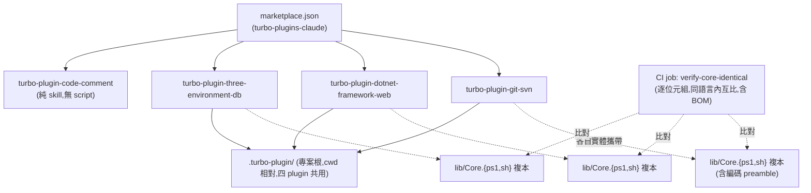
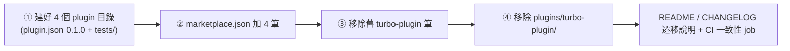

# refactor: 把 turbo-plugin 拆成四個獨立 plugin

## Summary

把單體 plugin `turbo-plugin` 拆成四個可獨立安裝的 plugin(`turbo-plugin-git-svn`、`turbo-plugin-dotnet-framework-web`、`turbo-plugin-three-environment-db`、`turbo-plugin-code-comment`),維持 `tp-*` skill 前綴與單一共用的專案根 `.turbo-plugin/`。同時把 git-svn 的 SVN push 訊息改為腳本確定性組合、dotnet 發佈路徑改為終端可點擊的固定輸出,並新增一支匯入既有 SVN 分支的 skill。以單一 atomic PR 取代舊單體。

---

## Problem Frame

詳見 origin(`docs/brainstorms/2026-06-19-turbo-plugin-split-requirements.md`)。一句話:單體把三個彼此無關的關注點綁死,使用者(尤其即將開工的 .NET Core + DbUp 專案)無法「只裝要的那塊」;另兩個既有痛點(push 訊息每次不同、發佈路徑無法點擊)一併在 git-svn / dotnet 兩塊修掉。

本案**承載性最高的切分是「git-svn 與其餘分離」**(由 .NET Core 只需 git-svn 的情境驅動)。dotnet / db / code-comment 之間的進一步三分屬安裝粒度衛生、非硬需求,且日後合併比拆分容易;故不為此額外設計,只求各自乾淨。

**前置狀態(已落地):** 同分支的 svn:ignore-drop 計畫(`docs/plans/2026-06-20-001-refactor-svn-ignore-reduce-to-fixed-git-plan.md`)已先行完成並 commit,turbo-plugin 隨之 bump 0.6.0。其結果改變了本案數個搬移對象的現狀,本案以此落地後狀態為起點:
- `Set-SvnIgnore.ps1/.sh` 與其測試**已刪除**——本案不再搬移它。
- `tp-suggest-ignore` 已縮為**只管 `.gitignore` + untrack(`svn delete`)**、不再碰 svn:ignore——仍歸 git-svn,但功能面已是純 git。
- `New-RemoteBridge` 與 `tp-setup` 改為設定**固定 `svn:ignore=.git`**(bridge 內部、非使用者管理);這條固定值是 `.git` 不進 SVN 的唯一防線,搬移時務必保留其 propset+commit arm。
- 連帶:四拆 doc-review 的「import 唯讀偷寫 svn:ignore」(ADV-1)finding 從根本消失(見 U11)。

---

## Key Technical Decisions

KTD1. **共用 code 用「各 plugin 自帶複本」,不執行期共享**(origin KD1)。`${CLAUDE_PLUGIN_ROOT}` 是各 plugin 各自的版本化 cache,無法可靠 source 別的 plugin 的 script,所以每個 plugin 必須實體攜帶它 source 的 lib。對 ~8 個無狀態函式、單一維護者而言,複本 + CI 一致性檢查正確;不引入 single-source + 生成步驟(過度設計)。

KTD2. **以「呼叫圖閉包」定義 universal Core,不用手列清單。** 把 `scripts/lib/Common.ps1` / `common.sh` 切成兩層:Core(`Core.ps1` + `core.sh`)= {讀 config、路徑解析、worktree 解析、git 版本探測、UTF-8 寫檔} 的**遞移閉包**;concern-specific helper 留所屬 plugin。**規則:concern 可呼叫 Core,Core 不可呼叫 concern。** Core 的**明確成員清單**(經呼叫圖驗證為必含,別只搬「那幾個」):`Probe-GitVersion`、`Get-NormalizedAbsolutePath`、`Resolve-RepoPath`、`Get-MainWorktree`、`Get-WorktreesDir`、`Test-IsMainWorktree`、`Test-IsSubmodule`、`Read-TurboPluginConfig`、`Resolve-ConfigValue`、`Write-Utf8NoBom`、`Get-RelativePathSafe`(及 `.sh` 對應)——`Get-MainWorktree`→`Get-NormalizedAbsolutePath`,dotnet 的 `Find-MSBuild`/`Find-SingleCsproj`→`Resolve-ConfigValue`+`Read-TurboPluginConfig`+`Resolve-RepoPath`、`Get-ProjectIdentityHash`→`Get-NormalizedAbsolutePath`,hook SessionStart→`Test-IsSubmodule`/`Test-IsMainWorktree`,皆是 concern→Core 邊。concern lib 仍留:git-svn 的 `Resolve-RemoteWorktree`、`Assert-TrustedSvnUrl`、`ConvertTo-NormalizedSvnUrl`、`Assert-ValidRemoteBranchName`、`Find-RemoteWorktreeCollision`;dotnet 的 `Find-MSBuild`、`Find-SingleCsproj`、`Get-ProjectIdentityHash`、`Format-IisExpressSiteName` + `IisHelpers.ps1` / `ApplicationHostHelpers.ps1`。只有 Core 跨 plugin 複製,故只有 Core 需逐字一致(U8)。

KTD2a. **編碼 preamble 屬 Core,dot-source 時跑一次。** `Common.ps1:9-14`(設 `[Console]::OutputEncoding` / `$OutputEncoding` 為 UTF-8)與 `common.sh:5-21`(UTF-8 locale bootstrap)是跨切面 load-bearing(svn / msbuild / iisexpress 不 mojibake 的依據)。它必須進 Core 並在 Core 載入時執行一次;concern lib 須**先 source Core**且**不得重設**編碼。後果:Core 含 top-level side-effect 語句,逐字一致檢查同時凍結這段(可接受、但須明寫)。

KTD3. **跨 plugin 一致性靠專屬 repo 層 CI job,不靠各 plugin 的 orchestrator。** orchestrator pre-flight 只看單一 plugin,無法做跨 plugin 不變式。新增 `tools/verify-core-identical.ps1` + `tools/verify-core-identical.sh`,由 `.github/workflows/tests.yml` 一個獨立 job 呼叫;**同語言內**逐位元組(含 BOM 與換行)比對(各 plugin 的 `Core.ps1` 互比、`core.sh` 互比,不跨語言)。比對腳本本身須 locale-safe(用 `grep -oE` / `sed`,**禁** `grep -P`——zh-TW Git Bash 預設非 UTF-8 會整支拒跑)。**R21 例外**:「加 plugin 零改 .yml」只對 test 探索成立,這個一致性 job 是唯一需要動 workflow 檔的地方。

KTD4. **standalone setup 維持 agent-prose SKILL(非腳本),concern-neutral base 為共用 SKILL 段落,各 plugin 引用。** 現行 `tp-setup` 是 590 行 agent 程序(無 setup 腳本),其 case (a) 子步驟有「不可重排」順序;切分是 SKILL 重新編寫,不是腳本抽取。每個 plugin 的 `tp-setup` SKILL 先跑共用 base 段(以**個別檔案存在與否**判斷,例如查 `config.toml` 而非只查目錄,避免半寫競態),再加自己 concern。共用檔以**標記區塊**讓各 plugin 只寫自己區段;**注意 marker 目前只存在於 `CLAUDE.md`,`conventions.md` / `config.toml` 今天沒有 marker scaffolding,本案要引入**——`config.toml` 的 marker 必須是 `#` 註解行以維持合法 TOML,且須驗證 `Read-TurboPluginConfig`(`Common.ps1:507` 略過 `#` 開頭行)確實容忍這些 marker 行。只有 git-svn 擁有 git bridge bootstrap(`git init` / `remote-svn/main`)。**guarantee 範圍**:marker 區塊在**循序** setup 下保證合併不覆蓋;兩個 session 同時對同一專案根跑 setup 的 concurrent read-modify-write 屬 out of scope(單一維護者假設,origin KD3);需要時可在每次寫前 re-read、變更則中止。concern runtime 需 bridge 而不存在時須 fail-loud(沿用 `[iis] enabled=false` 那種友善失敗,而非讓 `Get-WorktreesDir` 噴 path error)。

KTD5. **匯入的 bridge 與工作分支都要溯及 repo init commit。** bridge 沿用既有首推 bootstrap 模型(`New-RemoteBridge.ps1:78/86`:根起於 `git rev-list --max-parents=0 HEAD`,SVN 內容 `svn checkout --force` 疊上後 commit)。**但 unrelated-histories 失敗發生在 merge 時**(`Sync-FromSvn.ps1:82` 把 `remote-svn/<branch>` merge 進工作分支),所以**新工作分支必須 descend from `remote-svn/<branch>` bridge ref**(在 SVN 內容 commit 後由 bridge ref 開出),否則首次 `tp-pull-from-svn` 仍 `unrelated histories`。base-ref 對 bridge 與工作分支兩者都是正確性前提。

KTD6. **push body 由腳本組合,且 `git log` 列舉須在 ANSI scope 之外。** 用 `git log --no-merges <remote-svn-ref>..<branch> --format=%s` 取所有非-merge subject(現行 `Build-SvnCommit.ps1:73` 用 `%h|%s` 且**未加** `--no-merges`,本案改為 `--no-merges --format=%s` 並**去掉 `%h`**,符合 R12「預設無 hash」);「非-merge」以 parent 數判定,**不**用 subject 前綴 `Merge ` 比對。`git log` 主旨是 UTF-8,必須在 svn 用的 ANSI `OutputEncoding` scope **之外**擷取(沿用既有兩段 try/finally,別合併)。**body 鎖定的邊界要落在腳本層**:`Build-SvnCommit` 把鎖定 body 寫進 temp 檔,`Submit-SvnCommit` 讀「body-from-file + title-from-agent-arg」自行組合(agent 只能給 title),不可讓 agent 交一份自由 `--message`。

KTD7. **遷移為單一 atomic PR,硬移除舊單體 + 大聲遷移說明。** 嚴格順序:① 建好四個 `plugins/<name>/` 完整目錄(含 `plugin.json` 0.1.0 + `tests/`)→ ② `marketplace.json` 加四筆 → ③ 移除舊 `turbo-plugin` 筆 → ④ 移除 `plugins/turbo-plugin/`。任一中間 commit 都不得讓 `marketplace.json` 指向不存在路徑(U8 斷言把關)。**步驟 ②–④ 與目錄移除須落在同一 commit**。git blame:一個來源 → 四個目標的 fan-out,git rename 偵測每檔只能歸因一個目標,故 `git mv` 自動 `--follow` lineage 只有 `turbo-plugin-git-svn`(最大宗)保得住,其餘三個接受 copy-history;**因此本 PR 勿 squash-merge**(用保留中間 `git mv` commit 的 merge commit),否則連 git-svn 的 lineage 也可能退化。**注意此條 repo 內無強制機制**(squash 與否是 merge 時的人為選擇,merge-method / branch-protection 在 GitHub repo settings、不在版控);故 lineage 保留是 best-effort,owner 需在 merge 時手動確保,或接受「四個都 copy-history」為實際底線。舊安裝 `turbo-plugin@turbo-plugins-claude` 會靜默失聯(Claude Code 無 deprecation 管道),故每個 README/CHANGELOG 放遷移說明(移除舊 ID、改裝新四個)。

KTD8. **發佈路徑修正只動 SKILL + 腳本輸出,不動建置邏輯。** 腳本印出 raw Windows 絕對路徑(`$resolved`)與 `file:///` URL(`$displayPath`)各一行、結尾無標點;SKILL 強制 agent 逐字轉述那兩行、單獨成行、前後不接散文。

KTD9. **hook 隨 concern 走,各 plugin 只帶自己的 hook。** 現行 `hooks.json` 把 EnterWorktree(apphost,dotnet 概念)、SessionStart(含 dbhub 警示=db、setup 提示=當前單體中視為通用)綁在一起。拆後:EnterWorktree/apphost → dotnet;dbhub SessionStart 分支 → db;通用的 setup 提示 SessionStart 分支歸 **git-svn**(git-svn 為四者最常見的共同依賴、最可能被裝到;且此 hook 為 advisory,缺自己 concern marker 時 no-op,故即使某專案只裝別塊也不誤導)。多個 plugin 各自註冊 SessionStart 時 Claude Code 會合併、全部觸發,故每個 hook 必須 advisory 且在自己 concern marker 不存在時優雅 no-op(apphost 分支已自我跳過非 Windows;dbhub 分支本就只警示)。

**PS 5.1 / 編碼既有教訓(每個複本都要再守一次,複製時尤其當心):**
- EAP=Stop 下 native exe 只要寫 stderr 就丟 `NativeCommandError`,其後的 `$LASTEXITCODE` guard 不可達;測試斷言**安全性質**(exit≠0 + 無危險動作 + svn/git 原生錯誤文字),非自訂 guard 訊息。
- `common.sh` entity-decode 的 `${//&amp;amp;/\&}` 中 `&` 必須跳脫成 `\&`,否則靜默失效——一致性檢查會讓一個壞複本連帶全 plugin CI 紅。
- 含非 ASCII 的 `.ps1` 須 UTF-8 **with BOM**;`.sh` 維持**無 BOM**;`.ps1` 測試用 `[char]0x...` 建非 ASCII 資料時連旁邊 gloss 也要純 ASCII(`U+XXXX`),並留就地守衛註解。
- 五禁忌由 `tools/lint-ps-compat.ps1` 自動把關;**注意該 lint 目前只由 orchestrator pre-flight 以硬編路徑呼叫**(見 U2–U4 與 U8 的 scriptsDir 修正)。

---

## High-Level Technical Design

### 拆分後架構



### 共用檔案所有權矩陣（避免四個 setup 互相覆蓋）

`base` = 不存在則由先跑的 setup 建立(concern-neutral);`append` = 在自己標記區塊內 idempotent 追加;`owns` = 該檔由單一 plugin 建立與維護;`—` = 不碰。

| 檔案 | git-svn | dotnet | db | code-comment |
|---|---|---|---|---|
| `.turbo-plugin/config.toml`(檔本身,concern-neutral 空殼) | base | base | — | — |
| `.turbo-plugin/config.toml` `[svn]` | append | — | — | — |
| `.turbo-plugin/config.toml` `[iis]/[build]/[publish]/[frontend]/[run]` | — | append | — | — |
| `.turbo-plugin/conventions.md` | base + append git-svn 段 | append dotnet 段 | append db 段 | append comment 段 |
| `.gitignore` | base(`.turbo-plugin/`、`.local`)+ append `.svn/` | append `.vs/`、`bin/`、`obj/`、`packages/` | append(sql 輸出,如有) | — |
| `.commitlintrc.json` | owns(含完整 type-enum) | — | — | — |
| `CLAUDE.md`(專案層,標記區塊) | base + append 各自段 | append | append | append |
| `.turbo-plugin/applicationhost.config` | — | owns | — | — |
| `.turbo-plugin/dbhub.example.local.toml` | — | — | owns | — |
| `.mcp.json`(plugin root) | — | — | owns(`tp-dbhub`) | — |
| hook(各自) | setup-提示 SessionStart | EnterWorktree/apphost | dbhub SessionStart | — |
| `remote-svn/main` bridge + `worktrees/` | owns | — | — | — |

> code-comment 不碰 `.turbo-plugin/`、無 setup(origin R10)。`conventions.md` / `config.toml` 今天沒有 marker scaffolding,本案引入(config.toml marker 為 `#` 註解行)。

### 遷移順序（KTD7,單一 atomic PR、勿 squash）



---

## Output Structure

四個新目錄共用此骨架(僅列差異要點):

```
plugins/turbo-plugin-git-svn/
├── .claude-plugin/plugin.json        # version 0.1.0
├── CHANGELOG.md                      # [0.1.0]，含「split from turbo-plugin v0.5.2」+ 遷移說明
├── README.md  LICENSE
├── skills/{tp-pull-from-svn,tp-push-to-svn,tp-svn-log,tp-reset-branch-to-main,
│           tp-merge-main-into-branches,tp-suggest-ignore,tp-commit-msg,
│           tp-checkout-svn-branch,tp-setup}/SKILL.md
├── scripts/                          # 全套 SVN 腳本對 + Test-EncodingSupport（Set-SvnIgnore 已由 svn:ignore-drop 計畫刪除）
│   └── lib/{Core.ps1, core.sh, Common.ps1(svn concern), common.sh(svn concern)}
├── hooks/hooks.json                  # 只含 setup-提示 SessionStart 分支
├── default-files/.turbo-plugin/      # git-svn base 範本
└── tests/{Invoke-ScriptTests.ps1, invoke-script-tests.sh, lib/{shunit2,...}, fixtures/, unit/}
                                      # orchestrator 的 scriptsDir 指向「本」plugin（見 U2）

plugins/turbo-plugin-dotnet-framework-web/   # build/run/stop/publish + cleanup-orphan-iis + setup
│   scripts/lib/{Core.*, IisHelpers.ps1, ApplicationHostHelpers.ps1, (dotnet concern helpers)}
│   hooks/hooks.json                          # EnterWorktree/apphost
│   default-files/.turbo-plugin/applicationhost.config

plugins/turbo-plugin-three-environment-db/   # tp-db-management + setup
│   .mcp.json                                # tp-dbhub
│   hooks/hooks.json                          # dbhub SessionStart 警示
│   default-files/.turbo-plugin/dbhub.example.local.toml

plugins/turbo-plugin-code-comment/           # tp-csharp-comment, tp-js-comment（純 skill）
│   tests/{Invoke-ScriptTests.ps1, invoke-script-tests.sh, lib/shunit2}
                                      # 無 scripts/;orchestrator 在無 scripts/ 時跳過 lint+framework gate、回零測試=綠（見 U5）
```

---

## Requirements

完整需求見 origin;此處為實作 checklist,依關注點分組,括號標 origin 追溯。

**拆分與封裝**
- R1. 拆成四個獨立安裝 plugin,各為 `marketplace.json` 一筆、目錄 `plugins/turbo-plugin-<x>/`(origin R1)。
- R2. 全 skill 維持 `tp-*` 前綴(origin R2)。
- R3. skill→plugin 對應如 origin R3:git-svn 收 pull/push/svn-log/reset/merge-main/suggest-ignore/commit-msg + 新 checkout;dotnet 收 build/run/stop/publish/cleanup-orphan-iis;db 收 db-management(+ `.mcp.json`);code-comment 收 csharp-comment/js-comment。
- R4. 舊單體 entry 與目錄移除,四個取代(origin R4、KTD7)。
- R5. 四個新 plugin 各從 `0.1.0` 起、各自 CHANGELOG(origin R5)。

**共用基礎設施與 setup**
- R6. universal Core(呼叫圖閉包,KTD2)複製進每個需要的 plugin;**concern-specific helper 只留所屬 plugin(見 R7)**;新增 CI 斷言各 Core 複本同語言逐字一致(origin R6、KTD2/KTD3)。
- R7. concern-specific helper 只留所屬 plugin(origin R7、KTD2)。
- R8. 每個 plugin setup standalone:不存在則建 concern-neutral base、再加自己 concern;不依賴別的 plugin(origin R8、KTD4)。
- R9. 四個共用同一專案根 `.turbo-plugin/` 與 `.claude/settings.local.json`,各自只寫自己 key/section;config 讀取器須容忍未知 section 與 marker 註解行(origin R9、KTD4)。
- R10. code-comment 純 skill,無 script、不碰 `.turbo-plugin/`、無 setup(origin R10)。

**git-svn:push 訊息**
- R11. body 由腳本確定性列出所有非-merge commit subject;無 type 過濾、無逐筆詢問(origin R11、KTD6)。
- R12. title 由 agent 寫;body 由腳本鎖定(經 temp 檔交付,agent 不可改);`- ` 條列、預設無 hash(origin R12、KTD6)。
- R13. git-svn 不強制 commit 格式;`tp-commit-msg` 仍獨立對使用者的 `.commitlintrc.json` 驗語意(origin R13)。
- R14. push 詢問點用固定模板;最後確認為「確認送出 / 自己改標題 / 取消」,移除自由編輯迴圈(origin R14)。

**dotnet:發佈路徑**
- R15. 發佈後以固定模板輸出 raw Windows 路徑 + `file:///` URL 各一行、無標點、agent 逐字轉述(origin R15、KTD8)。

**git-svn:checkout 既有 SVN 分支**
- R16. 新 skill `tp-checkout-svn-branch` 一步匯入既有 SVN 分支成 bridge + 已填內容工作分支(origin R16)。
- R17. 工作分支名預設 = SVN 葉名消毒後、且 descend from bridge ref;內容於 bridge 建立時抓下,日後走 `tp-pull-from-svn`(origin R17、KTD5)。
- R18. 操作前以 `Assert-TrustedSvnUrl`(錨 `remote-svn-main` repos-root-url)驗證,且在任何 git/svn 變更**之前**(origin R18)。
- R19. worktree 命名/碰撞沿用 `Resolve-RemoteWorktree`(origin R19)。
- R20. 本機同名分支內容不同則拒絕並告知、零副作用(origin R20)。

**貢獻者流程**
- R21. 每個新 plugin 各帶兩層測試套件(慣例佈局,CI 自動探索);repo 根 README 與各 plugin README 更新(origin R21)。CI 自動探索測試入口無需改 `.yml`;R6 的跨 plugin Core 一致性 job(U8)為唯一需新增 workflow job 的例外(由 R6 授權)。

---

## Implementation Units

### 階段 A — 結構拆分與遷移

### U1. 切分 lib:抽出 universal Core(呼叫圖閉包)
- Goal: 把 `Common.ps1` / `common.sh` 切成 `Core.{ps1,sh}`(universal,將被跨 plugin 複製)+ concern lib(留所屬 plugin)。
- Requirements: R6, R7;KTD2/KTD2a。
- Dependencies: 無。
- Files(現址,拆分前在單體內先切):`plugins/turbo-plugin/scripts/lib/Common.ps1`、`common.sh` → 新增 `scripts/lib/Core.ps1`、`scripts/lib/core.sh`;更新所有 source 點先載 Core 再載 concern lib。
- Approach: 先算**呼叫圖閉包**:把每個落入 concern lib 的函式的遞移 Core 依賴全納入 Core(至少 `Get-NormalizedAbsolutePath`、`Resolve-RepoPath`、`Test-IsMainWorktree`、`Test-IsSubmodule` 及 `.sh` 對應)。編碼 preamble 進 Core、Core 載入時跑一次,concern lib 不重設(KTD2a)。挑 canonical Core 前**先審 Core 內品牌/版本字串**(如 `Probe-GitVersion` 的「turbo-plugin requires Git >= 2.31」),改中性措辭——一致性檢查會把它凍結到四份。
- Patterns to follow: 既有 `source "${CLAUDE_PLUGIN_ROOT}/scripts/lib/common.sh"` 契約;`Core.ps1` 含非 ASCII → UTF-8 with BOM,`core.sh` 無 BOM。
- Test scenarios: 既有單體測試全綠(行為保留 refactor);**雙向**靜態檢查——(a) Core 不引用任何 concern 函式;(b) 無 concern lib 引用「不在 Core 內」的 Core 函式;(c) 只 dot-source Core 時每個 Core 函式都可解析(無 concern lib 載入);(d) 只載 Core 的 `.ps1` / `.sh` 能正確 round-trip 一個非 ASCII 字串/路徑(證明 preamble 隨 Core);(e) dot-source concern lib 時必然先拉進 Core 的編碼 preamble(concern lib 首行 source Core;只載 concern lib 也能 round-trip 非 ASCII)——並明訂 `set -euo pipefail` 落在 Core、concern 不得弱化。
- Verification: 既有 Pester/shUnit2 套件不變綠;Core-only dot-source 無 missing-function。

### U2. Scaffold turbo-plugin-git-svn（含 git mv lineage）
- Goal: 建 git-svn plugin 完整目錄。
- Requirements: R1, R2, R3, R7;KTD7(此 plugin 繼承 `git mv` blame)、KTD9。
- Dependencies: U1。
- Files: `plugins/turbo-plugin-git-svn/`(`.claude-plugin/plugin.json` 0.1.0、CHANGELOG、README、LICENSE、9 支 skill、SVN 腳本對 + `Test-EncodingSupport`(`Set-SvnIgnore` 已於 svn:ignore-drop 計畫刪除)、`lib/{Core.*, Common.ps1, common.sh}`、`hooks/hooks.json`(只 setup-提示 SessionStart 分支)、`default-files/`、`tests/`)。
- Approach: 用 `git mv plugins/turbo-plugin → plugins/turbo-plugin-git-svn` 取得 lineage,再把非 git-svn 部分移出到 U3–U5。**修正 orchestrator 的 scriptsDir**:`Invoke-ScriptTests.ps1` / `invoke-script-tests.sh` 內硬編的 `plugins/turbo-plugin/scripts`(`Invoke-ScriptTests.ps1:57`、`invoke-script-tests.sh:35`)改成本 plugin 名,否則複本會 lint 已刪的舊路徑 → FAIL。**本 unit 不動 `marketplace.json`**(加四筆/刪舊筆屬 U7 步驟②)。
- Patterns to follow: repo plugin 骨架;`${CLAUDE_PLUGIN_ROOT}` 引用。
- Test scenarios: `tests/` 兩入口可被 CI discover;SVN 腳本既有測試在此 plugin 內全綠;orchestrator lint 的是**本** plugin 的 `scripts/`;`hooks.json` 的 `${CLAUDE_PLUGIN_ROOT}` 解析到本 plugin。
- Verification: CI matrix 納入本 plugin、windows+ubuntu 綠。

### U3. Scaffold turbo-plugin-dotnet-framework-web
- Goal: 建 dotnet plugin。
- Requirements: R1, R3, R7;KTD9。
- Dependencies: U1, U2(自 U2 抽離 dotnet 部分)。
- Files: `plugins/turbo-plugin-dotnet-framework-web/`(5 支 skill、Build/Publish-Web、Start/Stop-Iis、Get-ProjectIdentity/TargetUrl、Test-IisListening、Compress-Content、Remove-OrphanIis、`lib/{Core.*, IisHelpers.ps1, ApplicationHostHelpers.ps1, dotnet concern helpers}`、`hooks/hooks.json`(EnterWorktree/apphost)、`default-files/.turbo-plugin/applicationhost.config`、tests)。
- Approach: `git mv` 自 U2 把 dotnet 檔移入(copy-history 可接受)。同 U2 **修正 orchestrator scriptsDir 指向本 plugin**。
- Patterns to follow: 同 U2。
- Test scenarios: dotnet 腳本既有測試在此 plugin 全綠/自我 SKIP(無 MSBuild/IIS 的 runner);orchestrator lint 本 plugin scripts;CI discover 納入。
- Verification: CI 綠。

### U4. Scaffold turbo-plugin-three-environment-db
- Goal: 建 db plugin。
- Requirements: R1, R3;KTD9。
- Dependencies: U1, U2。
- Files: `plugins/turbo-plugin-three-environment-db/`(`tp-db-management` skill、`.mcp.json`(`tp-dbhub`)、`lib/Core.*`、`hooks/hooks.json`(dbhub SessionStart 警示)、`default-files/.turbo-plugin/dbhub.example.local.toml`、tests)。
- Approach: `.mcp.json` 移至此 plugin root,仍引用 `${CLAUDE_PROJECT_DIR}/.turbo-plugin/dbhub.local.toml`。同 U2 修正 orchestrator scriptsDir。
- Patterns to follow: 同上。
- Test scenarios: 若有 db 腳本則測之;`.mcp.json` 結構有效;db setup 缺 `dbhub.local.toml` 時 MCP 的預期失敗模式有測試或文件。
- Verification: CI 綠;MCP server 宣告可被解析。

### U5. Scaffold turbo-plugin-code-comment（純 skill,定案 option A）
- Goal: 建 code-comment plugin,且**被 CI discover 並回綠**(origin R21 要求每個 plugin 帶 tests/,故「不被 discover」不可選)。
- Requirements: R1, R3, R10, R21。
- Dependencies: U2。(code-comment 無 scripts、不載 Core,故不依賴 U1。)
- Files: `plugins/turbo-plugin-code-comment/`(`tp-csharp-comment`、`tp-js-comment`、plugin.json、CHANGELOG、README、LICENSE、`tests/{Invoke-ScriptTests.ps1, invoke-script-tests.sh, lib/shunit2}`)。
- Approach: 無 `scripts/`。**orchestrator 契約新增 guard**:無 `scripts/` 目錄時**跳過 lint pre-flight**(兩側都要——否則 `lint-ps-compat.ps1:32-35` 對缺失路徑 `exit 1` → FAIL)。framework gate **非對稱**:`.ps1`(`Invoke-ScriptTests.ps1:85-98` 的 Pester gate 連 `-SkipPreflight` 也跑)需加「零測試 → 跳過 Pester gate」分支;`.sh` 只要 vendore `tests/lib/shunit2`,既有零測試短路(`invoke-script-tests.sh:92-95`)就回 exit 0、**不需改**。人工 skill-test 套件照常。
- Patterns to follow: orchestrator 既有 PASS/SKIP/FAIL 契約 + 新 no-scripts guard。
- Test scenarios: Test expectation: 無 script 行為測試。驗證 orchestrator 在「無 scripts/ + 零腳本測試」下 windows(`Invoke-ScriptTests.ps1`)與 ubuntu(`invoke-script-tests.sh`、無 `-SkipPreflight`)皆 exit 0。
- Verification: CI discover 後 windows+ubuntu 綠。

### U6. standalone setup 切分 + 共用檔標記區塊
- Goal: 把單體 `tp-setup`(agent-prose SKILL)拆成各 plugin 的 standalone setup SKILL;共用檔以標記區塊合併。
- Requirements: R8, R9;KTD4。
- Dependencies: U2, U3, U4。
- Files: 各 plugin `skills/tp-setup/SKILL.md`(agent-prose,**非新增腳本**);`default-files/`;共用檔範本(config.toml、conventions.md、.gitignore、CLAUDE.md、.commitlintrc.json)。
- Approach: 依「共用檔所有權矩陣」。concern-neutral base 定義為**共用 SKILL 段落**,各 plugin 的 tp-setup 引用、保留既有「不可重排」順序;base 以檔案粒度判存在(查 `config.toml` 而非只查目錄)。**為 `conventions.md` 與 `config.toml` 引入 marker scaffolding**(目前只有 CLAUDE.md 有);`config.toml` marker 用 `#` 註解行,並驗證 `Read-TurboPluginConfig` 容忍。git-svn 獨佔 bridge bootstrap。concern runtime 需 bridge 而不存在 → fail-loud。idempotency marker 以 concern 粒度(git-svn 查 `remote-svn-main`、db 查 `dbhub.example.local.toml`、dotnet 查 `[iis]`)。
- Test scenarios: base routine 二度執行不重寫(循序 idempotent);兩個 plugin 的 setup **先後**跑只各自合併自己標記區段、不互相覆蓋(.gitignore / conventions.md / config.toml);config 讀取器遇未知 section **與 marker 註解行**靜默略過不丟(每個 plugin tests/ 補含外來 section 與 marker 的 fixture);非 git-svn plugin 在無 git repo / 無 bridge 時的 fail-loud 路徑;只有 git-svn 會 `git init` / 建 `remote-svn/main`。
- Verification: 在乾淨 sandbox 循序跑各 plugin setup,`.turbo-plugin/` 內容符合矩陣,無覆蓋。

### U7. marketplace 切換 + 遷移文件（atomic cutover）
- Goal: 完成取代舊單體。
- Requirements: R4, R21;KTD7。
- Dependencies: U2, U3, U4, U5, U6, U8。
- Files: `.claude-plugin/marketplace.json`(加四筆、刪舊筆)、移除 `plugins/turbo-plugin/`、repo 根 `README.md`(四套 search/install/update + 「我需要哪些?」決策指引,含 .NET Core=只裝 git-svn,並給明確 install ID `turbo-plugin-<x>@turbo-plugins-claude`)、各 plugin `CHANGELOG.md`(`[0.1.0]` 註記 split-from-v0.5.2 + 遷移說明)。
- Approach: 遵循 KTD7 四步順序;步驟②–④與目錄移除同一 commit;**勿 squash-merge**(保 lineage)。
- Test scenarios: U8 斷言每個 `source` 路徑存在**且為可安裝 plugin**(有 plugin.json + tests/ orchestrator);README 對每個 plugin 給明確 install ID。
- Verification: 全新 clone 後四個 plugin 皆可被 marketplace 解析;舊 `turbo-plugin` 不再出現。

### U8. 跨 plugin Core 一致性 CI job + tools
- Goal: 防 Core 複本漂移 + 守 marketplace 可安裝性。
- Requirements: R6;KTD3。
- Dependencies: U1(Core 檔成形);斷言需四目錄就位。
- Files: `tools/verify-core-identical.ps1`、`tools/verify-core-identical.sh`、`.github/workflows/tests.yml`(新增獨立 job)。
- Approach: 指定 canonical(建議 git-svn 的 Core),其餘 plugin 的同名 Core 檔逐位元組(含 BOM 與換行)比對;比對腳本 locale-safe(`grep -oE`/`sed`,禁 `-P`)。失敗訊息指名哪個 plugin 的哪個 Core 檔漂移 + 修法。同 job 斷言 `marketplace.json` 每個 `source` 目錄存在**且含 `.claude-plugin/plugin.json` 與 `tests/` orchestrator 入口**。(把 `lint-ps-compat` 提升為 repo 層 job 屬可選優化,見 Open Questions。)
- Test scenarios: 故意改一個 Core 複本一個位元組 → job 紅且指名;`marketplace.json` 指向不存在或缺 plugin.json/tests 的路徑 → job 紅;在 zh-TW 非 UTF-8 locale 下比對腳本不因 `grep -P` 拒跑。
- Verification: 四 plugin 一致時綠、任一漂移或不可安裝時紅。

### 階段 B — git-svn push 訊息

### U9. push 訊息腳本化（body 腳本鎖定 + agent 寫 title）
- Goal: 落實 R11–R14。
- Requirements: R11, R12, R13, R14;KTD6。
- Dependencies: U2。
- Files: `plugins/turbo-plugin-git-svn/`:`scripts/Build-SvnCommit.ps1`、`build-svn-commit.sh`、**`scripts/Submit-SvnCommit.ps1`、`submit-svn-commit.sh`**、`skills/tp-push-to-svn/SKILL.md`。
- Approach: `Build-SvnCommit` 以 `git log --no-merges <range> --format=%s`(去 `%h`)組 body、UTF-8 擷取在 ANSI scope 之外(KTD6),把鎖定 body 寫進 temp 檔;`Submit-SvnCommit` 改讀「body-from-file + title-from-agent-arg」自行組合(agent 只能給 title,不再交自由 `--message`);**title 在組合前須去除/拒絕換行(collapse 成單行)**,否則 agent 可用 `\n` 把 body 內容塞進 title 繞過鎖定。**此變更同時要刪掉 SKILL Steps 3.1-3.5**(type 過濾 + 逐筆未知 type 詢問)並改寫 Step 4/5——訊息組裝現在在 agent 端,這段 SKILL 手術才是工作主體,非只拆腳本契約。空/僅-merge 區間:零 commit → 沿用既有 `Nothing to push` 短路;非-merge 過濾後 body 為空 → 硬停「除 merge 外無可推內容」,並與 release-tag 規則對齊(release tag 觸發於「產生 git merge commit」,故僅-merge 推送可能有 tag 但 SVN body 空——本 unit 定案二者一致)。title 由 agent 寫;最後確認三選「確認送出 / 改標題 / 取消」,改標題 → 自由文字 → 重渲染(鎖定 body + 新 title)→ 回三選。固定模板只重做**最後確認**;push 流程既有的「branch mismatch」「pending-merge」「首推 bootstrap 風險」確認維持原措辭(明寫於 SKILL)。
- Execution note: 先寫失敗測試固定「相同 commit 集合 → body 位元組相同」,再改腳本。
- Patterns to follow: 既有兩段 OutputEncoding try/finally(別合併);body 鎖定後使用者改 subject 須 `git rebase` 重跑(SKILL 註明)。
- Test scenarios: feat/fix/refactor + 一個自動 merge → body 列三個非-merge、merge 被 `--no-merges` 排除(Covers AE1);docs/test/chore 全入 body(無 type 過濾,Covers AE2);subject 含 `` ` `` / `$` / 引號 / 前導 `- ` → 經 temp 檔原樣進 svn、不被 shell 內插破壞;僅-merge 區間 → 硬停且與 tag 規則一致;同一 commit 集合跑兩次 → body 位元組一致;`Submit` 只接受 title-arg、body 來自檔(agent 無法改 body)。
- Verification: 真 svn round-trip(有 svn 時)成功、無 svn 自我 SKIP;body 確定性與鎖定邊界測試綠。

### 階段 C — dotnet 發佈路徑

### U10. 發佈路徑固定模板
- Goal: 落實 R15。
- Requirements: R15;KTD8。
- Dependencies: U3。
- Files: `plugins/turbo-plugin-dotnet-framework-web/`:`scripts/Publish-Web.ps1`、`publish-web.sh`、`skills/tp-publish-dotnet-framework-web/SKILL.md`。
- Approach: 腳本印出 raw Windows 絕對路徑(`$resolved`)與 `file:///` URL(`$displayPath`)各一行、結尾無標點;SKILL 指示 agent 逐字轉述那兩行、各自成行、後不接散文/句號。
- Patterns to follow: 既有 `PUBLISH_OUTPUT_PATH=` token 解析。
- Test scenarios: 成功發佈 → stdout 含 raw 路徑行與 `file:///` 行、皆無結尾標點(Covers AE4);路徑含空白仍完整單行;SKILL 文字明確要求逐字、禁加標點/散文。
- Verification: 腳本輸出兩行格式正確;SKILL 指示無歧義。

### 階段 D — checkout 既有 SVN 分支

### U11. 新 skill tp-checkout-svn-branch（modeled on New-RemoteBridge,非參數化重用）
- Goal: 落實 R16–R20。
- Requirements: R16, R17, R18, R19, R20;KTD5。
- Dependencies: U2(在 git-svn plugin 內)。
- Files: `plugins/turbo-plugin-git-svn/skills/tp-checkout-svn-branch/SKILL.md`、`scripts/Checkout-SvnBranch.ps1` + `checkout-svn-branch.sh`、對應 `tests/unit/scripts/`。
- Approach: 是**新腳本、以 `New-RemoteBridge` 為樣板**(重用 `Resolve-RemoteWorktree`/`Find-RemoteWorktreeCollision`/`Assert-TrustedSvnUrl` 與「SVN path 已存在」的 checkout arm),非參數化舊腳本。前置條件——`remote-svn-main` 必須存在(否則 `Assert-TrustedSvnUrl` fail-closed,訊息**區分「目錄缺」vs「WC 損壞」並帶上 svn info 原因**、導向先跑 git-svn setup;不自行 bootstrap 主 bridge)。驗證以 `remote-svn-main` 為 trusted WC、在任何 mutation 之前。同名工作分支碰撞 pre-check **置於任何 mutation 之前**:存在且非空/非 unborn 即拒絕、零副作用、明確訊息。worktree 命名走 `Resolve-RemoteWorktree`(衍生鏈:SVN 葉名 → 工作分支名 → `Resolve-RemoteWorktree` → `remote-svn/<branch>` + dir;葉名空或被 allowlist 拒 → 要求使用者給明確名)。base-ref:bridge 根於 init commit,**工作分支由 `remote-svn/<branch>` bridge ref 開出**(KTD5),確保首 pull 不 unrelated histories。**import 為唯讀**:不對既有 SVN 分支做任何 svn commit/propset,只在本機 git 端寫(svn checkout 讀 + git-commit 內容到 bridge + 開工作分支),rollback 可完全乾淨;工作分支建立放 rollback-guarded try 的最後一步。(注:svn:ignore-drop 計畫〔`docs/plans/2026-06-20-001-refactor-svn-ignore-reduce-to-fixed-git-plan.md`,**已落地**〕把 svn:ignore **縮成固定 `.git`**、非整個移除;那條固定 svn:ignore 由 `New-RemoteBridge` 在**新建** bridge 時 propset+commit〔現址 `New-RemoteBridge.ps1` 的 `svn propset svn:ignore '.git' '.'` + `svn commit` arm〕,本 skill 匯入的是**既有**分支、刻意跳過該 arm,故對 SVN 端零寫入——四拆 doc-review 的「import 唯讀偷寫 svn:ignore」(ADV-1)finding 因此從根本消失。)(曾考慮把 git 端 populate 延到首次 `tp-pull-from-svn`〔重用 Sync-FromSvn〕可再減碼;留作實作時選擇。)
- Execution note: 先寫「同名衝突 → 零副作用拒絕」「無 remote-svn-main → fail-closed」「中途失敗 → 無新 SVN revision」三個失敗測試,再實作。
- Patterns to follow: `New-RemoteBridge.ps1` 的碰撞/部分狀態守衛與 rollback(本機 git 側 rollback try/catch),但**跳過其 svn copy arm 與 svn:ignore propset/commit arm**(後者僅適用新建 bridge;既有分支唯讀匯入不寫 SVN);保留 `svn rm --keep-local '.git'` 那類純本機 WC 修正不在此限。tgs 跨 worktree(`git rev-parse --git-common-dir`)、SVN 操作用子殼 `(cd <path> && svn ...)` / `Push-Location`。
- Test scenarios:(綁定回歸防線,非範例)目標 URL 在受信任根外 → 拒絕;percent-encoded traversal(`%2e%2e`)→ 拒絕;prefix-confusion(`repos-evil`)→ 拒絕;URL 在 `branches/` 下且合法 → 通過;無/損壞 `remote-svn-main` → fail-closed 且訊息含原因;同名本機分支內容不同 → 拒絕且零副作用(Covers AE3);葉名含須消毒字元 → 正確衍生;葉名被 allowlist 拒 → 要求明確名;`git merge-base <workbranch> remote-svn/<branch>` 匯入後非空(首 pull 不 unrelated histories);中途失敗 → bridge+worktree+工作分支一起回滾、且**目標 SVN 分支無新 revision**。
- Verification: 有 svn 時真 round-trip 匯入 + 後續 pull 成功;無 svn 自我 SKIP;拒絕/失敗路徑零副作用經測試確認。

---

## Acceptance Examples

- AE1. **Covers R11, R12, U9.** Given 推送含 feat/fix/refactor 三 commit + 一自動 merge commit;When 組 push 訊息;Then body 條列三個非-merge subject、merge 被 `--no-merges` 排除,title 為 agent 一行。
- AE2. **Covers R11, R13, U9.** Given 推送含 docs/test/chore;When 組訊息;Then 三者全入 body(無 type 過濾)。
- AE3. **Covers R20, U11.** Given 本機已有同名、內容不同的分支;When 跑 tp-checkout-svn-branch;Then 拒絕並告知、不建立 bridge 或工作分支、目標 SVN 分支無新 revision。
- AE4. **Covers R15, U10.** Given 成功發佈;When agent 回報;Then 輸出兩行(raw `C:\...`、`file:///...`)、各自成行、結尾無標點、無散文包裹。
- AE5. **Covers R6, U8.** Given 任一 plugin 的 `Core.ps1`/`core.sh` 複本與 canonical 出現一位元組差異;When CI 一致性 job 跑;Then job 紅並指名漂移檔。
- AE6. **Covers R10, U5.** Given code-comment plugin 無 `scripts/`、零腳本測試;When CI 在 windows 與 ubuntu 跑其 orchestrator;Then 皆 exit 0(綠),不因缺 scripts/ 路徑 FAIL。

---

## Scope Boundaries

**Resolved from origin（原本 deferred,本計畫已定案)**
- bridge / 工作分支 base-ref 模型 = 根於 repo init commit、工作分支由 bridge ref 開出(KTD5)。
- 新 skill 命名 = `tp-checkout-svn-branch`。
- Common.ps1/common.sh 的「universal vs concern」劃線 = 呼叫圖閉包(KTD2)。

**Deferred to Follow-Up Work**
- 順手清理 / 鄰近重構一律不在本案(沿用 origin「Not a goal」)。
- 本案落地後用 `/ce-compound` 記錄拆分決策(repo 無 `docs/solutions/`)——後續工作,非本 PR。

**Not a goal**
- 讓 dotnet-framework-web 在完全無 git/SVN 的專案運作:standalone setup 技術上使其可裝,但非目標;僅要求「需要 bridge 而不存在時 fail-loud」(U6),不為此額外設計功能。

---

## Risks & Dependencies

- **遷移 atomic 性(KTD7)**:中間狀態若 `marketplace.json` 指向不存在路徑,會壞掉**所有** plugin 的探索;且即使路徑存在,指向**不完整/不可安裝**的目錄(缺 plugin.json 或 tests/)同樣有害。緩解:嚴格四步順序 + U8 斷言「路徑存在且可安裝」+ 步驟②–④同一 commit + 勿 squash。
- **orchestrator 路徑耦合**:orchestrator 硬編 `plugins/turbo-plugin/scripts` 且強制 lint pre-flight;複本若未 repoint scriptsDir 會 lint 已刪路徑 → FAIL;code-comment 無 scripts/ 需 guard。緩解:U2–U4 repoint、U5 no-scripts guard。
- **舊安裝失聯**:硬移除後既有 `turbo-plugin@turbo-plugins-claude` 靜默失效。緩解:README/CHANGELOG 大聲遷移說明。
- **Core 漂移 / 安全函式無守**:Core 逐位元組檢查涵蓋 Core;但 `Assert-TrustedSvnUrl` 等屬 concern lib、單一複本、不在該檢查內。緩解:U11 的 trust 拒絕路徑列為**綁定**測試案例當回歸防線;BOM/換行差異會讓比對「不明原因」失敗,U8 訊息給修法。
- **編碼地雷(learnings)**:push body 的 `git log` 若落入 ANSI scope → 中文主旨 mojibake;preamble 若沒進 Core → dotnet/db mojibake;`common.sh` 的 `\&` 漏跳脫 → 靜默壞且連帶全 plugin CI 紅;`.sh` 用 `grep -P` 在 zh-TW 機器拒跑。緩解:KTD2a、KTD6、KTD3 與 PS 5.1 教訓段,均有對應測試。
- **hook 共存**:多 plugin 各註冊 SessionStart 時全部觸發;每個須 advisory + concern marker 不存在時 no-op(KTD9)。
- **依賴**:CLAUDE.md 版號/測試/跨平台/五禁忌規約(`tools/lint-ps-compat.*`);Claude Code 的 `.turbo-plugin/`(cwd 相對共用)、多-plugin marketplace、per-plugin cache 行為(已於 brainstorm 驗證)。

---

## Open Questions

**Deferred to Implementation**
- 精確的「不同內容」判定門檻(tip SHA 不相等 / 非祖先 / 任何同名即拒)——U11 採「同名非空即拒」為預設,實作時若 round-trip 顯示更佳判準可微調(不改對外行為:仍「拒絕 + 零副作用」)。
- canonical Core 來源指定(建議 git-svn 複本)——U8 實作時敲定並寫進失敗訊息。
- `lint-ps-compat` 是否提升為 repo 層 job(與 orchestrator 硬編路徑解耦)——U8 實作時評估,二者皆不破 CI。

---

## Sources / Research

- Origin 需求文件:`docs/brainstorms/2026-06-19-turbo-plugin-split-requirements.md`。
- 現行 push 過濾在 SKILL(非腳本):`plugins/turbo-plugin/skills/tp-push-to-svn/SKILL.md`(type 過濾 113–119、merge 略過 124、未知 type 詢問 133–142、agent 組 title 147–148);body 與 title 經 `Submit-SvnCommit.ps1 -Message` 寫入 svn `--file` temp。
- `Build-SvnCommit.ps1:73` 現用 `%h|%s` 未加 `--no-merges`(本案改);`Submit-SvnCommit.ps1:21,116` 將 `$Message` 逐字寫 temp。
- 發佈腳本既有兩料:`plugins/turbo-plugin/scripts/Publish-Web.ps1:124-125`。
- 共用 helper 與呼叫圖:`scripts/lib/Common.ps1`(`Get-MainWorktree`→`Get-NormalizedAbsolutePath`;`Resolve-RemoteWorktree` 191、`Assert-TrustedSvnUrl` 270、`Find-MSBuild` 407/409、`Find-SingleCsproj` 456/469、`Get-ProjectIdentityHash` 360);`IisHelpers.ps1:17/19`;`common.sh`(`resolve_remote_worktree` 201、`assert_trusted_svn_url` 264);編碼 preamble `Common.ps1:9-14`、`common.sh:5-21`;`scripts/New-RemoteBridge.ps1`(base-ref=init commit 78/86、svn-copy vs checkout arm 102/104、rollback 165-173、明示不建工作分支 12-16);`Sync-FromSvn.ps1:82`(merge 方向 remote→工作分支=unrelated-histories 發生點)。
- 測試/CI:orchestrator `Invoke-ScriptTests.ps1`(scriptsDir 硬編 57、lint 呼叫 73、framework gate 85-98)/`invoke-script-tests.sh`(35、74-80、零測試短路 92-95);`tools/lint-ps-compat.ps1:32-35`(缺路徑 exit 1);`.github/workflows/tests.yml`(discover 36-58、windows 96、ubuntu `-SkipPreflight` 144);`tests/lib/shunit2`、`ScriptsCommon.ps1`。
- hooks:`hooks/hooks.json`、`scripts/hooks/invoke-sessionstart.sh`(dbhub 警示 70-76、setup 提示 92-97)、`Invoke-PostToolUseEnterWorktree.ps1`(apphost)。
- 編碼教訓(auto-memory):PS 5.1 EAP=Stop + native stderr、MSYS console codepage vs svn argv、PS OutputEncoding 兩段 scope、bash `${//}` 的 `\&`、`grep -P` 非 UTF-8 拒跑、`.ps1` 測試 code-point gloss 須純 ASCII。
