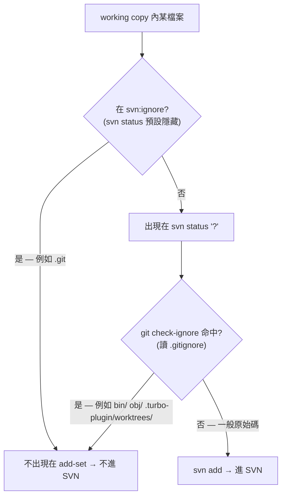

# refactor: 把 svn:ignore 縮成固定 `.git` 並移除使用者層管理

## Summary

把 turbo-plugin 的 git↔SVN bridge 對 `svn:ignore` 的「使用者層管理」整個拿掉——刪掉專責 svn:ignore CRUD 的 `Set-SvnIgnore` 腳本與其測試、tp-suggest-ignore 的 `--add-svn`/`--remove-svn` 與「SVN Ignore」分類——讓使用者不再需要思考 svn:ignore。但 **svn:ignore 不整個移除**:bridge 內部保留一個**固定的 `svn:ignore = .git`**,因為這是唯一能把 `.git` 擋在 SVN 之外的手段(見 KTD1)。其餘該被忽略的東西(`bin`、`obj`、`.turbo-plugin/worktrees/` 等)一律由 `.gitignore` + push 腳本既有的 `git check-ignore` 過濾負責。作為現行單體 turbo-plugin 上的小型獨立 PR,排在四拆計畫之前。

---

## Problem Frame

bridge 目前同時維護 `.gitignore`(git 側)與 `svn:ignore`(SVN 側),後者還有一整套使用者層管理:`Set-SvnIgnore.ps1/.sh`、tp-suggest-ignore 的 `--add-svn`/`--remove-svn` 與互動式「SVN Ignore」分類、`New-RemoteBridge` 的繼承式 propset、`tp-setup` case (a) 的 7f。痛點是:這套 svn:ignore 管理對「只有 bridge、沒有純 SVN 客戶端」的使用情境幾乎全是多餘負擔,維護它徒增複雜與「偷寫 SVN」風險。

origin brainstorm 的前提是「svn:ignore 是純死資料,可整個移除」。**規劃期查證推翻了這個前提的一半**:bridge push 的「要 `svn add` 哪些檔」其來源是 `svn status`(`svn_status_xml` 用純 `svn status --xml`,`plugins/turbo-plugin/scripts/lib/common.sh:339`),而 `svn status` **預設會隱藏 svn:ignore 命中的項目**。實測(見 Sources)確認:`.git`(linked worktree 的 gitdir 指標檔)會出現在 `svn status` 的 `?` 清單,且 push 腳本的第二道過濾 `git check-ignore .git` **回報「未被 ignore」**——所以唯一把 `.git` 擋住的就是 `svn:ignore` 裡的 `.git` 條目。直接整個拿掉 svn:ignore 會讓 `.git` 被 `svn add` 進 SVN(嚴重污染)。

因此本計畫的策略修正為:**svn:ignore 縮成固定 `.git`(內部實作細節,不對使用者開放),其餘全交給 `.gitignore` 與 git check-ignore。** 這同時達成 origin 的目標(使用者不再管 svn:ignore、remote-svn 用起來像 remote git)且不犧牲正確性。

---

## Requirements

R-ID 對應 origin brainstorm 的 R 編號;標「(修正)」者為規劃期依查證調整。

**行為**
- R1.(修正)bridge 以「固定 `svn:ignore = .git`」+ `.gitignore`(經 push 腳本的 `git check-ignore`)共同決定什麼進 SVN。svn:ignore 不再是使用者可管理的東西,縮成單一固定值 `.git`。送交行為本身不變。
- R2. bridge bootstrap 的 `svn rm --keep-local .git` 保留(防禦性,既有行為)。

**移除使用者層管理**
- R3. `Set-SvnIgnore.ps1` / `set-svn-ignore.sh` 移除,連同其專屬測試 `tests/unit/scripts/Set-SvnIgnore.test.ps1` / `set-svn-ignore.test.sh`。固定 `.git` 的 propset 改為呼叫點內聯的一行,不需此 CRUD 腳本。
- R6. `tp-suggest-ignore` 移除「SVN Ignore」分類與 `--add-svn`/`--remove-svn` direct-mode、移除 Analysis Step 2 對 `Set-SvnIgnore` 的 list 呼叫;保留「Git Ignore」「Inconsistency」「Un-track」分類與其 `svn delete`(untrack)能力,並刪掉 Inconsistency Option B / Un-track Option A 尾端**多餘的** svn:ignore-add(見 KTD6)。

**svn:ignore 固定化(取代 origin 的 R4/R5「移除」)**
- R4.(修正)`New-RemoteBridge` 把現行「繼承 `remote-svn-main` / 預設 `.git`+`.gitignore`」的變數 propset 邏輯換成**固定 `.git`**;保留設定它的 `svn commit`(見 KTD3);保留 `.gitignore` 複製(見 KTD5)。
- R5.(修正)`tp-setup` case (a) 的 sub-step 7f 從「turbo-plugin 的 .gitignore 條目 + `.turbo-plugin/worktrees/`」**簡化成固定 `.git`**;phase summary 與 decision rule 對應字句同步調整。

**不變 / 遷移**
- R7. `Build-SvnCommit` / `Submit-SvnCommit` 不變(已確認不讀 svn:ignore;固定 `.git` 透過 `svn status` 隱藏即生效)。
- R8. 既有已 bridge 的 SVN repo 裡的 svn:ignore 屬性留著 inert;無清除、無遷移步驟。

**收尾**
- R9. README skill 表那一行同步;CHANGELOG 新增 `[Unreleased]`→`[0.6.0]` 區段;`plugin.json` 版本 `0.5.2`→`0.6.0`(minor)。

---

## Key Technical Decisions

KTD1. **svn:ignore=`.git` 是 load-bearing,不是死資料。** push add-set 來源是 `svn status`(吃 svn:ignore、隱藏命中項),`git check-ignore` 是第二道過濾。`.git` 只被第一道(svn:ignore)擋下——`git check-ignore .git` 實測回報未 ignore。其餘要擋的(bin/obj/worktrees)都在 `.gitignore` → 被第二道擋下。故 svn:ignore 的最小必要內容 = 恰好 `.git`。

KTD2. **縮成固定常數,而非移除。** svn:ignore 變成 bridge 的內部實作細節(固定 `.git`),不對使用者開放管理。`.gitignore` 成為使用者唯一要維護的 ignore 來源(「remote svn 像 remote git」)。

KTD3. **保留 bootstrap 的 `svn commit`(修正 origin R4「連 commit 一起移除」的建議)。** 需要這個 commit 把 `svn:ignore=.git` 固化:① 讓 `svn status` 穩定隱藏 `.git`(主要理由);② working copy 衛生——bootstrap 後不留未 commit 的屬性變更。(註:未 commit 的 `.` 屬性變更**不會**污染 push add-set——`build-svn-commit` 的 parser 對 `.` 的 `item="normal"` property-only 變更會 fall-through 跳過;故 ② 僅屬衛生,非正確性必需。)

KTD4. **`New-RemoteBridge` 不再繼承 `remote-svn-main` 的 svn:ignore,改設固定 `.git`。** 這不只是簡化——現行繼承邏輯(`New-RemoteBridge.ps1:132-145`)在 `remote-svn-main` 有非空 svn:ignore 時會以繼承值覆蓋預設,而 `remote-svn-main` 的歷史 svn:ignore(來自 tp-setup 7f)**並不含 `.git`**;故今天的 feature bridge 可能拿到一份**不含 `.git`** 的 svn:ignore,`.git` 排除只能靠防禦性的 `svn rm --keep-local .git`。強制固定 `.git` 是**修正這個潛在漏洞**,非單純簡化。其它 pattern 由 `.gitignore`/`git check-ignore` 涵蓋,無需繼承。

KTD5. **保留 `New-RemoteBridge` 的 `.gitignore` 複製。** 此步與 svn:ignore 無資料耦合(查證確認),作用是把 main 的 `.gitignore` 帶進 bridge worktree,確保 push 腳本的 `git check-ignore` 用到最新規則(first-push 一致性)。不可隨 svn:ignore 簡化一起刪。

KTD6. **`tp-suggest-ignore` 的 untrack 能力保留、尾端 svn:ignore-add 刪除。** 「把已進 SVN 的檔從 SVN 移除」(Inconsistency Option B / Un-track Option A 的 `svn delete`)與 svn:ignore 無關、要留;但這些流程尾端原本還會 `Set-SvnIgnore -Add` 把檔加進 svn:ignore——該步多餘:檔案一旦進 `.gitignore`,push 腳本的 `git check-ignore` 已防止它被重新 add,svn:ignore-add 不再提供額外保護。

KTD7. **既有 svn:ignore 屬性留著 inert(同 origin KD2)。** 改完後沒有東西會再「管理」svn:ignore(只在建立新 bridge 時寫固定 `.git`);主動清除舊 repo 上同事留下的 bin/obj 等 pattern 只是多對 SVN 寫一筆、零效益。

---

## High-Level Technical Design

push 腳本決定「某個 `svn status` 項目要不要 `svn add` 進 SVN」的兩道過濾,以及 `.git` / `bin`、`obj` 各自被哪一道擋下:

關鍵:`.git` 走左邊(只有固定 svn:ignore=.git 擋得住);其餘要排除的東西走中間(靠 `.gitignore`)。這張圖就是「為什麼 svn:ignore 不能整個拿掉、但縮成 `.git` 就夠」的依據。

---

## Implementation Units

### U1. New-RemoteBridge:固定 `svn:ignore = .git`

- **Goal**:把 feature-bridge bootstrap 的變數式 svn:ignore 換成固定 `.git`,保留 commit 與 .gitignore 複製。
- **Requirements**:R1, R2, R4；KTD2/3/4/5。
- **Dependencies**:無。
- **Files**:
  - `plugins/turbo-plugin/scripts/New-RemoteBridge.ps1`(ignore 決策 131–145、.gitignore 複製 149–154、propset+commit 156–164、`svn rm --keep-local .git` 124)
  - `plugins/turbo-plugin/scripts/new-remote-bridge.sh`(ignore 決策 131–135、複製 139–142、propset+commit 144–148、`svn rm` 128)
- **Approach**:
  - 刪除「決定 `$ignoreToApply` / `$IGNORE_TO_APPLY`」整段(含繼承 `remote-svn-main` 的分支),改成固定字面 `.git`。
  - 保留 `svn propset svn:ignore`(值固定 `.git`)+ 其後的 `svn commit`;commit message 去掉「copy from remote-svn-main」字樣,改述為設定固定 ignore(例:`svn:ignore: .git`)。
  - 保留 `svn rm --keep-local .git`(R2)與 `.gitignore` 複製(KTD5)不動。
  - 兩檔行為維持一致(現況一致)。
- **Patterns to follow**:用**現行的直接 argv 形式** `svn propset svn:ignore '.git' .`(`New-RemoteBridge.ps1:158` / `new-remote-bridge.sh:146` 既有寫法),**不要**內聯 `Set-SvnIgnore` 的 `--file <temp>` 多行寫法——temp 檔只為多行 pattern 清單存在,固定單一 ASCII 字面 `.git` 無需,且徒增 PS 5.1 EAP=Stop + native-stderr 的清理風險;PS 5.1 五禁忌(含中文 .ps1 需 BOM——本檔若新增/保留非 ASCII 註解要顧)。
- **Test scenarios**:
  - 跑 `New-RemoteBridge` 後,`svn propget svn:ignore .` 於 bridge 根回傳**恰好** `.git`(無 `.gitignore`、無繼承 pattern)。Covers AE1。
  - **升級路徑**:對一個 `remote-svn-main` 的 svn:ignore **不含 `.git`**(舊式)的 repo 建 bridge → 新 bridge 仍取得**恰好** `.git`、`.git` 不被 push(確認不再繼承舊值)。Covers AE1。
  - `.ps1` 與 `.sh` 產出的 svn:ignore 值相同。
  - bridge worktree 內存在從 main 複製來的 `.gitignore`(複製步驟仍生效)。
  - 整體 round-trip(需 svn,CI 無 svn 時自我 SKIP):建 bridge → push → `svn list` 不含 `.git`。Covers AE1。
- **Verification**:新 bridge 的 svn:ignore 為固定 `.git`;`.git` 不出現在 SVN;.gitignore 複製與 `svn rm .git` 行為不變。

### U2. tp-setup case (a):7f 簡化為固定 `.git`

- **Goal**:把 case (a) 建立 `remote-svn/main` 時的 svn:ignore 從多條簡化成固定 `.git`,文件字句同步。
- **Requirements**:R1, R5;KTD2/3。
- **Dependencies**:無(與 U1 同模式,可並行)。
- **Files**:`plugins/turbo-plugin/skills/tp-setup/SKILL.md`(phase summary 行 90、sub-step 7f 段 164–170、decision rule 行 547 的「7a-7f」範圍字句）
- **Approach**:
  - **注意:現行 7f 只有 `svn propset`、case (a) 全程沒有任何 `svn commit`**(phase summary 行 90 雖承諾了 commit,程序卻未兌現)。故本單元是**新增**一個 load-bearing 的 svn commit,不是簡化既有 commit。
  - 7f 改為**兩個有序子步驟**(CLAUDE.md 禁 `&&` 串接 state-changing):先 `svn propset svn:ignore '.git' .`(直接 argv,不用 temp 檔),觀察成功,再 `svn commit`。新 commit 緊接 7f propset 之後、仍屬不可重排的 7 序列;與 7d 的 git empty-commit 互不干涉(不同 VCS)。移除「同 .gitignore 的 turbo-plugin 條目,含 `.turbo-plugin/worktrees/`」的描述。
  - `.turbo-plugin/worktrees/` 從 svn:ignore 移除後改靠 `.gitignore` + git check-ignore;在 case (a) 它依賴 sub-step 8 connect-merge 把 main 的 `.gitignore`(含 `.turbo-plugin/worktrees/`)帶進 `remote-svn/main`,故首次 push(必在 step 8 之後)時 git check-ignore 可命中。需以測試確認(見 Test scenarios)。
  - phase summary 行 90 由「設定 SVN 預設忽略規則並推送」改述為「設定 `svn:ignore=.git` 並 commit」。
  - decision rule 行 547:把 7f 明列為「propset + commit」兩動作,範圍仍 7a–7f、不可重排。
- **Patterns to follow**:此檔為 agent-prose SKILL,維持既有祈使句風格與 sub-step 編號;CLAUDE.md 禁 `&&` 串接 state-changing 指令(propset 與 commit 分兩步)。
- **Test scenarios**:此單元改的是 SKILL 散文,無 script 測試;由 skill-test 案覆蓋(見 U5):跑 `/tp-setup` case (a) 後 `svn propget svn:ignore .` = `.git` 且該 propset 已 commit(`svn status .` 無 `.` 的待 commit 屬性變更);首次 push 後 `.turbo-plugin/worktrees/` 不出現在 SVN(由 git check-ignore 擋)。Covers AE1, AE2。
- **Verification**:case (a) 完成後 `remote-svn/main` 的 svn:ignore 為固定 `.git` 且已 commit;7a–7e 載重步驟不受影響。

### U3. 刪除 Set-SvnIgnore 腳本與其測試

- **Goal**:移除已無人呼叫的 svn:ignore CRUD 腳本與測試。
- **Requirements**:R3。
- **Dependencies**:U4(必須先移除 tp-suggest-ignore 對它的所有呼叫,避免懸空引用)。
- **Files**(刪除):
  - `plugins/turbo-plugin/scripts/Set-SvnIgnore.ps1`
  - `plugins/turbo-plugin/scripts/set-svn-ignore.sh`
  - `plugins/turbo-plugin/tests/unit/scripts/Set-SvnIgnore.test.ps1`
  - `plugins/turbo-plugin/tests/unit/scripts/set-svn-ignore.test.sh`
- **Approach**:確認全 repo 對 `Set-SvnIgnore` / `set-svn-ignore` 的**執行期**引用只剩 tp-suggest-ignore(已由 U4 清除)後刪除四檔。CHANGELOG 內的歷史提及(`plugins/turbo-plugin/CHANGELOG.md`)屬過往紀錄,不動。
- **Patterns to follow**:測試 orchestrator(`Invoke-ScriptTests.ps1` / `invoke-script-tests.sh`)是慣例自動探索,刪測試檔後零改 orchestrator 即生效。
- **Test scenarios**:`Test expectation: none — 純刪除`。驗證點併入 U5(orchestrator 跑完仍綠、無懸空引用)。
- **Verification**:四檔不存在;以**腳本檔名** `Set-SvnIgnore.ps1`/`set-svn-ignore.sh` grep `scripts/`、`skills/`、`tests/`、`docs/`(README 例外)無殘留引用(用檔名而非 `--add-svn` 等 flag,才能抓到 SKILL Step 2 的無 flag list-mode 呼叫)。

### U4. tp-suggest-ignore 重塑(移除 SVN-ignore 半邊、保留 untrack)

- **Goal**:讓 tp-suggest-ignore 只負責 `.gitignore` 管理與「從 SVN 移除已 gitignore 檔」的 untrack,徹底拿掉 svn:ignore 設定面。
- **Requirements**:R6;KTD6。
- **Dependencies**:無(但 U3 依賴本單元先完成引用移除)。
- **Files**:`plugins/turbo-plugin/skills/tp-suggest-ignore/SKILL.md`
- **Approach**:
  - frontmatter:`description`(行 3)拿掉 `svn:ignore` 字樣;`argument-hint`(行 4)拿掉 `--add-svn|--remove-svn`。
  - Direct Mode:刪 `--add-svn` / `--remove-svn` 的表列(行 34–35)與其 Procedure(行 62–84);保留 `--add-git`/`--remove-git`(SKILL 內聯 git,不依賴被刪腳本)。**`--path` 參數(表列行 36 + frontmatter argument-hint + 行 38「--path is ignored for git operations」約束句)一併移除**——它只服務 svn 操作,移除 `--add-svn`/`--remove-svn` 後無消費者。
  - Analysis Mode:刪「SVN Ignore」分類(概述行 24、分類規則 135–141、Step 4 prompt 166–168、Step 5 執行 198–205);刪 Step 2 對 `Set-SvnIgnore` 的 list 呼叫(行 105/114);**Step 3 分類段**的「filter out 已在 `.gitignore` 或 `svn:ignore`」(行 153,注意此行在 Step 3、非 Step 4)改為「Filter out patterns already present in `.gitignore` before presenting.」。
  - 保留「Inconsistency」與「Un-track」分類與其 `svn delete`(untrack);**刪掉**其執行步驟尾端的 `Set-SvnIgnore -Add`(Inconsistency Option B 行 215、Un-track Option A 行 230)。
  - **同步修正使用者可見的選項描述文字**(否則「說一套做一套」):Inconsistency Option B 描述(行 174)由「Delete from SVN + add to svn:ignore」改為「Delete from SVN(remove from both — **destructive**…)」;Un-track Option A 描述(行 180)的 cleanup 清單由「git rm --cached + .gitignore + SVN delete + svn:ignore」改為「git rm --cached + .gitignore + SVN delete」。
  - **Inconsistency Option A**(行 173,把檔從 `.gitignore` 移除讓 git 追蹤)新增一句後果提示:此檔之後會開始流進 SVN(已不再被 git check-ignore 擋);若使用者不要它進 SVN,應改選 delete-from-SVN/keep-git-ignored,而非 Option A。
  - Completion Checks:**只移除行 265**(SVN Ignore 的 list 檢查);**保留行 266**(Inconsistency option B / Un-track option A 的 `svn log`/`svn list` 刪除檢查——服務存活的 untrack 能力)。Test Scenarios(行 273 的 `--add-svn`)移除。
  - Decision Rules 內「SVN delete 為 destructive 要二次確認」(行 257)等保留(仍適用於存活的 untrack/inconsistency-B)。
- **Patterns to follow**:維持 SKILL 既有四分類敘事與 `AskUserQuestion` 互動風格;CLAUDE.md 禁 `&&` 串接(SKILL 已有對應 NOTE,保留)。
- **Test scenarios**(由 skill-test 案覆蓋,見 U5):
  - `--add-git "*.log"` 仍正常:`.gitignore` 追加、main 新 commit。
  - `--add-svn ...` 不再被辨識(回報 unknown/unsupported)。Covers AE5。
  - Analysis mode 不再出現「SVN Ignore」分類。
  - **Un-track Option A**(改動的那個):`svn delete`(untrack)仍執行、流程**不再寫 svn:ignore**;選項描述文字不再含 svn:ignore。
  - **Un-track Option B**(原本就 svn-write-free):仍可「git 停追、SVN 保留」且**無任何 svn:ignore 寫入**。Covers AE4。
  - 無 remote worktree 時只跑 Git Ignore(行為不變)。Covers AE3。
- **Verification**:SKILL 內無 `svn:ignore` 設定路徑、無對 `Set-SvnIgnore` 的呼叫;untrack/Git-ignore 能力完好。

### U5. 測試與測試文件對齊

- **Goal**:移除/更新所有 svn:ignore 管理相關測試與測試計畫文件,確認兩層測試仍綠。
- **Requirements**:R3, R6。
- **Dependencies**:U1, U2, U3, U4。
- **Files**:
  - (U3 已刪)`tests/unit/scripts/Set-SvnIgnore.test.ps1` / `set-svn-ignore.test.sh`
  - `plugins/turbo-plugin/tests/docs/skill-tests.md`、`tests/docs/skill-tests-session-plan.md`、`tests/docs/script-tests-schema.md`(移除 svn:ignore 管理案、保留並調整 untrack 案;新增/調整「新 bridge 之 svn:ignore=.git」「`.git` 不進 SVN」的可重跑案)
  - 視情況:`New-RemoteBridge` 的既有 script 測試(若有)補一條「svn:ignore=.git」斷言。
- **Approach**:
  - 刪除的腳本測試由 orchestrator 自動不再探索;確認 `Invoke-ScriptTests.ps1` / `invoke-script-tests.sh` 跑完 PASS/SKIP、無 FAIL、無對已刪檔的硬引用。
  - skill-test 文件:把「--add-svn / SVN Ignore 分類」案刪除;把 Un-track/Inconsistency 案改為「無 svn:ignore 寫入」版本;新增 path-free 的 bridge round-trip 案(建 bridge → 確認 svn:ignore=.git 且 `.git` 不在 SVN)。
  - 缺 svn 的 runner(如部分 ubuntu)該案自我 SKIP(非 FAIL)。
- **Patterns to follow**:測試 path-free + repo 相對 gitignored sandbox + 零污染(svn 全域設定用 sandbox-local config 隔離);`.ps1` 測試含非 ASCII 須 BOM、code-point gloss 用 `U+XXXX` 純 ASCII;`.sh` 不要 BOM;`grep -oE` 而非 `-P`。
- **Test scenarios**:`Test expectation: none — 本單元即測試維護`;成功準則 = orchestrator 全綠(PASS/SKIP)、skill-test 文件可被任何人在任何機器照著重跑。
- **Verification**:CI(windows + ubuntu)綠;無對已刪腳本的引用;新 round-trip 案可重跑。

### U6. 文件與版本

- **Goal**:同步 README、CHANGELOG、版本號。
- **Requirements**:R9。
- **Dependencies**:U1–U5(描述要反映最終行為)。
- **Files**:
  - `plugins/turbo-plugin/README.md`(skill 表行 38)
  - `plugins/turbo-plugin/skills/tp-push-to-svn/SKILL.md`(過時 svn:ignore 文案行 193 / 226)
  - `plugins/turbo-plugin/CHANGELOG.md`
  - `plugins/turbo-plugin/.claude-plugin/plugin.json`(version 行 4)
- **Approach**:
  - README 行 38 `/tp-suggest-ignore` 描述去掉「+ `svn:ignore`」,改述為管理 `.gitignore` 與 SVN untrack。
  - `tp-push-to-svn/SKILL.md` 行 193 / 226 的「空 svn commit 因所有檔被 `svn:ignore`」文案改述為「空 commit 因變更檔全被 `.gitignore`(git check-ignore)過濾」;release-tag 觸發邏輯(看 git merge commit)不動。
  - CHANGELOG 在最上新增 `[Unreleased]` →(落地時)`[0.6.0] - 2026-06-20` 區段,繁體中文,分類:`Removed`(Set-SvnIgnore 腳本與測試、tp-suggest-ignore 的 svn:ignore 管理/`--add-svn`/`--remove-svn`/`--path`)、`Changed`(svn:ignore 縮成固定 `.git`;New-RemoteBridge/tp-setup 對應簡化;tp-push-to-svn 過時文案修整)。
  - `plugin.json` version `0.5.2` → `0.6.0`。
- **Patterns to follow**:CHANGELOG 繁中 + Keep a Changelog 分類不翻譯 + 絕對日期;版本 bump 兩檔同步(plugin.json + CHANGELOG)。
- **Test scenarios**:`Test expectation: none — 文件/版本`;檢查 plugin.json 與 CHANGELOG 版本一致。
- **Verification**:README 無 `svn:ignore` 管理字樣;`tp-push-to-svn/SKILL.md` 無「因 svn:ignore 而空 commit」字樣;CHANGELOG 有 0.6.0 區段;plugin.json = 0.6.0。

---

## Acceptance Examples

- AE1. **新 bridge 的 svn:ignore 為固定 `.git`,且 `.git` 不進 SVN。**
  - **Given**:乾淨專案,跑 `New-RemoteBridge`(或 `/tp-setup` case (a))。
  - **When**:bridge 建立並做一次 push。
  - **Then**:`svn propget svn:ignore .` = `.git`;`svn list` 不含 `.git`。
  - **Covered by**:R1, R4, R5;U1, U2。
- AE2. **git-ignored 的 bin/obj 不進 SVN(靠 .gitignore,非 svn:ignore)。**
  - **Given**:`.gitignore` 含 `bin/`、`obj/`;bridge worktree 出現新的 `bin/`/`obj/`。
  - **When**:push。
  - **Then**:它們不被 `svn add`(push 腳本 `git check-ignore` 過濾),即使 svn:ignore 只剩 `.git`。
  - **Covered by**:R1, R7;U1。
- AE3. **suggest-ignore 無 remote worktree → 只跑 Git Ignore。**
  - **Covered by**:R6;U4。
- AE4. **Un-track Option B 仍可「git 停追、SVN 保留」且無 svn:ignore 寫入。**
  - **Covered by**:R6, KTD6;U4。
- AE5. **`--add-svn` / `--remove-svn` 不再存在。**
  - **Given**:`/tp-suggest-ignore --add-svn "build/"`。
  - **Then**:回報不支援/未知參數(該 direct-mode 已移除)。
  - **Covered by**:R6;U4。

---

## Scope Boundaries

**在範圍內**:固定化 svn:ignore=`.git`、移除 svn:ignore 使用者層管理、保留 untrack、文件/版本。

**Not a goal**
- 主動清除既有 SVN repo 上的 svn:ignore 屬性(KTD7 / origin KD2:留著 inert)。
- 把已進 SVN 的同事舊檔(bin/obj 等)從 SVN 徹底刪除——那是使用者自行透過存活的 suggest-ignore untrack 流程在準備好時處理。

**Deferred to Follow-Up Work**
- 四拆計畫(`docs/plans/2026-06-19-001-refactor-turbo-plugin-four-way-split-plan.md`):本案落地後,四拆計畫需小幅修訂以反映「Set-SvnIgnore 已不存在、tp-suggest-ignore 已 git-only+untrack、New-RemoteBridge/tp-setup 的 svn:ignore 已固定化」。屬獨立後續 PR,不在本案。

---

## Alternatives Considered

- **整個移除 svn:ignore(origin 原議)**:已否決——`.git` 會出現在 `svn status` 的 `?` 且不被 `git check-ignore` 擋,移除會讓 `.git` 漏進 SVN(見 Problem Frame / KTD1)。
- **縮成固定 `.git`(本案採用)**:保留唯一非它不可的 svn 側守衛,移除全部使用者層管理。最小、最低風險,且修正了現行繼承可能漏 `.git` 的潛在問題(KTD4)。
- **git 驅動的 SVN 排除來源**(committed `.svn-exclude` 之類,push 腳本除 `git check-ignore` 外再讀它):可同時保留「git 追蹤但排除於 SVN」能力又不需使用者層 svn:ignore。**本案不採用**——使用者確認無此需求;若未來出現,這是首選擴充路徑(屬另案)。

---

## Risks & Dependencies

- **`.git` 防漏依賴固定 svn:ignore=.git**(KTD1)。風險:若任一呼叫點漏設或設錯,`.git` 會被 push。緩解:U1/U2 各有「`svn propget` = `.git`」斷言 + bridge round-trip(`svn list` 不含 `.git`)案(U5)。
- **能力移除:「git 追蹤但要排除於 SVN」的檔無法再表達。** `.gitignore` 只能擋 git 不追蹤的檔;`git check-ignore` 對 git-tracked 檔回報未 ignore。現行「SVN Ignore」分類理論上能擋這類(SKILL 舉例 `.claude/`、CI configs),移除後不能。**已與使用者確認其無此需求**;且 turbo-plugin 自建的 git-tracked 設定檔(`.turbo-plugin/config.toml`、`CLAUDE.md`、`.commitlintrc.json` 等)在現行 svn:ignore 下本來就未被擋、本來就會進 SVN——故非新增漏洞。若未來出現此需求,見 Alternatives 的「git 驅動排除來源」。
- **新 bridge 建在舊 repo 上**:移除繼承後(KTD4),對既有 repo 新建的 bridge 一律取得固定 `.git`,不再帶 `remote-svn-main` 的舊 svn:ignore。因舊 svn:ignore 內容全與 `.gitignore` 重疊(git check-ignore 涵蓋)且歷史上不含 `.git`,此為正向修正;既有舊 bridge 的 svn:ignore 留著不動(R8),不回歸。
- **bin/obj 防漏依賴使用者 `.gitignore`**(已確認在其 `.gitignore`)。風險:若某該排除項只在舊 svn:ignore、不在 `.gitignore` 且**非 git-tracked**,縮成 `.git` 後會被 push。緩解:補進 `.gitignore`;本案不主動掃描遷移(KTD7)。
- **缺 svn 的 CI runner**:round-trip 案需 svn,無 svn 時自我 SKIP(非 FAIL),CI 視 SKIP 為綠。
- **PS 5.1 相容**:U1 改 `.ps1` 時對照五禁忌;含中文則 BOM。
- **跨檔依賴**:U3 依賴 U4 先清引用;U5 依賴 U1–U4;U6 依賴 U1–U5。

---

## Sources / Research

- 規劃期查證(實測)
  - `svn status`(無 svn:ignore)會列出 `.git`、`.gitignore`、`bin`、`obj`、`normal.txt` 為 `?`——`.git` 確實在 push add-set 來源清單內。
  - `git check-ignore .git`(git 2.49) → exit 1(未 ignore);`git status` 從不顯示 `.git`。→ 第二道 git 過濾抓不到 `.git`。
- code 引用(現況)
  - push add-set 來源:`plugins/turbo-plugin/scripts/build-svn-commit.sh:95-108`(`svn_status_xml` → `?`=Add,`git check-ignore` 過濾);`lib/common.sh:336-346`(`svn_status_xml` 用純 `svn status --xml`)。
  - svn:ignore 設定點:`New-RemoteBridge.ps1:131-164`(決策 131–145、複製 149–154、propset+commit 156–164、`svn rm` 124)/ `new-remote-bridge.sh:127-148`;`tp-setup/SKILL.md`(phase summary 90、7f 164–170、decision rule 547);`Set-SvnIgnore.ps1`(306 行,param 僅 `-Add`/`-Remove`/`-Path`,純 svn:ignore CRUD)/ `set-svn-ignore.sh`(276 行)。
  - tp-suggest-ignore:`skills/tp-suggest-ignore/SKILL.md`(direct `--add-svn`/`--remove-svn` 34–35、62–84;四分類 21–27、130–151;Step 2 list 呼叫 105/114;執行 198–231;completion 264–267;test scenarios 271–275)。`--add-git`/`--remove-git` 為 SKILL 內聯 git,不依賴被刪腳本。
  - Build/Submit-SvnCommit:無 `svn:ignore`/`propset`/`propget` 引用(僅 git check-ignore + svn status/add/delete/commit)。
  - 版本:`plugin.json` version `0.5.2`;`CHANGELOG.md` 最新 `[0.5.2] - 2026-06-11`,無 `[Unreleased]`。
- 關聯:origin brainstorm `docs/brainstorms/2026-06-19-drop-svn-ignore-requirements.md`(本計畫修正其「svn:ignore 純死資料」前提為「svn:ignore=.git 為 load-bearing」);四拆計畫 `docs/plans/2026-06-19-001-refactor-turbo-plugin-four-way-split-plan.md`(本案落地後需小幅修訂)。
