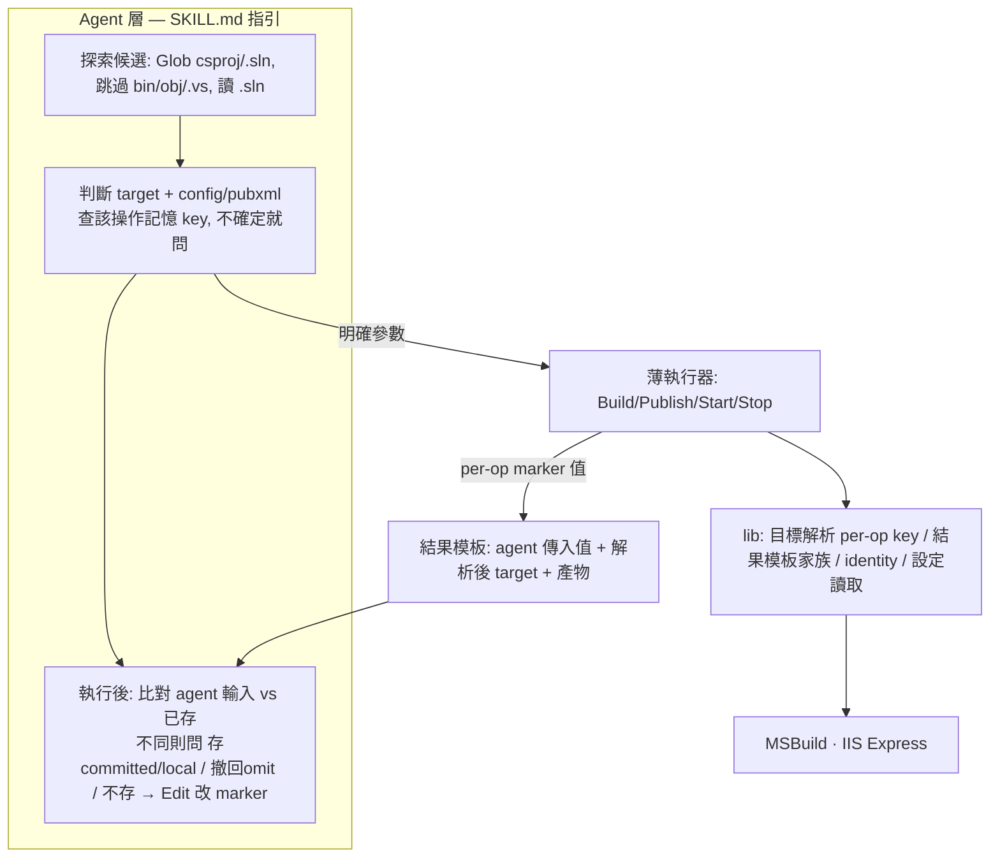

# feat: .NET 技能 csproj 化 — 給 agent 用的 VS 2022

## Summary

把 `turbo-plugin-dotnet-framework-web` 的 build / run / stop / publish 改成「給 agent 用的 VS 2022」：agent 決定要操作哪個 csproj / `.sln` 與 configuration / platform / pubxml，把明確參數傳給變薄的 executor；executor 對齊 VS——agent 沒指定的 config 一律**省略**、交給 MSBuild / `.sln` / `Directory.Build.props` 自行解析。選擇沿用既有的兩層設定查找（`config.toml` / `config.local.toml`）當記憶（**每個操作各自的 target key、向後相容既有 `[build].project`**）、執行後以 agent-Edit 存回；每次執行用 per-operation 固定模板回報 agent 傳入值 + script 解析/產出的具體產物（含實際 target）。`tp-cleanup-orphan-iis` 行為以「有 `-Project` 不變」為準，無-project 路徑因移除自動偵測而調整（見 KTD8）。

> **Target plugin:** `turbo-plugin-dotnet-framework-web`（本 repo 內）。以下所有路徑均相對該 plugin 目錄 `plugins/turbo-plugin-dotnet-framework-web/`，除非另行標明。

---

## Problem Frame

使用者專案普遍是「一個 `.sln` 多個 csproj」。現行要靠寫死 `[build].project` 或自動偵測單一 csproj 才知道操作哪個；多 csproj 時 `Find-SingleCsproj` 直接 throw，無法表達「這次要哪個」。原始「對齊 VS 2022」目標長期卡在「以為要在 script 裡重做 MSBuild 屬性求值」的誤解。Brainstorm（含兩輪 doc-review）已釐清：VS 做 build/run/publish 自己也沒展開求值，靠 MSBuild 內建預設 + 讀 `.sln` + publish 互動 + 讀 csproj XML；而現行 executor 之所以偏離 VS，是因為它**恆傳** `/p:Configuration=Debug`，反而壓過了 props 的條件式預設。

---

## Key Technical Decisions

- **KTD1 — agent 是腦、script 是薄執行器。** 「要操作哪個專案、用什麼 config/pubxml」的判斷寫在 SKILL.md 給 agent，不寫進 script。script 只依收到的明確參數呼叫 MSBuild / IIS Express，不做 MSBuild 屬性求值、不展開 Import 鏈（see origin: Key Decisions）。
- **KTD2 — executor「無值才省略」config；可存可撤。** executor 對 configuration/platform 區分兩態：**有值**（CLI 或 config 記憶）→ 附 `/p:`；**無值** → 不附，讓 MSBuild / `.sln` / `Directory.Build.props` 自行解析。現行 `Build-Web.ps1:30` 把空字串 fallback 成 Debug 再恆傳、壓過 props 的 `Condition="'$(Configuration)'==''"` 預設，必須改成「真的沒值就略過」。**save-back 不只能存值、也能撤回到 omit**：存回選項含「回到 omit（讓 MSBuild 決定）」＝刪掉該 key，避免「存過一次就永遠附 `/p:`、回不去 VS 對齊」的單向陷阱。save-back 也不主動存 agent 省略掉的 config。
- **KTD3 — 一律明確 target，移除自動偵測。** 移除 `Find-SingleCsproj`（`Common.ps1:107-130`）的「掃 repo 自動取單一 csproj」與「多個就 throw」；executor 要求明確 target，解析鏈為 `CLI 參數 → 該操作的 config 記憶 key → 清楚報錯`。target 的探索與抉擇全交給 agent（SKILL.md 指引：Glob `*.csproj`/`*.sln`、跳過 bin/obj/node_modules/.vs/.git、讀 `.sln`、查記憶、不確定就問）。caller 全遷移見 U1。
- **KTD4 — 兩層記憶＝既有設定查找，按操作分 key，向後相容，存回走 agent-Edit。** 讀取沿用既有 `Resolve-ConfigValue`（`Core.ps1:213-236`，已支援任意 `-Section`）的 `CLI → config.toml → config.local.toml → 預設` 四層（local 蓋 committed）。**每個操作讀/寫自己的 target key、存回與讀回同一 key**：build → `[build].project`（可為 `.sln`）、run/stop → `[run].project`、publish → `[publish].project`。**向後相容**：run/stop 讀 `[run].project` 無值時 fallback 讀既有 `[build].project`（既有使用者不 break），save-back 之後寫 `[run].project`、CHANGELOG 標明 key 遷移。configuration/platform 用 `[build].configuration/.platform`、pubxml 用 `[publish].default_pubxml`。解析器須 thread「操作/section」參數。不另開命名空間、不分「使用者設的」與「agent 記的」——記憶有值即明示選擇（KTD2 會附並回報）。存回 agent-Edit 規則見 U8。
- **KTD5 — per-operation 結果模板家族，含解析後 target。** 把現有 `Get-PublishOutputLines` / `PUBLISH_OUTPUT` marker（`Common.ps1:141-161`）一般化成 marker 家族（`BUILD_OUTPUT` / `RUN_OUTPUT` / `PUBLISH_OUTPUT` / `STOP_OUTPUT`）。回報 **agent 傳入值 + script 解析/產出的具體產物**——含 **executor 實際解析出的 target 路徑**（不論來自 CLI 或記憶，是 script 產物、非 MSBuild 求值）、發佈路徑、web URL、停的站台。**不**假裝 parse MSBuild 求值後的有效 config。回報實際 target 是糾錯閘關鍵（agent 省略 `-Project`、target 由記憶解析時，使用者才看得到實際建/跑了哪個）。**注意**：`.sln` build（KTD7 預設）的糾錯閘較弱——只能回報 `.sln` 路徑、無法逐專案；夠抓「選錯 solution」、抓不到「solution 內某專案 config 異常」（per-project 細節列 Open Questions）。
- **KTD6 — config 語意與存回按操作分。** build 帶 config（無值則省略，KTD2）；publish 以 pubxml 內嵌值為準、agent 預設不另傳 `/p:Configuration`；run 不涉 config（serve 上次 build 產物）；stop 最小回報、不觸發 save-back。save-back 只比對「agent 實際選定的輸入」、不比對 MSBuild 解析值、也不存 agent 省略掉的 config。
- **KTD7 — build 預設整個方案；`.sln` 僅 build 合法。** build 不指名時建整個 `.sln`（executor 接受 `.sln`，`SolutionDir` 由 `.sln` 所在目錄推導、保留結尾分隔符以符 `$(SolutionDir)` 慣例）；context 明顯單一時建單一 csproj，由 agent 判斷。**`.sln` 只對 build 合法**：run/stop/publish 的 target 必須是 csproj（讀 csproj XML / identity），收到 `.sln` 清楚報錯（U1 型別判別）。
- **KTD8 — `tp-cleanup-orphan-iis`：有 `-Project` 行為不變、無-project 路徑重整且不傷活站台。** 現行 `Remove-OrphanIis.ps1:19` 從 `Resolve-IisSettings -Project ''` **同時**取得「比對用的 csproj stem」與「要排除的目前站台」。移除自動偵測後無-project 會 throw（主入口壞掉），故無-project 路徑須重整：(a) **不呼叫 `Resolve-IisSettings`**，改用**通用** turbo-plugin 站台樣式 `^.+-[0-9a-f]{8}$` 比對（不綁單一 stem）；(b) **不傷活站台**——cleanup SKILL 指引 agent 在有當前專案時傳 `-Project` 以排除其站台；真正無-project（無當前專案）時改為**列舉但標示/不 blanket 殺**（保留既有 `AskUserQuestion` 多選確認，無-project 時不提供「全部清除」一鍵或先警示）。有 `-Project` 的行為與既有完全一致。屬最小但**確實有使用者可見差異**的調整，含於 U1。

---

## High-Level Technical Design

**分層**：判斷（agent / SKILL.md）↔ 薄執行（scripts）↔ 共用工具（lib）↔ 工具鏈（MSBuild / IIS Express）。



**參數解析 + 存回流程**（config 區分「無值省略」與「有值附上」；target 一律明確；run/stop fallback `[build].project`；run/stop/publish 拒 `.sln`）：

```mermaid
flowchart TB
  Need[需要某參數] --> CLI{CLI 有傳?}
  CLI -->|是| Use[採用 = 明示選擇]
  CLI -->|否| Mem{該操作記憶 key 有值?<br/>run/stop 無則 fallback [build].project}
  Mem -->|是, 驗證通過| Use
  Mem -->|否, 是 target| AgentT{agent 判斷}
  AgentT -->|唯一/已決| Use
  AgentT -->|多個合理| Ask[詢問使用者]
  Mem -->|否, 是 config| Omit[省略該參數<br/>交 MSBuild/.sln/props]
  Ask --> Use
  Use --> Exec[script 執行]
  Omit --> Exec
  Exec --> Tpl[per-op 模板: agent 傳入值 + 解析後 target + 產物]
  Tpl --> Diff{agent 選定輸入 != 已存?}
  Diff -->|是| Save[問: 存 committed/local / 撤回 omit / 不存 → agent-Edit 寫/刪該操作 key]
  Diff -->|否| Done[結束]
  Save --> Done
```

> 圖為設計方向；prose 與各 Implementation Unit 為準。stop 不進 save-back。

---

## Requirements Trace

origin（`docs/brainstorms/2026-06-22-dotnet-csproj-agent-vs2022-requirements.md`）的 R1–R16 對應到本計畫：

- R1, R3, R5（agent 判斷 csproj、優先序、多選須問不 throw）→ U1（解析）+ U6/U7（SKILL 指引）
- R2, R4（agent 判斷 config/platform/pubxml、薄執行器不求值、publish 以 pubxml 為準）→ U3/U4 + U6
- R6, R7, R8, R9, R11（兩層記憶、tp-setup 不寫、粒度、提示非權威、三去向）→ U8 + U6/U7（save-back 內嵌）+ 設定範本（U8）
- R10（save-back 只比對 agent 選定輸入、不比對 MSBuild 解析值）→ KTD6 + U8 的比對規則
- R12（per-operation 結果模板、含解析後 target）→ U2 + 各 executor U3/U4/U5
- R13（build 整方案 / 單一、executor 收 .sln、SolutionDir 由 .sln 推導）→ U1 + U3
- R14（run/publish 單一目標、併發可行）→ U4（publish）+ U5（run）+ U6/U7
- R15（stop 用 identity 解析、無 last-run 狀態）→ U5 + U7
- R16（cleanup：有 -Project 行為不變）→ KTD8（無-project 路徑重整，含於 U1）

---

## Implementation Units

### Phase A — 共用工具層（lib）

### U1. 目標解析改寫：移除自動偵測、per-op key（含向後相容）、`.sln` 型別判別、caller 全遷移

- **Goal**：實作 KTD3/KTD4/KTD7/KTD8 的解析半——移除 `Find-SingleCsproj` 自動偵測與多個-throw；改吃明確 target，解析鏈 `CLI → 該操作 config key（run/stop fallback [build].project）→ 清楚報錯`；thread 操作/section；`.sln` 僅 build 合法、其餘 caller 收 `.sln` 報錯；遷移**所有** caller；重整 cleanup 無-project 路徑（通用樣式、不傷活站台）。
- **Requirements**：R1, R3, R5, R13；R16（cleanup 無-project 路徑重整）。
- **Dependencies**：無。
- **Files**：
  - `scripts/lib/Common.ps1`（`Find-SingleCsproj`：移除自動偵測/throw、加操作 section 參數、回傳型別含 csproj-vs-.sln 判別；現行硬寫 `-Section 'build'` 於 `Common.ps1:112` 是精確改點）
  - `scripts/lib/IisHelpers.ps1`（`Resolve-IisSettings`：吃明確 project、section=run、收 `.sln` 報錯）
  - `scripts/Get-TargetUrl.ps1`、`scripts/Test-IisListening.ps1`（**經 `Resolve-IisSettings`**，遷移明確 project）
  - `scripts/Get-ProjectIdentity.ps1`（**直呼 `Find-SingleCsproj`**，非 Resolve-IisSettings；自己 thread section=run/per-csproj、自己拒 `.sln`）
  - `scripts/Remove-OrphanIis.ps1`（cleanup 無-project：略過 `Resolve-IisSettings`、用通用樣式 `^.+-[0-9a-f]{8}$`、不傷活站台；有 `-Project` 行為不變；KTD8）
  - 測試（PascalCase `.ps1` / 小寫 `.sh`）：`tests/unit/scripts/lib/Common.test.ps1`、`tests/unit/scripts/lib/IisHelpers.test.ps1`、`tests/unit/scripts/Get-ProjectIdentity.test.ps1`、`Get-TargetUrl.test.ps1`、`Test-IisListening.test.ps1`、`Remove-OrphanIis.test.ps1`（+ 各 `*.test.sh`）
- **Approach**：解析 `明確 CLI -Project/-Solution → 該操作 config key（build→[build].project；run/stop→[run].project，無值 fallback [build].project；publish→[publish].project）→ 清楚報錯`。`Resolve-ConfigValue` 已支援 `-Section`，thread section 不需改它。保留正規化（`Get-NormalizedAbsolutePath`）與 bin/obj/.vs 排除知識給驗證；候選列舉交 agent。回傳值分辨 csproj vs `.sln`；`Resolve-IisSettings` 等收 `.sln` 報錯。`Remove-OrphanIis` 無-project 改通用樣式、不取單一 stem、不做目前站台排除但**不 blanket 殺活站台**（見 KTD8）。**內部排序**：先落地 resolver + section + `.sln` 判別、把機械 caller 跑綠，再套 `Remove-OrphanIis` 的語意變更（單獨驗證）。
- **Patterns to follow**：`Resolve-ConfigValue`（多傳 section）；`Get-ProjectIdentityHash`（identity 不變，per-csproj）。
- **Test scenarios**：
  - 明確 `-Project` csproj → 回該路徑、型別=csproj；`.sln` → 型別=方案。
  - build 無 CLI 但 `[build].project` 有值 → 用之；run 無 CLI、`[run].project` 無但 `[build].project` 有 → **fallback 用之（向後相容）**；run `[run].project` 有 → 用之。
  - 無 CLI 且該操作 key（含 fallback）無值 → 清楚錯誤。
  - 多 csproj 未指定 → **不再 throw「multiple found」**。
  - `Resolve-IisSettings` 收 csproj → site/port；收 `.sln` → 報錯。`Get-ProjectIdentity` 收 `.sln` → 報錯。
  - `Get-TargetUrl`/`Test-IisListening` 帶明確 project → 正常；無 project 無記憶 → 清楚錯誤。
  - `Remove-OrphanIis` 無 `-Project` → 用通用樣式列舉、**不殺**未經選擇的站台、活站台被標示/不被 blanket 清；有 `-Project` → 排除該專案站台（既有行為）。
- **Verification**：lib + 各 caller 測試綠；既有依賴自動偵測的測試已遷移（見 U9）；Pester + shunit2 綠。

### U2. per-operation 結果模板家族（回值、executor 印；含解析後 target）

- **Goal**：實作 KTD5——把 `Get-PublishOutputLines` 一般化為 marker 家族**值計算 helper**，回報 agent 傳入值 + 解析後 target + 產物。
- **Requirements**：R12。
- **Dependencies**：無（與 U1 平行）。
- **Files**：`scripts/lib/Common.ps1`（helper）；`tests/unit/scripts/lib/Common.test.ps1` + `.test.sh`（或由各 executor 測試覆蓋）。
- **Approach**：沿用現有契約——**helper 只算值、marker 與各行由 executor inline 印**（現行 `PUBLISH_OUTPUT` 即 `Publish-Web.ps1` inline 印、`Get-PublishOutputLines` 只回值；保持「逐字、各自成行、無結尾標點」）。欄位按操作：build＝**解析後 target** + configuration/platform（有值才列、未指定標「由 MSBuild/solution 決定」）+ 成敗（`.sln` build 只列 `.sln` 路徑，糾錯閘較弱，見 KTD5 / Open Questions）；run＝解析後 target + web URL + 成敗；publish＝解析後 target + pubxml + 發佈輸出路徑 + 成敗；stop＝停的站台/csproj。
- **Patterns to follow**：`Common.ps1:141-161` `Get-PublishOutputLines`（回值、不印；FileSystem/非 FileSystem 分支）；`Publish-Web.ps1:109-128`（marker inline 印）。
- **Test scenarios**：
  - build 模板：有/無明確 config；含解析後 target 行（即使 target 來自記憶）。
  - publish 模板：保留既有兩行（路徑 + URL）回歸不破、無結尾標點。
  - run 模板：含 web URL、無 configuration、含解析後 target。
  - stop 模板：回報站台名。
- **Verification**：模板回歸測試綠；既有 publish 兩行格式測試不變。

### Phase B — 薄執行器（邏輯在 `.ps1`；`.sh` 為 `ps1-delegate.sh` 薄轉呼叫，不需改）

### U3. Build-Web：接受 .sln/.csproj、無值才省略 config、SolutionDir、BUILD 模板

- **Goal**：實作 KTD2 + KTD7——build 接受 `.sln` 或 csproj；config 有值（CLI 或 `[build]` 記憶）才附 `/p:`、無值省略；`.sln` 時 `SolutionDir` 由 `.sln` 目錄推導且保留結尾分隔符；輸出 BUILD 模板（含解析後 target）。
- **Requirements**：R2, R4, R12, R13。
- **Dependencies**：U1, U2。
- **Files**：`scripts/Build-Web.ps1`；`tests/unit/scripts/Build-Web.test.ps1` + `build-web.test.sh`。（`build-web.sh` delegator 不變。）
- **Approach**：移除「空字串就補 Debug/AnyCPU 再恆傳」（`Build-Web.ps1:24-25,30`）——值來自 CLI 或 `[build].configuration/.platform` 才附 `/p:`、否則略過。target 經 U1（section=build，可 `.sln`）。`.sln` 走方案建置、`SolutionDir` 取 `.sln` 目錄並沿用既有 `TrimEnd('\') + '\'`（`Build-Web.ps1:27`）結尾分隔符；csproj 走單檔。沿用 `Find-MSBuild`、`/restore /t:Build`、frontend `Compress-Content` 後步。
- **Patterns to follow**：`Build-Web.ps1:27`（SolutionDir 結尾）、`:30`（MSBuild 叫法）。
- **Test scenarios**：
  - `-Configuration Release` → args 含 `/p:Configuration=Release`。
  - 不傳 config 且 `[build]` 無記憶 → args **不含** `/p:Configuration|Platform`（核心回歸）。
  - `[build].configuration=Release` 在 config（無 CLI）→ args **含**（記憶=明示選擇）。
  - 傳 `.sln` → 建方案、`/p:SolutionDir` 指向 `.sln` 目錄且結尾帶分隔符。
  - 傳 csproj → 建單檔。
  - 無 target 且 `[build].project` 無值 → 清楚錯誤。
  - frontend 設定有/無 → 觸發/略過 `Compress-Content`。
  - BUILD 模板含解析後 target + 成敗。
- **Verification**：build 測試綠；移除/改寫原斷言「預設 Debug / `bin\Debug`」測試（見 U9）。

### U4. Publish-Web：明確 csproj target、pubxml 主導 config、PUBLISH 模板

- **Goal**：實作 KTD6 publish 半——明確 csproj target（讀/寫 `[publish].project`、拒 `.sln`）；configuration 以 pubxml 為準、預設不另傳 `/p:Configuration`；對齊家族（保留既有兩行）。
- **Requirements**：R2, R4, R12, R14。
- **Dependencies**：U1, U2。
- **Files**：`scripts/Publish-Web.ps1`；`tests/unit/scripts/Publish-Web.test.ps1` + `publish-web.test.sh`。（`publish-web.sh` delegator 不變。）
- **Approach**：target 經 U1（section=publish，讀 `[publish].project`，**不與 build 共用**，避免 build 的 `.sln` 選擇指歪 publish；收 `.sln` 報錯）。移除「恆附 `/p:Configuration`（預設 Release）」——精確改點 `Publish-Web.ps1:49`（Default `'Release'`）與 `:50`（`'Any CPU'`），改成只有 agent 明確傳才附、否則由 pubxml 內嵌 `<Configuration>` 決定。pubxml 解析維持現有（0/1/>1 行為）。沿用 `/p:DeployOnBuild=true /p:PublishProfile=` 與 `Get-PublishOutputLines` 兩行。
- **Patterns to follow**：`Publish-Web.ps1:49-50`（config default 移除點）、`:109-128`（兩行 inline 印）。
- **Test scenarios**：
  - 不傳 `-Configuration` → args **不含** `/p:Configuration`（pubxml 主導）；傳則含。
  - 收 `.sln` → 報錯。
  - 0 / 1 / >1 pubxml：0 預設、1 直接用、>1 由上層指定。
  - PUBLISH 兩行回歸不破、無結尾標點。
- **Verification**：publish 測試綠；missing-pubxml case 改先傳明確 csproj（見 U9）。

### U5. Start-Iis / Stop-Iis：明確 csproj、run 無 config、stop 回報站台

- **Goal**：實作 KTD6 run/stop 半 + KTD7——run/stop 吃明確 csproj（U1 `Resolve-IisSettings`，section=run，讀 `[run].project` fallback `[build].project`，拒 `.sln`）；run 不涉 config；stop 回報站台、不 save-back；RUN/STOP 模板。
- **Requirements**：R12, R14, R15。
- **Dependencies**：U1, U2。
- **Files**：`scripts/Start-Iis.ps1`、`scripts/Stop-Iis.ps1`；`tests/unit/scripts/Start-Iis.test.ps1`/`Stop-Iis.test.ps1` + `start-iis.test.sh`/`stop-iis.test.sh`。（`.sh` delegator 不變。）
- **Approach**：identity / site-name / port / 跨 worktree self-heal **不變**（per-csproj、天生併發各自站台）。改動限於：吃明確 csproj（U1，收 `.sln` 報錯）、RUN 模板（解析後 target + web URL）/ STOP 模板（停的站台）。stop 維持 idempotent + orphan 提示。
- **Patterns to follow**：`Start-Iis.ps1:13-50`（self-heal）、`Stop-Iis.ps1` site 比對與 temp config 清理。
- **Test scenarios**：
  - run 帶 csproj → site/port、RUN 模板含 web URL、無 configuration、含解析後 target。
  - 兩個不同 csproj 各自 run → 兩站台共存（R14）。
  - run/stop 收 `.sln` → 報錯。
  - stop 帶 csproj → 停站台、STOP 模板；無對應 process → exit 0 + orphan 提示。
  - run/stop 無 csproj、`[run].project`/`[build].project` 皆無 → 清楚錯誤。
- **Verification**：start/stop 測試綠；self-heal、idempotent、orphan 提示不破。

### Phase C — 技能層（agent 判斷指引；SKILL.md markdown）

### U6. build / publish SKILL 改寫：探索、判斷、省略、詢問、回報、存回

- **Goal**：實作 KTD1/2/3/6/7 在 agent 端，含 save-back——build/publish skill 指引 agent 探索候選、查該操作記憶 key、判斷 target 與 config/pubxml、不確定就問、傳明確參數、relay 模板、執行後跑 save-back（讀 U8 共用片段）。
- **Requirements**：R1, R2, R3, R5, R6, R8, R9, R10, R11, R13, R14。
- **Dependencies**：U3, U4, U8。
- **Files**：`skills/tp-build-dotnet-framework-web/SKILL.md`、`skills/tp-publish-dotnet-framework-web/SKILL.md`。
- **Approach**：改寫 Procedure：目標探索與抉擇（多 csproj 依記憶/context，無從判斷 `AskUserQuestion`）；config 預設「不指定、交 MSBuild」；build 預設整方案、context 明顯單一才建單一；publish 以 pubxml 為準、target 讀 `[publish].project`。保留 Step 0 `[iis] enabled`。結尾 relay U2 模板。**save-back 段落以 prose 指引 agent「讀並遵循 `${CLAUDE_PLUGIN_ROOT}/.../memory-save-back.md`」**（比照 tp-setup→setup-base 的 read-the-file 慣例，見 U8），不在 SKILL 內重抄。
- **Execution note**：無（SKILL markdown）。
- **Test scenarios**：`Test expectation: none` —— SKILL 為 agent 指引 markdown，無自動化 script 測試；以實際 session 安裝執行臨機驗證（repo CLAUDE.md 測試標準）。
- **Verification**：人讀一致性 + 實際 session 跑 build/publish（多 csproj 判斷、省略 config、多 pubxml 詢問、模板回報含實際 target、save-back 寫對 key、撤回 omit 可行）。

### U7. run / stop SKILL 改寫：探索、判斷、run 無 config/有 save-back、stop 無 save-back

- **Goal**：run/stop skill 指引 agent 判斷 csproj、傳明確參數、relay 模板；run 不涉 config 但 save-back target（`[run].project`）；stop 不 save-back。
- **Requirements**：R1, R3, R5, R10, R11, R14, R15。
- **Dependencies**：U5, U8。
- **Files**：`skills/tp-run-dotnet-framework-web/SKILL.md`、`skills/tp-stop-dotnet-framework-web/SKILL.md`。
- **Approach**：目標探索/抉擇同 U6；run relay RUN 模板、不存 config、執行後 save-back target（讀 U8 片段）；stop relay STOP 模板、**不**進 save-back。保留 Step 0、orphan 提示。
- **Execution note**：無。
- **Test scenarios**：`Test expectation: none`（SKILL 指引，臨機 session 驗證）。
- **Verification**：實際 session 跑 run/stop（多 web 判斷、併發各自站台、stop 回報、run save-back `[run].project`、stop 無 save-back）。

### U8. 記憶與 save-back 共用片段 + 設定範本 + agent-Edit 規則

- **Goal**：實作 KTD2/KTD4/KTD6 存回半——把 save-back 規則寫成**共用片段**（U6/U7 以 read-the-file 引用，先於 U6/U7 完成）；修正 tp-setup 範例位置與 seed。
- **Requirements**：R6, R7, R8, R9, R10, R11。
- **Dependencies**：U1。
- **Files**：
  - 共用片段：比照 tp-setup `setup-base.md` 的既有共用 asset 慣例放置（如 `skills/<某 skill>/assets/memory-save-back.md`；確切位置見 Open Questions）。**機制＝read-the-file**：U6/U7 SKILL 以 prose 指 agent 讀 `${CLAUDE_PLUGIN_ROOT}/...` 該檔並遵循（無 compile-time include；比照 `tp-setup/SKILL.md:16` → `setup-base.md`）。
  - **tp-setup（範例 seed）**：範例註解寫在 **`skills/tp-setup/SKILL.md` 的 dotnet heredoc**（`# >>> turbo-plugin:dotnet >>>` 例區塊，已有 `# project = "..."` 於 `[build]`、`# [run]` 但缺 `.project`）：補 `# project = "..."` 於 `[run]`、補 `# [publish]` 的 `# project`。**勿寫進 `setup-base.md`**（那是三 plugin 共用 concern-neutral base，會污染 git-svn/db）。tp-setup 同時 seed `[build]/[run]/[publish]` 的 section header（即使註解），讓 save-back 變「就地填既有 section」而非冷合成 header。**不**自動寫入選項值，維持 R7。
  - `default-files/.turbo-plugin/config.toml`：dotnet marker 維持空（範例由 tp-setup 寫入使用者專案）。
- **Approach**：讀取沿用 `Resolve-ConfigValue`（多傳 section、run/stop fallback `[build].project`）。save-back 比對「agent 該次選定輸入」（該操作 target、明確選的 config/platform、pubxml）vs 已存（含記憶為空首次、含明示預設值——嚴格版；不存省略的 config），不同就 `AskUserQuestion` 問**四去向：存 committed / 存 local / 撤回 omit（刪 key）/ 不存**。**agent-Edit 規則（讀-改-寫）**：在 marker 內找既有 `[section]` + key → 就地取代/刪除；無 section（冷啟動）→ 依 tp-setup seed 的 section header 填入；**key 一律落在對應 `[section]` header 之下、marker 之內**（避免 flat reader 把 header 前的 key 綁到空 section）。**跨檔一致**：存 committed 時若 `config.local.toml` 有同 key 影子值（local 蓋 committed），須一併清除/警示，否則下次仍讀舊值、重問迴圈。記憶為提示非權威：沿用前 agent 驗證 csproj/pubxml 仍在，失效則重判/問。
- **Execution note**：無。
- **Test scenarios**：`Test expectation: none`（指引/範本；臨機 session 驗證）。範本/結構檢查（marker 存在、tp-setup seed 含 `[run].project`、agent-Edit 後 key 落在正確 section header 下且在 marker 內、存 committed 後 local 無影子）歸 U9。
- **Verification**：實際 session：首次操作觸發存回；二次沿用不重問；撤回 omit 後 build 回到不附 `/p:`；記憶失效→重判；committed/local 寫對檔、無影子重問；多次 save-back 各寫各自 key、key 在正確 section 內。

### Phase D — 測試、文件、版本

### U9. 測試修訂與新增

- **Goal**：修所有依賴舊行為的測試；新增多 csproj、`.sln`、無值省略-config、明確-target、per-op key（含 fallback）、解析後 target、`.sln`-拒、cleanup 無-project 通用樣式/不傷活站台。
- **Requirements**：對應 U1–U5、U8 行為。
- **Dependencies**：U1, U2, U3, U4, U5, U8。
- **Files**（PascalCase `.ps1` / 小寫 `.sh`）：`tests/unit/scripts/Build-Web.test.ps1`/`build-web.test.sh`、`Publish-Web.test.*`、`Start-Iis.test.*`/`Stop-Iis.test.*`、`Get-ProjectIdentity.test.*`、`Get-TargetUrl.test.*`、`Test-IisListening.test.*`、`Remove-OrphanIis.test.*`、`tests/unit/scripts/lib/Common.test.ps1`、`tests/unit/scripts/lib/IisHelpers.test.ps1`；fixtures 於 `tests/fixtures/`（多 csproj + 一個 `.sln`，repo 相對 sandbox、無機器路徑）。
- **Approach**：依各 unit scenarios 落實。**已知需遷移的既有斷言**：`Common.test.ps1` 的「multiple/zero .csproj → throw」（U1 移除）；`IisHelpers.test.ps1` 無-project `Resolve-IisSettings` cases（改傳明確 project）；`Publish-Web.test.ps1` missing-pubxml case（改先傳明確 csproj）；`Build-Web.test.ps1` 的預設 Debug/`bin\Debug` 斷言（改為「無值即不附」）。新增多 csproj + `.sln` fixture、per-op key fallback、save-back marker 結構檢查、cleanup 無-project 不傷活站台。
- **Execution note**：`Execution note: U3/U4 的「無值省略 config」「明確 target」「.sln 型別」與 U1 cleanup 語意屬行為變更，先寫失敗測試再改。`
- **Test scenarios**：本 unit 即測試本體（見 U1–U5 各自 scenarios）。額外：`.sln` fixture 下 SolutionDir 正確且 run/stop/publish 拒；缺 MSBuild/IIS runner 自我 SKIP（CI 綠）。
- **Verification**：Pester + shunit2 全綠；無 SKIP 誤判 FAIL；零 sandbox 外殘留。

### U10. README / CHANGELOG / 版本 bump

- **Goal**：minor bump、文件同步、**標明 key 遷移與 cleanup 行為差異**。
- **Requirements**：repo 版控規約。
- **Dependencies**：U1–U9。
- **Files**：`.claude-plugin/plugin.json`（`0.1.0 → 0.2.0`）、`CHANGELOG.md`（`[Unreleased]` 下新增 `0.2.0`，繁中、Added/Changed/Fixed/Removed；**Changed 標明 run/stop 記憶 key 由 `[build].project` 遷移為 `[run].project`（有 fallback）**、**cleanup 無-project 行為差異**）、`README.md`（skill 行為：agent 判斷 target/config、無值省略、per-op 記憶 key 與 save-back、per-op 模板含實際 target）。
- **Approach**：依 repo CLAUDE.md 版控規則同步 plugin.json + CHANGELOG；README 更新 Skills/設定段落。
- **Test scenarios**：`Test expectation: none -- 純文件/版本 metadata`。
- **Verification**：plugin.json 版本與 CHANGELOG 區段一致；README 與新行為相符。

---

## Scope Boundaries

- 不重做 MSBuild 屬性求值引擎（不展開 Import 鏈 / `Directory.Build.props` 求值）。
- 不讀 VS 的 `.suo`；以既有兩層設定查找為記憶。
- 不重新實作 solution build 編排（交 MSBuild 處理 `.sln`）。
- class library 等非 web 專案只隨方案被 build，不納入 run/publish 目標。
- `tp-cleanup-orphan-iis` 有 `-Project` 行為不變（無-project 路徑重整見 KTD8）；`Compress-Content`（frontend pack）、跨 worktree IIS identity/self-heal 不在變更範圍。

### Deferred to Follow-Up Work

- 用 `-getProperty`（VS2022 17.8+，舊版 fallback）讓模板回報 MSBuild **求值後**有效 config——選配增強。
- 兩個 csproj 宣告同一 port 的併發 run 衝突處理——edge case。

---

## Risks & Dependencies

- **行為變更回歸（範圍廣）**：移除自動偵測 + 無值省略 config 讓多支測試紅——U9 已列遷移清單（Common throw 斷言、IisHelpers 無-project、Publish missing-pubxml、Build Debug 斷言）。
- **向後相容（run/stop key 遷移）**：既有使用者用 `[build].project` 驅動 run/stop——靠 KTD4 的 fallback 不 break；CHANGELOG（U10）標明遷移。
- **cleanup 不傷活站台**：無-project 路徑移除目前站台排除——靠 KTD8 的「通用樣式 + 不 blanket 殺 + agent 傳當前 project」保護；U9 加「不傷活站台」測試。
- **記憶 key 讀寫對齊 + 跨檔影子**：save-back 寫的 key 必須 == 下次讀的 key（per-op section）、且存 committed 要清 local 影子——U1 thread section + U8 規則 + U9 結構/影子測試把關。
- **空 marker 冷啟動**：save-back 要在正確 `[section]` 下填 key——靠 tp-setup seed section header（U8）+ U9 結構檢查降風險；最終實際 session 驗證。
- **`.sln` 流向**：`.sln` 僅 build 合法——U1 型別判別 + 各 caller 報錯；另須查 `[build].project` 的其它 reader（frontend/Compress-Content 等）是否容忍 `.sln`（見 Open Questions）。
- **`.sln` 的 `SolutionDir`**：非根 `.sln` 由 `.sln` 目錄推導、保留結尾分隔符（`Build-Web.ps1:27`）。
- **save-back agent-Edit 可靠性**：非 script-deterministic；靠 U8 讀-改-寫規則 + U9 結構檢查 + 實際 session 驗證。
- **PS 5.1 相容**：守五禁忌（非 ASCII 需 BOM、native exe `2>&1` 禁、3 參數 `Join-Path` 禁、單元素 pipeline `.Count` 需 `@()`、無 `GetRelativePath`）；tp-setup 寫中文註解進 config.toml，save-back agent-Edit 須保留 BOM 狀態——repo CLAUDE.md 規則。
- **依賴既有 lib**：`Resolve-ConfigValue`（讀，已支援 section）、`Get-ProjectIdentityHash`、`Get-PublishOutputLines`（回值）沿用、不重寫。

---

## Open Questions（Deferred to Implementation）

- csproj target（非 `.sln`）建置時 `SolutionDir` 取 repo 根或該 csproj 對應 solution 目錄。
- `[build].project` 存 `.sln` 時，其它讀 `[build].project` 的 path（frontend/`Compress-Content` 的專案目錄推導等）是否容忍 `.sln`——實作時逐一查；必要時改存 `[build].solution` 別 key。
- `.sln` build 的糾錯閘最小可用訊號：只 `.sln` 路徑，或加 MSBuild 回報的專案數/名——影響 U2 模板欄位設計。
- 共用 save-back 片段確切放置（既有 asset 慣例下哪個目錄）；read-the-file 引用方式不變。
- per-op 模板 marker 精確字串/欄位排版（與既有 `PUBLISH_OUTPUT` 兩行契約相容、可被 agent 解析）。
- 記憶驗證深度（R9）：只查檔在不在，或也比對 pubxml profile 仍在 `PublishProfiles/`。
- cleanup 無-project 的 `-RemoveAll` 語意：是否一律改成逐站台確認（不提供無-project 一鍵全清）以補償失去的目前站台排除。

---

## Sources & Research

- Origin requirements：`docs/brainstorms/2026-06-22-dotnet-csproj-agent-vs2022-requirements.md`（含兩輪 ce-doc-review 修正）。
- 現況事實（plugin 結構掃描 + 兩輪 doc-review feasibility/adversarial 讀碼、已直接覆核）：
  - `scripts/lib/Common.ps1`：`Find-SingleCsproj`（L107-130；`:112` 硬寫 `-Section 'build'` 是 per-op key 精確改點；多個 throw）、`Get-PublishOutputLines`（L141-161，回值不印）、`Get-ProjectIdentityHash`（L16-40）。
  - `scripts/lib/Core.ps1`：`Read-TurboPluginConfig`（L174-202，flat、key 須在 `[section]` 下否則綁空 section；不支援陣列/巢狀）、`Resolve-ConfigValue`（L213-236，已支援任意 `-Section`，merge config.toml→config.local.toml、local 蓋 committed）。
  - `scripts/lib/IisHelpers.ps1`：`Resolve-IisSettings`（L81-141，呼叫 `Find-SingleCsproj`、算 site/port、讀 csproj XML 取 `<IISUrl>`）。
  - `Resolve-IisSettings` caller：`Start-Iis.ps1`、`Stop-Iis.ps1`、`Get-TargetUrl.ps1:12`、`Test-IisListening.ps1:12`、`Remove-OrphanIis.ps1:19`。**`Get-ProjectIdentity.ps1:19` 直呼 `Find-SingleCsproj`**（非 Resolve-IisSettings）。
  - `scripts/Build-Web.ps1:24-25`（config 空字串 fallback Debug/AnyCPU）、`:27`（`SolutionDir = $repoRoot.TrimEnd('\')+'\'`）、`:30`（恆傳 `/p:Configuration /p:Platform`，須改無值省略）。
  - `scripts/Publish-Web.ps1:49-50`（config Default `'Release'`/`'Any CPU'`，須移除使 pubxml 主導）、`:109-128`（`PUBLISH_OUTPUT` marker inline 印）。
  - `scripts/Remove-OrphanIis.ps1:19,21,34`（從 `Resolve-IisSettings -Project ''` 取 stem 與 currentSiteName 做比對/排除）、`:111`（`-RemoveAll` Stop-Process）、`:53-83`（temp-file 清理，獨立於 csproj 解析，勿過度遷移）。
  - `.sh` executor 經 `scripts/lib/ps1-delegate.sh` 薄轉呼叫 `.ps1`（`"$@"` 直通；邏輯改 `.ps1`、delegator 不動）。
  - **設定範本 `default-files/.turbo-plugin/config.toml`：dotnet marker 區塊是空的**；`[build]/[publish]/[run]` 範例註解在 **`skills/tp-setup/SKILL.md` 的 dotnet heredoc**（`# [build]` 有 `# project=...`、`# [run]` 缺 `.project`），由 tp-setup 在 setup 時寫入使用者專案。`setup-base.md` 是三 plugin 共用 concern-neutral base（**不可**放 dotnet 範例）。無 config writer，tp-setup 以 agent Edit 寫。
  - 共用 asset 機制：read-the-file（`tp-setup/SKILL.md:16` prose 指 agent 讀 `setup-base.md`；無 compile-time include；base 檔三 plugin byte-identical 複製）。
  - 測試：`tests/Invoke-ScriptTests.ps1`（Pester gate）+ `tests/invoke-script-tests.sh`（shunit2）；script 測試 `tests/unit/scripts/*.test.ps1`（**PascalCase**，如 `Build-Web.test.ps1`）+ `*.test.sh`（小寫）；lib 測試在 `tests/unit/scripts/lib/`。既有待遷移斷言：`Common.test.ps1`「multiple .csproj→throw」、`IisHelpers.test.ps1` 無-project Resolve、`Publish-Web.test.ps1` missing-pubxml（依賴自動偵測）。
- MSBuild property precedence：命令列 `/p:Configuration` 為 global property，優先於 `Directory.Build.props` 的 `Condition="'$(Configuration)'==''"` 與 `.sln` solution-config——故「無值才省略」才能讓 props/.sln 生效（對齊 VS）。`-getProperty` 為 MSBuild 17.8+。
