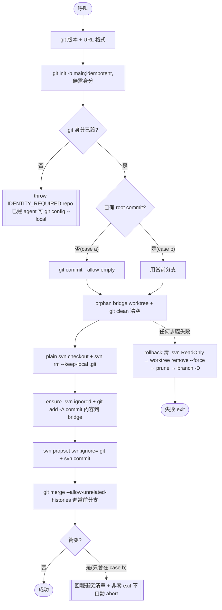

# feat: 把 git↔SVN bridge bootstrap 腳本化(tp-setup case (a)/(b))

## Summary

新增一支**可重入的固定腳本對** `Initialize-GitSvnBridge.ps1` + `initialize-git-svn-bridge.sh`,承接 tp-setup case (a)(新建)與 case (b)(接管既有 git+SVN)目前由 agent **逐條下** git/svn 指令的 bridge bootstrap 機械步驟。腳本走已實證的「**空 main 先行**」流程,把 SVN 內容 merge 進(case a 空的、case b 既有的)當前分支;agent 只保留收 SVN URL、收 git 身分、確認三件互動,base 骨架改在腳本跑完**後**疊上。含兩層測試。

---

## Problem Frame

case (a)/(b) 的 bridge bootstrap(`git init` → 初始 commit → orphan bridge worktree → `svn checkout` → 固定 `svn:ignore=.git` → `git merge` 進當前分支)目前寫成 SKILL agent-prose,由 agent 逐條執行。實測 agent 反覆出錯:`git checkout --orphan` 即使配 `--no-checkout` 仍把初始 commit 檔寫回 working tree、漏 `--force`、對**非空 SVN repo** 撞 `.gitignore`/`CLAUDE.md` tree conflict、rollback 的 `git worktree remove --force` 在 Windows `.svn` 唯讀檔上 Permission denied。這些全是無需 agent 判斷的確定性步驟,放在 agent 手上只是把確定性的事變不確定。

本 session(見 memory `project_git_svn_tp_setup_bootstrap`)已用沙盒實證一條零衝突的流程,並先以 5 顆 fix(`cf79d71` 等)緩解了 prose 版的最嚴重症狀。本計畫把該流程**固定成腳本**,從根本移除這類 agent 操作錯誤。case (b) 目前就是「跑 case (a) sub-step 6-7」共用同一段 prose,有完全相同的脆弱性,故一併納入。

---

## Key Technical Decisions

**KTD1 — 空 main 先行(已實證零衝突)。** 初始 commit 留空 → 先把 SVN 內容 merge 進「空 main」(空的一方無檔可撞 → 零衝突,main 直接變 SVN 內容)→ base 骨架後置疊上(append `.gitignore` / inject `CLAUDE.md` base 區塊 / 建 `.turbo-plugin/config.toml`,皆 idempotent 順序編輯,非 merge)。純「空祖先」不夠(兩邊各自 add 同名檔仍 add/add);關鍵是 **merge 進空 main + 骨架後置**。2026-06-29 沙盒實測 populated/空 SVN 皆零衝突。

**KTD2 — 單一腳本,case (a)/(b) 共用,依「是否已有 root commit」分流(非「`.git` 是否存在」)。** 腳本先 `git init -b main`(idempotent),再依是否已有 root commit 分流:無 root commit → `git commit --allow-empty`(case a);已有 root commit → 用當前分支(case b)。(用 root-commit 而非 `.git`,是因為身分 throw 後 `git init` 已把 `.git` 建出,`.git` 不再能區分 a/b;見 KTD3。)merge 階段:case (a) 進空 main → 必乾淨;case (b) 進**有內容**的當前分支 → **可能衝突** → 腳本回報衝突(結構化 token + 非零 exit),agent 照現行 case (b)「列衝突、不自動 abort、提示手動解」處理。

**KTD3 — 順序:`git init` → 身分檢查/throw → `git commit`;身分 throw 時 repo 已存在,agent 可寫 `--local`,設好後乾淨重跑。** 硬性順序(adversarial + feasibility review 一致):① **先 `git init -b main`**(idempotent、**無需身分**,且這步讓 throw 後 agent 的 `git config --local` 有 repo 可寫)② **再查 git 身分**(`git config user.name`/`user.email` 合併 local+global,任一空 → 印 `TP_TOKEN:IDENTITY_REQUIRED` + 非零 exit)③ **才 `git commit --allow-empty`**(永不在無身分下 commit——這是本決策真正要保證的:`git commit` 需要身分,`git init` 不需要)。**為何不是「身分先於所有 mutation」**:若身分檢查排在 `git init` 前就 throw,case (a)(全新、無 global 身分)下還沒有 `.git`,agent 的 `git config --local` 會失敗(需 repo)、`--global` 又被禁 → 死鎖。**case 分流用「是否已有 root commit」而非「`.git` 是否存在」**(`git init` 後 `.git` 必在,只有 root commit 能區分 a/b)。身分 throw 的唯一副作用是一個 bare 空 `.git`(無 commit);re-invoke 時 `git init` no-op、`has root commit`=否 → 仍走 case (a) arm → **乾淨重跑**。身分收集留 agent(固定模板 `AskUserQuestion`,維持「不自動代填、不得用 Claude email、一律 repo-local」);其餘 mid-run 失敗走 KTD4 rollback(detect-and-abort)。**例外:MERGE_CONFLICT 退出不是乾淨重跑**——bridge 已建成且刻意不 rollback,後續由 agent 端解衝突續接,不重呼叫腳本(見 U3、R3)。

**KTD4 — rollback 含 Windows `.svn` 唯讀檔清理。** 既有 `New-RemoteBridge`/`Checkout-SvnBranch` 的 rollback **不**特別處理 `.svn` 唯讀檔(只靠 `--force` + `2>$null` +〔Checkout〕`git worktree prune` fallback);唯讀清理目前只存在於**測試** helper(`Remove-Sandbox` / `Remove-DirTree`)。本腳本 rollback 要刪含 SVN working copy 的 bridge 目錄,故**移植該唯讀清理**(刪除前遞迴清 ReadOnly;`.sh` 用 `chmod -R +w`)+ 保留 `git worktree prune` fallback。**case (a) rollback 留著自建的 bare `.git`/空 root commit 即可**——re-run 時 `has root commit`=否 → 仍走 case (a) arm(空 root + unrelated merge,歷史收斂相同,benign);實作勿把這個 leftover 當 bug「修掉」。

**KTD5 — orphan bridge + `git clean` 取空 worktree 後 plain `svn checkout`(不用 `--force`)。** 用 orphan 的**真正理由**是:case (b) 的 SVN 內容是與 main **genuinely unrelated 的歷史**,故 merge 用 `--allow-unrelated-histories`。這刻意不同於 `Checkout-SvnBranch`(secondary-branch import:bridge 由 root commit 開出 + `svn checkout --force`、避免 unrelated merge)——本腳本是 **first-bridge bootstrap**;case (a) 的 root commit 是**空的、不帶 SVN 內容**,故仍以 orphan 與 case (b) 統一處理(而非 descend-from-root)。`git clean -dffx` 取空 worktree 的作用是**避免 svn checkout 被既有檔 obstruct**(即 cf79d71 修正的問題),空目錄下 plain `svn checkout` 即可、不需 `--force`(實證可行)。沿用 `svn rm --keep-local .git` + 固定 `svn:ignore=.git` propset+commit(見 `svn:ignore=.git` load-bearing 決策)。

**KTD6 — 重用既有 lib helper,不重造;`New-RemoteBridge` 不可重用。** 兩側 helper 已齊全:`Get-MainWorktree`/`get_main_worktree`、`Resolve-RemoteWorktree`/`resolve_remote_worktree`、`Probe-GitVersion`/`probe_git_version`、`Write-Utf8NoBom`/`write_utf8_no_bom`、`Get-WorktreesDir`/`get_worktrees_dir`。`New-RemoteBridge` 要求 `remote-svn-main` 當 trust 錨,bootstrap 不了「第一個」bridge,故新寫而非擴充。

**KTD7 — bootstrap 階段無 trust 錨可比,故跳過 `Assert-TrustedSvnUrl`,只做 URL 格式驗證。** `Assert-TrustedSvnUrl` 需要一個已信任的 working copy(`remote-svn-main`)當比較基準;case (a)/(b) 是**建立第一個** bridge,使用者給的 URL **本身就是**日後的信任錨,沒有可比對象。bootstrap 只驗 scheme(http(s)/svn/file),trust 邊界檢查留給後續 secondary-branch 流程(`New-RemoteBridge` / `Checkout-SvnBranch`,維持不變)。

**KTD8 — 測試遵守 CLAUDE.md 嚴格隔離(比現有 unit-test 模板嚴)。** 現有 per-case unit test 有兩個與 CLAUDE.md 不符之處:`.sh` 用系統 `mktemp`(非 repo 相對)、且兩語言皆**不**傳 `--config-dir`(污染真實 `%APPDATA%\Subversion`)。新測試對齊 CLAUDE.md「path-free repo 相對 sandbox」+「sandbox-local svn config」:`.ps1` 用 `New-Sandbox`(repo 相對)、`.sh` 改用 repo 相對 sandbox(非 `mktemp`)、所有 svn **client** 呼叫帶 `--config-dir <sandbox>/.svnconfig`(比照 `Reset-Fixture.ps1`)。

---

## High-Level Technical Design

agent 與腳本的分工 + 身分 throw 重呼叫迴圈:

```mermaid
sequenceDiagram
    participant U as 使用者
    participant A as Agent (tp-setup SKILL)
    participant S as Initialize-GitSvnBridge 腳本
    A->>U: 收 SVN URL(AskUserQuestion)
    A->>A: Phase summary 確認(執行/改 case/取消)
    loop 身分未設則重試
        A->>S: 呼叫腳本(SVN URL)
        S->>S: git 版本檢查 + URL 格式驗證
        S->>S: git init -b main(idempotent;無需身分)
        S->>S: git 身分檢查
        alt 身分未設
            S-->>A: throw IDENTITY_REQUIRED(repo 已建)
            A->>U: 固定模板問 name/email
            A->>A: git config --local 寫入身分(repo 已存在)
        else 身分已設
            S->>S: 執行 bootstrap(見下方流程)
            S-->>A: 成功 / 衝突回報 / 失敗(已 rollback)
        end
    end
    A->>A: 套用 base 骨架(疊在 SVN 內容上,idempotent)
    A->>U: 完成報告
```

腳本內部流程(決策點:git 身分是否已設、是否已有 root commit、merge 是否衝突):



> 上述為設計方向示意,非實作規格。實際旗標/訊息由實作決定。

---

## Requirements

- **R1.** 新增 `Initialize-GitSvnBridge.ps1` + `initialize-git-svn-bridge.sh`,行為一致,執行 KTD1/KTD2/KTD5 的 bootstrap 機械並 merge 進當前分支。
- **R2.** 腳本先 `git init`,再依「是否已有 root commit」分流(case a:空 commit;case b:用當前分支),case (a) merge 必乾淨、case (b) 可能衝突則結構化回報。
- **R3.** 腳本順序為 `git init` → 身分檢查 → `commit`;身分未設 → 以可辨識 token/exit throw(KTD3,throw 時 repo 已建,agent 可 `git config --local`),設好後**乾淨重跑**(不重複建 bridge)。**MERGE_CONFLICT 退出不走腳本重跑**——bridge 已建成,改由 agent 端解衝突後續接骨架(見 U3)。
- **R4.** rollback 涵蓋 Windows `.svn` 唯讀檔(KTD4),失敗後零殘留(worktree/branch 清掉、bridge 目錄刪除)。
- **R5.** bootstrap 跳過 trust 錨比對,只驗 URL 格式(KTD7);沿用固定 `svn:ignore=.git` 與 `svn rm --keep-local .git`。
- **R6.** tp-setup SKILL case (a)/(b) 改為:SVN URL 前置 → 確認 → 呼叫腳本(含身分 throw 重呼叫迴圈)→ 腳本後套 base 骨架 → case (b) 衝突列出手動解。
- **R7.** 兩層測試(Pester + shunit2)涵蓋 case a/b × 空/非空 SVN、可重入、rollback、svn-gate SKIP,並遵守 KTD8 隔離。
- **R8.** README + CHANGELOG 同步;不動 case (c)/(d)、不動 `New-RemoteBridge`/`Checkout-SvnBranch` secondary-branch 流程。

---

## Implementation Units

### U1. bootstrap 腳本對 `Initialize-GitSvnBridge.{ps1,sh}`

- **Goal**:把 case (a)/(b) 的 bridge bootstrap 機械固定成可重入腳本(KTD1–KTD7)。
- **Requirements**:R1, R2, R3, R4, R5。
- **Dependencies**:無(可先行)。
- **Files**:
  - 建 `plugins/turbo-plugin-git-svn/scripts/Initialize-GitSvnBridge.ps1`
  - 建 `plugins/turbo-plugin-git-svn/scripts/initialize-git-svn-bridge.sh`
  - 測試於 U2。
- **Approach**:
  - PS 以 `Set-StrictMode -Version Latest` + `$ErrorActionPreference='Stop'` 開頭,dot-source `lib/Common.ps1`(會帶 Core);`.sh` `source lib/common.sh`。
  - 參數:`-SvnUrl`(必要)、`-Branch`(預設 `main`)。`.sh` 用 `--svn-url` / `--branch`。bootstrap 為 main-only——`-Branch` 實際恆為 `main`,保留參數僅為與 sibling 腳本(`New-RemoteBridge`/`Checkout-SvnBranch`)簽章對稱。
  - 流程依 HTD flowchart:`Probe-GitVersion` → URL 格式驗證(scheme 白名單,**不**呼叫 `Assert-TrustedSvnUrl`,KTD7)→ **`git init -b main`(idempotent、無需身分;先建 repo 讓 throw 後 agent 的 `git config --local` 可寫,KTD3)** → **git 身分檢查**(`git config user.name`/`user.email` 合併 local+global,任一空 → 印 `TP_TOKEN:IDENTITY_REQUIRED` + 非零 exit)→ **root-commit 分流**(無 root commit → `git commit --allow-empty`;已有 root commit → 用當前分支;偵測用 `git rev-parse --verify HEAD`,EAP-safe)→ `Resolve-RemoteWorktree` 取 bridge 名/路徑 → `git worktree add --detach --no-checkout` → `git checkout --orphan remote-svn/<branch>` → `git rm -rf --cached .`(容錯:空 index)→ `git clean -dffx` → plain `svn checkout`(KTD5)→ `svn rm --keep-local .git` → ensure `.svn/` 在 bridge `.gitignore` → `git add -A` + `git commit`(或 `--allow-empty`)→ `svn propset svn:ignore '.git' .` → `svn commit` → `git -C <main> merge --allow-unrelated-histories remote-svn/<branch>`;merge 非零 → 印 `TP_TOKEN:MERGE_CONFLICT <files>` + 非零 exit(**不** abort,KTD2)。
  - **身分 throw 乾淨重跑(KTD3)**:`git init` 先於身分檢查,throw 時只多一個 bare 空 `.git`(無 commit、未建 bridge)→ agent 設好身分後重新呼叫:`git init` no-op、`has root commit`=否 → case (a) arm → **乾淨重跑**(非 resume)。其餘 mid-run 失敗:偵測 bridge branch/worktree 的 ref-XOR-dir 不一致(沿用 `New-RemoteBridge` 措辭)後走 **rollback 乾淨報錯**(detect-and-abort,比照 sibling;不嘗試 resume)。**例外:case (b) MERGE_CONFLICT 退出** bridge 已建成,不 rollback、不靠腳本重跑,改由 U3 的 agent 端續接(見 R-risk5)。
  - **rollback(KTD4)**:`try/catch`(PS)/ `trap`(sh);失敗時先遞迴清 bridge 目錄 ReadOnly(`.sh`:`chmod -R +w`)→ `git worktree remove --force` → `git worktree prune` → `git branch -D remote-svn/<branch>` → re-throw。case (a) 自建的 bare 空 `.git` 留著即可(見 KTD4,re-run 仍走 case (a) arm)。已執行的 `svn commit`(svn:ignore)為永久,re-run 靠乾淨重跑吸收。
  - **PS 5.1**:含中文輸出走 `Write-Utf8NoBom`;native exe 不用 `2>&1`;單元素 pipeline 用 `@()`;非 ASCII `.ps1` 存 UTF-8 BOM;`[System.IO.Path]::Combine` 不用 3-arg `Join-Path`。
- **Execution note**:happy-path 序列已由 2026-06-29 沙盒實證(空/非空 SVN 零衝突),非 characterization;建議先補 U2 的失敗測試(身分 throw、rollback、衝突回報)再收斂可重入/rollback 細節。
- **Patterns to follow**:`scripts/New-RemoteBridge.ps1`(bridge + rollback + 可重入偵測 + svn:ignore)、`scripts/Checkout-SvnBranch.ps1`(import commit + `.svn/` ignore + `worktree prune` fallback)、`scripts/Sync-FromSvn.ps1`(`git add -A`/commit「sync」模式 + bridge clean 不變式)、`scripts/lib/Common.{ps1,sh}` helper。
- **Technical design**:見上方 HTD flowchart(目錄分流 + rollback)。
- **Test scenarios**:見 U2(本單元的測試在 U2 集中實作)。
- **Verification**:在 sandbox 對空 SVN 與非空 SVN 各跑一次 case (a),bridge `git status` 乾淨、`remote-svn/main` 存在、`svn propget svn:ignore .`=`.git`、main 取得 SVN 內容;身分未設時得 `IDENTITY_REQUIRED`,設後重呼叫成功。

### U2. 兩層測試 `Initialize-GitSvnBridge.test.{ps1,sh}`

- **Goal**:覆蓋 U1 的所有路徑,svn-gated,遵守 KTD8 隔離。
- **Requirements**:R7。
- **Dependencies**:U1。
- **Files**:
  - 建 `plugins/turbo-plugin-git-svn/tests/unit/scripts/Initialize-GitSvnBridge.test.ps1`
  - 建 `plugins/turbo-plugin-git-svn/tests/unit/scripts/initialize-git-svn-bridge.test.sh`
  - (如需)在 `tests/fixtures/seed/` 沿用既有 `svn-repo-r1-r20.dump` 當「非空 SVN」來源;空 SVN 用 `svnadmin create` 不 load。
- **Approach**:鏡像 `New-RemoteBridge.test.{ps1,sh}` 腳手架:PS `New-Sandbox`/`Remove-Sandbox`(repo 相對、ReadOnly 清理)、`Invoke-PsScript`(`cmd.exe /c` 重導避 PS5.1 NativeCommandError)、file-scope `$SvnReady` + `It -Skip:`;`.sh` 改用 **repo 相對 sandbox**(非 `mktemp`,KTD8)+ `HAS_SVN`/`startSkipping`。**所有 svn client 呼叫帶 `--config-dir <sandbox>/.svnconfig`**(比照 `Reset-Fixture.ps1`,KTD8)。`tearDown`/`finally` 清 ReadOnly 後刪 sandbox,零殘留。
- **Test scenarios**:
  - **Covers R1/R2.** case (a) + 空 SVN:bootstrap 後 `remote-svn/main` 存在、bridge `git status` 乾淨、`svn propget svn:ignore .`=`.git`、main 為空(骨架後置不在腳本內)。
  - **Covers R1/R2.** case (a) + 非空 SVN(load 種子 dump):merge exit 0、無衝突、main = SVN 內容、bridge 乾淨、`.svn/` **未**進 git(bridge `.gitignore` 含 `.svn/`)。
  - **Covers R2.** case (b) + 既有 git(有內容)+ 非空 SVN 且**有重疊衝突檔**:腳本印 `TP_TOKEN:MERGE_CONFLICT` + 非零 exit、**未** abort(merge 狀態留著供手動解)。
  - **Covers R2.** case (b) + 既有 git + 非空 SVN **無重疊**:merge 乾淨、main 同時有原內容與 SVN 內容。
  - **Covers R2 / R7.** case (b) + 既有 git + **空** SVN:merge 空 bridge 進既有 main = no-op、既有內容不變、bridge 乾淨(補滿 R7 的 a/b × 空/非空 grid)。
  - **Covers R3(可重入).** 身分未設 → exit 非零且 stdout 含 `IDENTITY_REQUIRED`、**未**留下半套 bridge(或留下可被第二次呼叫吸收的乾淨 partial);設身分後重呼叫 → 成功、無「already a repo」失敗、無重複 bridge。
  - **Covers R4(rollback).** 注入中途失敗(例如 worktree 建好後給不存在的 SVN URL)→ rollback 後 `remote-svn/main` branch 與 bridge 目錄皆不存在、含 `.svn` 唯讀檔仍能刪、main 無殘留。
  - **Covers R5.** `svn propget svn:ignore .` = `.git`;`svn rm --keep-local .git` 後 `.git` 不在 svn 版控但檔在。
  - **svn-gate**:無 svn → 全 svn 案 SKIP(非 FAIL),framework gate 仍綠。
  - **零污染(KTD8)**:跑完 `%APPDATA%\Subversion` 未被改(`--config-dir` 生效)、sandbox 外無殘留。
- **Verification**:`tests/Invoke-ScriptTests.ps1` 與 `tests/invoke-script-tests.sh` 自動探索並執行;有 svn 時全 PASS、無 svn 時 SKIP 計綠;ubuntu runner 上可移植 `.sh` 案跑、缺工具 SKIP。
- **Patterns to follow**:`tests/unit/scripts/New-RemoteBridge.test.{ps1,sh}`、`tests/fixtures/reset/Reset-Fixture.ps1`(`--config-dir` + `Remove-DirTree` ReadOnly 清理)、`tests/lib/ScriptsCommon.ps1`。

### U3. tp-setup SKILL case (a)/(b) 重排為呼叫腳本

- **Goal**:把 case (a)/(b) 的 agent-prose bootstrap 換成「收 URL → 確認 → 呼叫腳本(身分 throw 重呼叫)→ 骨架後置 → case (b) 衝突手動解」。
- **Requirements**:R6, R8。
- **Dependencies**:U1。
- **Files**:
  - 改 `plugins/turbo-plugin-git-svn/skills/tp-setup/SKILL.md`(case (a) sub-steps 5–8、case (b) 對應段、Decision Rules、Completion Checks、Phase summary 透明度清單)。
- **Approach**:
  - **SVN URL 前置**:把現行 sub-step 6 的 URL 收集移到 bootstrap 之前(腳本需要它);格式/空值重問同現行。
  - **身分**:不再由 agent 主動建初始 commit;改為呼叫腳本,腳本回 `IDENTITY_REQUIRED` 時 agent 用**固定模板** `AskUserQuestion` 收 name/email、`git config --local` 寫入(此時腳本已 `git init`,故 `--local` 有 repo 可寫;維持「不自動代填、不得用 Claude email」)、**重呼叫腳本**(乾淨重跑)。
  - **執行路由**:依現有「執行路由」段(有 Git Bash 用 Bash 工具跑 `.sh`,否則 PowerShell 工具跑 `.ps1`)呼叫新腳本——複用本 session 已補的路由規則。
  - **骨架後置**:腳本成功後,跑共用 `setup-base` 的檔案寫入 + git-svn 設定(append `.gitignore` patterns、inject `CLAUDE.md` base 區塊、建 `.turbo-plugin/config.toml [svn]`),idempotent 疊在 SVN 內容上 + commit。**順序硬性要求:先 append `.gitignore` 的 `.turbo-plugin/worktrees/` + `.svn/` patterns,才做任何 `git add`**——否則 merge 後到骨架 commit 之間,巢狀 bridge worktree 與其 `.svn/` 在 main 尚未被 ignore,`git add -A` 會誤把 `.svn` 內容 stage 進 main(feasibility review)。
  - **case (b) 衝突(MERGE_CONFLICT)**:腳本回 `MERGE_CONFLICT` + 非零 exit、bridge 已建成且**不 rollback**。agent **不重呼叫 bootstrap 腳本**(會撞「bridge 已存在」死路);改為列衝突檔、引導使用者手動解 + `git commit` 完成該 merge,**再由 agent 直接接「骨架後置」收尾**(套 `.gitignore`/`CLAUDE.md`/config 並 commit)。不自動 abort(同現行 case (b));見 R-risk5。
  - 更新 Decision Rules(7a–7g 序列改為「呼叫腳本」)、Completion Checks、Phase summary「會動到外部」清單(`svn checkout`/`svn commit` 仍由腳本動到 SVN 伺服器,需列)。
- **Execution note**:agent-prose,無自動測試;以 U2 腳本測試 + 一次真實 `/tp-setup` case (a)(空與非空 SVN)人工驗證為準。
- **Patterns to follow**:現行 `skills/tp-setup/SKILL.md` 的 Phase summary / AskUserQuestion / 執行路由段;`skills/tp-checkout-svn-branch/SKILL.md` 呼叫腳本的寫法。
- **Test scenarios**:`Test expectation: none — SKILL agent-prose,無自動測試層;行為由 U2 + 人工 /tp-setup 驗證`。
- **Verification**:對空 SVN 與非空 SVN 各跑一次真實 `/tp-setup` case (a) 完成且零衝突;一次 case (b)(既有 git)能接管並把 SVN 內容併入(有重疊時列衝突)。

### U4. README + CHANGELOG 同步

- **Goal**:文件反映新腳本與 case (a)/(b) 流程。
- **Requirements**:R8。
- **Dependencies**:U1, U3。
- **Files**:
  - 改 `plugins/turbo-plugin-git-svn/README.md`(腳本對清單 + setup 流程描述)。
  - 改 `plugins/turbo-plugin-git-svn/CHANGELOG.md`(0.1.0 種子內 tp-setup 段補一句:case (a)/(b) bootstrap 由 `Initialize-GitSvnBridge` 腳本承接)。
- **Approach**:README 的「SVN bridge 腳本對」清單加 `Initialize-GitSvnBridge`;0.1.0 種子描述 final 狀態(此 plugin 未發版,直接改種子,不另開發版區段)。commit type 用 `feat`(觸發 minor)。
- **Test scenarios**:`Test expectation: none — 純文件`。
- **Verification**:README 腳本清單含新腳本;CHANGELOG 0.1.0 描述與最終行為一致。

---

## Scope Boundaries

**In scope**:case (a)/(b) bridge bootstrap 腳本化 + 共用、可重入身分流程、rollback `.svn` 唯讀硬化、兩層測試、tp-setup SKILL case (a)/(b) 重排、README/CHANGELOG。

**Out of scope / 不動**:
- case (c)(補設定)、case (d)(peer-mode)——本就不做 bridge bootstrap(git-svn peer-mode 為 no-op)。
- `New-RemoteBridge` / `Checkout-SvnBranch` 的 secondary-branch 流程與其 trust 模型——不變。
- base 骨架(`setup-base`)的內容與 marker 機制——維持 agent、只改「在 case (a)/(b) 的執行時機」(腳本後)。
- dotnet / db plugin。

### Deferred to Follow-Up Work
- 把既有 per-case unit test(`New-RemoteBridge.test` 等)的 `.sh` sandbox 與 `--config-dir` 也對齊 KTD8 嚴格隔離(目前只在新測試做;既有測試的偏差是預先存在的)。

---

## Risks & Dependencies

- **R-risk1 — case (b) 重疊衝突**:populated git × populated SVN 的重疊檔(`CLAUDE.md` 等)merge 必須使用者手動解。緩解:`.gitignore` 以 seed-from-main 消除(case a)/ 結構化回報 + 不 abort(case b),與現行 case (b) 一致;測試覆蓋衝突與非衝突兩路。
- **R-risk2 — 重呼叫正確性**:身分 throw 的唯一副作用是 bare 空 `.git`(KTD3 順序:`git init` → 身分 → commit),re-invoke 時 `git init` no-op、`has root commit`=否 → case (a) arm → 乾淨重跑。緩解:case 分流用「是否已有 root commit」而非「`.git` 是否存在」(避免 re-call 誤走 case (b) arm → unborn HEAD);root-commit 偵測(`git rev-parse --verify HEAD`)須 **EAP-safe**(比照 `Get-MainWorktree` 的 try/catch + `SilentlyContinue`,把「無 HEAD」當 case (a)、勿硬失敗);U2 專測「未設身分 → 設 → 重呼叫成功、無重複 bridge」。
- **R-risk5 — case (b) MERGE_CONFLICT 後續接(adversarial review)**:衝突退出時 bridge 已建成(刻意不 rollback)、且骨架 gated 於腳本成功 → 若使用者解完衝突後盲目重呼叫腳本會撞「bridge 已存在」死路,骨架也沒套上(此為 populated-git × populated-SVN 的**預期**情境,非罕見)。緩解:U3 明定衝突後**不重呼叫腳本**——agent 引導使用者解衝突 + commit merge,再由 agent 直接套骨架收尾;U2/人工測「case (b) 衝突 → 手動解 → 骨架套上、setup 完成」。
- **R-risk3 — Windows `.svn` 唯讀 rollback**:`git worktree remove --force` 在唯讀 `.svn` 上失敗。緩解:KTD4 先清 ReadOnly + `worktree prune` fallback;U2 注入失敗測 rollback 零殘留。
- **R-risk4 — PS 5.1 / 編碼**:native exe 的 stderr、含中文輸出、BOM。緩解:遵 CLAUDE.md 五禁忌 + `Write-Utf8NoBom`;測試用 `Invoke-PsScript`(cmd.exe 重導)避 NativeCommandError。
- **Dependency**:Pester ≥5、shunit2(已 vendored)、svn/svnadmin(svn-gated);git ≥2.31。

---

## Sources & Research

- memory `project_git_svn_tp_setup_bootstrap`(2026-06-26/29 進度、已實證設計、本 session 5 顆 fix)。
- 2026-06-29 沙盒實測:空 main 先行 → merge 進空 main 零衝突 → 骨架後置(populated/空 SVN 皆通)。
- 既有腳本範本:`scripts/New-RemoteBridge.ps1`、`scripts/Checkout-SvnBranch.ps1`、`scripts/Sync-FromSvn.ps1`、`scripts/lib/Common.{ps1,sh}` / `Core.{ps1,sh}`。
- 測試慣例:`tests/Invoke-ScriptTests.ps1` / `tests/invoke-script-tests.sh`(`*.test.{ps1,sh}` 自動探索)、`tests/unit/scripts/New-RemoteBridge.test.{ps1,sh}`、`tests/lib/ScriptsCommon.ps1`、`tests/fixtures/reset/Reset-Fixture.ps1`(`--config-dir` + ReadOnly 清理)、`tests/fixtures/seed/svn-repo-r1-r20.dump`。
- 相關計畫:`docs/plans/2026-06-19-001-refactor-turbo-plugin-four-way-split-plan.md`、`docs/plans/2026-06-20-001-refactor-svn-ignore-reduce-to-fixed-git-plan.md`、`docs/plans/2026-05-29-001-fix-turbo-plugin-svn-url-trust-and-test-gaps-plan.md`、`docs/brainstorms/2026-06-07-turbo-plugin-checkout-existing-svn-branch-SEED.md`。
- 慣例:repo `CLAUDE.md`(PS 5.1 五禁忌、測試標準、cross-platform script 約定)、`plugins/turbo-plugin-git-svn/README.md`。
