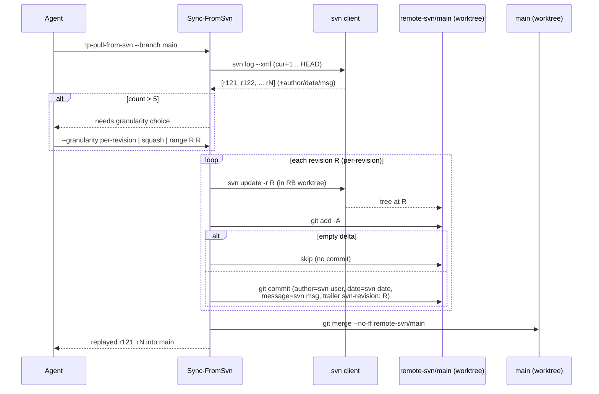
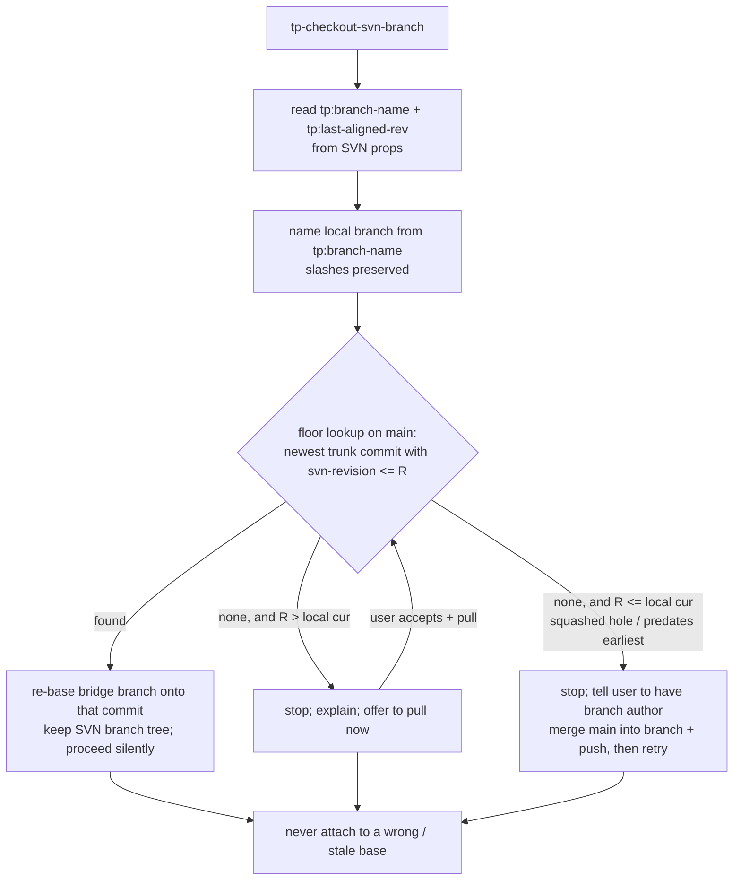

# Per-Revision SVN Replay Bridge - Plan

## Goal Capsule

- **Objective**: Make `turbo-plugin-git-svn` attach a checked-out branch to the correct fork-point in local `main` by replaying SVN revisions as individual git commits on pull. Per-commit history and blame come along as a byproduct.
- **Product authority**: plugin owner. SVN is a hard constraint (no git server available); the north star is maximum git-server-like fidelity within that constraint.
- **Open blockers**: none. The one load-bearing architecture fork (full replay vs anchor-only) and the author-fidelity scope were resolved during planning — see Key Technical Decisions.

---

## Product Contract

> **Product Contract preservation:** unchanged during planning except **R14** (revision traceability), which was added during the 2026-07-07 `ce-doc-review` pass. No product-scope change was made while enriching to implementation-ready.

### Summary

Change `tp-pull-from-svn` to replay each SVN revision as its own git commit (author, message, and date preserved) instead of collapsing the range into one `sync: svn r<N>` snapshot. Record per-branch metadata (original name + last-aligned-main revision) so `tp-checkout-svn-branch` attaches an imported branch at its true fork-point. Let the user choose replay granularity when the volume is large, defaulting to per-revision.

### Problem Frame

The bridge shares only file content through SVN, not git history. Pull collapses every intervening revision into one lump commit to HEAD, so local `main` holds no commit at an arbitrary revision. That breaks two things: a checked-out branch cannot attach to its true fork-point, so a long-lived branch merges back with spurious conflicts; and teammates' individual commits, authorship, and blame are lost.

`git svn` solves this natively but was rejected. It was removed from Git for Windows in v2.54.0 (2026-04-20), already fails on the team's current machine for a trivial local `file://` clone, needs WSL or MSYS2 on Windows, and is linear-history-only — hostile to the team's multi-engineer branch collaboration. The plain `svn` client works on Windows, so the remedy is to replay revisions ourselves with it.

### Key Decisions

- **Reject `git svn`; build per-revision replay in-house.** Reuse the working `svn` client to get git-svn's fidelity without its Windows breakage, keeping the plugin's cross-platform, agent-native, guardrail design. Verdict from `ce-pov`: Reject adopting git-svn, Tier 2, high confidence.
- **Only pull replays per-revision.** Push and other operations keep their current model. The goal is correct fork-point branching; per-commit history and blame are a welcome side effect, not the driver.
- **Replay granularity is user-selectable, defaulting to per-revision.** When a pull or the initial `tp-setup` import would replay more than 5 revisions, offer three choices; with 5 or fewer, replay per-revision without asking — 5 commits is acceptable even for the first `tp-setup` import.
- **Per-branch metadata lives in SVN properties.** The original branch name (slashes preserved) and the last-aligned-main revision.
- **Checkout resolves the fork-point in graded steps and never attaches to a wrong base.** See F2 and the Acceptance Examples.
- **Self-inflicted gaps are acceptable.** If a needed revision is unrecoverable because the user squashed or skipped that range, checkout stops and explains rather than guessing.

### Actors

- A1. **Branch author** — pushes a branch to SVN; each merge-main-into-branch push advances that branch's last-aligned-main revision.
- A2. **Checking-out engineer** — imports an existing SVN branch into their own repo and continues development.
- A3. **Agent** — drives the SKILLs, presents the granularity choice and the checkout fork-point prompts.

### Key Flows

- F1. **Pull with granularity choice.** Trigger: `tp-pull-from-svn` or the `tp-setup` import finds more than 5 new revisions. The agent offers per-revision (recommended) / squash-to-one / per-revision for a chosen range. With 5 or fewer it replays per-revision silently. Each replayed revision becomes one git commit carrying that revision's SVN author, message, and date.
- F2. **Checkout with graded fork-point resolution.** Trigger: `tp-checkout-svn-branch`. Read the branch's last-aligned-main revision from metadata, then:
  - the commit for that revision is in local `main` → attach the imported branch there; proceed silently;
  - it is not local but a pull would bring it → stop, explain, offer to pull now;
  - it is not local and a pull cannot bring it (the revision predates local `main`'s earliest commit because that range was squashed) → stop, explain, and tell the user to ask the branch author to merge main into the branch and push (which advances the branch's alignment to a recoverable revision), then retry.

### Requirements

**Per-revision pull replay**

- R1. `tp-pull-from-svn` replays each new SVN revision as its own git commit, preserving the SVN author, message, and timestamp.
- R2. When there are 5 or fewer new revisions, pull replays per-revision without prompting, even during the first `tp-setup` import.

**Granularity control**

- R3. When a pull or the `tp-setup` import would replay more than 5 revisions, the agent offers three choices: per-revision, squash-to-one, or per-revision for a user-specified revision range.
- R4. The granularity prompt recommends per-revision by default.

**Branch metadata**

- R5. On a branch's first push, the plugin stores the original git branch name (slashes preserved) as an SVN property on the branch.
- R6. The plugin maintains a last-aligned-main revision for each branch: set when the branch is created, updated on every merge-main-into-branch push.
- R7. `tp-checkout-svn-branch` names the imported working branch from the stored original name, not the dash-form SVN path leaf.

**Checkout fork-point resolution**

- R8. Checkout attaches the imported branch at the local git commit for the stored last-aligned-main revision when that commit exists locally.
- R9. When that commit is absent but reachable by pulling, checkout stops, explains the missing revision, and offers to pull.
- R10. When that commit is absent and unreachable by pulling, checkout stops and tells the user to have the branch author refresh the branch's alignment, then retry.
- R11. Checkout never silently attaches the branch to an incorrect base.

**Constraints and compatibility**

- R12. All new behavior uses the plain `svn` client, never `git svn`, and works on Windows PowerShell 5.1 with non-ASCII (CP950 / Big5) paths and messages.
- R13. Every script change ships paired `.ps1` + `.sh` with matching behavior and two-layer tests (Pester + shunit2, svn-gated).

**Revision traceability**

- R14. Each replayed commit records its source SVN revision in a machine-readable, per-commit form (a git commit trailer, note, or tag — the exact mechanism is a planning decision), replacing the removed `sync: svn r<N>` marker. `tp-checkout-svn-branch` uses this marker to map a stored revision number to the local git commit for it — the lookup R8–R11 depend on. Because git SHAs differ per repo, the revision marker (not the SHA) is the cross-repo lookup key.

### Acceptance Examples

- AE1. **Covers R1.** Given three new trunk revisions r124–r126 with per-revision chosen, pull produces three git commits on `main`, each carrying the matching revision's author and message — not one squashed commit.
- AE2. **Covers R8.** A branch whose last-aligned-main revision is r120, with local `main` holding the r120 commit → checkout attaches the imported branch at r120 with no prompt, and `git merge-base main <branch>` resolves to that commit.
- AE3. **Covers R9.** Same branch, but local `main` is behind r120 → checkout stops, explains, and offers to pull; on accept and pull, it proceeds and attaches at r120.
- AE4. **Covers R10, R11.** The branch's last-aligned-main revision predates local `main`'s earliest commit (that range was squashed at setup) → checkout stops and tells the user to ask the branch author to merge main into the branch and push, then retry; it does not attach to a wrong base.
- AE5. **Covers R7.** A branch pushed as `feature/test-3-feature` (SVN path leaf `feature-test-3-feature`) is checked out as local branch `feature/test-3-feature`, slash preserved.

### Scope Boundaries

- Out: adopting or wrapping `git svn`.
- Out: per-revision replay on the push side — push keeps its current merge-plus-content-commit model. A **`main` push** stays clean: the push body is computed over `remote-svn/<branch>..<branch>` excluding merges, and replayed commits (built on `remote-svn/main`, merged into `main`) fall on the excluded side. **Caveat (measure in U4/U5 fixture):** a **feature-branch push after a merge-main-into-branch** surfaces the merged trunk revisions in `remote-svn/feature..feature` (they are reachable from `feature` but not from `remote-svn/feature`), so the SVN body would carry N revision subjects instead of 1. This already happens today with the single `sync` subject; per-revision multiplies it. Resolution deferred to a fixture measurement: accept and document the N-line body, or filter lines carrying an `svn-revision:` trailer out of the push body.
- Out: full historical blame as a goal in itself — per-commit history is a byproduct of per-revision pull; squashed ranges have no per-revision history and that is accepted.
- Out (of v1 promise): backfilling pre-existing lump history in already-bridged repos.
- Deferred: SubGit — relevant only if the team later gains SVN-server install rights and budget; a separate evaluation, not this work.

### Deferred to Follow-Up Work

- **authors-file identity mapping.** v1 uses the raw SVN username as the git author name (KTD2); a follow-up may add an authors-file that maps SVN usernames to `Name <email>` git identities.
- **Backfill of existing lump-history bridges.** Replay is forward-only; branches created before this feature keep their lump history and cannot attach at a true fork-point until a follow-up backfill (or a fresh re-bridge) is scheduled.

### Outstanding Questions

**Resolved during planning** (see Key Technical Decisions)

- Full per-revision replay vs anchor-only → **full replay** (KTD1). Author fidelity → **raw SVN username, best-effort tier** (KTD2). Revision marker mechanism → **git commit trailer** (KTD3). Timestamp fidelity → **SVN date as git author-date** (KTD6).

**Deferred to Implementation** (execution-time unknowns)

- The exact `git log` trailer-scan invocation for the floor lookup (portable `%(trailers)` support across the target git versions) — resolved in U1 against the test matrix.
- The precise merge-main-into-branch *detection* heuristic inside the generic push path (U4) — the plan fixes the owner (fold the advance into the push commit); the exact reachability check is tuned against a fixture.
- The push-body caveat (Scope Boundaries): accept-vs-filter decided after a merge-main → feature-push fixture run.

### Dependencies / Assumptions

- The plain `svn` client (TortoiseSVN 1.14.x) is present and works on the team's Windows machines, including non-ASCII paths.
- Existing bridge invariants hold: `svn:ignore=.git` is load-bearing, `.git` stays out of SVN, and the `remote-svn/<branch>` orphan-worktree model is intact.
- This session's prior fixes remain in place; the checkout connect-to-main change (commit `6962db7`) is the structural touchpoint this work refines.
- This session's `svn log --xml` parser (`svn_log_format_xml` in `plugins/turbo-plugin-git-svn/scripts/lib/common.sh`, and the PowerShell `System.Xml` path in `Get-SvnLog.ps1`) is reused as the revision-enumeration primitive.

---

## Key Technical Decisions

### KTD1. Full per-revision replay, not anchor-only

`ce-doc-review` asked us to weigh a lighter "anchor commit only at fork revisions + last-aligned revision in metadata" alternative before committing to full replay. Weighed and rejected: anchor-only must place a git commit at an **arbitrary past revision inside `main`'s existing linear history**, which — when that revision falls inside an already-collapsed lump range — requires rewriting or grafting shared history and risks breaking `merge-base`. Full per-revision replay makes every revision naturally present as an ancestor of `main`, so fork-point attachment needs **no history rewrite**; the per-commit history and blame are a free byproduct. This also matches the `ce-brainstorm` / `ce-pov` sanctioned direction. Anchor-only is cheaper in commit count but strictly harder for the correctness guarantee (R11).

### KTD2. R1 tiered fidelity — author mapping off the critical path

R1 is split into two tiers so the unresolved SVN→git author-mapping never blocks the fork-point goal:

- **Mandatory tier** (required for fork-point correctness): one git commit per revision, with the correct tree at that revision and the R14 revision trailer.
- **Best-effort tier** (fidelity, degradable): SVN author → git author name, SVN message → commit message, SVN date → author-date. For v1 the author is the **raw SVN username** used verbatim as the git author name (deterministic, needs no config, makes AE1 verifiable). An authors-file mapping to full `Name <email>` identities is deferred (Scope Boundaries → Deferred to Follow-Up Work).

### KTD3. Revision marker = git commit trailer `svn-revision: <N>`

The revision→commit lookup key (R14) is a **commit trailer** (`svn-revision: 124`), chosen over a git tag (one ref per revision would flood the ref namespace) and git notes (a separate notes ref carried in `refs/notes/*`, easy to leave un-regenerated on an independent replay). The binding reason a trailer wins: it is **intrinsic to the commit object and reproduced identically by each engineer's independent SVN replay** — cross-repo history here does not propagate via fetch/merge (each repo re-replays from SVN with its own SHAs), so the marker must live inside the commit the replay recreates. The trailer also survives merges; because git SHAs differ per repo, the trailer — not the SHA — is the cross-repo lookup key.

**Lookup semantics — floor, not exact-match.** SVN revision numbers are repository-global and monotonic, so a trunk pull replays only the *sparse* subset of revisions that changed trunk. An arbitrary revision `R` — notably a branch's `copyfrom-rev`, often the repo HEAD at copy time pointing at some other path — frequently has **no** commit carrying exactly `svn-revision: R`. Checkout therefore resolves `R` to the **newest replayed trunk commit on `main` whose `svn-revision` value is ≤ R** (scan `git log main --grep='^svn-revision: ' --format=...`, pick the greatest value ≤ R), scoped to `main` (never `HEAD`), returning at most one SHA. The lookup **fails loud on more than one commit sharing a trailer value** rather than guessing (see the idempotency guard in KTD4); if no commit ≤ R exists at all, that is the genuine "predates earliest" case (R10).

### KTD4. Replay commits are created on `remote-svn/main`, then merged into `main`

Each replayed commit is built on the `remote-svn/main` orphan worktree (exactly where today's single `sync: svn r<N>` commit is built) and then merged into `main` via the existing `--no-ff` merge. This keeps the ***`main`-side* push** clean: `Get-SvnPushBody` computes its body over `remote-svn/<branch>..<branch>` excluding merges, so replayed commits sit on the excluded side of a `main` push. This is **not** a blanket "never inflate" guarantee — see the Scope Boundaries note on the merge-main-into-branch feature-push case, where replayed trunk subjects can enter the body.

**Clean-tree + idempotency guards.** The `remote-svn/main` worktree must be **infinite-depth** so `svn update -r R` yields a uniform per-revision tree; the loop asserts the working copy is uniformly at `R` with no local modification before `git add -A`, so an empty index means "tree identical to R-1" (skip, no no-op commit) and never "partial/sparse update" (this repo has been bitten by SVN mixed-revision / `--depth empty` drift before). The loop tracks the highest replayed revision (`cur`) and is **idempotent**: a revision whose trailer already exists on `remote-svn/main` is not re-replayed, so an interrupted-then-rerun pull cannot mint a duplicate `svn-revision:` commit.

### KTD5. Branch metadata in `tp:*` SVN custom properties

Two custom SVN properties on the branch path carry the metadata the bridge cannot otherwise share:

- `tp:branch-name` — the original git branch name with slashes preserved (source for R7).
- `tp:last-aligned-rev` — the trunk revision the branch is currently aligned to. Initialized at branch creation to the branch root's **`copyfrom-rev`** (the trunk revision the branch was `svn copy`-ed *from*), read via `svn log -v --stop-on-copy --xml <branch-url>` — **not** the branch's own creation revision, which never touched trunk and would carry no trailer. Advanced on every merge of `main` into the branch (R6).

**Who advances it, and the commit cost.** There is no dedicated "merge-main-into-branch push" script today (`Merge-MainIntoBranches.*` is local-git-only; the actual push is the generic `Build-SvnCommit` / submit path, which cannot by itself tell a merge-main push from an ordinary feature push). The advance is therefore folded into that push: when a push carries a newly-reachable merge of `main` into the branch, the property is set **in the same commit as the push's content** (not a separate property commit), idempotently (no-op when unchanged). Only the *first push / branch creation* pays a dedicated property commit — the bounded cost. Because a stale property would silently mis-route checkout (R11 catches "no base / arbitrary base" but not "stale-but-present base"), checkout additionally cross-checks the stored alignment against topology (see U5). Properties are chosen because the bridge never runs `svn merge`, so a custom property is never moved or polluted across paths (validated in prior work; see `svn:ignore=.git` precedent).

### KTD6. Timestamp fidelity

The SVN commit date is preserved as the git **author-date**; the git committer-date is the replay moment. This keeps `git log` ordering and blame anchored to the original SVN timeline while being honest that the commit was materialized locally at replay time.

### KTD7. Granularity control retained as three-way

The `>5 new revisions` prompt keeps all three options (per-revision default / squash-to-one / per-revision for a user-specified range). The owner explicitly retained the range option during `ce-doc-review` rather than narrowing to a binary choice.

---

## High-Level Technical Design

### Pull: per-revision replay loop (F1)

### Checkout: graded fork-point resolution (F2 / R8–R11)

---

## Implementation Units

### U1. Revision-enumeration + replay-commit primitives (shared lib)

- **Goal**: Give the pull path everything it needs to turn one SVN revision into one git commit, without duplicating logic across `.ps1`/`.sh`.
- **Requirements**: R1, R12, R13, R14 (mandatory + best-effort tiers of KTD2/KTD3/KTD6).
- **Dependencies**: none.
- **Files**:
  - `plugins/turbo-plugin-git-svn/scripts/lib/common.sh` (modify)
  - `plugins/turbo-plugin-git-svn/scripts/lib/Common.ps1` (modify)
  - `plugins/turbo-plugin-git-svn/tests/unit/scripts/replay-primitives.test.sh` (create)
  - `plugins/turbo-plugin-git-svn/tests/unit/scripts/Replay-Primitives.test.ps1` (create)
- **Approach**:
  - Revision enumeration: a helper that runs `svn log --xml -r <cur+1>:HEAD <path>` and yields, per revision, `{rev, author, date, message}` — reusing the existing `svn_log_format_xml` / `System.Xml` parser rather than adding a new XML tool.
  - Replay-commit helper: given `{rev, author, date, message}` and a worktree already at that revision's tree, run `git add -A`; if the index is empty, signal "skip"; else `git commit` with **author = `<svn-username> <>`** (git `--author` requires a `Name <email>` shape, so the raw username fills the name slot with an empty angle-bracket email), author-date = SVN date, and message = SVN message plus a blank line and the `svn-revision: <rev>` trailer. **Idempotent**: skip when a commit with this revision's trailer already exists on `remote-svn/main`.
  - Revision→commit **floor** lookup helper: over `main`, find the newest commit whose `svn-revision:` trailer value is ≤ R (`git log main --grep='^svn-revision: ' --format='%H %(trailers:key=svn-revision,valueonly)'`, then pick the greatest value ≤ R). Returns at most one SHA; scope strictly to `main`, never `HEAD`; **fail loud if two commits share the same trailer value** (the multi-match that would reproduce the `not a valid object name` failure of `6962db7` / `6f73114`). Empty only when no commit ≤ R exists.
  - PS5.1: any non-ASCII content keeps the file UTF-8 BOM; force arrays with `@(...)` at use sites; no 3-arg `Join-Path`; keep `git log` UTF-8 output outside any ANSI OutputEncoding scope.
- **Patterns to follow**: `svn_log_format_xml` in `lib/common.sh`; the ANSI/UTF-8 OutputEncoding scoping in `Build-SvnCommit.ps1`; sed-extract test harness in `tests/unit/scripts/svn-log-xml-format.test.sh`.
- **Execution note**: Add the failing unit tests first — the trailer format and the empty-delta skip are the contract the pull loop depends on.
- **Test scenarios**:
  - Enumeration of a 3-revision range returns the revisions in ascending order with author/date/message decoded (reuses seed dump r-range).
  - Replay-commit helper writes a commit whose author is the raw SVN username in `<name> <>` form, whose author-date equals the SVN date, and whose message ends with `svn-revision: <rev>`.
  - Empty-delta case: worktree tree unchanged from prior revision → helper signals skip, no commit created.
  - Idempotency: replaying a revision whose trailer already exists → skipped, no duplicate commit.
  - Floor lookup: for a target R with no exact `svn-revision: R` commit, returns the newest commit with trailer value ≤ R; returns empty only when none ≤ R; **fails loud** when two commits carry the same trailer value.
  - Non-ASCII commit message (CJK) round-trips without mojibake on both `.sh` and `.ps1`.
- **Verification**: New lib tests pass under both runners; `git log --format='%an %ad'` on a replayed commit shows the SVN identity/date; the trailer is greppable.

### U2. `tp:*` branch-metadata property helpers (shared lib)

- **Goal**: Read/write the two branch-metadata SVN properties in one place.
- **Requirements**: R5, R6, R7 (storage half), R12, R13.
- **Dependencies**: none (peer of U1).
- **Files**:
  - `plugins/turbo-plugin-git-svn/scripts/lib/common.sh` (modify)
  - `plugins/turbo-plugin-git-svn/scripts/lib/Common.ps1` (modify)
  - `plugins/turbo-plugin-git-svn/tests/unit/scripts/tp-branch-props.test.sh` (create)
  - `plugins/turbo-plugin-git-svn/tests/unit/scripts/Tp-BranchProps.test.ps1` (create)
- **Approach**:
  - `Get-TpBranchProp` / `get_tp_branch_prop`: `svn propget tp:<name> <branch-url>` returning the value or empty.
  - `Set-TpBranchProp` / `set_tp_branch_prop`: `svn propset tp:<name> <value> .` in the branch worktree followed by a scoped `svn commit --depth empty` with a fixed message (mirroring the `svn:ignore=.git` commit shape so the property commit is bounded and drift-free).
  - Copy-from (fork) revision reader: run `svn log -v --stop-on-copy --xml <branch-url>` and extract the branch-root `<path>`'s **`copyfrom-rev`** attribute (the trunk revision the branch was copied *from*) — NOT the earliest `<logentry>`'s `revision` (that is the branch's own creation revision, which never touched trunk and carries no trailer). This requires extending the reused XML parser to surface `copyfrom-rev` (the current `svn_log_format_xml` / `System.Xml` path ignores it).
  - Guard non-ASCII branch names (CP950) on the property value round-trip.
- **Patterns to follow**: the `svn propset svn:ignore ... ; svn commit --depth empty` sequence in `New-RemoteBridge.ps1` / `new-remote-bridge.sh`; the property-commit scoping rationale already documented there.
- **Test scenarios**:
  - Set then get `tp:branch-name` with a slash-bearing name (`feature/test-3-feature`) round-trips exactly.
  - `tp:last-aligned-rev` set to a revision number reads back identically.
  - Copy-from reader returns the trunk `copyfrom-rev` (not the branch creation revision) for a branch created via `svn copy` from trunk@R in the fixture.
  - Property commit touches only the property (no file drift swept in).
  - Absent property → getter returns empty, not an error.
- **Verification**: Property round-trip tests pass; `svn proplist -v` on the fixture branch shows only the intended `tp:*` props plus `svn:ignore`.

### U3. Per-revision pull replay + granularity (Sync-FromSvn)

- **Goal**: Replace the single-`sync`-commit pull with a per-revision replay loop honoring the granularity choice.
- **Requirements**: R1, R2, R3, R4, R13, R14.
- **Dependencies**: U1.
- **Files**:
  - `plugins/turbo-plugin-git-svn/scripts/Sync-FromSvn.ps1` (modify)
  - `plugins/turbo-plugin-git-svn/scripts/sync-from-svn.sh` (modify)
  - `plugins/turbo-plugin-git-svn/tests/unit/scripts/Sync-FromSvn.test.ps1` (modify)
  - `plugins/turbo-plugin-git-svn/tests/unit/scripts/sync-from-svn.test.sh` (modify)
- **Approach**:
  - Enumerate `r(cur+1)..HEAD` via U1. If count ≤ 5, replay per-revision silently (R2). If count > 5, accept a `-Granularity`/`--granularity` argument (`per-revision` | `squash` | `range <lo>:<hi>`); the SKILL supplies it after prompting (U6). Absent the argument on a >5 range, emit a structured "needs granularity choice" signal and exit non-error so the agent can prompt.
  - `cur` (the resume point) is derived from the highest `svn-revision:` trailer already on `remote-svn/main`, not a separate bookmark — so an interrupted pull resumes correctly and never re-replays. Before each `svn update -r R`, assert the `remote-svn/main` worktree is infinite-depth and has no local modifications, so an empty post-update delta means "identical tree," never a sparse/partial update.
  - Per-revision path: loop `svn update -r R` in the `remote-svn/<branch>` worktree, then U1's replay-commit helper (skip empty deltas, skip already-present trailers). After the loop, `git merge --no-ff remote-svn/main` into the target branch — reusing the existing merge + conflict-rollback block unchanged.
  - Squash path: one `svn update` to HEAD + one commit carrying an `svn-revision: <HEAD-of-range>` trailer (so floor lookup treats the squashed range as a single boundary — a fork revision below that HEAD correctly floor-resolves to an earlier commit or the R10 refresh path, never silently onto the squash commit).
  - Range path: per-revision within `<lo>:<hi>`, squash the remainder.
  - Keep every existing guard (dirty main/remote worktree, orphaned-sync detection, branch switch/restore).
- **Patterns to follow**: the current loop-free body of `Sync-FromSvn.ps1` (svn update → commit → merge → rollback); the `--no-merges` orphan-sync guard.
- **Execution note**: Characterization-first — capture the current squash behavior as a test before refactoring, since squash remains a supported path and must not regress.
- **Test scenarios**:
  - `Covers AE1.` Three new revisions, per-revision → three commits on `main`, each with its revision's author/message and an `svn-revision:` trailer; not one squashed commit.
  - ≤5 revisions replays per-revision with no granularity argument required (R2).
  - `>5` revisions with no granularity argument → structured "needs choice" signal, no commits created, clean exit.
  - `squash` choice on a >5 range → single `sync: svn r<HEAD>` commit (today's behavior preserved).
  - `range <lo>:<hi>` → per-revision inside the range, squash outside.
  - A revision that changes nothing produces no commit (empty-delta skip).
  - Interrupted-then-rerun: after a mid-loop stop leaving commits for r121–r123, re-running resumes at r124 (cur = highest trailer) and does not duplicate r121–r123.
  - Existing guards still fire: dirty worktree, orphaned sync commit.
- **Verification**: Updated pull tests pass; a per-revision pull leaves N commits on `main` each greppable by trailer; squash path byte-identical to prior output.

### U4. Branch metadata on first push and merge-main-into-branch (New-RemoteBridge + push)

- **Goal**: Write `tp:branch-name` and initialize/advance `tp:last-aligned-rev`.
- **Requirements**: R5, R6, R13.
- **Dependencies**: U1, U2.
- **Files**:
  - `plugins/turbo-plugin-git-svn/scripts/New-RemoteBridge.ps1` (modify)
  - `plugins/turbo-plugin-git-svn/scripts/new-remote-bridge.sh` (modify)
  - the merge-main-into-branch push script (discover exact path during implementation — likely `Build-SvnCommit.ps1` / the `tp-merge-main-into-branches` path) (modify)
  - corresponding `tests/unit/scripts/*` (modify/create)
- **Approach**:
  - First push / branch creation: after the branch's SVN path exists, set `tp:branch-name` = original git branch name (slashes preserved) and `tp:last-aligned-rev` = the trunk `copyfrom-rev` (U2's `svn log -v --stop-on-copy` reader). Fold the property write into the existing `svn:ignore=.git` property-commit where possible to avoid a second commit; otherwise it is one dedicated property commit (KTD5).
  - Advancing `tp:last-aligned-rev` (no dedicated merge-main push script exists): the generic push path detects whether this push newly makes `main` reachable from the branch (i.e. a merge of `main` into the branch occurred) and, if so, sets `tp:last-aligned-rev` to the newest `svn-revision:` trailer reachable on `main` **within the same push commit** (via U1's lookup family — hence the U1 dependency), not a separate property commit. An ordinary feature push (no new `main` merge) does not advance it. The write is idempotent (no-op when unchanged).
  - Preserve non-ASCII branch-name fidelity through the property value.
- **Patterns to follow**: the `svn propset ... ; svn commit --depth empty` block in `New-RemoteBridge.*`; U2 helpers.
- **Test scenarios**:
  - First push stores `tp:branch-name` (slashes preserved) and `tp:last-aligned-rev` = trunk `copyfrom-rev`.
  - A push that newly merges `main` into the branch advances `tp:last-aligned-rev`; an ordinary feature push (no new main merge) does NOT advance it and adds no property commit.
  - Non-ASCII branch name survives the property round-trip.
  - Only first push / creation pays a dedicated property commit (bounded-cost check).
- **Verification**: After a scripted first-push + merge-push in the fixture, `svn propget tp:branch-name` and `tp:last-aligned-rev` return the expected values.

### U5. Checkout graded fork-point resolution (Checkout-SvnBranch)

- **Goal**: Rewire checkout from "attach at `remote-svn/main` tip" to "attach at the fork-revision commit, graded," and name the branch from metadata.
- **Requirements**: R7, R8, R9, R10, R11, R13.
- **Dependencies**: U1 (lookup), U2 (metadata read).
- **Files**:
  - `plugins/turbo-plugin-git-svn/scripts/Checkout-SvnBranch.ps1` (modify)
  - `plugins/turbo-plugin-git-svn/scripts/checkout-svn-branch.sh` (modify)
  - `plugins/turbo-plugin-git-svn/tests/unit/scripts/Checkout-SvnBranch.test.ps1` (modify)
  - `plugins/turbo-plugin-git-svn/tests/unit/scripts/checkout-svn-branch.test.sh` (modify)
- **Approach**:
  - Read `tp:branch-name` (→ local branch name, slashes preserved) and `tp:last-aligned-rev` (→ target revision R) via U2.
  - **Floor-resolve** R to the newest `main` commit with `svn-revision` ≤ R via U1's floor lookup. Graded on R vs the local highest-replayed revision `cur`:
    - a commit ≤ R is found → **re-base the bridge branch's base ref** onto that fork commit — keep the imported commit's tree (the SVN branch content) and only move its parent, so the working branch descends from the import commit rather than being created directly at the fork commit. A direct `git branch <name> <fork-rev>` would give trunk-at-fork content, not the SVN branch tree — do not do that.
    - no commit ≤ R **and R > cur** (a pull would bring the missing trunk revisions) → stop, explain, offer to pull, retry after pull;
    - no commit ≤ R **and R ≤ cur** (the fork revision falls in a locally-squashed hole, or predates the earliest replayed commit) → stop, tell the user to have the branch author merge main into the branch and push, then retry.
  - **Stale-alignment cross-check**: even when a base is found, confirm the topology does not contradict the stored revision (no un-merged trunk revisions the branch lacks beyond R); a stale `tp:last-aligned-rev` that mis-routes is caught here rather than attaching silently — R11 extended to "stale-but-present."
  - Never fall back to attaching at an arbitrary or stale base (R11): if resolution fails, stop with an explanation.
  - Preserve the existing read-only-to-SVN invariant (checkout never writes SVN) and the trust-anchor / `remote-svn/main` up-front validation.
- **Patterns to follow**: the current `remote-svn/main` anchor validation in `Checkout-SvnBranch.ps1` (lines ~130–140); the orphan-import base logic from the two-root bridge fix (commit `6f73114`).
- **Execution note**: Test-first on the three graded branches — R8/R9/R10 are the correctness core and AE2–AE4 pin them.
- **Test scenarios**:
  - `Covers AE2.` last-aligned r120, `main` holds a commit ≤ r120 → floor-resolve, re-base onto it with no prompt; `git merge-base main <branch>` == that commit.
  - Sparse floor: last-aligned r120 with no exact r120 commit but an r118 trunk commit present → attaches at r118 (nearest ≤ R), not a spurious stop.
  - `Covers AE3.` no commit ≤ r120 and r120 > cur → stop, explain, offer pull; after pull, re-base at the resolved commit.
  - `Covers AE4./R11.` no commit ≤ r120 and r120 ≤ cur (interior squash hole or predates earliest) → stop, instruct alignment refresh, do not attach to a wrong base.
  - Base-ref swap keeps SVN tree: the checked-out branch's tree equals the SVN branch content (not trunk-at-fork content); only its parent is the fork commit.
  - Stale `tp:last-aligned-rev` contradicted by topology → stop, do not attach.
  - `Covers AE5./R7.` branch pushed as `feature/test-3-feature` (leaf `feature-test-3-feature`) → local branch `feature/test-3-feature`, slash preserved.
  - Resolution failure never leaves a branch attached at `remote-svn/main` tip.
- **Verification**: Checkout tests pass; the three graded paths produce the AE-specified outcomes; no path silently attaches to a wrong base.

### U6. SKILL updates — granularity prompt + checkout fork-point prompts

- **Goal**: Teach the agent-facing SKILLs the new decision points, in plain language (no internal jargon leaked to end-user prompts).
- **Requirements**: R3, R4 (granularity UX), R9, R10 (checkout prompts).
- **Dependencies**: U3, U5.
- **Files**:
  - `plugins/turbo-plugin-git-svn/skills/tp-pull-from-svn/SKILL.md` (modify)
  - `plugins/turbo-plugin-git-svn/skills/tp-checkout-svn-branch/SKILL.md` (modify)
  - (if metadata maintenance needs surfacing) `plugins/turbo-plugin-git-svn/skills/tp-merge-main-into-branches/SKILL.md` (modify)
- **Approach**:
  - Pull SKILL: when the script signals `>5 new revisions`, present the three-way choice with per-revision recommended (R3/R4), in plain language ("要一顆一顆保留、還是壓成一顆…"), then re-invoke pull with the chosen granularity.
  - Checkout SKILL: Decision Rules for the graded resolution — on "absent but pullable" offer to pull; on "absent and unrecoverable" give the plain-language "請分支作者把 main 併進分支再 push" instruction. Never expose raw revision-lookup internals as a decision the user must parse.
  - Keep user-facing text free of internal tokens (per the standing convention); technical detail stays in dev-facing comments only.
- **Patterns to follow**: the existing plain-language cursor line and auto-`--verbose` decision rules added to `tp-svn-log` SKILL this session; the AskUserQuestion phrasing conventions used across the plugin's SKILLs.
- **Test scenarios**: `Test expectation: none — SKILL.md is agent-facing prose with no script behavior.` Coverage is via U3/U5 script tests plus manual review that the prompts carry no internal jargon.
- **Verification**: SKILLs describe the granularity choice and the two checkout stop-and-explain paths in plain language; no internal tokens surface in user-facing prompts.

### U7. tp-setup first-import per-revision bootstrap (Initialize-GitSvnBridge)

- **Goal**: Make the first `tp-setup` import honor per-revision replay + granularity (R2/R3/F1), instead of the current single full-HEAD `svn checkout` + one `sync` commit.
- **Requirements**: R2, R3, R4, R13, R14.
- **Dependencies**: U1, U3.
- **Files**:
  - `plugins/turbo-plugin-git-svn/scripts/Initialize-GitSvnBridge.ps1` (modify)
  - `plugins/turbo-plugin-git-svn/scripts/initialize-git-svn-bridge.sh` (modify)
  - `plugins/turbo-plugin-git-svn/tests/unit/scripts/Initialize-GitSvnBridge.test.ps1` (modify/create)
  - `plugins/turbo-plugin-git-svn/tests/unit/scripts/initialize-git-svn-bridge.test.sh` (modify/create)
- **Approach**: bootstrap the orphan `remote-svn/main` bridge at the first trunk revision, then run U3's per-revision replay loop forward to HEAD honoring the `>5` granularity choice — rather than one full checkout to HEAD, which leaves `cur+1..HEAD` empty so a subsequent pull replays nothing. Reuse U1's enumeration + replay-commit helpers so the setup path and the steady-state pull path produce identical commit shapes (author / date / trailer). Preserve the existing setup invariants: `svn:ignore=.git` pinning, `.git` untracked from SVN, trust-anchor validation.
- **Execution note**: Characterization-first — capture the current single-`sync` bootstrap output before refactoring. A deep first import (`>5`) defaults to the granularity prompt (squash stays available so a huge first import is not forced per-revision).
- **Patterns to follow**: current `Initialize-GitSvnBridge.*` bootstrap steps (svn checkout → first commit); U3's replay loop.
- **Test scenarios**:
  - A fresh bridge over a ≤5-revision trunk imports per-revision (each commit trailer-greppable), not one lump.
  - A fresh bridge over a `>5`-revision trunk: no granularity choice → prompts; `squash` → single lump (today's behavior); per-revision → N commits.
  - After bootstrap, a subsequent `tp-pull-from-svn` finds nothing new (no double-import); the resume point `cur` = HEAD.
  - Setup invariants intact: `svn:ignore=.git` set, `.git` not tracked in SVN.
- **Verification**: `/tp-setup` against a multi-revision fixture yields per-revision `main` history (or the chosen granularity); a follow-up pull is a no-op.

---

## Verification Contract

- **Orchestrator green.** `plugins/turbo-plugin-git-svn/tests/Invoke-ScriptTests.ps1` (Windows PowerShell 5.1) and `plugins/turbo-plugin-git-svn/tests/invoke-script-tests.sh` (bash) both complete with lint 0 violations, Pester 0 failed, shunit2 0 failed. svn-gated tests SKIP (not FAIL) where `svn` is unavailable; CI counts SKIP as green.
- **PS5.1 five-taboo lint clean.** No 3-arg `Join-Path`, no `GetRelativePath`, non-ASCII `.ps1` saved UTF-8 BOM, no `2>&1` on native exe, single-element pipelines forced to array with `@()`.
- **Cross-platform parity.** Each changed `.ps1` and its `.sh` sibling produce matching behavior on the shared fixtures.
- **Acceptance Examples pass as tests.** AE1 (U3, and the setup path in U7), AE2/AE3/AE4 (U5), AE5 (U5) each map to a passing, named test scenario.
- **Review-hardening invariants hold.** Floor lookup (nearest ≤ R, fail-loud on a duplicate trailer, scoped to `main`); replay idempotency (interrupted-then-rerun mints no duplicate); U5 re-base keeps the SVN branch tree (not trunk-at-fork content); U7 first import honors per-revision + granularity and a follow-up pull is a no-op; `tp:last-aligned-rev` = trunk `copyfrom-rev`.
- **No global-state pollution.** Tests run against the repo-relative gitignored sandbox; svn global config is sandbox-isolated; nothing is left behind outside the sandbox.

---

## Definition of Done

- U1–U7 landed, each as its own conventional 繁中 commit (`feat` / `fix`), local only (no push) unless the owner asks.
- AE1–AE5 covered by passing tests under both runners.
- Floor lookup, replay idempotency, U5 base-ref swap (SVN tree preserved), and `copyfrom-rev` alignment are each proven by a named test.
- The full orchestrator is green (lint 0 / Pester 0-fail / shunit2 0-fail) on Windows; the portable `.sh` subset is green on ubuntu with svn-gated SKIPs.
- Pull produces per-revision commits (trailer-greppable) with SVN author/date/message; squash and range paths still work; empty deltas skip.
- Checkout attaches at the true fork-point in the local case and stops-with-explanation in both absent cases, never attaching to a wrong base.
- `tp:branch-name` / `tp:last-aligned-rev` are written on first push and advanced on merge-main-into-branch push.
- SKILL prompts carry the new decisions in plain language with no internal jargon.
- Product Contract preserved (only R14 added, during doc-review); no unreviewed product-scope change.

---

## Sources & Research

- `ce-pov` verdict (this session): Reject adopting `git svn`, Tier 2, high confidence — grounds KTD1's rejection of the git-svn path.
- `ce-brainstorm` (this session): chose in-house per-revision replay (option D) as the direction enriched here.
- `ce-doc-review` (2026-07-07, this document): added R14; deferred the full-replay-vs-anchor-only question (resolved here as KTD1) and R1 tiering (KTD2); confirmed the push-side body concern is a non-issue given `Get-SvnPushBody`'s range exclusion.
- Codebase touchpoints verified this session: `plugins/turbo-plugin-git-svn/scripts/Sync-FromSvn.ps1` (pull model), `Checkout-SvnBranch.ps1` (base selection, commit `6962db7`), `Build-SvnCommit.ps1` (`Get-SvnPushBody` range `remote-svn/<branch>..<branch>`, merges excluded), `New-RemoteBridge.ps1` (the only existing `svn propset` precedent), `lib/common.sh` (`svn_log_format_xml`).
- Memory: `project_git_svn_realusage_decision_backlog`, `project_git_svn_two_root_bridge_bug` (orphan-import base), `reference_svn_ignore_dot_git_load_bearing`.
