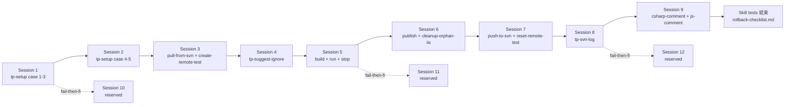

# Skill tests — Session 切分建議

turbo-plugin v1.0 PR-readiness Skill tests 是 **使用者主導** 的測試階段:每個 case
都需要在 `C:\Turbo\test-turbo-plugin\test-turbo-plugin` 內開一個 Claude Code session,使用者貼
`skill-tests.md` 的 prompt 範本進去,觀察 agent 行為並轉述給 orchestrator
判讀 PASS / FAIL。本檔規劃 8-12 個建議 session(分 9 主場 + 3 reserved
fail-then-fix re-run = 12 個 session slot)。

> 使用者可以合併 / 拆分 session;case 數總和 **45** 不變。

---

## Per-skill case 數對照表

(per-skill 詳細 case spec 與 prompt 範本見 `skill-tests.md` 對應 section)

| Skill | Case count | 備註 |
|---|---|---|
| tp-setup | 5 | case 4 / 5 走 real-install LSP / CE / agent teams / TUI |
| tp-pull-from-svn | 4 | |
| tp-push-to-svn | 4 | |
| tp-create-remote-test | 3 | |
| tp-reset-remote-test | 2 | **surface-small skill** — below R12 通用 floor(reset 操作只有 4 條 path:diff-only preview / Apply / Cancel / already-equal,2 case 即覆蓋) |
| tp-build-dotnet-framework-web | 3 | |
| tp-run-dotnet-framework-web | 3 | |
| tp-stop-dotnet-framework-web | 3 | |
| tp-publish-dotnet-framework-web | 3 | |
| tp-cleanup-orphan-iis | 3 | |
| tp-suggest-ignore | 4 | 含 cross-worktree propset + rollback |
| tp-svn-log | 4 | 含 pagination + 中文 + revision spec + escape |
| tp-csharp-comment | 2 | **surface-small skill** — below R12 通用 floor |
| tp-js-comment | 2 | **surface-small skill** — below R12 通用 floor |
| **Total** | **45** | |

> **R12 floor not ceiling**(plan trade-off 5 resolution):「1 happy + 2-3 error +
> 1 中文 = 4 最少數」是通用 floor,但對 surface 表面狹窄的 skill(comment 系列
> 只有「跑 + verify 覆蓋」、reset-remote-test 只有 4 條 path)2 case 即足夠覆蓋
> 全部行為。三個 surface-small skill 上方表格標 **surface-small** 並寫理由。

---

## Session 切分建議

預估每 session 10-30 分鐘(視使用者集中時間 + agent 回應快慢)。

### Session 1 — tp-setup case 1-3(case-detect + 中文 path)

- **預估時間**:25-35 分鐘
- **fixture pre-state**:fresh-base(orchestrator 跑 `Reset-Fixture.ps1`)
- **cases**:
  - P2-tp-setup-1(case (a) 新建 happy)
  - P2-tp-setup-2(case (c) 主 worktree 補設定 idempotent)
  - P2-tp-setup-3(中文 workspace path)
- **session 結束 state**:fixture 已過 setup case (a) + 中文 path 復原為英文 path

### Session 2 — tp-setup case 4-5(Phase 3 real-install LSP / CE / agent teams / TUI)

- **預估時間**:30-40 分鐘(LSP install 各等 30-60 秒)
- **fixture pre-state**:session 1 結束狀態
- **cases**:
  - P2-tp-setup-4(Phase 3 LSP 兩個 real-install)
  - P2-tp-setup-5(Phase 3 CE + agent teams + TUI fullscreen real-install)
- **session 結束 state**:`~/.claude/settings.json` 含 5 個推薦項目 keys;`dotnet tool -g` + `npm -g` 各裝一個 binary。**不要 rollback,留到 Skill tests 全部結束才一次性 rollback**(per RBP Q3 resolution)。

### Session 3 — tp-pull-from-svn + tp-create-remote-test

- **預估時間**:20-30 分鐘
- **fixture pre-state**:session 2 結束狀態 + orchestrator 跑 `Reset-Fixture.ps1`(reset 主 fixture 但不動 `~/.claude/settings.json`)+ 跑 setup case (a) bootstrap
- **cases**:
  - P2-tp-pull-from-svn-1 / 2 / 3 / 4
  - P2-tp-create-remote-test-1 / 2 / 3
- **session 結束 state**:含 remote-test-1 worktree 的 fixture

### Session 4 — tp-suggest-ignore(cross-worktree + rollback)

- **預估時間**:20-30 分鐘
- **fixture pre-state**:session 3 結束狀態
- **cases**:
  - P2-tp-suggest-ignore-1(analysis mode happy)
  - P2-tp-suggest-ignore-2(direct --add-svn cross-worktree)
  - P2-tp-suggest-ignore-3(rollback when remote-test-1 propset 失敗)
  - P2-tp-suggest-ignore-4(中文 svn:ignore pattern)
- **session 結束 state**:remote-main + remote-test-1 worktree svn:ignore 含測試 patterns(case 3 rollback 後不含 obj/,case 1+2+4 後含 `.env` / `.claude/` / `obj/` / `中文資料夾/`)

### Session 5 — tp-build + tp-run + tp-stop(同 IIS 環境連續)

- **預估時間**:25-35 分鐘
- **fixture pre-state**:session 4 結束狀態(IIS / build 不互斥,可同 fixture 連續測)
- **cases**:
  - P2-tp-build-dotnet-framework-web-1 / 2 / 3
  - P2-tp-run-dotnet-framework-web-1 / 2 / 3
  - P2-tp-stop-dotnet-framework-web-1 / 2 / 3
- **session 結束 state**:沒 iisexpress 在跑(case 9 結束跑了 stop);bin/Debug/ 有 build 產出

### Session 6 — tp-publish + tp-cleanup-orphan-iis

- **預估時間**:20-30 分鐘
- **fixture pre-state**:session 5 結束狀態 + orchestrator 預製 `Properties/PublishProfiles/Local.pubxml`(case 1 需要)+ 預製 2 個 orphan(case `cleanup` 需要)
- **cases**:
  - P2-tp-publish-dotnet-framework-web-1 / 2 / 3
  - P2-tp-cleanup-orphan-iis-1 / 2 / 3
- **session 結束 state**:bin/Publish/ 有 publish artifact;applicationhost.config orphan sites 已清(case 1)

### Session 7 — tp-push-to-svn + tp-reset-remote-test

- **預估時間**:25-35 分鐘
- **fixture pre-state**:orchestrator 跑 `Reset-Fixture.ps1` 重置 SVN history + 重跑 setup + 重跑 create-remote-test 建 test-1(避免 session 4 / 5 在 SVN 留下 r21+ 影響 push test)
- **cases**:
  - P2-tp-push-to-svn-1 / 2 / 3 / 4
  - P2-tp-reset-remote-test-1 / 2
- **session 結束 state**:SVN log 含若干 push 進去的 commit(case 1-3 各 push 一次);test-1 已 reset

### Session 8 — tp-svn-log(pagination + 中文 + revision spec + escape)

- **預估時間**:15-25 分鐘
- **fixture pre-state**:orchestrator 跑 `Reset-Fixture.ps1`(SVN seed r1-r20 含 r5/r10/r15 中文 commit msg)
- **cases**:
  - P2-tp-svn-log-1 / 2 / 3 / 4
- **session 結束 state**:fixture 不變(svn-log 是 read-only)

### Session 9 — tp-csharp-comment + tp-js-comment

- **預估時間**:15-25 分鐘
- **fixture pre-state**:orchestrator 跑 `Reset-Fixture.ps1` + 跑 setup(a) + 預製 case stub(per `skill-tests.md` Setup 段)
- **cases**:
  - P2-tp-csharp-comment-1 / 2
  - P2-tp-js-comment-1 / 2
- **session 結束 state**:source files 含註解(用後 fixture 重置即清)

### Session 10-12(reserved — fail-then-fix re-run)

- **觸發條件**:Skill tests session 1-9 中任何 case FAIL,orchestrator 跑 F5 fail-then-fix loop 修完 bug 後 re-run 失敗 case 與受影響的 cross-skill case
- **預估時間**:每 session 15-30 分鐘(視修復 commit 影響範圍)
- **若沒用到** → 跳過,直接進 Skill tests 結束 rollback checklist
- **若用到 3 個都還不夠** → R33 budget cap 觸發(Skill tests ~12 session 上限),orchestrator surface scope-cut question 給使用者

---

## Session 進行順序的依賴關係

- **session 2 → session 3 之間** 推薦做 `Reset-Fixture.ps1` 但**不**動 `~/.claude/settings.json`(LSP / CE / agent teams / TUI 留著到 Skill tests 結束)
- **session 4 → session 5** 不必 reset(同 fixture 連續測)
- **session 6 → session 7** 推薦 `Reset-Fixture.ps1` 重置 SVN history(避免 session 4 的 svn-ignore commits 影響 push test 結果)
- **session 7 → session 8 → session 9** 各自獨立 fixture(都需要 reset)

---

## Skill tests 開始前 checklist

orchestrator 在 session 1 開始前確認:

- [ ] `C:\Turbo\test-turbo-plugin\test-turbo-plugin` 已存在或可建立
- [ ] `C:\Turbo\test-turbo-plugin\svn-repo` SVN repo 已 seed(r1-r20 含中文 commit msg)
- [ ] `plugins/turbo-plugin/tests/fixtures/reset/Reset-Fixture.ps1` 可正常跑(Script tests 已驗證 idempotency)
- [ ] 使用者主機已裝:VS / IIS Express / .NET Framework SDK / Git for Windows / svn cli
- [ ] 使用者主機**尚未**裝 `csharp-ls`(`dotnet tool list -g` 不含)
- [ ] 使用者主機**尚未**裝 `typescript-language-server`(`npm list -g --depth=0` 不含)
- [ ] 使用者 `~/.claude/settings.json` 已備份(rollback 用 — 推薦 `Copy-Item ~/.claude/settings.json ~/.claude/settings.json.pre-turbo-plugin-test`)
- [ ] 使用者同意 Skill tests 進行期間不要在其它 worktree 動 `~/.claude/settings.json`(R-4 mitigation)
- [ ] `skill-tests.md` 與 `rollback-checklist.md` 已 commit 在 `feat/turbo-plugin-v1.0` branch

---

## Skill tests 結束 checklist

session 9 跑完(或 session 10-12 fail-then-fix 都修完)後:

- [ ] `skill-tests.md` `## Summary` section 已填(45 case 統計)
- [ ] `skill-tests.md` `## Known Issues` 列入 `FAIL-known` case(若有,per R32 escalation)
- [ ] 使用者確認哪些 `FAIL-known` 不 block v1.0 PR
- [ ] **執行 `rollback-checklist.md`** 還原使用者主機(per RBP Q3 = (b) — Skill tests 全部結束才一次性 rollback)
- [ ] rollback 完 commit「fix(turbo-plugin): mark v1.0.0 test plan complete + rollback restored」進 `feat/turbo-plugin-v1.0` branch
